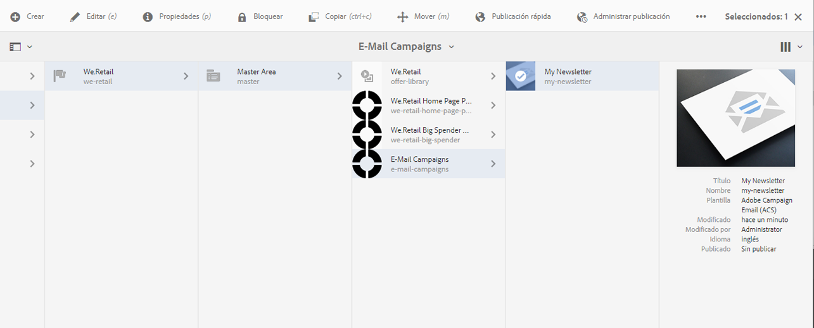

# Targeting de Adobe Campaign{#targeting-your-adobe-campaign}

Para el targeting de la newsletter de Adobe Campaign, primero debe configurar la segmentación, que solo está disponible en la IU clásica (para el contexto del cliente). Después, puede crear las experiencias dirigidas para Adobe Campaign. Ambas se describen en esta sección.

## Configuración de la segmentación en AEM {#setting-up-segmentation-in-aem}

Para configurar la segmentación, debe utilizar la IU clásica para configurar los segmentos. Los pasos restantes se pueden realizar en la IU estándar.

En la configuración de la segmentación se incluye la creación de segmentos, una marca, una campaña y experiencias.

>[!NOTE]
>
>El ID del segmento se debe asignar al ID de Adobe Campaign.

### Creación de segmentos {#creating-segments}

Para crear segmentos:

1. Open the [segmentation console](http://localhost:4502/miscadmin#/etc/segmentation) at **&lt;host>:&lt;port>/miscadmin#/etc/segmentation**.
1. Create a new page and enter a title - for example, **AC Segments**- and select the **Segment (Adobe Campaign)** template.
1. Seleccione la página creada en la vista de árbol de la parte izquierda.
1. Cree un segmento, por ejemplo, dirigido a usuarios masculinos. Para ello, cree una nueva página en el segmento que ha creado llamado Masculino y seleccione la plantilla **Segmento (Adobe Campaign)**.
1. Abra la página de segmento creada, arrastre el segmento **ID del segmento** desde la barra de tareas y suéltelo en la página.
1. Double-click the trait, enter the ID representing in this case, the male segment defined in Adobe Campaign - for example, **MALE** - and click **OK**. The following message should appear: *`targetData.segmentCode == "MALE"`*
1. Repita los pasos para otro segmento, por ejemplo, un segmento dirigido a usuarias femeninas.

### Creación de una marca {#creating-a-brand}

Para crear una marca:

1. En **Sitios**, vaya a la carpeta **Campañas** (por ejemplo, en We.Retail).
1. Haga clic en **Crear página** e introduzca un título para la página, como por ejemplo We.Retail Brand, y seleccione la plantilla **Marca**.

### Creación de una campaña {#creating-a-campaign}

Para crear una campaña:

1. Abra la página **Marca** que acaba de crear.
1. Haga clic en **Crear página** e introduzca un título para la página, como por ejemplo We.Retail Campaign, seleccione la plantilla **Campaña** y haga clic en **Crear**.

### Creación de experiencias {#creating-experiences}

Para crear experiencias para los segmentos:

1. Abra la página **Campaña** que acaba de crear.
1. Create experiences for your segments by clicking **Create Page** and entering a title for your page, for example, Male as you are creating an experience for the Male segment, and select the **Experience** template.
1. Abra la página de la experiencia creada.
1. Haga clic en **Editar** y, debajo de Segmentos, haga clic en **Añadir elemento**.
1. Enter the path to the male segment, for example **/etc/segmentation/ac-segments/male** and click **OK**. The following message should appear: *Experience is targeted at: Male*
1. Repita los pasos anteriores para crear una experiencia para todos los segmentos, como por ejemplo el segmento Femenino.

## Creación de una newsletter con contenido de destino {#creating-a-newsletter-with-targeted-content}

Una vez que haya creado los segmentos, una marca, una campaña y una experiencia, puede crear una newsletter con contenido de destino. Después de crear la experiencia, vinculará estas a los segmentos.

>[!NOTE]
>
>[Los ejemplos de correo electrónico solo están disponibles en Geometrixx](/help/sites-developing/we-retail.md). Descargue el contenido de ejemplo de Geometrixx de Uso compartido de paquetes.

Para crear una newsletter con contenido de destino:

1. Create a newsletter with targeted content: Below Email Campaigns in Geometrixx Outdoors, click or tap **Create** > **Page**, and select one of the Adobe Campaign Mail templates.

   

1. En la newsletter, añada un componente de texto y personalización.
1. Añada texto en el componente de texto y personalización, como &quot;Este es el valor predeterminado&quot;.
1. Click the arrow next to **Edit** and select **Targeting**.
1. Seleccione la marca del menú desplegable Marca y seleccione la campaña. (Se trata de la marca y la campaña que creó anteriormente).
1. Haga clic en **Iniciar Targeting**. Aparecerán los segmentos en el área Audiencias. La experiencia predeterminada se utiliza si ninguno de los segmentos definidos coincide.

   >[!NOTE]
   >
   >De forma predeterminada, los ejemplos de correo electrónico que se incluyen en AEM utilizan Adobe Campaign como motor de targeting. Para las newsletters personalizadas, es posible que tenga que seleccionar Adobe Campaign como motor de targeting. Durante el targeting, pulse o haga clic en + en la barra de herramientas, introduzca un título para la nueva actividad y seleccione **Adobe Campaign** como motor de targeting.

1. Haga clic en **Valor predeterminado** y luego en el componente de texto y personalización que ha añadido. Verá la diana con una flecha. Haga clic en el icono para dirigirse a este componente.

   

1. Vaya a otro segmento (Masculino), haga clic en **Agregar oferta** y luego haga clic en el icono del signo más (+). A continuación, edite la oferta.
1. Vaya a otro segmento (Femenino), haga clic en **Agregar oferta** y luego haga clic en el icono del signo más (+). A continuación, edite esta oferta.
1. Click **Next** to see Mapping, then click **Next** to see Settings, which does not apply to Adobe Campaign, and click **Save**.

   AEM genera automáticamente el código de targeting correcto para Adobe Campaign cuando el contenido se utiliza en un envío en Adobe Campaign.

1. En Adobe Campaign, cree el envío: seleccione **Envío por correo electrónico con contenido de AEM**, seleccione la cuenta local de AEM, según corresponda, y confirme los cambios.

   En la vista HTML, las distintas experiencias de componentes de destino se incluyen en el código de targeting de Adobe Campaign.

   

   >[!NOTE]
   >
   >Si también establece los segmentos en Adobe Campaign, al hacer clic en **Previsualizar**, aparecerá una lista con las experiencias para cada segmento.

