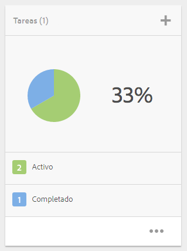
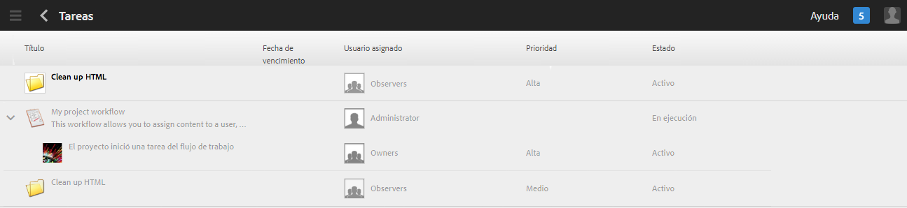
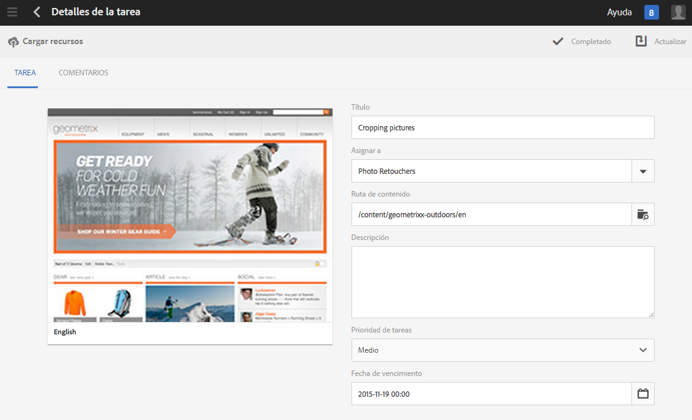
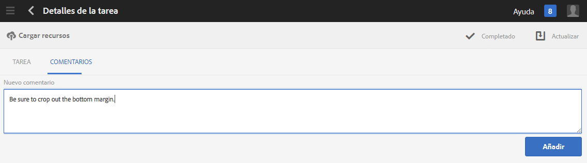
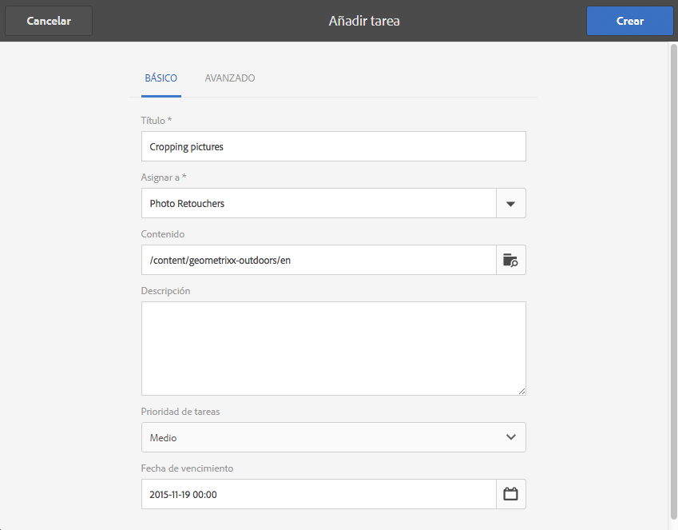
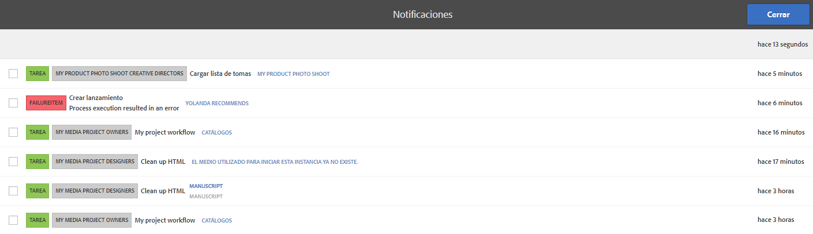
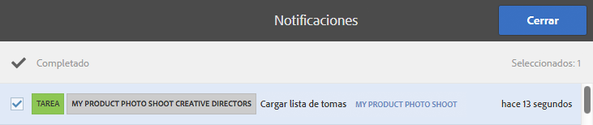

# Uso de tareas{#working-with-tasks}

>[!CAUTION]
>
>AEM 6.4 ha llegado al final de la compatibilidad ampliada y esta documentación ya no se actualiza. Para obtener más información, consulte nuestra [períodos de asistencia técnica](https://helpx.adobe.com/es/support/programs/eol-matrix.html). Buscar las versiones compatibles [here](https://experienceleague.adobe.com/docs/).

Las tareas representan elementos de trabajo que se deben realizar en el contenido. Cuando se le asigna una tarea, esta aparece en la bandeja de entrada del flujo de trabajo. Los elementos de tarea tienen un valor de tarea en la columna Tipo.

Las tareas también se utilizan en los proyectos para determinar el nivel de integridad de las tareas actuales, incluidas las tareas de flujo de trabajo.

## Seguimiento del progreso del proyecto {#tracking-project-progress}

Para realizar un seguimiento del progreso del proyecto, fíjese en las tareas activas/completadas de un proyecto representadas por la variable **Tareas** mosaico. El progreso del proyecto se puede determinar mediante:

* **Mosaico de tareas:** En el mosaico de tareas, disponible en la página de detalles del proyecto, se muestra un progreso general del proyecto.

* **Lista de tareas:** Al hacer clic en el mosaico Tarea, se muestra una lista de tareas. Esta lista contiene información detallada sobre todas las tareas relacionadas con el proyecto.

Tanto las tareas de flujo de trabajo de lista como las tareas que crea directamente en la variable **Tareas** mosaico.

### Mosaico de tareas {#task-tile}

Si un proyecto tiene tareas relacionadas, se mostrará un mosaico de tareas dentro del proyecto. El mosaico Tareas muestra el estado actual del proyecto. Esto se basa en tareas existentes dentro del flujo de trabajo y no incluye ninguna tarea que se genere en el futuro a medida que avance el flujo de trabajo. La siguiente información está visible en el mosaico de tareas:

* Porcentaje de tareas completadas
* Porcentaje de tareas activas
* Porcentaje de tareas vencidas

### Visualización o modificación de las tareas de un proyecto {#viewing-or-modifying-the-tasks-in-a-project}

Además de realizar el seguimiento del progreso, es posible que también desee ver más información sobre el proyecto o modificarlo.

#### Lista de tareas {#task-list}

Haga clic en los puntos suspensivos (...) en el mosaico Tarea para mostrar la lista de las tareas relacionadas con el proyecto. Las tareas se dividen por flujos de trabajo principales. Los detalles de la tarea se muestran junto con metadatos como la fecha de vencimiento, el usuario asignado, la prioridad y el estado.

#### Detalles de la tarea {#task-details}

Para obtener más información sobre una tarea en particular, en la lista de tareas, pulse o haga clic en la tarea y **Detalles de la tarea **abra.

### Visualización y modificación de comentarios de tareas {#viewing-and-modifying-task-comments}

En Detalles de la tarea, puede editar o agregar comentarios. Además, todos los comentarios de un proyecto están visibles en el área Comentarios .

### Adición de tareas {#adding-tasks}

Puede agregar nuevas tareas a los proyectos. A continuación, estas tareas aparecen en el mosaico Tareas y están disponibles en la bandeja de entrada Notificaciones para realizar acciones.

Para añadir una tarea:

1. En el mosaico **Tareas** del proyecto, pulse o haga clic en el icono +. Se abre la ventana **Agregar tarea**.
1. Introduzca información sobre la tarea. El título de la tarea y el grupo al que está asignada son obligatorios. La información adicional, como la ruta de contenido, la descripción, la prioridad de tareas y la fecha de caducidad, son opcionales. Además, puede seleccionar el **Avanzadas** para introducir el nombre de la tarea, que se utiliza para asignar un nombre a la URL.

   

1. Toque o haga clic en **Crear**.

## Uso de tareas en la bandeja de entrada {#working-with-tasks-in-the-inbox}

Otra forma de acceder a las tareas es desde la bandeja de entrada. Desde la bandeja de entrada, puede abrir el contenido para implementar los cambios necesarios. Cuando termine, establezca el estado de la tarea en Completada. Las tareas también aparecen en la bandeja de entrada cuando se asignan a un grupo de usuarios al que pertenece. En este caso, cualquier miembro del grupo puede realizar el trabajo y completar la tarea.

Para completar una tarea, seleccione la tarea y haga clic en **Completar**. Añada información a la tarea y, a continuación, haga clic en **Hecho**. Consulte [Su bandeja de entrada](/help/sites-authoring/inbox.md) para obtener más información.

