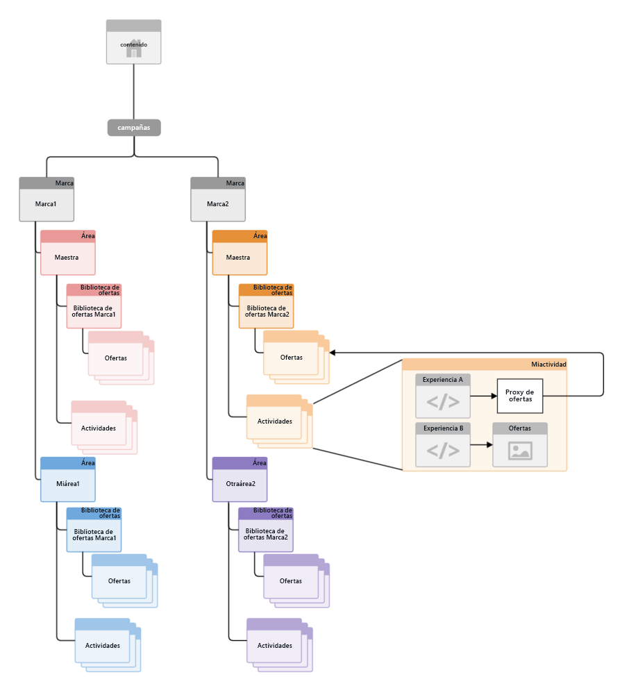
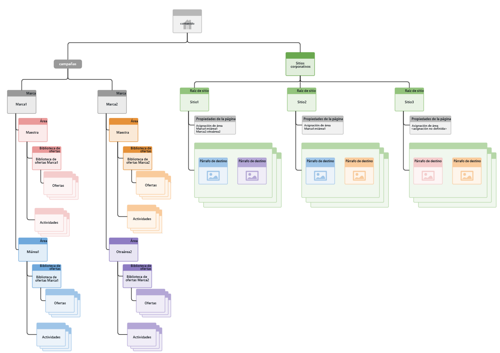

# Estructurar la administración de diversos sitios para el contenido segmentado{#how-multisite-management-for-targeted-content-is-structured}

>[!CAUTION]
>
>AEM 6.4 ha llegado al final de la compatibilidad ampliada y esta documentación ya no se actualiza. Para obtener más información, consulte nuestra [períodos de asistencia técnica](https://helpx.adobe.com/es/support/programs/eol-matrix.html). Buscar las versiones compatibles [here](https://experienceleague.adobe.com/docs/).

El diagrama siguiente muestra cómo se estructura la compatibilidad multisitio para el contenido de destino.

Las áreas aparecen debajo de **/content/campaigns/&lt;brand>** y, de forma predeterminada, cada marca tiene un área principal, que se crea automáticamente. Cada área tiene su propio conjunto de actividades, experiencias y ofertas.

Para buscar contenido de destino, las páginas o sitios se pueden asignar a un área. Si no hay ningún área configurada, AEM vuelve al área principal de esta marca específica.

En el diagrama siguiente se muestra un ejemplo de cómo funciona la lógica para tres sitios, llamados site1, site2 y site3.

* site1 busca myarea1 para brand1 y otherarea2 para brand2 en función de la asignación de áreas.
* site2 busca myarea1 para brand1 y master area para brand2, ya que solo se define la asignación de área para brand1.
* site3 busca el área principal para brand1 y brand2, ya que no se ha definido ninguna otra asignación de área para este sitio.
