# Administración de proyectos{#managing-projects}

>[!CAUTION]
>
>AEM 6.4 ha llegado al final de la compatibilidad ampliada y esta documentación ya no se actualiza. Para obtener más información, consulte nuestra [períodos de asistencia técnica](https://helpx.adobe.com/es/support/programs/eol-matrix.html). Buscar las versiones compatibles [here](https://experienceleague.adobe.com/docs/).

Proyectos permite organizar el proyecto agrupando recursos en una entidad.

En el **Proyectos** para acceder a sus proyectos y realizar acciones en ellos:

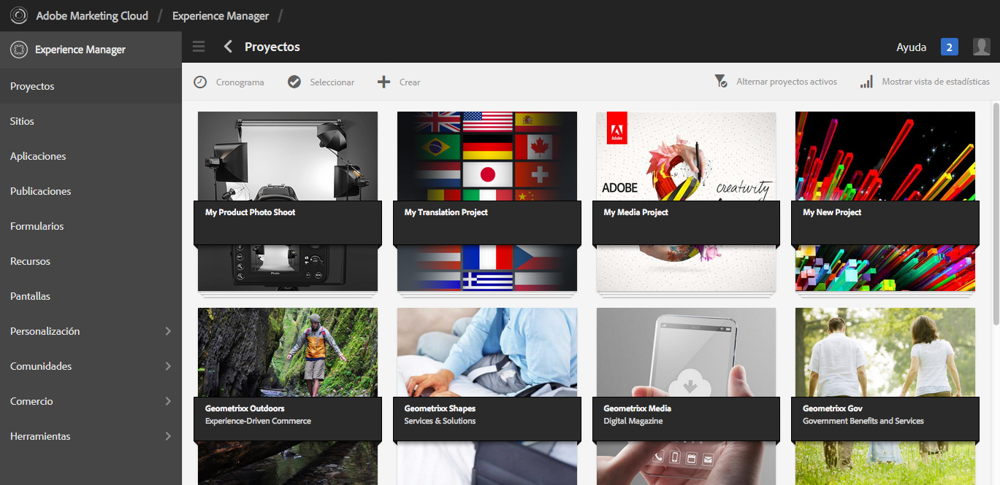

En Proyectos, puede crear un proyecto, asociar recursos al proyecto y también eliminar un proyecto o vínculos a recursos. Es posible que desee abrir un mosaico para ver su contenido, así como para agregar elementos a un mosaico. En este tema se describen esos procedimientos.

>[!NOTE]
>
>6.2 ha introducido la capacidad de organizar Proyectos en carpetas. En la página Proyectos , puede crear un proyecto o una carpeta.
>
>Si se crea una carpeta, se lleva al usuario a esa carpeta, donde puede crear otra carpeta o un proyecto. Ayuda a organizar los proyectos en carpetas basadas en categorías como campañas de productos, ubicación, idiomas de traducción, etc.
>
>Los proyectos y carpetas se pueden ver en una vista de lista y también se pueden buscar.

>[!CAUTION]
>
>Para que los usuarios de los proyectos puedan ver otros usuarios/grupos mientras utilizan la funcionalidad Proyectos , como crear proyectos, crear tareas/flujos de trabajo, ver y administrar el equipo, dichos usuarios deben tener acceso de lectura en **/home/users** y **/home/groups**. La forma más sencilla de implementar esto es dar a la variable **usuarios de proyectos** acceso de lectura de grupo a **/home/users** y **/home/groups**.

## Creación de un proyecto {#creating-a-project}

De forma predeterminada, AEM proporciona estas plantillas para elegir al crear un proyecto:

* Proyecto simple
* Proyecto de medios
* Proyecto de sesión fotográfica del producto
* Proyecto de traducción

El procedimiento para crear un proyecto es el mismo de un proyecto a otro. La diferencia entre los tipos de proyectos incluye las [funciones de usuario](/help/sites-authoring/projects.md) y los [flujos de trabajo](/help/sites-authoring/projects-with-workflows.md) disponibles. Para crear un nuevo proyecto:

1. En **Proyectos**, pulse o haga clic en **Crear** y abrirá el asistente **Crear proyecto**:
1. Seleccionar una plantilla. Proyecto simple, proyecto multimedia, [Proyecto de traducción](/help/sites-administering/tc-manage.md)y [Producto de sesión fotográfica del producto](/help/sites-authoring/managing-product-information.md) están disponibles y haga clic en **Siguiente**.

   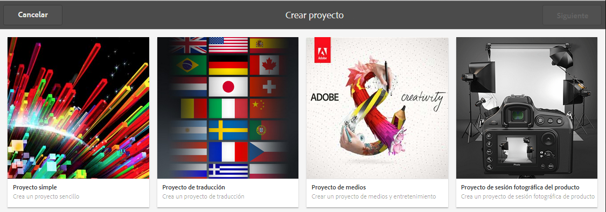

1. Defina el **Título** y la **Descripción** y añada una imagen en **miniatura** si es necesario. También puede agregar o eliminar usuarios y a qué grupo pertenecen. Además, haga clic en **Avanzadas** para añadir un nombre utilizado en la dirección URL.

   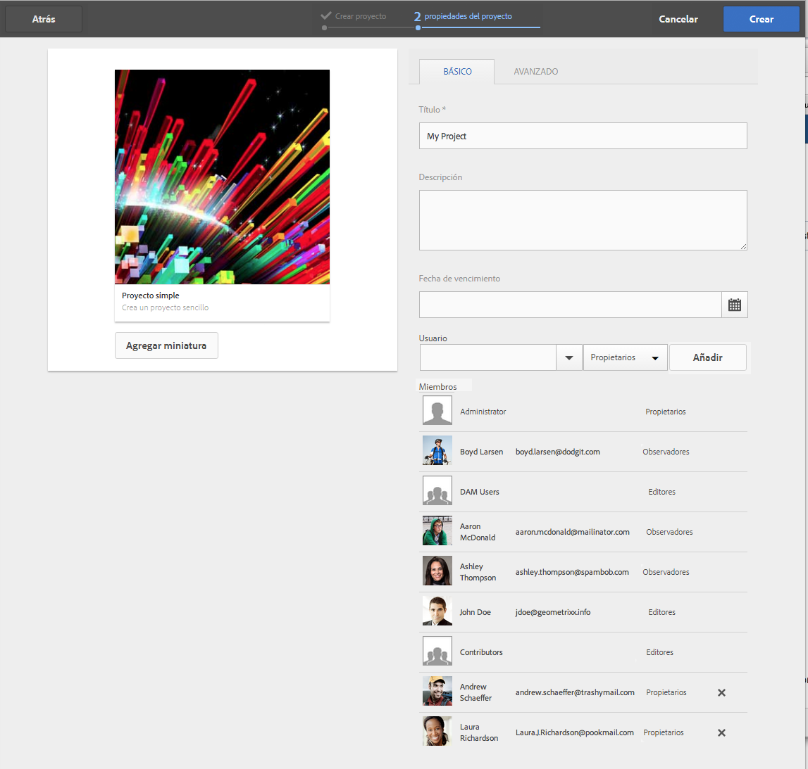

1. Toque o haga clic en **Crear**. La confirmación le preguntará si desea abrir el nuevo proyecto o volver a la consola.

### Asociación de recursos al proyecto {#associating-resources-with-your-project}

Como los proyectos permiten agrupar los recursos en una entidad, se desea asociar los recursos al proyecto. Estos recursos se denominan **Mosaicos**. Los tipos de recursos que puede añadir se describen en [Mosaicos del proyecto](/help/sites-authoring/projects.md#project-tiles).

Para asociar recursos al proyecto:

1. Abra el proyecto desde la **Proyectos** consola.
1. Toque o haga clic **Agregar mosaico** y seleccione el mosaico que desee vincular al proyecto. Puede seleccionar varios tipos de mosaicos.

   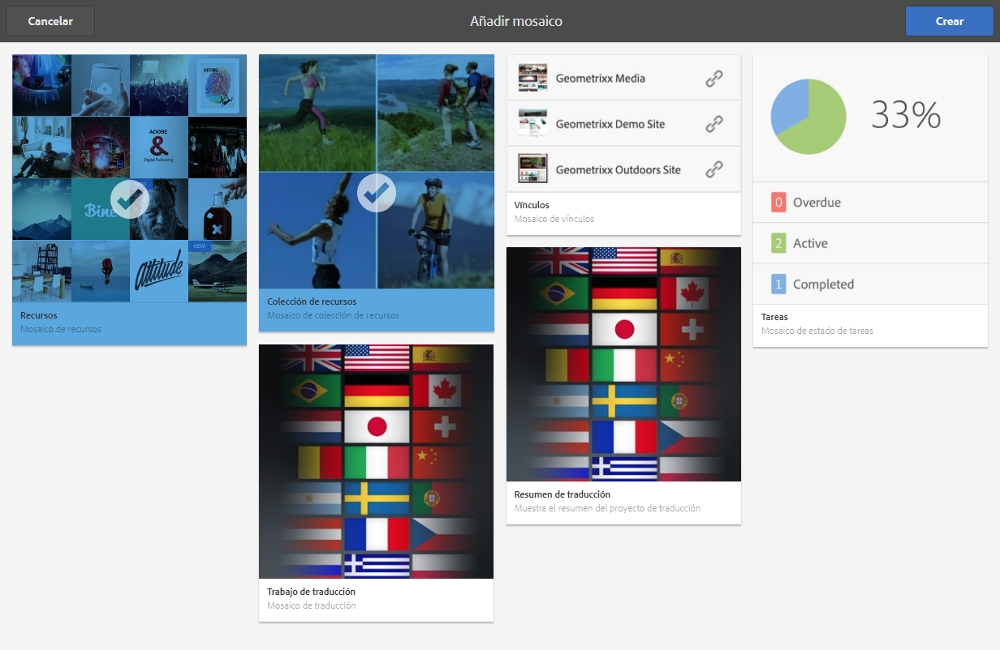

   >[!NOTE]
   >
   >Los mosaicos de proyecto que se pueden asociar a un proyecto se describen detalladamente en [Mosaicos de proyecto.](/help/sites-authoring/projects.md#project-tiles)

1. Toque o haga clic en **Crear**. El recurso está vinculado al proyecto y, a partir de ahora, podrá acceder a él desde el proyecto.

### Eliminación de un proyecto o un vínculo a un recurso {#deleting-a-project-or-resource-link}

Para eliminar un proyecto desde la consola o un recurso vinculado desde el proyecto se utiliza el mismo método: 

1. Vaya a la ubicación adecuada:

   * Para eliminar un proyecto, vaya al nivel superior del **Proyectos** consola.
   * Para eliminar un vínculo a un recurso de un proyecto, abra el proyecto en la consola **Proyectos**.

1. Para introducir el modo de selección, haga clic en **Seleccionar** y seleccione el proyecto o el vínculo a un recurso.
1. Toque o haga clic en **Eliminar**.

1. Debe confirmar la eliminación en un cuadro de diálogo. Si se confirma, se elimina el proyecto o el vínculo al recurso. Toque o haga clic en **Anular selección** para salir del modo de selección.

>[!NOTE]
>
>Al crear el proyecto y agregar usuarios a las distintas funciones, los grupos asociados con el proyecto se crean automáticamente para administrar los permisos asociados. Por ejemplo, un proyecto llamado Myproject tendría tres grupos: **Propietarios de Myproject**, **Editores de Myproject**, **Observadores de Myproject**. Sin embargo, si se elimina el proyecto, esos grupos no se eliminarán automáticamente. Un administrador debe eliminar manualmente los grupos en **Herramientas** > **Seguridad** > **Grupos**.

### Adición de elementos a un mosaico {#adding-items-to-a-tile}

En algunos mosaicos, es posible que desee agregar más de un elemento. Por ejemplo, puede tener más de un flujo de trabajo que se ejecuta a la vez o más de una experiencia.

Para agregar elementos a un mosaico:

1. En **Proyectos**, vaya al proyecto y haga clic en el icono Añadir + del mosaico al que desee agregar un elemento.

   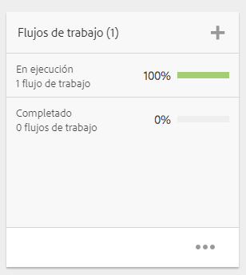

1. Agregue un elemento al mosaico como lo haría al crear un nuevo mosaico. Se describen los mosaicos del proyecto [here](/help/sites-authoring/projects.md#project-tiles). En este ejemplo, se ha añadido otro flujo de trabajo.

   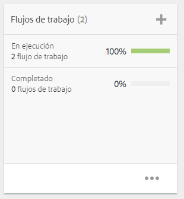

### Apertura de un mosaico {#opening-a-tile}

Es posible que desee ver qué elementos están incluidos en un mosaico actual, o modificar o eliminar elementos del mosaico.

Para abrir un mosaico para ver o modificar elementos:

1. En la consola Proyectos , pulse o haga clic en los puntos suspensivos (...)

   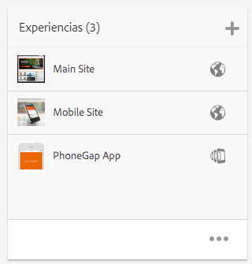

1. AEM enumera los elementos de ese mosaico. Puede introducir el modo de selección para modificar o eliminar los elementos.

   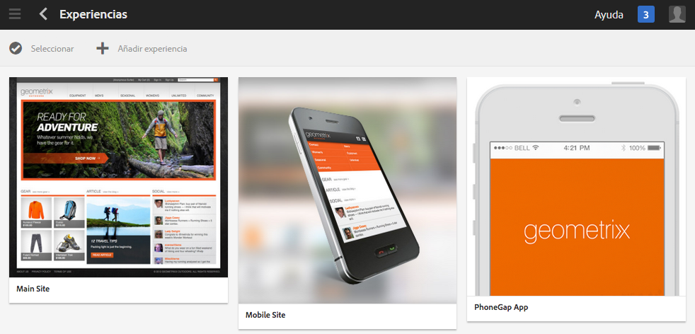

## Visualización de estadísticas del proyecto {#viewing-project-statistics}

Para ver las estadísticas del proyecto, en la sección **Proyectos** consola, haga clic en **Mostrar vista de estadísticas**. Se muestra el nivel de finalización de cada proyecto. Haga clic en **Mostrar vista de estadísticas** para ir a la **Proyectos** consola.

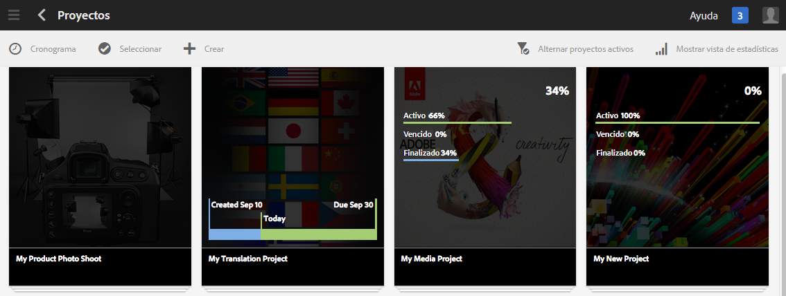

### Visualización de una línea de tiempo del proyecto {#viewing-a-project-timeline}

La cronología del proyecto proporciona información sobre cuándo se utilizaron por última vez los recursos del proyecto. Para ver la cronología del proyecto, pulse o haga clic en **Cronología** y, a continuación, introduzca el modo de selección y seleccione el proyecto. Los recursos se muestran en el panel izquierdo. Pulse o haga clic en **Cronología** para volver a la consola **Proyectos**.

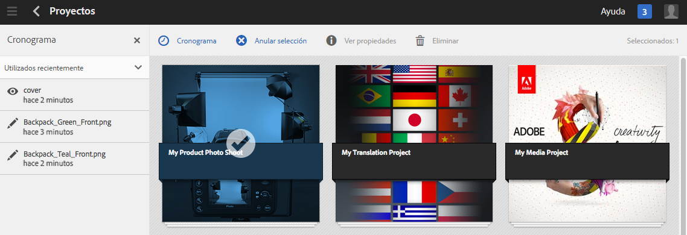

### Visualización de proyectos activos/inactivos {#viewing-active-inactive-projects}

Para alternar entre los proyectos activos e inactivos, en la consola **Proyectos**, haga clic en **Alternar proyectos activos**. Si el icono tiene una marca de verificación junto a él, muestra los proyectos activos.

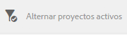

Si el icono tiene una x junto a él, muestra los proyectos inactivos.

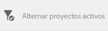

## Hacer que los proyectos sean inactivos o activos {#making-projects-inactive-or-active}

Es posible que desee hacer que un proyecto esté inactivo si lo ha completado, pero aun así desea conservar la información del proyecto.

Para que un proyecto esté inactivo (o activo):

1. En el **Proyectos** consola, abra el proyecto y busque la **Información del proyecto** mosaico.

   >[!NOTE]
   Es posible que tenga que agregar este mosaico si todavía no está en el proyecto. Consulte [Adición de mosaicos](#adding-items-to-a-tile).

1. Pulse o haga clic en **Editar**.
1. Cambie el selector de **Activo** a **Inactivo** (o viceversa).

   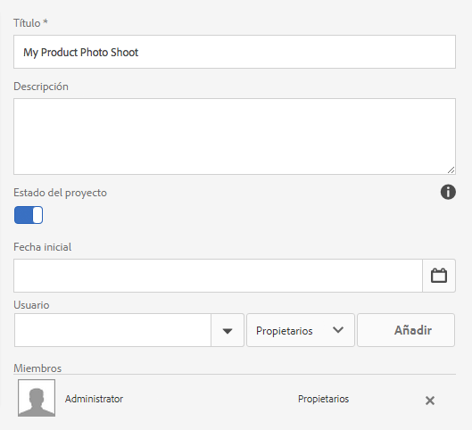

1. Toque o haga clic en **Hecho** para guardar los cambios.
