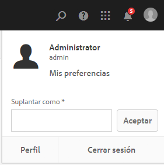
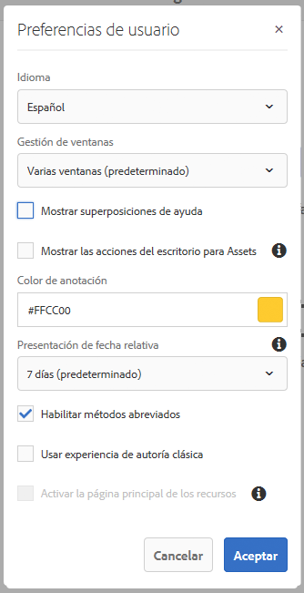

# Configuración del entorno de cuenta{#configuring-your-account-environment}

AEM le permite configurar su cuenta y ciertos aspectos del entorno de creación.

Using the [User](/help/sites-authoring/user-properties.md#user-settings) option in the [header](/help/sites-authoring/basic-handling.md#the-header) and the associated [My Preferences](#my-preferences) dialog, you can modify your user options.

## Configuración de usuario {#user-settings}

El cuadro de diálogo **Configuración de usuario** le permite acceder a lo siguiente:

* Suplantar como

   * Con la función [Suplantar como](/help/sites-administering/security.md#impersonating-another-user), un usuario puede trabajar en nombre de otro usuario.

* Perfil

   * Ofrece un práctico vínculo a la [Configuración del usuario](/help/sites-administering/security.md). 

* [Mis preferencias](/help/sites-authoring/user-properties.md#my-preferences)

   * Especifique las distintas preferencias exclusivas al usuario 

## Mis preferencias {#my-preferences}

Puede acceder al cuadro de diálogo **Preferencias** a través de la opción [Usuario](/help/sites-authoring/user-properties.md#user-settings) en el encabezado.

Cada usuario puede establecer determinadas propiedades para sí mismo. 

* **Idioma**

   Se trata del idioma que se utiliza para la IU del entorno de creación. Seleccione el idioma requerido de la lista disponible.

   Esta configuración también se utiliza para la IU clásica.

* **Gestión de ventanas**

   Esta opción permite definir el comportamiento o la apertura de las ventanas. Seleccione:

   * **Varias ventanas** (predeterminado)

      * Las páginas se abren en una nueva ventana.
   * **Ventana única**

      * Las páginas se abren en la ventana actual.

* **Mostrar las acciones del escritorio para Assets**

   Esta opción requiere la utilización de la aplicación de escritorio de AEM.

* **Color de anotación**

   Define el color predeterminado que se utiliza al crear anotaciones.

   * Haga clic en el bloque de color para abrir el selector de muestras para seleccionar un color.
   * Como alternativa, introduzca el código hexadecimal del color deseado en el campo. 

* **Presentación de fecha relativa**

   Para mejorar la legibilidad, AEM procesará las fechas dentro de los últimos siete días como fechas relativas (por ejemplo, hace tres días) y las fechas más antiguas como fechas exactas (por ejemplo, el 20 de marzo de 2017).

   Esta opción define el modo en que se muestran las fechas del sistema. Las opciones disponibles son las siguientes:

   * **Mostrar siempre la fecha exacta**: se muestra siempre la fecha exacta (nunca una fecha relativa).
   * **1 día**: se muestra la fecha relativa para las fechas dentro de un día; de lo contrario, se muestra una fecha exacta. 
   * **7 días (valor predeterminado)**: se muestra la fecha relativa para las fechas dentro de siete días; de lo contrario, se muestra una fecha exacta. 
   * **1 mes**: se muestra la fecha relativa para las fechas dentro de un mes; de lo contrario, se muestra una fecha exacta. 
   * **1 año**: se muestra la fecha relativa para las fechas dentro de un año; de lo contrario se muestra una fecha exacta. 
   * **Mostrar siempre la fecha relativa**: las fechas exactas nunca se muestran, y solo se muestran fechas relativas.

* **Habilitar métodos abreviados**

   AEM admite varios métodos abreviados del teclado para mejorar la eficiencia de la creación de contenido.

   * [Métodos abreviados del teclado para editar páginas](/help/sites-authoring/page-authoring-keyboard-shortcuts.md)
   * [Métodos abreviados del teclado para las consolas](/help/sites-authoring/keyboard-shortcuts.md)

   Esta opción habilita los métodos abreviados del teclado. De manera predeterminada, los métodos abreviados están habilitados, pero se pueden deshabilitar; por ejemplo, si un usuario tiene determinados requisitos de accesibilidad.

* **Usar experiencia de autoría clásica**

   Esta opción permite la creación de páginas basada en la [IU clásica](/help/sites-classic-ui-authoring/home.md). De forma predeterminada, se utiliza la IU estándar. 

* **Activar la página principal de los recursos**

   Esta opción solo está disponible si el administrador del sistema ha habilitado la experiencia de la página principal de los recursos para toda la organización.

