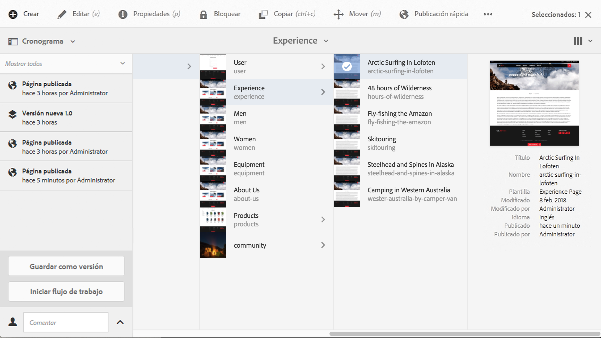

# Aplicación de flujos de trabajo a páginas{#applying-workflows-to-pages}

>[!CAUTION]
>
>AEM 6.4 ha llegado al final de la compatibilidad ampliada y esta documentación ya no se actualiza. Para obtener más información, consulte nuestra [períodos de asistencia técnica](https://helpx.adobe.com/es/support/programs/eol-matrix.html). Buscar las versiones compatibles [here](https://experienceleague.adobe.com/docs/).

Durante la creación, puede invocar flujos de trabajo para realizar acciones en las páginas; también es posible aplicar más de un flujo de trabajo.

Al aplicar el flujo de trabajo, debe especificar la siguiente información:

* Flujo de trabajo que se va a aplicar.

   Puede aplicar cualquier flujo de trabajo (al que tenga acceso, según lo haya asignado el administrador de AEM).

* De forma opcional, un título que ayuda a identificar la instancia de flujo de trabajo en la bandeja de entrada de un usuario.
* La carga útil del flujo de trabajo; puede ser una o más páginas.

Los flujos de trabajo se pueden iniciar desde:

* el **[Sitios](#starting-a-workflow-from-the-sites-console)** consola.
* al editar una página, desde **[Información de la página](#starting-a-workflow-from-the-page-editor)**.

>[!NOTE]
>
>Consulte también lo siguiente:
>
>* [Cómo aplicar flujos de trabajo a recursos DAM](/help/assets/assets-workflow.md).
>* [Uso de flujos de trabajo de proyecto](/help/sites-authoring/projects-with-workflows.md).
>

>[!NOTE]
>
>Los administradores de AEM pueden [iniciar flujos de trabajo mediante varios métodos más](/help/sites-administering/workflows-starting.md).

## Inicio de un flujo de trabajo desde la consola Sitios {#starting-a-workflow-from-the-sites-console}

Puede iniciar un flujo de trabajo desde:

* el **[Crear](#starting-a-workflow-from-the-sites-toolbar)** de la barra de herramientas Sitios.
* el **[Cronología](#starting-a-workflow-from-the-timeline)** carril de la consola Sitios .

En ambos casos, deberá:

* [Especificar los detalles del flujo de trabajo en el asistente Crear flujo de trabajo](#specifying-workflow-details-in-the-create-workflow-wizard).

### Inicio de un flujo de trabajo desde la barra de herramientas Sitios {#starting-a-workflow-from-the-sites-toolbar}

Puede iniciar un flujo de trabajo desde la barra de herramientas de la consola **Sitios**:

1. Busque y seleccione la página deseada. 

1. En la opción **Crear** de la barra de herramientas, ahora puede seleccionar el **Flujo de trabajo**.

   

1. La variable **Crear flujo de trabajo** asistente le ayudará [especificar los detalles del flujo de trabajo](#specifying-workflow-details-in-the-create-workflow-wizard).

### Inicio de un flujo de trabajo desde la línea de tiempo {#starting-a-workflow-from-the-timeline}

En el **Cronología** puede iniciar un flujo de trabajo para aplicarlo al recurso seleccionado.

1. [Seleccione el recurso](/help/sites-authoring/basic-handling.md#viewing-and-selecting-resources) y abra [Cronología](/help/sites-authoring/basic-handling.md#timeline) (o abra Cronología y seleccione el recurso).
1. La punta de flecha junto al campo Comentario puede utilizarse para mostrar **Iniciar flujo de trabajo**:

   

1. La variable **Crear flujo de trabajo** asistente le ayudará [especificar los detalles del flujo de trabajo](#specifying-workflow-details-in-the-create-workflow-wizard).

### Especificación de los detalles del flujo de trabajo en el asistente Crear flujo de trabajo {#specifying-workflow-details-in-the-create-workflow-wizard}

La variable **Crear flujo de trabajo** le ayudará a seleccionar el flujo de trabajo y a especificar los detalles necesarios.

Después de abrir el **Crear flujo de trabajo** desde:

* el **[Crear](#starting-a-workflow-from-the-sites-toolbar)** de la barra de herramientas Sitios.
* el **[Cronología](#starting-a-workflow-from-the-timeline)** carril de la consola Sitios .

Puede especificar detalles:

1. En el **Propiedades** , se definen las opciones básicas del flujo de trabajo:

   * **Modelo de flujo de trabajo**
   * **Título del flujo de trabajo**

      * Puede especificar un título para esta instancia, para ayudarle a identificarlo en una etapa posterior.

   Según el modelo de flujo de trabajo, también están disponibles las siguientes opciones. Permiten que el paquete creado como carga útil se mantenga después de que se complete el flujo de trabajo.

   * **Conservar paquete de flujo de trabajo**
   * **Título del paquete**

      * Puede especificar un título para el paquete, para ayudar a la identificación.
   >[!NOTE]
   >
   >La opción **Mantener paquete de flujo de trabajo** está disponible cuando el flujo de trabajo se ha configurado para la compatibilidad con varios recursos y se han seleccionado varios recursos.

   Cuando haya terminado, seleccione **Siguiente** para continuar.

   

1. En la etapa **Ámbito**, puede seleccionar lo siguiente:

   * **Añadir contenido** para abrir el [explorador de rutas](/help/sites-authoring/author-environment-tools.md#path-browser) y seleccionar recursos adicionales. En el explorador, haga clic o pulse en **Seleccionar** para añadir contenido a la instancia de flujo de trabajo.
   * Un recurso existente para ver acciones adicionales:

      * **Incluir elementos secundarios** para especificar que en el flujo de trabajo se incluirán los elementos secundarios de ese recurso.

         Se abrirá un cuadro de diálogo para que pueda ajustar la selección según lo siguiente:

         * Incluir solo los elementos secundarios inmediatos.
         * Incluir solo las páginas modificadas.
         * Incluir solo las páginas ya publicadas.

         Los elementos secundarios especificados se añaden a la lista de recursos a los que se aplica el flujo de trabajo.

      * **Eliminar selección** para eliminar ese recurso del flujo de trabajo.

   

   >[!NOTE]
   >
   >Si agrega recursos adicionales, puede utilizar **Atrás** para ajustar la configuración **Mantener flujo de trabajo del paquete** en el paso **Propiedades**.

1. Use la opción **Crear** para cerrar el asistente y crear la instancia de flujo de trabajo. Se muestra una notificación en la consola Sitios .

## Inicio de un flujo de trabajo desde el editor de páginas {#starting-a-workflow-from-the-page-editor}

Al editar una página, puede seleccionar **Información de la página** en la barra de herramientas. El menú desplegable tiene la opción **Iniciar en flujo de trabajo**. Se abrirá un cuadro de diálogo en el que puede especificar el flujo de trabajo necesario junto con un título, si fuera necesario: 

