# Participación en flujos de trabajo{#participating-in-workflows}

Los flujos de trabajo incluyen normalmente los pasos que una persona debe llevar a cabo para realizar una actividad en una página o un recurso. El flujo de trabajo selecciona un usuario o grupo para llevar a cabo la actividad y asigna el elemento de trabajo a esa persona o grupo. El usuario recibe la notificación y puede tomar las medidas adecuadas:

* [Visualización de notificaciones](#notifications-of-available-workflow-actions) 
* [Finalización de una etapa de participante](#completing-a-participant-step) 
* [Delegación de una etapa de participante](#delegating-a-participant-step) 
* [Realización de una etapa hacia atrás en una etapa de participante](#performing-step-back-on-a-participant-step) 
* [Apertura de un elemento de flujo de trabajo para ver los detalles (y tomar medidas)](#opening-a-workflow-item-to-view-details-and-take-actions) 
* [Visualización de la carga útil del flujo de trabajo (varios recursos)](#viewing-the-workflow-payload-multiple-resources) 

## Notificaciones de las acciones de flujo de trabajo disponibles {#notifications-of-available-workflow-actions}

Cuando se le asigna un elemento de trabajo (por ejemplo, **Aprobar contenido**), aparecen varias alertas o notificaciones:

* El indicador de [notificaciones](/help/sites-authoring/inbox.md) (barra de herramientas) se incrementará:

   

* El elemento figurará en la [Bandeja de entrada](/help/sites-authoring/inbox.md) de notificaciones:

   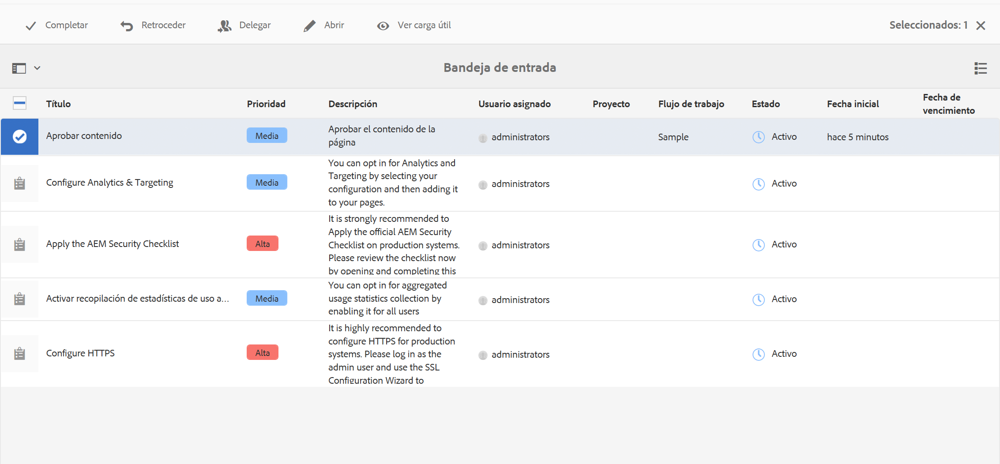

* Cuando utilice el editor de página, la barra de estado mostrará lo siguiente:

   * El nombre de los flujos de trabajo que se aplican a la página; por ejemplo, solicitud de activación.
   * Las acciones disponibles para el usuario actual para la etapa actual del flujo de trabajo; por ejemplo, Completar, Delegar, Ver detalles.
   * El número de flujos de trabajo en los que se encuentra la página. Puede hacer lo siguiente:

      * Usar las flechas izquierda/derecha para navegar por la información de estado de los distintos flujos de trabajo.
      * Hacer clic o pulsar en el número real para abrir una lista desplegable de todos los flujos de trabajo aplicables y, a continuación, seleccionar el flujo de trabajo que desee visualizar en la barra de estado.

   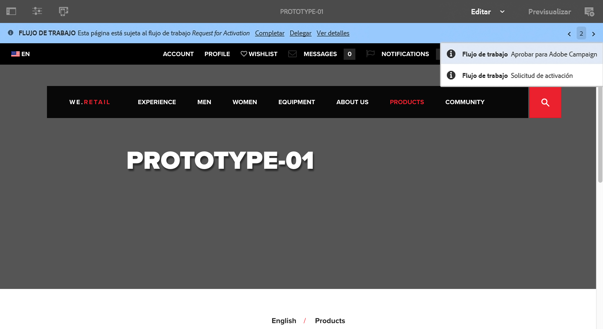

   >[!NOTE]
   >
   >The status bar is only visible to users with workflow privileges; for example, members of the `workflow-users` group.
   >
   >
   >Las acciones se muestran cuando el usuario actual participa directamente en el paso actual del flujo de trabajo.

* Cuando la opción **Escala de tiempo** está abierta para el recurso, se mostrará la etapa del flujo de trabajo. Al hacer clic o pulsar en el titular de alerta, se mostrarán las acciones disponibles:

   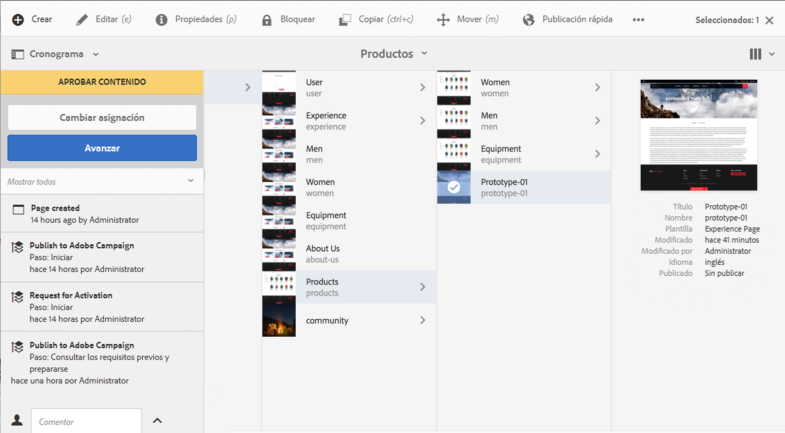

### Finalización de una etapa de participante {#completing-a-participant-step}

Puede completar un elemento para permitir que el flujo de trabajo vaya al paso siguiente.

En esta acción, puede indicar lo siguiente:

* **Etapa siguiente**: la etapa siguiente que se debe llevar a cabo. Se puede seleccionar una de la lista que se proporciona.
* **Comentario**: si fuera necesario

Puede completar una etapa de participante desde las ubicaciones siguientes:

* [la Bandeja de entrada](#completing-a-participant-step-inbox)
* [el Editor de página](#completing-a-participant-step-page-editor)
* [Escala de tiempo](#completing-a-participant-step-timeline)
* al [abrir un elemento de flujo de trabajo para ver los detalles](#opening-a-workflow-item-to-view-details-and-take-actions).

#### Finalización de una etapa de participante: bandeja de entrada {#completing-a-participant-step-inbox}

Utilice el siguiente procedimiento para completar el elemento de trabajo:

1. Abra la **[Bandeja de entrada AEM](/help/sites-authoring/inbox.md)**.
1. Seleccione el elemento de flujo de trabajo en el que desee realizar la acción (pulsar o hacer clic en la miniatura).
1. Select **Complete** from the toolbar.
1. Se abre el cuadro de diálogo **Completar elemento de trabajo**. Select the **Next Step** from the drop down selector and add a **Comment** if required.
1. Use **OK** to complete the step (or the **Cancel** to abort the action).

#### Finalización de una etapa de participante: editor de la página {#completing-a-participant-step-page-editor}

Utilice el siguiente procedimiento para completar el elemento de trabajo:

1. Abra la [página para editarla](/help/sites-authoring/managing-pages.md#opening-a-page-for-editing).
1. Select **Complete** from the status bar at the top.
1. Se abre el cuadro de diálogo **Completar elemento de trabajo**. Select the **Next Step** from the drop down selector and add a **Comment** if required.
1. Use **OK** to complete the step (or the **Cancel** to abort the action).

#### Finalización de una etapa de participante: escala de tiempo {#completing-a-participant-step-timeline}

También puede utilizar la escala de tiempo para completar y hacer avanzar una etapa:

1. Select the required page and open **Timeline** (or open **Timeline** and select the page):

   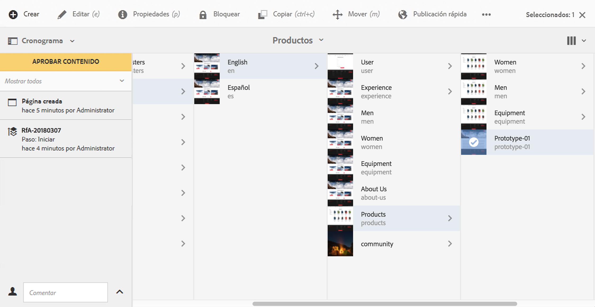

1. Haga clic o pulse en el titular de alerta para mostrar las acciones disponibles. Seleccione **Avanzar**:

   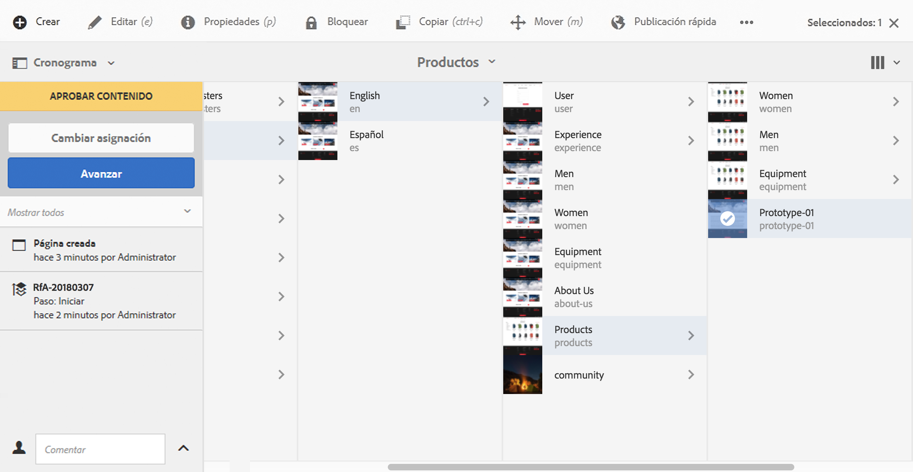

1. Según el flujo de trabajo, puede seleccionar la siguiente etapa:

   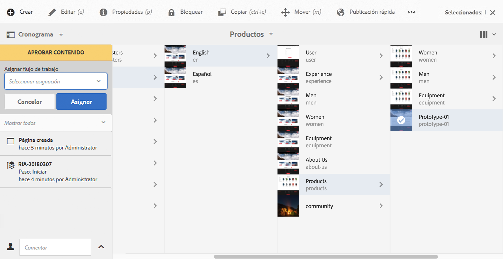

1. Seleccione **Avanzar** para confirmar la acción.

### Delegación de una etapa de participante {#delegating-a-participant-step}

Si se le ha asignado un paso, pero por cualquier motivo no puede realizarlo, puede delegar el paso a otro usuario o grupo.

Los usuarios que están disponibles para la delegación dependen de los usuarios a los que se ha asignado el elemento de trabajo:

* Si el elemento de trabajo se ha asignado a un grupo, los miembros del grupo estarán disponibles.
* Si el elemento de trabajo se ha asignado a un grupo y luego se ha delegado a un usuario, los miembros del grupo y el grupo están disponibles.
* Si el elemento de trabajo se ha asignado a un único usuario, el elemento de trabajo no se puede delegar.

En esta acción, puede indicar lo siguiente:

* **Usuario**: el usuario al que desea delegar el elemento de trabajo. Puede seleccionarlo de una lista proporcionada
* **Comentario**: si fuera necesario

Puede delegar una etapa de participante desde las ubicaciones siguientes:

* [la Bandeja de entrada](#delegating-a-participant-step-inbox)
* [el Editor de página](#delegating-a-participant-step-page-editor)
* [Escala de tiempo](#delegating-a-participant-step-timeline)
* al [abrir un elemento de flujo de trabajo para ver los detalles](#opening-a-workflow-item-to-view-details-and-take-actions).

#### Delegación de una etapa de participante: bandeja de entrada {#delegating-a-participant-step-inbox}

Utilice el siguiente procedimiento para delegar un elemento de trabajo:

1. Abra la **[Bandeja de entrada AEM](/help/sites-authoring/inbox.md)**.
1. Seleccione el elemento de flujo de trabajo en el que desee realizar la acción (pulsar o hacer clic en la miniatura).
1. Select **Delegate** from the toolbar.
1. Se abrirá el cuadro de diálogo. Specify the **User** from the drop down selector (this can also be a group) and add a **Comment** if required.
1. Use **OK** to complete the step (or the **Cancel** to abort the action).

#### Delegación de una etapa de participante: editor de la página {#delegating-a-participant-step-page-editor}

Utilice el siguiente procedimiento para delegar un elemento de trabajo:

1. Abra la [página para editarla](/help/sites-authoring/managing-pages.md#opening-a-page-for-editing).
1. Select **Delegate** from the status bar at the top.
1. Se abrirá el cuadro de diálogo. Specify the **User** from the drop down selector (this can also be a group) and add a **Comment** if required.
1. Use **OK** to complete the step (or the **Cancel** to abort the action).

#### Delegación de una etapa de participante: escala de tiempo {#delegating-a-participant-step-timeline}

También puede utilizar la escala de tiempo para delegar o asignar una etapa:

1. Select the required page and open **Timeline** (or open **Timeline** and select the page).
1. Haga clic o pulse en el titular de alerta para mostrar las acciones disponibles. Seleccione **Cambiar asignación**:

   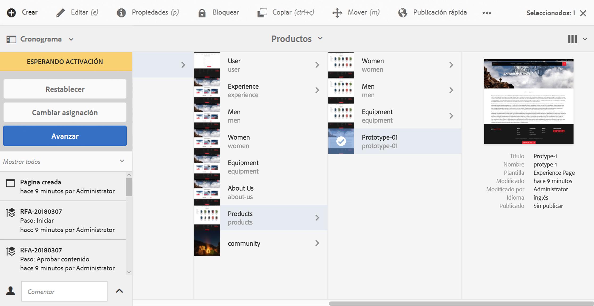

1. Especifique un nuevo usuario para la asignación:

   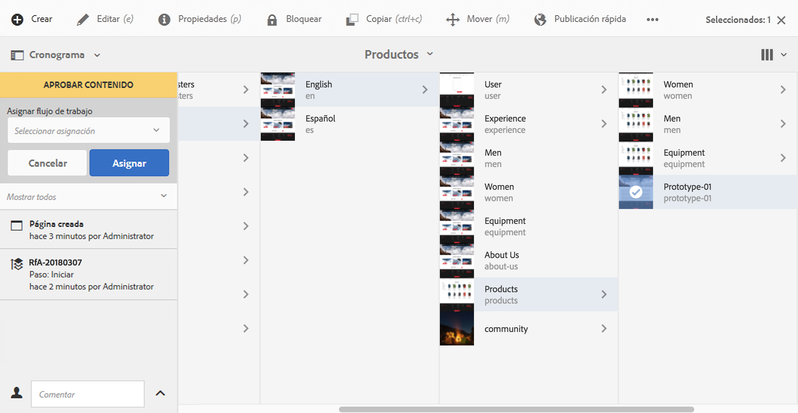

1. Select **Assign** to confirm the action.

### Realización de un paso hacia atrás en un paso de participante {#performing-step-back-on-a-participant-step}

Si descubre que un paso o una serie de pasos deben repetirse, puede volver atrás. Esto le permite seleccionar un paso que ya se haya visto en el flujo de trabajo, para volver a realizar el procesamiento. El flujo de trabajo vuelve al paso especificado y continúa desde ahí.

En esta acción, puede indicar lo siguiente:

* **Etapa anterior:** la etapa a la que se va a regresar. Se puede seleccionar una de la lista que se proporciona
* **Comentario**: si fuera necesario

Puede volver a una etapa anterior durante cualquier etapa de participante desde las ubicaciones siguientes:

* [la Bandeja de entrada](#performing-step-back-on-a-participant-step-inbox)
* [el Editor de página](#performing-step-back-on-a-participant-step-page-editor)
* [Escala de tiempo](#performing-step-back-on-a-participant-step-timeline)
* al [abrir un elemento de flujo de trabajo para ver los detalles](#opening-a-workflow-item-to-view-details-and-take-actions).

#### Realización de una etapa hacia atrás en una etapa de participante: bandeja de entrada {#performing-step-back-on-a-participant-step-inbox}

Utilice el siguiente procedimiento para volver a la etapa anterior:

1. Abra la **[Bandeja de entrada AEM](/help/sites-authoring/inbox.md)**.
1. Seleccione el elemento de flujo de trabajo en el que desee realizar la acción (pulsar o hacer clic en la miniatura).
1. Select **Step Back** to open the dialog.

1. Especifique un valor en **Etapa anterior** y añada un comentario en el campo **Comentario**, si fuera necesario.
1. Use **OK** to complete the step (or the **Cancel** to abort the action).

#### Realización de una etapa hacia atrás en una etapa de participante: editor de página {#performing-step-back-on-a-participant-step-page-editor}

Utilice el siguiente procedimiento para volver a la etapa anterior:

1. Abra la [página para editarla](/help/sites-authoring/managing-pages.md#opening-a-page-for-editing).
1. Select **Step Back** from the status bar at the top.
1. Especifique un valor en **Etapa anterior** y añada un comentario en el campo **Comentario**, si fuera necesario.
1. Use **OK** to complete the step (or the **Cancel** to abort the action).

#### Realización de una etapa hacia atrás en una etapa de participante: escala de tiempo {#performing-step-back-on-a-participant-step-timeline}

También puede utilizar la escala de tiempo para restablecer hasta una etapa anterior:

1. Select the required page and open **Timeline** (or open **Timeline** and select the page).
1. Haga clic o pulse en el titular de alerta para mostrar las acciones disponibles. Seleccione **Restablecer**:

   

1. Especifique la etapa a la que debe restablecerse el flujo de trabajo:

   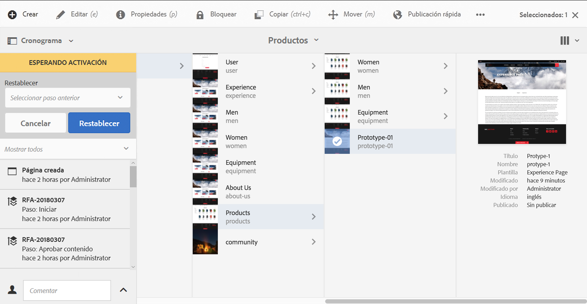

1. Select **Roll back** to confirm the action.

### Opening a Workflow Item to View Details (and Take Actions) {#opening-a-workflow-item-to-view-details-and-take-actions}

Visualice los detalles del elemento de trabajo del flujo de trabajo y tome las medidas adecuadas.

Los detalles del flujo de trabajo se muestran en fichas y las acciones adecuadas están disponibles en la barra de herramientas:

* Ficha **ELEMENTO DE TRABAJO:**

   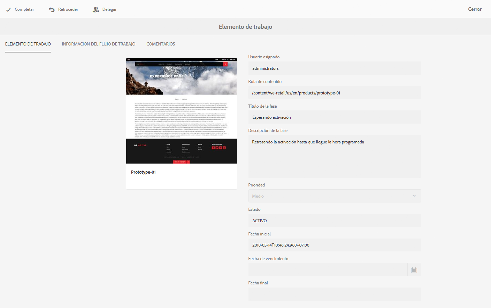

* **INFORMACIÓN DEL FLUJO DE TRABAJO**

   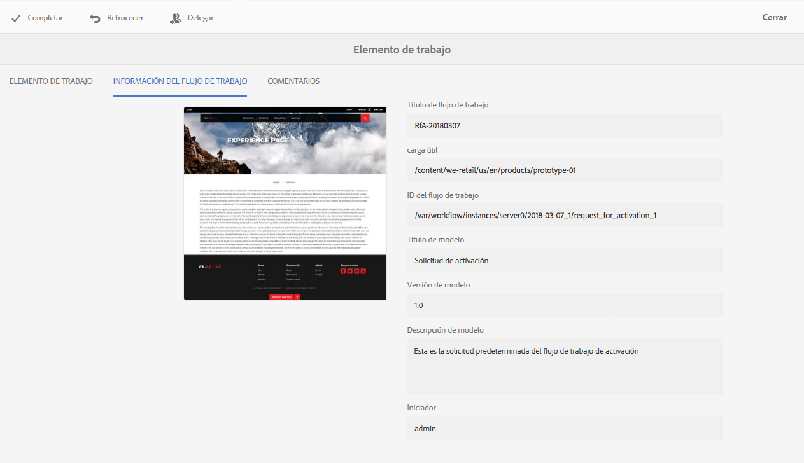

   Si se han configurado [etapas de flujo de trabajo](/help/sites-developing/workflows.md#workflow-stages) para el modelo, puede ver el progreso según los siguientes elementos:

   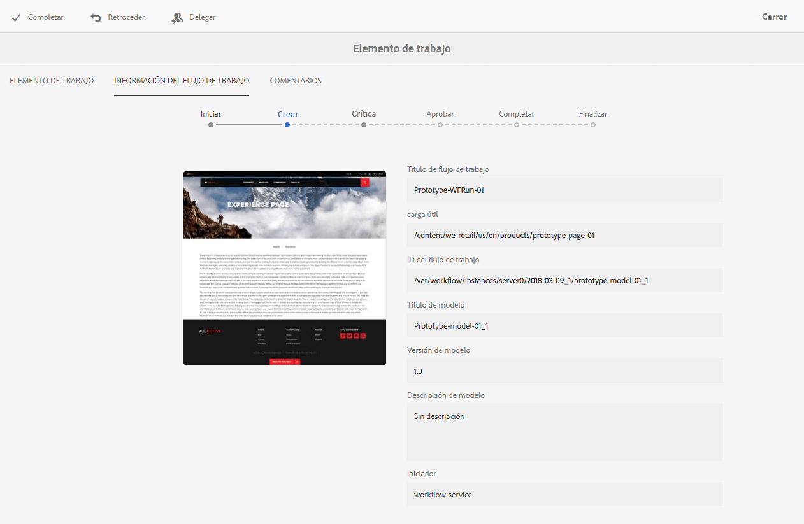

* **COMENTARIOS**

   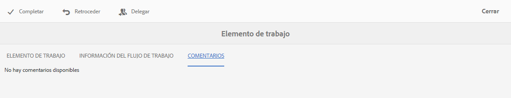

Puede abrir los detalles del elemento de trabajo desde las ubicaciones siguientes:

* [la Bandeja de entrada](#performing-step-back-on-a-participant-step-inbox)
* [el Editor de página](#performing-step-back-on-a-participant-step-page-editor)

#### Apertura de los detalles del flujo de trabajo: bandeja de entrada {#opening-workflow-details-inbox}

Para abrir un elemento de flujo de trabajo y ver los detalles:

1. Abra la **[Bandeja de entrada AEM](/help/sites-authoring/inbox.md)**.
1. Seleccione el elemento de flujo de trabajo en el que desee realizar la acción (pulsar o hacer clic en la miniatura).
1. Select **Open** to open the information tabs.

1. Si fuera necesario, seleccione la acción adecuada, proporcione los detalles necesarios y confirme con **Aceptar** (o **Cancelar**).
1. Use **Save** or **Cancel** to exit.

#### Apertura de los detalles del flujo de trabajo: editor de página {#opening-workflow-details-page-editor}

Para abrir un elemento de flujo de trabajo y ver los detalles:

1. Abra la [página para editarla](/help/sites-authoring/managing-pages.md#opening-a-page-for-editing).
1. Select **View Details** from the status bar to open the information tabs.

1. Si fuera necesario, seleccione la acción adecuada, proporcione los detalles necesarios y confirme con **Aceptar** (o **Cancelar**).
1. Use **Save** or **Cancel** to exit.

### Viewing the Workflow Payload (Multiple Resources) {#viewing-the-workflow-payload-multiple-resources}

Puede ver los detalles de la carga útil asociada con la instancia de flujo de trabajo. Inicialmente, se muestran los recursos del paquete y luego puede explorar en profundidad para mostrar las páginas individuales.

Para ver la carga útil y los recursos de la instancia de flujo de trabajo:

1. Abra la **[Bandeja de entrada AEM](/help/sites-authoring/inbox.md)**.
1. Seleccione el elemento de flujo de trabajo en el que desee realizar la acción (pulsar o hacer clic en la miniatura).
1. Select **View Payload** from the toolbar to open the dialog.

   Dado que un paquete de flujo de trabajo es simplemente una colección de punteros a rutas dentro del repositorio, puede añadir, quitar o modificar las entradas aquí para ajustar los elementos a los que el paquete de flujo de trabajo hace referencia. Utilice el componente **Definición de medios** para añadir nuevas entradas.

   

1. Los vínculos se pueden utilizar para abrir las páginas individuales.

