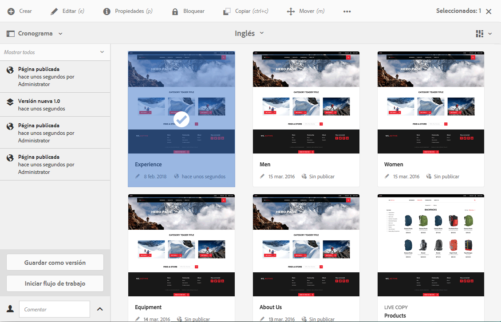

# Uso de versiones de página  {#working-with-page-versions}

>[!CAUTION]
>
>AEM 6.4 ha llegado al final de la compatibilidad ampliada y esta documentación ya no se actualiza. Para obtener más información, consulte nuestra [períodos de asistencia técnica](https://helpx.adobe.com/es/support/programs/eol-matrix.html). Buscar las versiones compatibles [here](https://experienceleague.adobe.com/docs/).

Al generar una versión se crea una &quot;instantánea&quot; de una página en un punto específico en el tiempo. Con el control de versiones, puede realizar las siguientes acciones:

* Cree una versión de una página.
* Restaurar una página a una versión anterior para deshacer un cambio realizado en una página, por ejemplo.
* Compare la versión actual de una página con una versión anterior, resaltando las diferencias en el texto y las imágenes.

## Creación de una nueva versión   {#creating-a-new-version}

Puede crear una versión de su recurso desde:

* el [Carril de cronología](#creating-a-new-version-timeline)
* el [Crear](#creating-a-new-version-create-with-a-selected-resource) (cuando hay un recurso seleccionado)

### Crear una nueva versión: línea de tiempo {#creating-a-new-version-timeline}

1. Desplácese para mostrar la página para la que desea crear una versión.
1. Seleccione la página en [modo de selección](/help/sites-authoring/basic-handling.md#viewing-and-selecting-resources).
1. Abra el **Cronología** para abrir el Navegador.
1. Toque o haga clic en la punta de la flecha junto al campo de comentarios para mostrar las opciones:

   

1. Select **Guardar como versión**.
1. Escriba un **Etiqueta** y **Comentario** si es necesario.

   

1. Confirme la nueva versión con **Crear**.

   La información en la línea de tiempo se actualizará para indicar la nueva versión.

### Crear una nueva versión: creación con un recurso seleccionado {#creating-a-new-version-create-with-a-selected-resource}

1. Desplácese para mostrar la página para la que desea crear una versión.
1. Seleccione la página en [modo de selección](/help/sites-authoring/basic-handling.md#viewing-and-selecting-resources).
1. Seleccione el **Crear** en la barra de herramientas.
1. Se abrirá el cuadro de diálogo. Si procede, puede introducir un valor **Etiqueta** y **Comentario:**

   

1. Confirme la nueva versión con **Crear**.

   La línea de tiempo se abrirá con información actualizada para indicar la nueva versión. 

## Reversión a una versión de la página {#reverting-to-a-page-version}

Cuando haya creado una versión, puede volver a dicha versión si es necesario.

>[!NOTE]
>
>Al restaurar una página, la versión creada formará parte de una rama nueva.
>
>Como ejemplo:
>
>* Cree una versión de una página cualquiera.
>* Las etiquetas y los nombres de nodo iniciales serán 1.0., 1.1, 1.2, etc.
>* Restaurar la primera versión; es decir, 1.0.
>* Vuelva a crear nuevas versiones.
>* Las etiquetas generadas y los nombres de nodo ahora serán 1.0.0, 1.0.1, 1.0.2, etc.
>

Para volver a una versión anterior:

1. Desplácese para mostrar la página que desea revertir a una versión anterior.
1. Seleccione la página en [modo de selección](/help/sites-authoring/basic-handling.md#viewing-and-selecting-resources).
1. Abra la columna **Cronología** y seleccione **Mostrar todo** o **Versiones**. Se enumerarán las versiones de página de la página seleccionada.
1. Seleccione la versión a la que desee revertir. Se mostrarán las opciones posibles:

   

1. Select **Revertir a esta versión**. Se restaurará la versión seleccionada y se actualizará la información en la cronología.

## Vista previa de una versión   {#previewing-a-version}

Puede obtener una vista previa de una versión específica:

1. Desplácese para mostrar la página que desee comparar.
1. Seleccione la página en [modo de selección](/help/sites-authoring/basic-handling.md#viewing-and-selecting-resources).
1. Abra la columna **Línea de tiempo** y seleccione **Mostrar todo** o **Versiones**.
1. Se enumerarán las versiones de la página. Seleccione la versión que desee previsualizar:

   

1. Select **Vista previa**. La página se muestra en una nueva pestaña.

   >[!CAUTION]
   >
   >Si se ha movido una página, ya no puede realizar una vista previa de ninguna versión realizada antes del movimiento.
   >
   >Si tiene problemas con una vista previa, consulte la [Cronología](/help/sites-authoring/basic-handling.md#timeline) para que la página vea si se ha movido.

## Comparar una versión con la página actual {#comparing-a-version-with-current-page}

Para comparar una versión anterior con la página actual:

1. Desplácese para mostrar la página que desee comparar.
1. Seleccione la página en [modo de selección](/help/sites-authoring/basic-handling.md#viewing-and-selecting-resources).
1. Abra la columna **Línea de tiempo** y seleccione **Mostrar todo** o **Versiones**.
1. Se enumerarán las versiones de la página. Seleccione la versión que desee comparar:

   

1. Select **Comparar con actual**. La variable [diferenciación de página](/help/sites-authoring/page-diff.md) se abrirán y mostrarán las diferencias.

## Deformación de tiempo   {#timewarp}

Deformación de tiempo es una función diseñada para simular el estado *publicado* de una página en periodos específicos en el pasado.

El propósito es permitirle realizar un seguimiento del sitio web publicado en el punto temporal seleccionado. Se utilizan las versiones de página para determinar el estado del entorno de publicación.

Para ello:

* El sistema busca la versión de la página que estaba activa en el momento seleccionado.
* Esto significa que la versión mostrada se creó o activó *antes del* punto temporal seleccionado en Deformación de tiempo.
* Al navegar a una página que se haya eliminado, también se procesará, siempre que las versiones antiguas de la página sigan estando disponibles en el repositorio.
* Si no se encuentran versiones publicadas, Deformación de tiempo volverá al estado actual de la página en el entorno de creación (para evitar una página de error/404, lo que impediría el examen).

### Utilizar la Deformación de tiempo {#using-timewarp}

Deformación de tiempo es un [mode](/help/sites-authoring/author-environment-tools.md#page-modes) del editor de páginas. Para iniciarlo, simplemente cambie como lo haría con cualquier otro modo.

1. Inicie el editor de la página en la que desea iniciar Deformación de tiempo y, a continuación, seleccione **Deformación de tiempo** en la selección de modo.

   

1. En el cuadro de diálogo establezca una fecha y hora de destino y pulse o haga clic en **Establecer fecha**. Si no selecciona una hora, la hora actual será la predeterminada.

   

1. La página se muestra en función de la fecha establecida. El modo Deformación de tiempo se indica mediante la barra de estado azul situada en la parte superior de la ventana. Utilice los vínculos de la barra de estado para seleccionar una nueva fecha de destino o salir del modo Deformación de tiempo.

   

### Limitaciones de Deformación de tiempo

Deformación de tiempo realiza el mejor esfuerzo para reproducir una página en un punto temporal seleccionado. Sin embargo, debido a las complejidades de la creación continua de contenido en AEM, esto no siempre es posible. Estas limitaciones deben tenerse en cuenta al utilizar Deformación de tiempo.

* **Deformación de tiempo funciona dependiendo de las páginas publicadas**: Deformación de tiempo solo funciona a la perfección si ya ha publicado la página. En caso contrario, Deformación de tiempo mostrará la página actual en el entorno de creación.
* **Deformación de tiempo emplea las versiones de página**: si se desplaza a una página que se ha eliminado del repositorio, se procesa correctamente si aún hay versiones antiguas de la página en el repositorio.
* **Las versiones eliminadas afectan a la función Deformación de tiempo**: si las versiones se eliminan del repositorio, Deformación de tiempo no puede mostrar resultados correctos.
* **Deformación de tiempo es de solo lectura**: no se puede editar la versión antigua de la página. Tan solo pueden visualizarse. Si desea restaurar la versión anterior, deberá hacerlo manualmente mediante la restauración.
* **Deformación de tiempo se basa únicamente en el contenido de la página**: si los elementos para procesar el sitio web (código, CSS, recursos e imágenes, etc.) cambian, la vista será diferente de la original, ya que no hay versiones de dichos elementos en el repositorio.

>[!CAUTION]
>
>Deformación de tiempo está diseñada como una herramienta para ayudar a los autores a comprender y crear su contenido. No se trata de un registro de auditoría ni de un registro jurídico.
