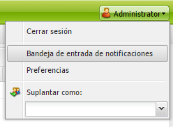
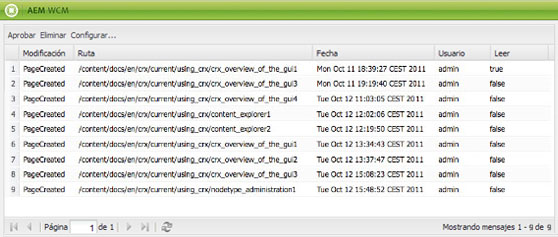
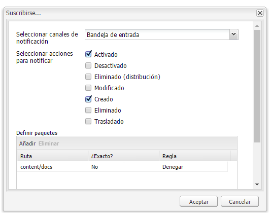
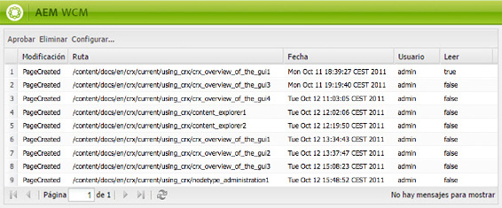

# Su bandeja de entrada{#your-inbox}

>[!CAUTION]
>
>AEM 6.4 ha llegado al final de la compatibilidad ampliada y esta documentación ya no se actualiza. Para obtener más información, consulte nuestra [períodos de asistencia técnica](https://helpx.adobe.com/es/support/programs/eol-matrix.html). Buscar las versiones compatibles [here](https://experienceleague.adobe.com/docs/).

Puede recibir notificaciones desde varias áreas de AEM, como notificaciones sobre elementos de trabajo o tareas que representan acciones que debe realizar en el contenido de la página.

Estas notificaciones se reciben en dos bandejas de entrada, que están separadas por el tipo de notificaciones:

* En la siguiente sección se describe una bandeja de entrada donde puede ver las notificaciones recibidas como resultado de suscripciones.
* Una bandeja de entrada especializada para elementos de flujo de trabajo se describe en la sección [Participación en flujos de trabajo](/help/sites-classic-ui-authoring/classic-workflows-participating.md) documento.

## Visualización de notificaciones {#viewing-your-notifications}

Para ver las notificaciones:

1. Abra la bandeja de entrada de notificaciones: en el **Sitios web** consola, haga clic en el botón de usuario en la esquina superior derecha y seleccione **Bandeja de entrada de notificaciones**.

   

   >[!NOTE]
   >
   >También puede acceder a la consola directamente desde el navegador; por ejemplo:
   >
   >` https://<host>:<port>/libs/wcm/core/content/inbox.html`

1. Se enumerarán las notificaciones. Puede realizar las acciones necesarias:

   * [Suscripción a las notificaciones](#subscribing-to-notifications)
   * [Procesamiento de notificaciones](#processing-your-notifications)

   

## Suscripción a las notificaciones {#subscribing-to-notifications}

Para suscribirse a notificaciones:

1. Abra la bandeja de entrada de notificaciones: en el **Sitios web** consola, haga clic en el botón de usuario en la esquina superior derecha y seleccione **Bandeja de entrada de notificaciones**.

   

   >[!NOTE]
   >
   >También puede acceder a la consola directamente desde el navegador; por ejemplo:
   >
   >`https://<host>:<port>/libs/wcm/core/content/inbox.html`

1. Haga clic en **Configurar...** en la esquina superior izquierda para abrir el cuadro de diálogo de configuración.

   

1. Seleccione el canal de notificación:

   * **Bandeja de entrada**: las notificaciones se mostrarán en la bandeja de entrada de AEM.
   * **Correo electrónico**: las notificaciones se enviarán por correo electrónico a la dirección de correo electrónico definida en su perfil de usuario.

   >[!NOTE]
   >
   >Es necesario configurar algunos ajustes para recibir notificaciones por correo electrónico. También es posible personalizar la plantilla de correo electrónico o añadir una plantilla de correo electrónico para un nuevo idioma. Consulte [Configuración de notificaciones por correo electrónico](/help/sites-administering/notification.md#configuringemailnotification) para configurar las notificaciones por correo electrónico en AEM.

1. Seleccione las acciones de página para las que desea recibir notificaciones:

   * Activado: cuando se activa una página.
   * Desactivado: cuando se desactiva una página.
   * Eliminado (distribución): cuando se elimina-replica una página, es decir, cuando se replica una acción de eliminar realizada en una página.

      Cuando se elimina o mueve una página, se replica automáticamente una acción de eliminar: la página se elimina en la instancia de origen donde se realizó la acción de eliminación y en la instancia de destino definida por los agentes de replicación.

   * Modificado: cuando se modifica una página.
   * Creado: cuando se haya creado una página.
   * Eliminado: cuando se elimina una página mediante la acción de eliminar página.
   * Desplegado: cuando se despliega una página.

1. Defina las rutas de las páginas para las que recibirá notificaciones:

   * Haga clic en **Agregar** para agregar una fila nueva a la tabla.
   * Haga clic en el **Ruta** celda de tabla e introduzca la ruta, por ejemplo `/content/docs`.
   * Para recibir notificaciones para todas las páginas pertenecientes al subárbol, establezca **¿Exacto?** a **No**.

      Para recibir notificaciones únicamente para acciones en la página definida por la ruta, establezca **¿Exacto?** a **Sí**.

   * Para permitir la regla, establezca **Regla** a **Permitir**. Si está configurado como **Denegar**, la regla se deniega, pero no se elimina y se puede permitir más tarde.

   Para quitar una definición, seleccione la fila haciendo clic en una celda de tabla y haga clic en **Eliminar**.

1. Haga clic en **OK** para guardar la configuración.

## Procesamiento de notificaciones {#processing-your-notifications}

Si ha elegido recibir notificaciones en su bandeja de entrada de AEM, la bandeja de entrada se llenará de notificaciones. Puede [ver las notificaciones](#viewing-your-notifications) a continuación, seleccione las notificaciones necesarias para:

* Aprobar haciendo clic en **Aprobar**: el valor de la variable **Lectura** se configura como **true**.

* Eliminarla haciendo clic en **Eliminar**.

