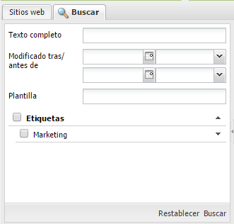
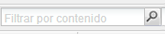
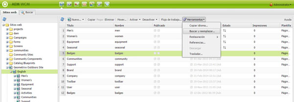
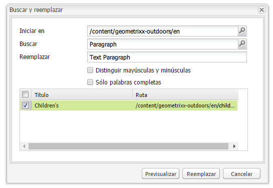

# Búsqueda{#search-features}

>[!CAUTION]
>
>AEM 6.4 ha llegado al final de la compatibilidad ampliada y esta documentación ya no se actualiza. Para obtener más información, consulte nuestra [períodos de asistencia técnica](https://helpx.adobe.com/es/support/programs/eol-matrix.html). Buscar las versiones compatibles [here](https://experienceleague.adobe.com/docs/).

El entorno de autor AEM ofrece varios mecanismos para buscar contenido, en función del tipo de recurso.

>[!NOTE]
>
>Fuera del entorno de creación también hay otros mecanismos disponibles para buscar, como la variable [Generador de consultas](/help/sites-developing/querybuilder-api.md) y [CRXDE Lite](/help/sites-developing/developing-with-crxde-lite.md).

## Conceptos básicos de búsqueda {#search-basics}

Para acceder al panel de búsqueda, haga clic en el **Buscar** en la parte superior del panel izquierdo de la consola adecuada.

El panel de búsqueda permite realizar búsquedas en todas las páginas del sitio web. Contiene campos y utilidades para lo siguiente:

* **Texto completo**: Buscar el texto especificado
* **Modificado después/antes**: Buscar solo las páginas modificadas entre fechas específicas
* **Plantilla**: Buscar solo las páginas basadas en la plantilla especificada
* **Etiquetas**: Buscar solo las páginas con las etiquetas especificadas

>[!NOTE]
>
>Cuando la instancia está configurada para [Búsqueda de Lucene](/help/sites-deploying/queries-and-indexing.md) puede utilizar lo siguiente en **Texto completo**:
>
>* [Comodín](https://lucene.apache.org/core/5_3_1/queryparser/org/apache/lucene/queryparser/classic/package-summary.html#Wildcard_Searches)
>* [Operadores booleanos](https://lucene.apache.org/core/5_3_1/queryparser/org/apache/lucene/queryparser/classic/package-summary.html#Boolean_operators)
>
>* [Expresiones regulares](https://lucene.apache.org/core/5_3_1/queryparser/org/apache/lucene/queryparser/classic/package-summary.html#Regexp_Searches)
>* [Agrupación de campos](https://lucene.apache.org/core/5_3_1/queryparser/org/apache/lucene/queryparser/classic/package-summary.html#Field_Grouping)
>* [Ampliación](https://lucene.apache.org/core/5_3_1/queryparser/org/apache/lucene/queryparser/classic/package-summary.html#Boosting_a_Term)
>

Para ejecutar la búsqueda, haga clic en **Buscar** en la parte inferior del panel. Haga clic en **Restablecer** para borrar los criterios de búsqueda.

## Filter {#filter}

En varias ubicaciones se puede configurar un filtro (y borrarlo) para explorar en profundidad y refinar la vista:

## Buscar y reemplazar {#find-and-replace}

En el **Sitios web** consola a **Buscar y reemplazar** permite buscar y reemplazar varias instancias de una cadena en una sección del sitio web.

1. Seleccione la página raíz, o carpeta, donde desea que se realice la acción de buscar y reemplazar.
1. Select **Herramientas** then **Buscar y reemplazar**:

   

1. La variable **Buscar y reemplazar** hace lo siguiente:

   * confirma la ruta raíz en la que debería comenzar la acción de búsqueda
   * define el término que se va a encontrar
   * define el término que debería reemplazarlo
   * indica si la búsqueda debe distinguir entre mayúsculas y minúsculas
   * indica si solo se deben encontrar palabras completas (de lo contrario, también se encuentran subcadenas)

   Hacer clic **Vista previa** enumera dónde se ha encontrado el término. Puede seleccionar o borrar instancias específicas para reemplazarlas:

   

1. Haga clic en **Reemplazar** para reemplazar todas las instancias. Se le solicitará que confirme la acción.

El ámbito predeterminado para el servlet de buscar y reemplazar cubre las siguientes propiedades:

* `jcr:title`
* `jcr:description`
* `jcr:text`
* `text`

El ámbito se puede cambiar mediante la consola de gestión web Apache Felix (por ejemplo, en `http://localhost:4502/system/console/configMgr`). Select `CQ WCM Find Replace Servlet (com.day.cq.wcm.core.impl.servlets.FindReplaceServlet)` y configure el ámbito según sea necesario.

>[!NOTE]
>
>En una instalación de AEM estándar, Buscar y reemplazar utiliza Lucene para la funcionalidad de búsqueda.
>
>Lucene indexa propiedades de cadena de hasta 16 k de longitud. No se buscarán las cadenas que superen esto.
