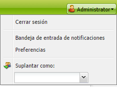
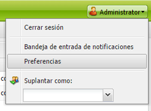
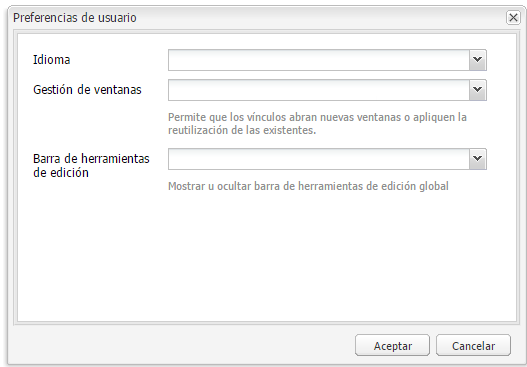

# Configuración del entorno de cuenta{#configuring-your-account-environment}

AEM le permite configurar su cuenta y ciertos aspectos del entorno de creación.

Al utilizar la [configuración de la cuenta](#account-settings) y las [preferencias de usuario](#user-preferences), se pueden definir las siguientes opciones y preferencias:

* **Barra de herramientas de edición** Seleccione si desea que se muestre la barra de herramientas de edición global. Esta barra de herramientas, que se muestra en la parte superior de la ventana del explorador, le proporciona 
**Botones Copiar**, **Cortar**, **Pegar** y **Eliminar** para utilizar con los componentes de párrafo de esa página:

   * Mostrar si es necesario (predeterminado)
   * Mostrar siempre
   * Mantener oculto

* **Suplantar como** Con la función [Suplantar como](/help/sites-administering/security.md#impersonating-another-user), un usuario puede trabajar en nombre de otro usuario.

* **Idioma** El idioma que se va a utilizar en la interfaz de usuario del entorno de creación. Seleccione el idioma requerido en la lista disponible.

* **Gestión de ventanas** Seleccione una de estas opciones:

   * Varias ventanas (predeterminado): Las páginas se abrirán en una ventana nueva.
   * Ventana única: Las páginas se abrirán en la ventana actual.

## Configuración de la cuenta {#account-settings}

El icono de usuario le da acceso a varias de las siguientes opciones:

* Cerrar sesión
* [Suplantar como](/help/sites-administering/security.md#impersonating-another-user)
* [Preferencias de usuario](#user-preferences)
* [Bandeja de entrada de notificaciones](/help/sites-classic-ui-authoring/author-env-inbox.md)

## Preferencias de usuario {#user-preferences}

Cada usuario puede establecer ciertas propiedades por su propia cuenta. Se puede hacer en el cuadro de diálogo **Preferencias** situado en la esquina superior derecha de las consolas.

El cuadro de diálogo ofrece las opciones siguientes:

