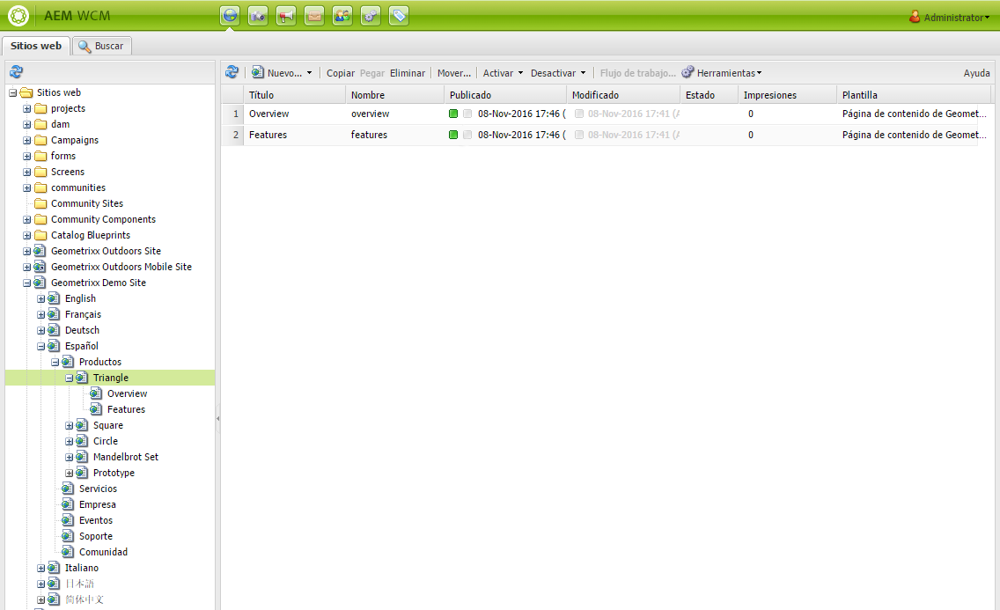
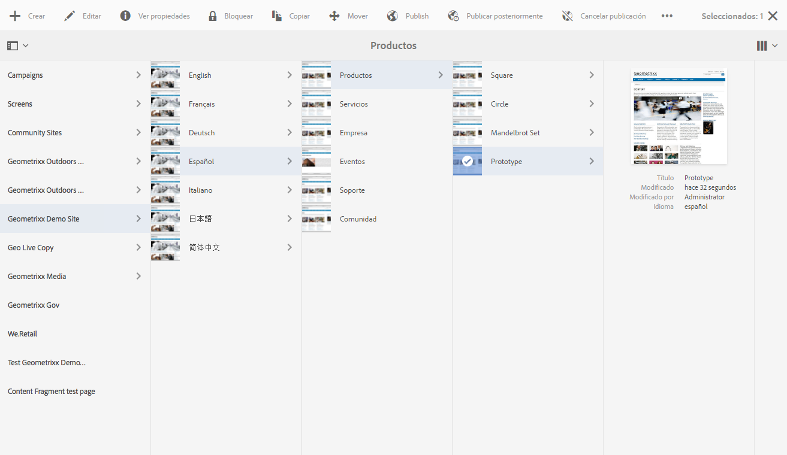
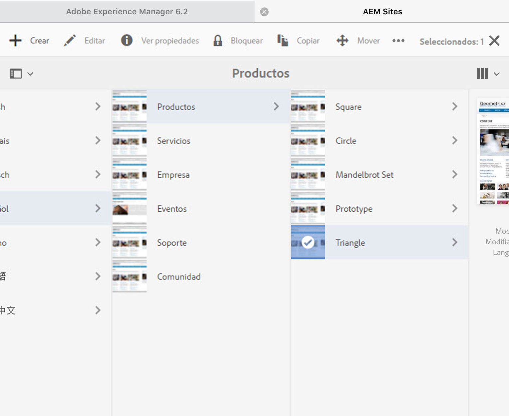

# Uso del entorno de creación{#working-with-the-author-environment}

>[!CAUTION]
>
>AEM 6.4 ha llegado al final de la compatibilidad ampliada y esta documentación ya no se actualiza. Para obtener más información, consulte nuestra [períodos de asistencia técnica](https://helpx.adobe.com/es/support/programs/eol-matrix.html). Buscar las versiones compatibles [here](https://experienceleague.adobe.com/docs/).

>[!NOTE]
>
>La siguiente documentación se centra en la IU clásica. Para obtener información sobre la creación en la IU moderna y con capacidad táctil, consulte la [documentación de creación estándar](/help/assets/assets.md).

El entorno de creación permite realizar tareas relacionadas con:

* [Creación](/help/sites-authoring/author.md) (incluido [creación de páginas](/help/sites-authoring/qg-page-authoring.md) y [administración de recursos](/help/assets/assets.md))

* [Administración](/help/sites-administering/administer-best-practices.md) tareas que necesita para generar y mantener el contenido del sitio web

Para conseguirlo, se proporcionan dos interfaces gráficas de usuario, a las que se puede acceder desde cualquier navegador moderno:

1. IU clásica

   * Esta IU siempre ha estado disponible en AEM durante muchos años.
   * Es principalmente verde.
   * Se ha diseñado para utilizarse en dispositivos de escritorio.
   * Ya no se mantiene.
   * La siguiente documentación se centra en esta IU clásica. Para obtener información sobre la creación en la IU moderna y táctil, consulte la [documentación de creación estándar](/help/sites-authoring/author.md).
   

1. IU táctil

   * Esta es la IU AEM estándar moderna.
   * Es principalmente gris, con una interfaz limpia y plana.
   * Está diseñado para utilizarse tanto en dispositivos táctiles como de escritorio (optimizado para dispositivos táctiles). Aunque el aspecto es el mismo en todos los dispositivos [visualización y selección de los recursos](/help/sites-authoring/basic-handling.md) difiere ligeramente (toques frente a clics).
   * Consulte la [documentación de creación estándar](/help/sites-authoring/author.md) para obtener más información sobre cómo crear con la IU táctil. La siguiente documentación se centra en la IU clásica.

   * Escritorio:
   

   * Dispositivos de tableta (o de escritorio con menos de 1024 píxeles de ancho):
   
