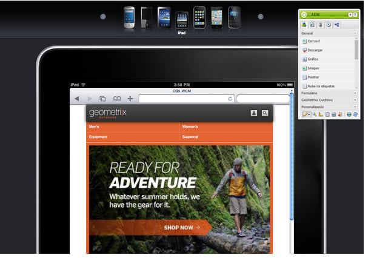

# Crear una página para dispositivos móviles{#authoring-a-page-for-mobile-devices}

>[!CAUTION]
>
>AEM 6.4 ha llegado al final de la compatibilidad ampliada y esta documentación ya no se actualiza. Para obtener más información, consulte nuestra [períodos de asistencia técnica](https://helpx.adobe.com/es/support/programs/eol-matrix.html). Buscar las versiones compatibles [here](https://experienceleague.adobe.com/docs/).

Al crear una página móvil, esta se muestra de forma que emula al dispositivo móvil. Al crear la página, puede cambiar entre varios emuladores para ver qué ve el usuario final al acceder a la página.

Los dispositivos se agrupan en las categorías característica, inteligente y táctil, según las capacidades de los dispositivos para procesar una página. Cuando el usuario final accede a una página móvil, AEM detecta el dispositivo y envía la representación que corresponde a su grupo de dispositivos.

>[!NOTE]
>
>Para crear un sitio móvil basado en un sitio estándar existente, cree una Live Copy del sitio estándar. (Consulte [Creación de una Live Copy para diferentes canales](/help/sites-administering/msm-livecopy.md).)
>
>Los desarrolladores de AEM pueden crear nuevos grupos de dispositivos. (Consulte [Creación de filtros de grupo de dispositivos.](/help/sites-developing/groupfilters.md))

Utilice el siguiente procedimiento para crear una página para móvil:

1. En el explorador, vaya a la **Siteadmin** consola.
1. Abra el **Productos** página siguiente **Sitios web** >> **Sitio de demostración de Geometrixx Mobile** >> **Inglés**.

1. Cambie a un emulador diferente. Para ello, puede:

   * Haga clic en el icono del dispositivo en la parte superior de la página.
   * Haga clic en el **Editar** en el **Barra de tareas** y seleccione el dispositivo en el menú desplegable.

1. Arrastre y suelte la **Texto e imagen** de la ficha Móvil de la barra de tareas a la página.
1. Edite el componente y añada texto. Haga clic en **OK** para guardar los cambios.

La página tiene el mismo aspecto que la siguiente:

>[!NOTE]
>
>Los emuladores se desactivan cuando se solicita una página de la instancia del autor desde un dispositivo móvil. La creación se puede realizar utilizando la IU táctil.
