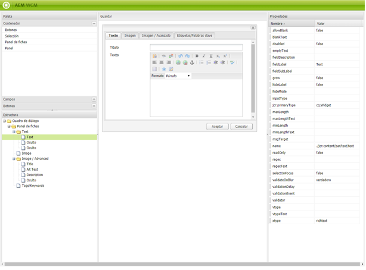
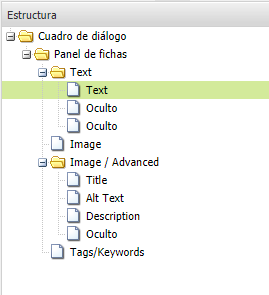
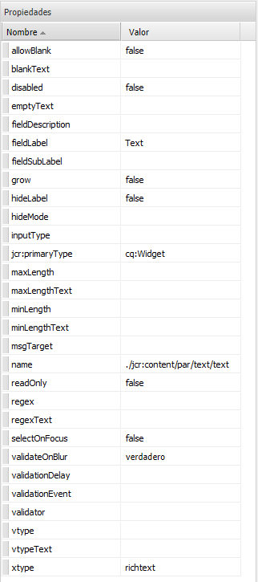
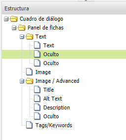
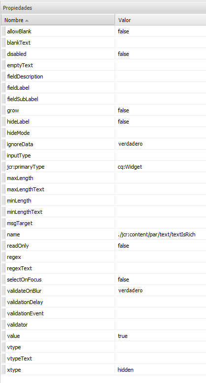
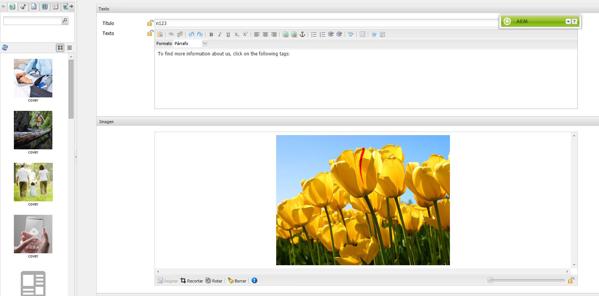

# Scaffolding{#scaffolding}

A veces, es posible que necesite crear un conjunto grande de páginas que comparten la misma estructura pero tienen contenido diferente. A través de la interfaz de AEM estándar, necesitaría crear cada página, arrastrar los componentes correspondientes a la página y rellenar cada uno individualmente.

Con scaffolding, puede crear un formulario (un scaffold) con campos que reflejen la estructura que desee para sus páginas y luego usar este formulario para crear fácilmente páginas según esta estructura.

>[!NOTE]
>
>El scaffolding (en la IU clásica) [respeta la herencia de MSM](#scaffolding-with-msm-inheritance).

## Funcionamiento del scaffolding {#how-scaffolding-works}

Scaffolds are stored in the **Tools** console of the site admin.

* Abra la consola **Herramientas** y haga clic en **Scaffolding de página predeterminada**.

* Aquí, haga clic en **geometrixx**.
* Dentro de **geometrixx**, encontrará una *página de scaffold* denominada **Noticias**. Haga doble clic para abrir esta página.

The scaffold consists of a form with a field for each piece of content that will make up the page to be created and four important parameters which are accessed through the **Page Properties** of the scaffold page.

Las propiedades de página de scaffolding son:

* **Texto del título**: Es el nombre de esta página de scaffolding misma. En este ejemplo, se llama “Noticias”.
* **Descripción**: Aparece debajo del título en la página de scaffolding.
* **Plantilla de destino**: Es la plantilla que este scaffold usará cuando cree una nueva página. En este ejemplo, es una plantilla de *Página de contenido de Geometrixx*.

* **Ruta de destino**: Es la ruta de acceso de la página primaria debajo de la cual este scaffold creará nuevas páginas. In this example the path is */content/geometrixx/en/news*.

El cuerpo del scaffold es el formulario. Cuando un usuario desea crear una página con el scaffold, el usuario completa el formulario y hace clic en *Crear*, en la parte inferior. En el ejemplo **Noticias** de arriba, el formulario tiene los siguientes campos:

* **Título**: Es el nombre de la página que se va a crear. Este campo siempre está presente en cada scaffold.
* **Texto**: Este campo corresponde a un componente de texto en la página resultante.
* **Imagen**: Este campo corresponde a un componente de imagen en la página resultante.
* **Imagen/Avanzado**: **Título**: El título de la imagen.

* **Imagen/Avanzado**: **Texto alternativo**: El texto alternativo de la imagen.

* **Imagen/Avanzado**: **Descripción**: Descripción de la imagen.

* **Imagen/Avanzado**: **Tamaño**: El tamaño de la imagen.

* **Etiquetas/Palabras clave**: Los metadatos que se asignarán a esta página. Este campo siempre está presente en cada scaffold.

## Creación de un scaffold {#creating-a-scaffold}

To create a new scaffold go to the **Tools** console, then **Default Page Scaffolding** and create a new page. A single page template type will be available, the *Scaffolding Template.*

*Vaya a las Propiedades **de**página de la nueva página y defina el Texto* del *título, la* Descripción *, la Plantilla* de *Destinatario y la Ruta* del *Destinatario, tal como se describe más arriba.*

*A continuación, debe definir la estructura de la página que creará este scaffold. Para ello, vaya al modo de diseño en la página de scaffold. Aparecerá un vínculo que le permitirá editar el scaffold en el **editor de cuadro de diálogo**.

Con el editor de cuadro de diálogo, puede especificar las propiedades que se crearán cada vez que se cree una nueva página con este scaffold.

La definición de cuadro de diálogo para un scaffold funciona igual que la de un componente (consulte [Componentes](/help/sites-developing/components.md)). Sin embargo, se aplican unas pocas diferencias importantes:

* Las definiciones de cuadro de diálogo de componente se procesan como cuadros de diálogo normales (como se muestra en el panel del medio del editor de cuadro de diálogo, por ejemplo), mientras que las definiciones de cuadro de diálogo de scaffold, si bien aparecen como cuadros de diálogo normales en el editor de cuadro de diálogo, se presentan en la página de scaffold como formulario de scaffold (como se muestra en el scaffold de **Noticias** más arriba).
* Los cuadros de diálogo proporcionan campos únicamente para los valores necesarios para definir el contenido de un solo componente específico. Un cuadro de diálogo de scaffold debe proporcionar campos para toda propiedad en todo párrafo de la página que se creará.
* En el caso de los cuadros de diálogo de componente, el componente utilizado para procesar el contenido especificado está implícito y, por lo tanto, la propiedad `sling:resourceType` del párrafo se completa automáticamente durante la creación del párrafo. Con un scaffold, el cuadro de diálogo mismo debe proporcionar toda la información que define tanto el contenido como el componente asignado de un párrafo dado. En los cuadros de diálogo de scaffold, esta información debe proporcionarse mediante campos *Oculto* para enviar esta información en el momento de creación de la página.

Un repaso al cuadro de diálogo de scaffold **Noticias** de ejemplo en el editor de cuadro de diálogo ayuda a explicar cómo funciona. Entre al modo de diseño en la página de scaffold y haga clic en el vínculo de editor de cuadro de diálogo.

Now, click on the dialog field **Dialog > Tab Panel > Text > Text**, like this:

La lista de propiedades de este campo aparecerá en el lado derecho del editor de cuadro de diálogo, de esta manera:

Observe la propiedad name de este campo. Tiene el valor

./jcr:content/par/text/text

Es el nombre de la propiedad en que se escribirá el contenido de este campo cuando se use el scaffold para crear una página. La propiedad se indica como una ruta de acceso relativa desde el nodo que representa la página que se va a crear. Especifica la propiedad text, debajo del nodo text, que se encuentra debajo del nodo par, que es un nodo secundario del nodo jcr:content debajo del nodo page.

Esto define la ubicación del almacenamiento de contenido para el texto que se colocará dentro de este campo. Sin embargo, también necesitamos especificar dos características más para este contenido:

* El hecho de que la cadena que se está almacenando deba interpretarse como *texto enriquecido* y
* qué componente debería usarse para procesar este contenido en la página resultante.

Tenga en cuenta que, en un cuadro de diálogo de componente normal, no tendría que especificar esta información, porque está implícita en el hecho de que el cuadro de diálogo ya está ligado a un componente específico.

Para especificar estos dos elementos de información, se usan campos ocultos. Click on the first hidden field **Dialog > Tab Panel > Text > Hidden**, like this:

Las propiedades de este campo oculto son las siguientes:

La propiedad name de este campo oculto es

`./jcr:content/par/text/textIsRich`

This is a boolean property used to interpret the text string stored at `./jcr:content/par/text/text.`

Como sabemos que el texto debería interpretarse como texto enriquecido, especificamos la propiedad `value` de este campo como `true`.

>[!CAUTION]
>
>The dialog editor allows the user to change the values of *existing* properties in the dialog definition. Para añadir una propiedad nueva, el usuario debe utilizar [CRXDE Lite](/help/sites-developing/developing-with-crxde-lite.md). Por ejemplo, cuando se añade un nuevo campo oculto a una definición de cuadro de diálogo con el editor de cuadro de diálogo, no tiene una propiedad *value* (es decir, una propiedad con el nombre &quot;value&quot;). Si el campo oculto en cuestión requiere que se establezca una propiedad *value* predeterminada, entonces esta propiedad debe agregarse manualmente con una de las herramientas de CRX. El valor no puede agregarse con el editor de cuadro de diálogo mismo. Sin embargo, una vez que la propiedad está presente, su valor puede editarse con el editor de cuadro de diálogo.

El segundo campo oculto puede verse al hacer clic en él de esta manera:

Las propiedades de este campo oculto son las siguientes:

La propiedad name de este campo oculto es

`./jcr:content/par/text/sling:resourceType`

y el valor fijo especificado para esta propiedad es

`foundation/components/textimage`

``This specifies that component to be used to render the text content of this paragraph is the *Text Image* component. Using with the `isRichText` boolean specified in the other hidden field, the component can render the actual text string stored at `./jcr:content/par/text/text` in the desired way.

## Scaffolding con herencia de MSM {#scaffolding-with-msm-inheritance}

En la IU clásica; el scaffolding está totalmente integrado con la herencia de MSM (cuando proceda).

Cuando se abre una página en modo **Scaffolding** (mediante el icono de la parte inferior de la barra de tareas), cualquier componente que esté sujeto a la herencia se indica con:

* un símbolo de bloqueo (en la mayoría de los componentes; por ejemplo, texto y título)
* una máscara con el texto **Hacer clic para cancelar herencia** (para los componentes de la imagen)

Esto muestra que el componente no se puede editar hasta que se cancele la herencia.

>[!NOTE]
>
>Esto se puede comparar con los [componentes heredados al editar el contenido de la página](/help/sites-authoring/editing-content.md#inheritedcomponentsclassicui).

Hacer clic en el símbolo de bloqueo o en el icono de imagen le permite anular la herencia:

* El símbolo cambiará a un candado abierto.
* Una vez desbloqueado, puede editar el contenido.

Para restaurar la herencia tras el desbloqueo, haga clic en el símbolo del candado desbloqueado: se perderán las modificaciones que haya realizado.

>[!NOTE]
>
>If the inheritance is canceled at the page level (from the Livecopy tab of Page Properties) then all components will be editable in **Scaffolding** mode (they will be shown in unlocked state).

