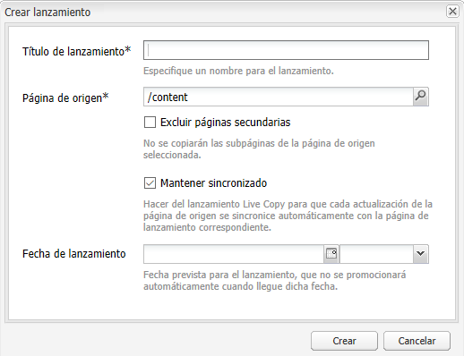
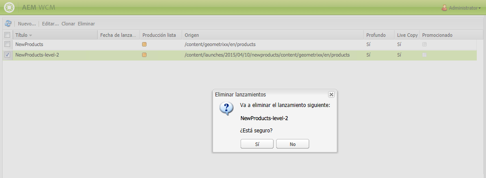

# Creación de lanzamientos{#creating-launches}

>[!CAUTION]
>
>AEM 6.4 ha llegado al final de la compatibilidad ampliada y esta documentación ya no se actualiza. Para obtener más información, consulte nuestra [períodos de asistencia técnica](https://helpx.adobe.com/es/support/programs/eol-matrix.html). Buscar las versiones compatibles [here](https://experienceleague.adobe.com/docs/).

Cree un lanzamiento para permitir la actualización de una nueva versión de páginas web existentes para su activación futura. Al crear un lanzamiento, especificará un título y la página de origen:

* El título aparece en la sección **Barra de tareas**, desde donde los autores pueden acceder para trabajar en ellos.
* Las páginas secundarias de la página de origen se incluyen en el lanzamiento de forma predeterminada. Si lo desea, puede usar solamente la página de origen.
* De forma predeterminada, [Live Copy](/help/sites-administering/msm.md) actualiza automáticamente las páginas de lanzamiento a medida que cambian las páginas de origen. Puede especificar que se cree una copia estática para evitar cambios automáticos.

De forma opcional, puede especificar la **fecha de lanzamiento** (y hora) para establecer cuándo se promocionarán y activarán las páginas. Sin embargo, la **fecha de lanzamiento** solo funciona en combinación con el indicador **Producción lista** (consulte [Edición de la configuración de un lanzamiento](/help/sites-classic-ui-authoring/classic-launches-editing.md#editing-a-launch-configuration)); para que las acciones se produzcan de forma automática, se deben configurar ambas.

## Creación de un lanzamiento {#creating-a-launch}

El siguiente procedimiento crea un lanzamiento.

1. Abra la página de administración del sitio web ([http://localhost:4502/siteadmin](http://localhost:4502/siteadmin)).
1. Haga clic en **Nuevo...** then **Nuevo lanzamiento...**.
1. En el **Crear Launch** , especifique valores para las siguientes propiedades:

   * **Título de lanzamiento**: Nombre del lanzamiento. El nombre debe tener sentido para los autores.
   * **Página de origen**: Ruta a la página para la que se crea el lanzamiento. De forma predeterminada, se incluyen todas las páginas secundarias.
   * **Excluir páginas secundarias**: Seleccione esta opción para crear el lanzamiento solo para la página de origen y no para las páginas secundarias. De forma predeterminada, esta opción no está seleccionada.
   * **Mantener sincronizado**: Seleccione esta opción para actualizar automáticamente el contenido de las páginas de lanzamiento cuando cambien las páginas de origen. Esto se logra convirtiendo el lanzamiento en un [live copy](/help/sites-administering/msm.md).
   * **Fecha del lanzamiento**: la fecha y hora en que la copia de lanzamiento se debe activar (depende del indicador **Producción lista**; consulte [Lanzamientos: orden de los eventos](/help/sites-authoring/launches.md#launches-the-order-of-events)).

   

1. Haga clic en **Crear**.

## Eliminación de un lanzamiento {#deleting-a-launch}

También puede eliminar un lanzamiento.

1. En el [inicia la consola](/help/sites-classic-ui-authoring/classic-launches.md), seleccione el lanzamiento requerido.
1. Haga clic en **Eliminar** - se requiere confirmación:

   

   >[!CAUTION]
   >
   >Al eliminar lanzamientos anidados, primero debe eliminar los niveles inferiores.
