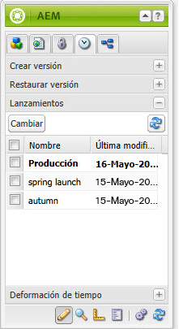
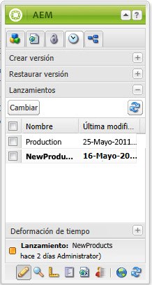

# Edición de lanzamientos{#editing-launches}

>[!CAUTION]
>
>AEM 6.4 ha llegado al final de la compatibilidad ampliada y esta documentación ya no se actualiza. Para obtener más información, consulte nuestra [períodos de asistencia técnica](https://helpx.adobe.com/es/support/programs/eol-matrix.html). Buscar las versiones compatibles [here](https://experienceleague.adobe.com/docs/).

## Edición de páginas de lanzamiento {#editing-launch-pages}

Cuando se ha creado un lanzamiento para una página (o conjunto de páginas), puede editar el contenido en la copia de lanzamiento de las páginas.

1. Abra la página para editarla.
1. En la barra de tareas, seleccione la opción **Versiones** y, a continuación, expanda la pestaña **Lanzamientos** grupo. El título del lanzamiento que se está editando utiliza una fuente en negrita.

   

1. Seleccione el lanzamiento en el que desea trabajar y haga clic en **Conmutador**.
1. Comience a editar.

   >[!NOTE]
   >
   >Puede usar la variable **Página** ficha de la barra de tareas para realizar acciones como **Crear página secundaria**, entre otros.

## Edición de una configuración de Launch {#editing-a-launch-configuration}

Después de crear un lanzamiento, puede cambiar el nombre y la fecha del lanzamiento. También puede especificar una imagen para asociarla con el lanzamiento.

1. Abra la página de administración de lanzamientos ([http://localhost:4502/libs/launches/content/admin.html](http://localhost:4502/libs/launches/content/admin.html)).

1. Seleccione el lanzamiento necesario y haga clic en **Editar** para abrir el cuadro de diálogo:

   * En el **General** , puede editar:

      * **Título**
      * **Fecha de lanzamiento**: equivale a la fecha de lanzamiento
      * **Producción lista**

      Consulte [Lanzamientos: el orden de los eventos](/help/sites-authoring/launches.md#launches-the-order-of-events) para obtener información sobre el propósito y la interacción de estos campos.

   * En el **Imagen** , puede cargar un archivo de imagen.

1. Haga clic en **Guardar**.

## Descubrimiento del estado de inicio de una página {#discovering-the-launch-status-of-a-page}

Cuando edita un lanzamiento de una página, la información sobre el lanzamiento aparece en la parte inferior del **Versiones** ficha de la barra de tareas:

* Nombre del lanzamiento.
* El tiempo desde el último cambio.
* El usuario que realizó el último cambio.
* El estado de la variable **Listo para la producción** indicador (naranja=no establecido; green=set).

