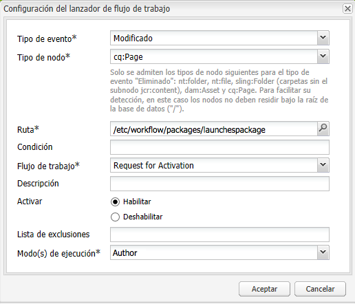

# Promoción de lanzamientos{#promoting-launches}

>[!CAUTION]
>
>AEM 6.4 ha llegado al final de la compatibilidad ampliada y esta documentación ya no se actualiza. Para obtener más información, consulte nuestra [períodos de asistencia técnica](https://helpx.adobe.com/es/support/programs/eol-matrix.html). Buscar las versiones compatibles [here](https://experienceleague.adobe.com/docs/).

Debe promocionar páginas de lanzamiento para volver a mover el contenido al origen (producción) antes de publicarlo. Cuando se promociona una página de lanzamiento, la página correspondiente de las páginas de origen se reemplaza con el contenido de la página promocionada. Las siguientes opciones están disponibles al promocionar una página de lanzamiento:

* Promocionar solo la página actual o todo el lanzamiento.
* Promocionar las páginas secundarias de la página actual.
* Promocionar el lanzamiento completo o solo las páginas que han cambiado.

## Promocionar páginas de lanzamiento {#promoting-launch-pages}

Para promocionar páginas, realice los pasos siguientes mientras edita la página de lanzamiento que desee promocionar:

1. En el **Página** en la barra de tareas, haga clic en **Promocionar lanzamiento**.
1. Especifique las páginas que desea promocionar:

   * (Predeterminado) Para promocionar solo la página actual, seleccione **Promocionar Cambios De Página A La Versión De Producción**.
   * Para promocionar también las páginas secundarias de la página actual, seleccione **Incluir páginas secundarias**.
   * Para promocionar todas las páginas del lanzamiento, seleccione **Promocionar lanzamiento completo a la versión de producción**.

1. Para añadir las páginas de producción a un paquete de flujo de trabajo, seleccione **Agregar Al Paquete De Flujo De Trabajo** y, a continuación, seleccione el paquete de flujo de trabajo.
1. Haga clic en **Promocionar**.

## Procesamiento de páginas promocionadas mediante el flujo de trabajo de AEM {#processing-promoted-pages-using-aem-workflow}

Utilice modelos de flujo de trabajo para realizar un procesamiento masivo de páginas de lanzamiento promocionadas:

1. Cree un paquete de flujo de trabajo.
1. Cuando los autores promocionan páginas de Launch, las almacenan en el paquete de flujo de trabajo.
1. Inicie un modelo de flujo de trabajo utilizando el paquete como carga útil.

Para iniciar un flujo de trabajo automáticamente cuando se promocionan páginas, [configuración de un lanzador de flujo de trabajo](/help/sites-administering/workflows-starting.md#workflows-launchers) para el nodo del paquete.

Por ejemplo, puede generar automáticamente solicitudes de activación de página cuando los autores promocionan páginas de lanzamiento. Configure un iniciador de flujo de trabajo para iniciar el flujo de trabajo de activación de solicitud cuando se modifique el nodo del paquete.

