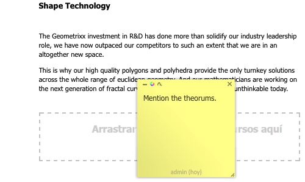

# Anotaciones al editar una página{#annotations-when-editing-a-page}

>[!CAUTION]
>
>AEM 6.4 ha llegado al final de la compatibilidad ampliada y esta documentación ya no se actualiza. Para obtener más información, consulte nuestra [períodos de asistencia técnica](https://helpx.adobe.com/es/support/programs/eol-matrix.html). Buscar las versiones compatibles [here](https://experienceleague.adobe.com/docs/).

La adición de contenido a las páginas de su sitio web suele someterse a análisis antes de publicarse. Para ayudarle, muchos componentes directamente relacionados con el contenido (en lugar de, por ejemplo, el diseño) permiten añadir una anotación.

Una anotación coloca un marcador o nota adhesiva de color en la página. La anotación le permite (a usted o a otros usuarios) dejar comentarios o preguntas para otros autores o revisores.

>[!NOTE]
>
>La definición de un tipo de componente individual determina si se puede añadir una anotación o no en instancias de dicho componente.

>[!NOTE]
>
>Las anotaciones creadas en la IU clásica también se mostrarán en la IU táctil. Sin embargo, los bocetos son específicos de la IU y solo se muestran en la IU en la que se crearon.

>[!CAUTION]
>
>Al eliminar un recurso (p. ej. un párrafo), se eliminan todas las anotaciones y bocetos relacionados con ese recurso; independientemente de su posición en la página en su conjunto.

>[!NOTE]
>
>Según sus necesidades, también puede desarrollar un flujo de trabajo para enviar notificaciones cuando estas se añadan, actualicen o eliminen.

## Anotaciones {#annotations}

En función del diseño del párrafo, la anotación está disponible como opción en el menú contextual (normalmente el botón derecho del ratón cuando se sitúa sobre el párrafo necesario) o como botón en la barra de edición de párrafos.

En cualquier caso, seleccione **Anotar**. Se aplicará al párrafo una anotación en forma de nota adhesiva de color; entrará inmediatamente en el modo de edición y podrá añadir texto directamente:

Puede mover la anotación a una nueva posición de la página. Haga clic en el área del borde superior y, a continuación, mantenga y arrastre simultáneamente la anotación a la nueva posición. Puede estar en cualquier lugar de la página, aunque suele ser significativo mantenerla conectada al párrafo de alguna manera.

Las anotaciones (incluidos los bocetos relacionados) también se incluyen en cualquier acción de copia, corte o eliminación que se realice en el párrafo al que estén relacionadas; para las acciones de copia o corte, la posición de la anotación (y los bocetos relacionados) mantiene su posición en relación con el párrafo original.

El tamaño de la anotación también se puede aumentar o reducir arrastrando la esquina inferior derecha.

Para realizar un seguimiento, el pie de página indicará el usuario que creó la anotación y la fecha. Los siguientes autores pueden editar la misma anotación (el pie de página se actualizará) o crear una nueva para el mismo párrafo.

La confirmación se solicitará cuando seleccione eliminar la anotación (al eliminar una anotación también se eliminan los bocetos relacionados con ella).

Los tres iconos de la parte superior izquierda permiten minimizar la anotación (junto con los bocetos relacionados), cambiar el color y añadir bocetos.

>[!NOTE]
>
>Las anotaciones solo están visibles en el modo de edición del entorno de creación.
>
>No están visibles en un entorno de publicación ni en los modos de diseño o previsualización disponibles en un entorno de creación.

>[!NOTE]
>
>Las anotaciones no se pueden agregar a una página que otro usuario haya bloqueado.

## Bocetos de anotación {#annotation-sketches}

>[!NOTE]
>
>Los bocetos no están disponibles en Internet Explorer, por lo que:
>
>* el icono no se mostrará.
>* los bocetos existentes, creados en otro navegador, no se mostrarán.
>

Los bocetos son una característica de las anotaciones que permiten crear sencillos gráficos de línea en cualquier parte de la ventana del explorador (parte visible):

* El cursor cambiará a una cruz cuando esté en modo de boceto. Puede dibujar varias líneas distintas.
* La línea del boceto refleja el color de la anotación y puede ser:

   * freehand

      el modo predeterminado; termine soltando el botón del ratón.

   * recto:

      mantener pulsado `ALT` y haga clic en los puntos de inicio y fin; termine con un doble clic.

* Después de haber salido del módulo de boceto, puede hacer clic en una línea de boceto para seleccionar ese boceto.
* Mueva un boceto seleccionándolo y arrastrándolo a la posición deseada.
* Un boceto superpone el contenido. Esto significa que en las 4 esquinas del boceto no se puede hacer clic en el párrafo subyacente; por ejemplo, si necesita editar o acceder a un vínculo. Si esto supone un problema (por ejemplo, un boceto cubre un área grande de la página), minimice la anotación correspondiente, ya que esto también minimizará todos los bocetos relacionados, lo que le proporcionará acceso al área subyacente.
* Para eliminar un boceto individual, seleccione el boceto necesario y, a continuación, presione la tecla **Eliminar** clave (**fn**-**retroceso** en un MAC).

* Si mueve o copia un párrafo, todas las anotaciones relacionadas y sus bocetos también se moverán o copiarán; su posición en relación con el párrafo seguirá siendo la misma.
* Si elimina una anotación, también se eliminarán todos los bocetos adjuntos a la anotación.
