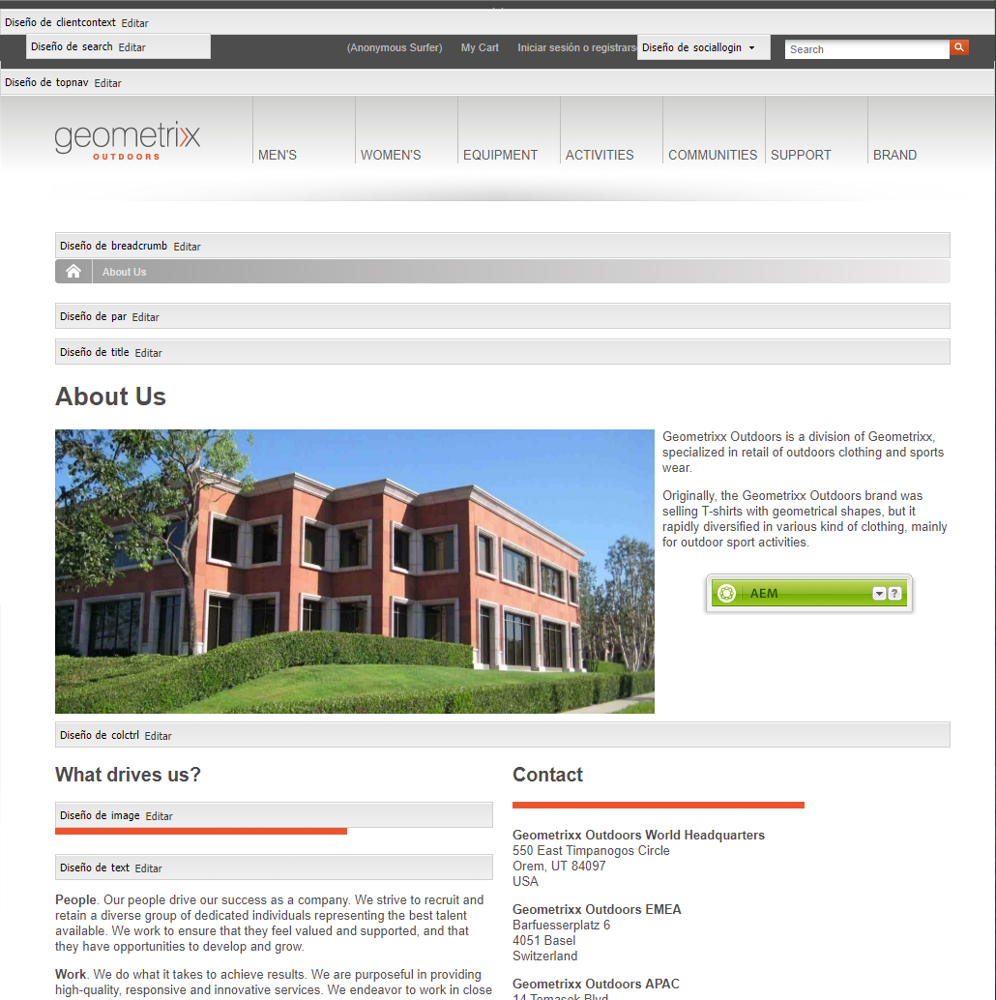
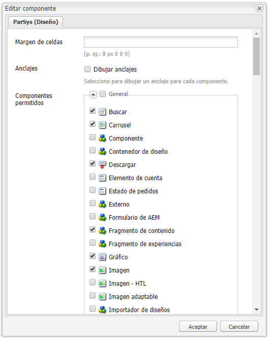
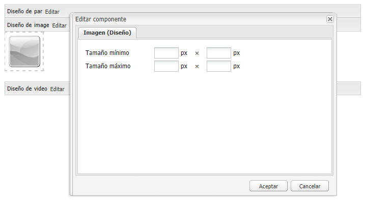

# Configuración de componentes en modo de diseño{#configuring-components-in-design-mode}

>[!CAUTION]
>
>AEM 6.4 ha llegado al final de la compatibilidad ampliada y esta documentación ya no se actualiza. Para obtener más información, consulte nuestra [períodos de asistencia técnica](https://helpx.adobe.com/es/support/programs/eol-matrix.html). Buscar las versiones compatibles [here](https://experienceleague.adobe.com/docs/).

Cuando AEM instancia está instalada de forma predeterminada, una selección de componentes está disponible inmediatamente en la barra de tareas.

Además de estos, también hay otros componentes disponibles. Puede utilizar el modo Diseño para [Habilitar o deshabilitar estos componentes](#enabledisablecomponentsusingdesignmode). Cuando esté habilitado y ubicado en su página, puede usar el modo Diseño para [configuración de aspectos del diseño de componentes](#configuringcomponentsusingdesignmode) editando los parámetros del atributo.

>[!NOTE]
>
>Se debe tener cuidado al editar estos componentes. La configuración de diseño suele formar parte integral del diseño de todo el sitio web, por lo que solo debe modificarla alguien con los privilegios (y la experiencia) adecuados, normalmente un administrador o desarrollador. Consulte [Desarrollo de componentes](/help/sites-developing/components.md) para obtener más información.

Esto implica añadir o eliminar los componentes permitidos en el sistema de párrafos de la página. El sistema de párrafos ( `parsys`) es un componente compuesto que contiene todos los demás componentes de párrafo. El sistema de párrafos permite a los autores añadir componentes de distintos tipos a una página, ya que contiene todos los demás componentes de párrafos. Cada tipo de párrafo se representa como un componente.

Por ejemplo, el contenido de una página de producto puede contener un sistema de párrafos que incluya lo siguiente:

* Una imagen del producto (en forma de imagen o párrafo de imagen de texto)
* La descripción del producto (como párrafo de texto)
* Una tabla con datos técnicos (como párrafo de tabla)
* Un formulario que rellenan los usuarios (como comienzo de formulario, elemento de formulario y párrafo final de formulario)

>[!NOTE]
>
>Consulte [Desarrollo de componentes](/help/sites-developing/components.md#paragraphsystem) y [Directrices para el uso de plantillas y componentes](/help/sites-developing/dev-guidelines-bestpractices.md#guidelines-for-using-templates-and-components) para obtener más información sobre `parsys`.

## Habilitar/deshabilitar componentes {#enable-disable-components}

En el modo Diseño, la barra de tareas se minimiza y es posible configurar los componentes accesibles para la creación:

1. Para entrar al modo Diseño, abra una página para editarla y utilice el icono de la barra de tareas:

   

1. Haga clic en **Editar** en el sistema de párrafos (**Diseño de par**).

   

1. Se abrirá un cuadro de diálogo en el que se enumerarán los grupos de componentes que se muestran en la barra de tareas junto con los componentes individuales que contienen.

   Seleccione los componentes que desee añadir o quitar de la barra de tareas.

   

1. La barra de tareas se minimiza en el modo Diseño. Al hacer clic en la flecha, puede maximizar la barra de tareas y volver al modo de edición:

   

## Configuración del diseño de un componente {#configuring-the-design-of-a-component}

En el modo Diseño, también se pueden configurar atributos para los componentes individuales. Cada componente tiene sus propios parámetros. El siguiente ejemplo muestra la variable **Imagen** componente:

1. Para entrar al modo Diseño, abra una página para editarla y utilice el icono de la barra de tareas:

   

1. Puede configurar el diseño de los componentes.

   Por ejemplo, si hace clic en **Editar** en el componente Imagen (**Diseño de la imagen**) puede configurar los parámetros específicos del componente:

   

1. Haga clic en **OK** para guardar los cambios.

1. La barra de tareas se minimiza en el modo Diseño. Al hacer clic en la flecha, puede maximizar la barra de tareas y volver al modo de edición:

   
