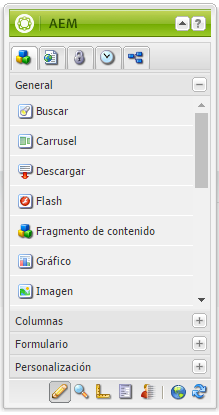
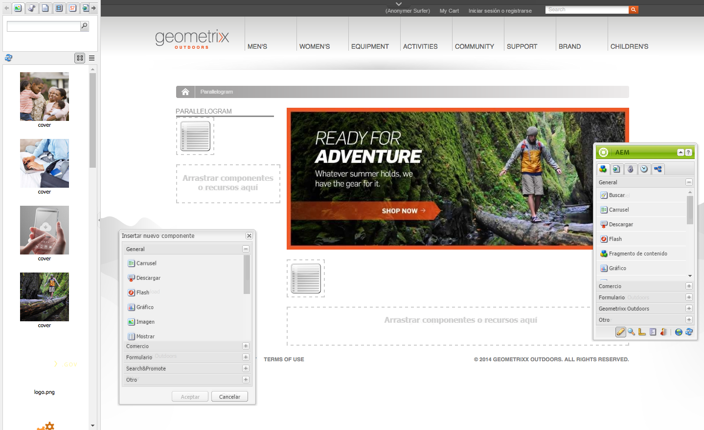
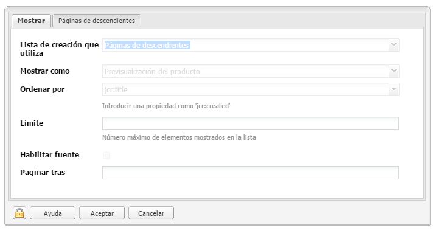
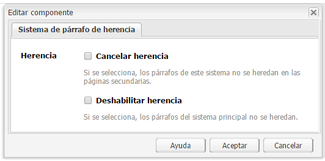

# Edición del contenido de una página{#editing-page-content}

>[!CAUTION]
>
>AEM 6.4 ha llegado al final de la compatibilidad ampliada y esta documentación ya no se actualiza. Para obtener más información, consulte nuestra [períodos de asistencia técnica](https://helpx.adobe.com/es/support/programs/eol-matrix.html). Buscar las versiones compatibles [here](https://experienceleague.adobe.com/docs/).

Después de crear una página (nueva o como parte de un lanzamiento o Live Copy), puede editar el contenido para realizar las actualizaciones que requiera.

El contenido se añade mediante componentes (adecuados para el tipo de contenido) que se pueden arrastrar a la página. Después estos se pueden editar local, mover o eliminar.

>[!NOTE]
>
>Su cuenta necesita el [derechos de acceso adecuados](/help/sites-administering/security.md) y [permissions](/help/sites-administering/security.md#permissions) para editar páginas; por ejemplo, añadir, editar o eliminar componentes, anotar, desbloquear.
>
>Si se producen problemas, le sugerimos que se ponga en contacto con el administrador del sistema.

## Barra de tareas {#sidekick}

La barra de tareas es una herramienta clave al crear páginas. Flota al crear una página, por lo que siempre está visible.

Hay disponibles varias pestañas e iconos, entre ellos:

* Componentes
* Página
* Información
* Versiones
* Flujo de trabajo
* Modos
* Andamiaje
* Client Context
* Sitios web

Ofrecen acceso a una amplia selección de funcionalidades; incluido:

* [selección de componentes](/help/sites-classic-ui-authoring/classic-page-author-env-tools.md#sidekick)
* [mostrar referencias](/help/sites-classic-ui-authoring/classic-page-author-env-tools.md#showing-references)
* [acceso al registro de auditoría](/help/sites-classic-ui-authoring/classic-page-author-env-tools.md#audit-log)
* [modos de conmutación](/help/sites-classic-ui-authoring/classic-page-author-env-tools.md#page-modes)
* [creación](/help/sites-classic-ui-authoring/classic-page-author-work-with-versions.md#creating-a-new-version), [restaurar](/help/sites-classic-ui-authoring/classic-page-author-work-with-versions.md#restoring-a-page-version-from-sidekick) y [comparar](/help/sites-classic-ui-authoring/classic-page-author-work-with-versions.md#comparing-with-a-previous-version) versiones

* [publicación](/help/sites-classic-ui-authoring/classic-page-author-publish-pages.md#publishing-a-page), [cancelar la publicación](/help/sites-classic-ui-authoring/classic-page-author-publish-pages.md#unpublishing-a-page) una página

* [edición de propiedades de página](/help/sites-classic-ui-authoring/classic-page-author-edit-page-properties.md)

* [andamiaje](/help/sites-authoring/scaffolding.md)

* [contexto de cliente](/help/sites-administering/client-context.md)

## Insertar un componente {#inserting-a-component}

### Insertar un componente {#inserting-a-component-1}

Después de abrir la página, puede empezar a agregar contenido. Para ello, agregue componentes (también llamados párrafos).

Para insertar un componente nuevo:

1. Existen varios métodos para seleccionar el tipo de párrafo que desea insertar:

   * Haga doble clic en el área etiquetada **Arrastrar componentes o recursos aquí...** - el **Insertar nuevo componente** se abre la barra de herramientas. Seleccione un componente y haga clic en **OK**.
   * Arrastre un componente desde la barra de herramientas flotante (denominada barra de tareas) para insertar un nuevo párrafo.
   * Haga clic con el botón derecho en un párrafo existente y seleccione **Nuevo...** - se abre la barra de herramientas Insertar nuevo componente . Seleccione un componente y haga clic en **OK**.

   

1. Tanto en la barra de tareas como en la **Insertar nuevo componente** para ver una lista de los componentes disponibles (tipos de párrafo). Pueden dividirse en varias secciones (por ejemplo, General, Columnas, etc.), que pueden expandirse según sea necesario.

   Estas opciones pueden variar según el entorno de producción. Para obtener información detallada sobre los componentes, consulte [Componentes predeterminados](/help/sites-classic-ui-authoring/classic-page-author-default-components.md).

1. Inserte el componente que desee en la página. A continuación, haga doble clic en el párrafo y se abrirá una ventana que le permitirá configurar el párrafo y añadir contenido.

### Inserción de un componente mediante el buscador de contenido {#inserting-a-component-using-the-content-finder}

También puede agregar un componente nuevo a la página arrastrando un recurso desde el [Buscador de contenido](/help/sites-classic-ui-authoring/classic-page-author-env-tools.md#the-content-finder). Esto creará automáticamente un componente nuevo del tipo correspondiente que contiene el recurso.

Esto es válido para los siguientes tipos de recursos (algunos dependerán del sistema de páginas o párrafos):

| Tipo de recurso | Tipo de componente resultante |
|---|---|
| Imagen | Imagen |
| Documento | Descargar |
| Producto | Producto |
| Vídeo | Flash |

>[!NOTE]
>
>Puede configurar este comportamiento en su instalación. Consulte [Configurar un sistema de párrafos para que al arrastrar un recurso se cree una instancia de componente](/help/sites-developing/developing-components.md#configuring-a-paragraph-system-so-that-dragging-an-asset-creates-a-component-instance) para obtener más información.

Para crear un componente arrastrando uno de los tipos de activo anteriores:

1. Asegúrese de que la página se encuentra en el modo de [**edición**.](/help/sites-classic-ui-authoring/classic-page-author-env-tools.md#page-modes)
1. Abra el [Buscador de contenido](/help/sites-classic-ui-authoring/classic-page-author-env-tools.md#the-content-finder).
1. Arrastre el recurso hasta la posición deseada. El [marcador de posición de componente](#componentplaceholder) le muestra dónde se colocará el componente.

   Se creará un componente, apropiado para el tipo de recurso, en la ubicación requerida; contendrá el recurso seleccionado.

1. [Editar](#editmovecopypastedelete) el componente si es necesario.

## Edición de un componente (contenido y propiedades) {#editing-a-component-content-and-properties}

Para editar un párrafo existente, realice una de las siguientes acciones:

* **Hacer doble clic** el párrafo para abrirlo. Verá la misma ventana que cuando creó el párrafo con el contenido existente. Realice los cambios y haga clic en **OK**.

* **Clic con el botón derecho** el párrafo y haga clic en **Editar**.

* **Haga clic en** dos veces en el párrafo (un doble clic lento) para entrar al modo de edición in situ. Podrá editar directamente el texto en la página, en lugar de en una ventana de diálogo. En este modo, se le proporcionará una barra de herramientas en la parte superior de la página. Simplemente realice los cambios y se guardarán automáticamente.

## Mover un componente {#moving-a-component}

Para mover un párrafo:

>[!NOTE]
>
>También puede utilizar [Cortar y pegar](#cut-copy-paste-a-component) para mover un componente.

1. Seleccione el párrafo que desee mover:

   

1. Arrastre el párrafo a la nueva ubicación (AEM indica a dónde se puede mover el párrafo con una marca de verificación verde). Colóquelo en la ubicación que desee.
1. Se mueve el párrafo:

   

## Eliminación de un componente {#deleting-a-component}

Para eliminar un párrafo:

1. Seleccione el párrafo y **clic con el botón derecho**:

   

1. Select **Eliminar** del menú . AEM WCM solicita confirmación de que desea eliminar el párrafo, ya que esta acción no se puede deshacer.
1. Haga clic en **Aceptar**.

>[!NOTE]
>
>Si ha configurado su [Propiedades del usuario para mostrar la barra de herramientas de edición global](/help/sites-classic-ui-authoring/author-env-user-props.md) también puede realizar ciertas acciones en los párrafos utilizando la variable **Copiar**, **Cortar**, **Pegar**, **Eliminar** botones disponibles.\
>Varios [combinaciones de teclas](/help/sites-classic-ui-authoring/classic-page-author-keyboard-shortcuts.md) también están disponibles.

## Cortar, copiar o pegar un componente {#cut-copy-paste-a-component}

Como cuando [Eliminación de un componente](#deleting-a-component) puede utilizar el menú contextual para copiar, cortar o pegar un componente

>[!NOTE]
>
>Si ha configurado su [Propiedades del usuario para mostrar la barra de herramientas de edición global](/help/sites-classic-ui-authoring/author-env-user-props.md) también puede realizar ciertas acciones en los párrafos utilizando la variable **Copiar**, **Cortar**, **Pegar**, **Eliminar** botones disponibles.
>
>Varios [combinaciones de teclas](/help/sites-classic-ui-authoring/classic-page-author-keyboard-shortcuts.md) también están disponibles.

>[!NOTE]
>
>Solo se puede cortar, copiar y pegar contenido en la misma página.

## Componentes heredados {#inherited-components}

Los componentes heredados pueden ser el producto de distintos escenarios, como por ejemplo:

* [Administración de varios sitios](/help/sites-administering/msm.md); también en combinación con [andamiaje](/help/sites-classic-ui-authoring/classic-feature-scaffolding.md#scaffolding-with-msm-inheritance).

* [Lanzamientos](/help/sites-classic-ui-authoring/classic-launches.md) (cuando se basa en Live Copy).
* Componentes específicos; por ejemplo, el sistema de párrafos heredado dentro de Geometrixx.

Puede cancelar (y volver a habilitar) la herencia. Según el componente, esto puede estar disponible en:

1. **Live Copy**

   Si un componente forma parte de una Live Copy o un lanzamiento, se indica mediante un icono de cerrojo. Puede hacer clic en el cerrojo para cancelar la herencia.

   * El icono de cerrojo se muestra cuando se selecciona el componente; por ejemplo:

   

   * El cerrojo también se muestra en el cuadro de diálogo de los componentes; por ejemplo:

   

1. **Un sistema de párrafos heredado**

   El cuadro de diálogo de configuración. Por ejemplo, como con el sistema de párrafos heredado dentro de la Geometrixx:

   

## Agregar anotaciones {#adding-annotations}

[Anotaciones](/help/sites-classic-ui-authoring/classic-page-author-annotations.md) permita que otros autores hagan comentarios sobre su contenido. Esto suele utilizarse con fines de revisión y validación.

## Previsualizar páginas   {#previewing-pages}

Hay dos iconos en el borde inferior de la barra de tareas que son importantes para obtener una vista previa de las páginas:

* El icono de lápiz le muestra que se encuentra en el modo de edición, donde puede añadir, modificar, mover o eliminar contenido.

   

* El icono de lupa le permite seleccionar el modo de vista previa en el que la página se muestra tal como se verá en el entorno de publicación (a veces también es necesario actualizar la página):

   

   En el modo de vista previa, la barra de tareas se reducirá; haga clic en el icono de flecha hacia abajo para volver al modo de edición:

   

## Buscar y reemplazar {#find-replace}

Para ediciones de mayor escala de la misma frase, se recomienda **[Buscar y reemplazar](/help/sites-classic-ui-authoring/author-env-search.md#find-and-replace)** permite buscar y reemplazar varias instancias de una cadena en una sección del sitio web.

## Bloquear una página   {#locking-a-page}

AEM permite bloquear páginas para que nadie más pueda modificar su contenido. Esta función es útil cuando realice muchas ediciones en una página concreta o cuando tenga que congelar una página durante un rato.

>[!CAUTION]
>
>El bloqueo de páginas debe usarse con cuidado, ya que la única persona que puede desbloquear una página es la que la ha bloqueado (o una cuenta con privilegios de administrador).

Para bloquear una página:

1. En el **Sitios web** , seleccione la página que desee bloquear.
1. Haga doble clic en la página para abrirla y editarla.
1. En el **Página** ficha de la barra de tareas, seleccione **Bloquear página**:

   

   Un mensaje muestra que su página está bloqueada para otros usuarios. Además, en el panel derecho del **Sitios web** , AEM WCM muestra la página como bloqueada e indica qué usuario la bloqueó.

   

## Desbloquear una página {#unlocking-a-page}

Para desbloquear una página:

1. En el **Sitios web** , seleccione la página que desee desbloquear.
1. Haga doble clic en la página para abrirla.
1. En el **Página** ficha de la barra de tareas, seleccione **Desbloquear página**.

## Deshacer y rehacer modificaciones de páginas {#undoing-and-redoing-page-edits}

Utilice los siguientes métodos abreviados del teclado mientras el marco de contenido de la página está seleccionado:

* Deshacer: Ctrl + Z (Windows) o Cmd + Z (Mac)
* Rehacer: Ctrl + Y (Windows) o Cmd + Y (Mac)

Cuando deshace o rehace la eliminación, adición o reubicación de uno o más párrafos, los elementos que parpadean (comportamiento predeterminado) resaltan los párrafos afectados.

>[!NOTE]
>
>Consulte [Deshacer y rehacer ediciones de página: la teoría](#undoing-and-redoing-page-edits-the-theory) para ver toda la información sobre las posibilidades de deshacer y rehacer ediciones de página.

## Deshacer y rehacer ediciones de página: la teoría {#undoing-and-redoing-page-edits-the-theory}

>[!NOTE]
>
>El administrador del sistema puede [configurar varios aspectos de las funciones de Deshacer/Rehacer](/help/sites-administering/config-undo.md) según los requisitos de su instancia.

AEM almacena un historial de las acciones que realiza y la secuencia en que las realizó. Por lo tanto, se deshacen varias acciones en el orden en que se realizaron. A continuación, puede usar el comando Rehacer para aplicar nuevamente una o más de las acciones realizadas.

Si se selecciona un elemento en la página de contenido, el comando para deshacer y rehacer se aplica al elemento seleccionado, como un componente de texto.

El comportamiento de los comandos deshacer y rehacer es similar al de otros programas de software. Utilice los comandos para restaurar el estado reciente de la página web a medida que toma decisiones sobre el contenido. Por ejemplo, si mueve un párrafo de texto a una ubicación diferente en la página, puede usar el comando Deshacer para mover el párrafo a la posición original. Si luego decide nuevamente mover el párrafo, utilice el comando Rehacer.

>[!NOTE]
>
>Puede hacer lo siguiente:
>
>* rehacer acciones siempre y cuando no haya realizado ninguna edición en la página desde que usó el comando Deshacer.
>* deshacer un máximo de 20 acciones de edición (configuración predeterminada).
>* también use [Métodos abreviados del teclado](/help/sites-classic-ui-authoring/classic-page-author-keyboard-shortcuts.md) para deshacer y rehacer.
>

Puede utilizar Deshacer y Rehacer para los siguientes tipos de cambios de página:

* Adición, edición, eliminación y desplazamiento de párrafos
* Edición in situ del contenido de párrafos
* Copiar, cortar y pegar elementos dentro de una página
* Copiar, cortar y pegar elementos entre páginas
* Adición, eliminación y cambio de archivos e imágenes
* Agregar, quitar y cambiar anotaciones y bocetos
* Cambios en Scaffold
* Adición y eliminación de referencias
* Cambio de los valores de propiedad en los cuadros de diálogo de componentes.

Los campos de formulario procesados por los componentes de formulario no tienen ningún valor especificado durante la creación de páginas. Por lo tanto, los comandos deshacer y rehacer no afectan a los cambios que realice en los valores de estos tipos de componentes. Por ejemplo, no se puede deshacer la selección de un valor en una lista desplegable.

>[!NOTE]
>
>Se necesitan permisos especiales para deshacer y rehacer cambios en archivos e imágenes. Además, el historial de deshacer cambios en archivos e imágenes dura un mínimo de horas. Sin embargo, más allá de este tiempo, no se garantiza que se puedan deshacer los cambios. El administrador puede proporcionar permisos y cambiar el tiempo predeterminado de diez horas.
