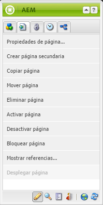

# Creación: entorno y herramientas{#authoring-the-environment-and-tools}

>[!CAUTION]
>
>AEM 6.4 ha llegado al final de la compatibilidad ampliada y esta documentación ya no se actualiza. Para obtener más información, consulte nuestra [períodos de asistencia técnica](https://helpx.adobe.com/es/support/programs/eol-matrix.html). Buscar las versiones compatibles [here](https://experienceleague.adobe.com/docs/).

El entorno de creación AEM ofrece varios mecanismos para organizar y editar el contenido. Se puede acceder a las herramientas desde varios editores de páginas y consolas.

## Administración del sitio {#site-administration}

La variable **Sitios web** permite administrar y desplazarse por el sitio web. Con los dos paneles, la estructura del sitio web se puede ampliar y se pueden realizar acciones en el elemento requerido:

## Edición del contenido de la página {#editing-your-page-content}

Hay un editor de páginas independiente con la IU clásica, que utiliza el buscador de contenido y la barra de tareas:

`http://localhost:4502/cf#/content/geometrixx/en/products/triangle.html`

## Acceso a la Ayuda   {#accessing-help}

Varios **Ayuda** se puede acceder directamente a los recursos desde AEM:

Además de acceder a [ayuda desde las barras de herramientas de la consola](/help/sites-classic-ui-authoring/author-env-basic-handling.md#accessing-help), también puede acceder a la ayuda desde la barra de tareas (mediante el icono ? ) al editar una página:

O utilizando la variable **Ayuda** en el cuadro de diálogo de edición de componentes específicos; esto mostrará ayuda contextual.

## Barra de tareas {#sidekick}

La variable **Componentes** de la barra de tareas le permite examinar los componentes que se pueden añadir a la página actual. El grupo requerido puede expandirse y luego un componente arrastrado a la ubicación requerida en la página.

## Buscador de contenido {#the-content-finder}

El buscador de contenido es una forma rápida y sencilla de encontrar recursos o contenido dentro del repositorio al editar una página.

Puede utilizar el buscador de contenido para localizar una serie de recursos. Cuando proceda, puede arrastrar un elemento y colocarlo en un párrafo de la página:

* [Imágenes](#finding-images)
* [Documentos](#finding-documents)
* [Películas](#finding-movies)
* [Explorador Dynamic Media](/help/sites-administering/scene7.md#scene7contentbrowser)
* [Páginas](/help/sites-classic-ui-authoring/classic-page-author-env-tools.md#finding-pages)
* [Párrafos](#referencing-paragraphs-from-other-pages)
* [Productos](/help/sites-classic-ui-authoring/classic-page-author-env-tools.md#products)
* O bien [examinar el sitio web según la estructura del repositorio](#the-content-finder)

Con todas las opciones, puede [buscar elementos específicos](#the-content-finder).

### Búsqueda de imágenes {#finding-images}

Esta ficha enumera las imágenes del repositorio.

Después de crear un párrafo de imagen en la página, puede arrastrar un elemento y colocarlo dentro del párrafo.

### Búsqueda de documentos {#finding-documents}

Esta ficha enumera los documentos del repositorio.

Después de crear un párrafo de descarga en la página, puede arrastrar un elemento y colocarlo dentro del párrafo.

### Búsqueda de películas {#finding-movies}

Esta ficha enumera cualquier película (por ejemplo, elementos de Flash) en el repositorio.

Después de crear un párrafo apropiado (por ejemplo, un Flash) en la página, puede arrastrar un elemento y colocarlo dentro del párrafo.

### Productos {#products}

Esta ficha enumera los productos. Después de crear un párrafo apropiado (por ejemplo, Producto) en la página, puede arrastrar un elemento y colocarlo dentro del párrafo.

### Búsqueda de páginas {#finding-pages}

Esta ficha muestra todas las páginas. Haga doble clic en cualquier página para abrirla y editarla.

### Referencia a párrafos de otras páginas {#referencing-paragraphs-from-other-pages}

Esta pestaña le permite buscar otra página. Se enumerarán todos los párrafos de esa página. A continuación, puede arrastrar un párrafo a su página actual para crear una referencia al párrafo original.

### Uso de la vista de repositorio completo {#using-the-full-repository-view}

Esta ficha muestra todos los recursos del repositorio.

### Uso de la búsqueda con el navegador de contenido {#using-search-with-the-content-browser}

En todas las opciones puede buscar elementos específicos. Cualquier etiqueta y recurso que coincida con el patrón de búsqueda aparece en la lista:

También puede utilizar caracteres comodín para la búsqueda. Los caracteres comodín admitidos son:

* `*` - Hace coincidir una secuencia de cero o más caracteres.

* `?` - Hace coincidir un solo carácter.

>[!NOTE]
>
>Hay una pseudo propiedad &quot;name&quot; que debe utilizarse para realizar una búsqueda comodín.

Por ejemplo, si hay una imagen disponible con el nombre:

`ad-nmvtis.jpg`

los siguientes patrones de búsqueda la encontrarán (y cualquier otra imagen que coincida con el patrón):

* `name:*nmv*`
* `name:AD*` - la coincidencia de caracteres es *not* distingue entre mayúsculas y minúsculas.
* `name:ad?nm??is.*` - puede utilizar cualquier número de caracteres comodín en una consulta.

>[!NOTE]
>
>También puede utilizar [SQL2](https://helpx.adobe.com/experience-manager/6-4/sites/developing/using/reference-materials/javadoc/org/apache/jackrabbit/commons/query/sql2/package-summary.html) buscar.

## Mostrar referencias {#showing-references}

AEM permite ver qué páginas están vinculadas a la página en la que está trabajando.

Para mostrar referencias de página directas:

1. En la barra de tareas, seleccione la **Página** icono de ficha.

   

1. Select **Mostrar referencias...** AEM abre la ventana Referencias y muestra qué páginas hacen referencia a la página seleccionada, incluidas sus rutas de acceso.

   

En determinadas situaciones, hay disponibles acciones adicionales en la barra de tareas, como:

* [Lanzamientos](/help/sites-classic-ui-authoring/classic-launches.md)
* [Live Copies](/help/sites-administering/msm.md)

* [Modelo](/help/sites-administering/msm-best-practices.md)

Otro [las relaciones entre páginas se pueden ver en la consola Sitios web](/help/sites-classic-ui-authoring/author-env-basic-handling.md#page-information-on-the-websites-console).

## Registro de auditorías {#audit-log}

La variable **Registro de auditoría** se puede acceder desde el **Información** de la barra de tareas. Enumera las acciones recientes realizadas en la página actual; por ejemplo:

## Información de la página {#page-information}

La consola Sitios web también [proporciona información sobre el estado actual de la página](/help/sites-classic-ui-authoring/author-env-basic-handling.md#page-information-on-the-websites-console) como publicación, modificación, bloqueo, Live Copy, etc.

## Modos de página   {#page-modes}

Al editar una página con la IU clásica hay varios modos a los que se puede acceder mediante los iconos en la parte inferior de la barra de tareas:

La fila de iconos situada en la parte inferior de la barra de tareas se utiliza para cambiar los modos de trabajo de las páginas:

* [Editar](/help/sites-classic-ui-authoring/classic-page-author-edit-mode.md)

   Este es el modo predeterminado y le permite editar la página, agregar o eliminar componentes y realizar otros cambios.

* [Vista previa](/help/sites-classic-ui-authoring/classic-page-author-edit-content.md#previewing-pages)

   Este modo permite obtener una vista previa de la página como si apareciera en el sitio web con formato final.

* [Design](/help/sites-classic-ui-authoring/classic-page-author-design-mode.md#main-pars-procedure-0)

   En este modo, puede editar el diseño de la página configurando los componentes accesibles.

>[!NOTE]
>
>También hay otras opciones disponibles:
>
>* [Andamiaje](/help/sites-classic-ui-authoring/classic-feature-scaffolding.md)
>* [Client Context](/help/sites-administering/client-context.md)
>* Sitios web: abrirá la consola Sitios web .
>* Volver a cargar: actualizará la página.

## Métodos abreviados de teclado {#keyboard-shortcuts}

Hay varios [métodos abreviados del teclado](/help/sites-classic-ui-authoring/classic-page-author-keyboard-shortcuts.md) disponibles.
