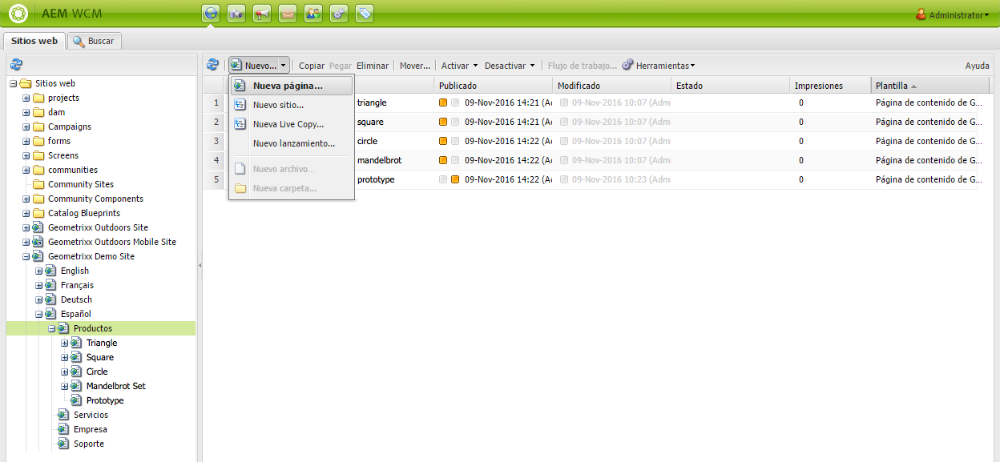
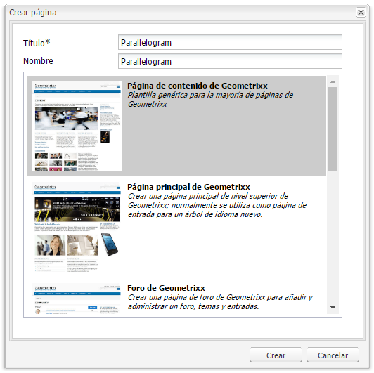
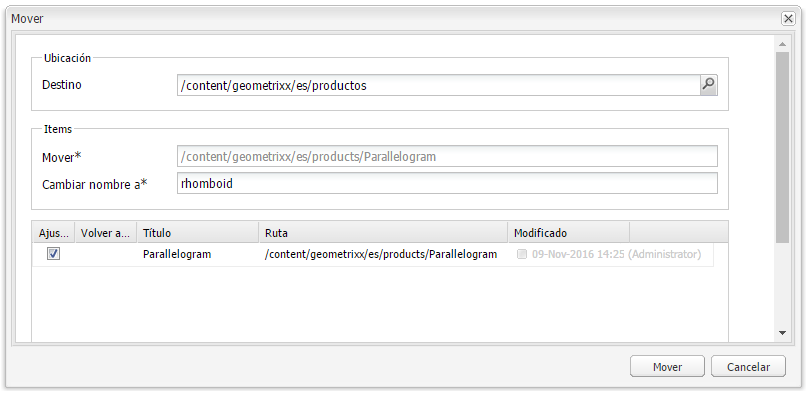

# Crear y organizar páginas{#creating-and-organizing-pages}

En esta sección se describe cómo crear y administrar páginas con Adobe Experience Manager (AEM) para luego poder [crear contenido](/help/sites-classic-ui-authoring/classic-page-author-edit-content.md) en esas páginas.

>[!NOTE]
>
>Su cuenta necesita los [derechos de acceso](/help/sites-administering/security.md) y [permisos](/help/sites-administering/security.md#permissions) adecuados para realizar acciones en las páginas, como crear, copiar, mover, eliminar o editar.
>
>Si se producen problemas, le sugerimos que se ponga en contacto con el administrador del sistema.

## Organizar el sitio web {#organizing-your-website}

Como creador, deberá organizar el sitio web dentro de AEM. Esto implica crear y dar nombre a las páginas de contenido para que:

* pueda encontrarlas con facilidad en el entorno de creación
* los usuarios que visiten el sitio web puedan explorarlas fácilmente en el entorno de publicación

También puede usar [carpetas](#creating-a-new-folder) para organizar el contenido.

La estructura de un sitio web se puede considerar como una *estructura de árbol* que alberga las páginas de contenido. Los nombres de estas páginas de contenido se usan para formar las URL, y el título se muestra cuando se visualiza el contenido de la página.

A continuación encontrará un fragmento del sitio Geometrixx, desde el que se accederá, por ejemplo, a la página `Triangle`:

* entorno de autor

   `http://localhost:4502/cf#/content/geometrixx/en/products/triangle.html`

* Entorno de publicación

   `http://localhost:4503/content/geometrixx/en/products/triangle.html`

   Depending on the configuration of your instance, use of `/content` might be optional on the publish environment.

```xml
  /content
    /geometrixx
      /en
        /toolbar...
        /products
          /triangle
            /overview 
            /features
          /square...
          /circle...
          /...
        /...
      /fr...
      /de...
      /es...
      /...
    /...
```

This structure can be viewed from the Websites console, which you can use to [navigate through the tree structure](/help/sites-classic-ui-authoring/author-env-basic-handling.md#main-pars-text-15).


### Convenciones de nomenclatura de páginas {#page-naming-conventions}

Cuando se crea una nueva página aparecen dos campos clave:

* **[Título](#title)**:

   * Se muestra al usuario en la consola, en la parte superior del contenido de la página al editar. 
   * Este campo es obligatorio.

* **[Nombre](#name)**:

   * Se usa para generar la URI.
   * Es opcional que el usuario especifique algo en este campo. Si no se especifica, el nombre se deriva del título.

When creating a new page, AEM will [validate the page name according to the conventions](/help/sites-developing/naming-conventions.md) imposed by AEM and JCR.

La implementación y la lista de caracteres permitidos difieren ligeramente según la IU (es más extensa para la IU táctil), pero el mínimo permitido es:

* De la &quot;a&quot; a la &quot;z&quot;
* De la &quot;A&quot; a la &quot;Z&quot;
* De &quot;0&quot; a &quot;9&quot;
* _ (guion bajo)
* `-` (guion/signo menos)

Utilice solo estos caracteres si quiere estar seguro de que serán aceptados/utilizados (si necesita información detallada de todos los caracteres permitidos, consulte [las convenciones de nomenclatura de archivos](/help/sites-developing/naming-conventions.md)).

#### Título {#title}

Si proporciona solo un **título** de página al crear una nueva página, AEM derivará el **nombre**[ de página de esta cadena y lo validará según las convenciones impuestas por AEM y JCR. ](/help/sites-developing/naming-conventions.md) Si bien en ambas IU se aceptará un campo **Título** con caracteres no válidos, los caracteres no válidos se sustituirán en el nombre derivado. Por ejemplo:

| Título | Nombre derivado |
|---|---|
| Schön | schoen.html |
| SC%&amp;&amp;ast;ç+ | sc---c-.html |

#### Nombre {#name}

Al indicar un valor **Nombre**[ cuando se cree una página, AEM validará el nombre según las convenciones impuestas por AEM y JCR.](/help/sites-developing/naming-conventions.md)

In the Classic UI you **cannot enter invalid characters** in the **Name** field.

>[!NOTE]
>In the touch-enabled UI you **cannot submit invalid characters** in the **Name** field. Cuando AEM detecte caracteres no válidos, el campo se resaltará y aparecerá un mensaje explicativo para indicar qué caracteres se deben eliminar o reemplazar.

>[!NOTE]
>
>Debe evitar usar un código de dos letras, tal como se indica en ISO-639-1, a menos que sea una raíz de idioma.
>
>Consulte [Preparación de contenido para su traducción](/help/sites-administering/tc-prep.md) para obtener más información.

### Plantillas {#templates}

En AEM, una plantilla especifica un tipo de página especializado. Todas las páginas nuevas se basarán en una plantilla.

La plantilla define la estructura de una página (se incluyen una imagen en miniatura y otras propiedades). Por ejemplo, puede tener plantillas diferentes para páginas de producto, mapas del sitio e información de contacto. Las plantillas están compuestas de [componentes](#components).

AEM incluye varias plantillas listas para usar. Las plantillas que se presentarán dependerán del sitio web individual y la información que debe suministrarse (al crear la nueva página web) dependerá de la IU que se utilice. Los campos principales son:

* **Título** El título se muestra en la página web resultante.

* **Nombre** Se utiliza al dar nombre a la página.

* **Plantilla** Una lista de plantillas disponibles para usar durante la generación de la nueva página.

### Componentes {#components}

Componentes son los elementos ofrecidos por AEM para que pueda añadir tipos de contenido específicos. AEM incorpora una serie de componentes integrados que proporcionan amplias funcionalidades, como por ejemplo:

* Texto
* Imagen
* Presentación de diapositivas
* Vídeo
* Muchas más

Once you have created and opened a page you can [add content using the components](/help/sites-classic-ui-authoring/classic-page-author-edit-content.md#insertinganewparagraph), available from the [sidekick](/help/sites-classic-ui-authoring/classic-page-author-env-tools.md#sidekick).

## Administrar páginas {#managing-pages}

### Creación de una nueva página {#creating-a-new-page}

A menos que alguien haya creado todas las páginas con antelación, antes de poder empezar a crear contenido, debe crear una página:

1. Desde la consola **Sitios web**, seleccione el nivel en el que desee creación de una nueva página.

   En el siguiente ejemplo, está creando una página dentro del nivel **Productos**, que se muestra en el panel izquierdo; en el panel derecho se muestran las páginas que ya existen en el nivel debajo de **Productos**.

   

1. En el menú **Nuevo...** (haga clic en la flecha junto a **Nuevo...**), seleccione **Nueva página…**. Se abre la ventana **Crear página**.

   Hacer clic en **Nuevo...** también equivale a un método abreviado para la opción **Nueva página...**.

1. El cuadro de diálogo **Crear página** permite:

   * Proporcionar un **Título**; se muestra para el usuario.
   * Proporcionar un **Nombre**; se usa para generar el URI. Si no se especifica, el nombre se derivará del título.

      * Si se proporciona un valor **Nombre** al crear una página, AEM [validará el nombre según las convenciones](/help/sites-developing/naming-conventions.md) impuestas por AEM y JCR.
      * En la IU clásica **no se pueden introducir caracteres no válidos** en el campo **Nombre**.
   * Haga clic en la plantilla que desee usar para crear la nueva página.

      La plantilla se usa como base para la nueva página; por ejemplo, para determinar el diseño básico de una página de contenido.
   >[!NOTE]
   >
   >Consulte las [convenciones de nomenclatura de páginas](#page-naming-conventions).

   La información mínima necesaria para crear una página nueva es el valor **Título** y la plantilla necesaria.

   

   >[!NOTE]
   >
   >Si desea utilizar caracteres Unicode en las URL, configure la propiedad Alias (`sling:alias`) ([propiedades de página](/help/sites-classic-ui-authoring/classic-page-author-edit-page-properties.md)).

1. Haga clic en **Crear** para crear la página. Regresa a la consola **Sitios web**, donde puede ver una entrada para la nueva página.

   La consola proporciona información sobre la página (por ejemplo, cuándo se editó por última vez y quién lo hizo) que se actualiza según sea necesario.

   >[!NOTE]
   >
   >También puede crear una página mientras edita una página existente. Using **Create Child Page **from the **Page** tab of the sidekick, will create a new page directly under the page being edited.

### Abrir una página para su edición {#opening-a-page-for-editing}

Puede abrir la página que desee [editar](/help/sites-classic-ui-authoring/classic-page-author-edit-content.md#editing-a-component-content-and-properties) mediante varios métodos:

* Desde la consola **Sitios web** puede **hacer doble clic** en la entrada de la página para abrirla y editarla.

* Desde la consola **Sitios web**, puede **hacer clic con el botón derecho** (menú contextual) en el elemento de página y luego seleccionar **Abrir** del menú.

* Una vez que haya abierto una página, puede desplazarse a otras páginas dentro del sitio (para editarlas) si hace clic en hipervínculos.

### Copiar y pegar una página    {#copying-and-pasting-a-page}

Al copiar, puede copiar cualquiera de estas opciones:

* una sola página
* una página junto con todas las subpáginas

1. Desde la consola **Sitios web**, seleccione la página que desee copiar.

   >[!NOTE]
   >
   >En esta etapa, es irrelevante si desea copiar una sola página o las páginas secundarias.

1. Haga clic en **Copiar**.

1. Navegue a la nueva ubicación y haga clic en:

   * **Pegar**: para pegar la página junto con todas las subpáginas
   * **Mayús + Pegar**: para pegar la página seleccionada únicamente

   Las páginas se pegan en la nueva ubicación.

   >[!NOTE]
   >
   >El nombre de página podría ajustarse automáticamente si una página existente ya tiene el mismo nombre.

   >[!NOTE]
   >
   >También puede utilizar **Copiar página** desde la ficha **Página** de la barra de tareas. Se abrirá un cuadro de diálogo en el que puede especificar el destino, etc.

### Mover una página o cambiarle el nombre {#moving-or-renaming-page}

>[!NOTE]
>
>A la hora de especificar un nombre nuevo, las opciones para cambiar el nombre de una página también están sujetas a las [convenciones de nomenclatura de páginas](#page-naming-conventions).

El procedimiento para mover o cambiar el nombre de una página es el mismo. Con la misma acción puede:

* mover una página a una nueva ubicación
* cambiar de nombre una página en la misma ubicación
* mover una página a una nueva ubicación y cambiar su nombre a la vez

AEM le ofrece la funcionalidad de actualizar vínculos internos a la página que está moviendo o cuyo nombre está cambiando. Esto puede hacerse página por página para proporcionar flexibilidad completa.

Para mover o cambiar el nombre de una página:

1. Hay varios métodos para propiciar un movimiento:

   * Desde la consola **Sitios web**, haga clic para seleccionar la página y, a continuación, seleccione **Mover...**.
   * Desde la consola **Sitios web** también puede seleccionar el elemento de página, **hacer clic con el botón derecho** y seleccionar **Mover...**
   * Al editar una página, puede seleccionar **Mover página** desde la ficha **Página** de la barra de tareas.

1. Se abre la ventana **Mover**, donde puede especificar una nueva ubicación, un nuevo nombre para la página, o ambos.

   

   En la página también se muestra una lista con toda página que haga referencia a la página que se está moviendo. De acuerdo con el estado de la página de referencia, es posible que pueda ajustar esos vínculos en las páginas o volver a publicarlas.

1. Complete los siguientes campos, según corresponda:

   * **Destino**

      Use el mapa del sitio (disponible mediante el selector desplegable) para seleccionar la ubicación a la que debería moverse la página.

      Si solo está cambiando el nombre de la página, ignore este campo.

   * **Mover**

      Especifique la página que se moverá (esto generalmente se completa de forma predeterminada, según cómo y dónde inició la acción de mover).

   * **Cambiar nombre a**

      La etiqueta de la página actual se muestra de forma predeterminada. Especifique la nueva etiqueta de página, si es necesario.

   * **Ajustar**

      Actualice los vínculos en la página mostrada que apuntan a la página que se movió: por ejemplo, si la página A tiene vínculos a la página B, AEM ajusta los vínculos en la página A en caso de que mueva la página B.

      Con esto se puede seleccionar o anular la selección de cada página de referencia individual.

   * **Volver a publicar**

      Vuelva a publicar la página de referencia; nuevamente esto puede seleccionarse para cada página individual.
   >[!NOTE]
   >
   >Si la página ya se ha activado, al moverse se desactiva automáticamente. De forma predeterminada, se reactiva cuando se termina de mover, pero esto se puede cambiar desactivando el campo **Volver a publicar** de la página en la ventana **Mover.**

1. Haga clic en **Mover**. Se le solicitará que confirme la acción. Haga clic en **Aceptar** para confirmar.

   >[!NOTE]
   >
   >No se actualizará el título de la página.

### Eliminar una página {#deleting-a-page}

1. Puede eliminar una página desde varias ubicaciones:

   * Dentro de la consola **Sitios web**, haga clic para seleccionar la página, luego haga clic con el botón derecho y seleccione **Eliminar** del menú resultante.
   * Dentro de la consola **Sitios web**, haga clic para seleccionar la página y luego seleccione **Eliminar** de la barra de herramientas resultante.
   * En la barra de tareas, utilice la ficha **Página** para seleccionar **Eliminar página** (se elimina la página que está abierta).

1. Una vez que haya seleccionado para eliminar una página, debe confirmar la solicitud, ya que la acción no se puede deshacer.

   >[!NOTE]
   >
   >Después de eliminarla, si la página se publicó, puede restaurar la última versión (o una versión específica), pero esto puede no tener exactamente el mismo contenido que la última versión si se hicieron más modificaciones. Consulte [Cómo restaurar páginas](/help/sites-classic-ui-authoring/classic-page-author-work-with-versions.md#restoringpages) para obtener más información detallada.

>[!NOTE]
>
>Si una página ya está activada, se desactiva automáticamente antes de eliminarse.

### Bloquear una página {#locking-a-page}

Puede [bloquear o desbloquear una página](/help/sites-classic-ui-authoring/classic-page-author-edit-content.md#locking-a-page) desde una consola o bien editando una página en concreto. En ambas ubicaciones también se mostrará información sobre si una página está bloqueada o no.

### Crear una nueva carpeta {#creating-a-new-folder}

>[!NOTE]
>
>A la hora de especificar un nombre nuevo, las opciones para cambiar el nombre de las carpetas están también sujetas a las [convenciones de nomenclatura de páginas](#page-naming-conventions).

1. Abra la consola **Sitios web** y vaya hasta la ubicación deseada.
1. In the **New...** menu (click the arrow next to **New...**), select **New Folder...**.
1. Se abrirá el cuadro de diálogo **Crear carpeta**. Aquí puede indicar el **Nombre** y el **Título**:

   

1. Seleccione **Crear** para crear la carpeta.

