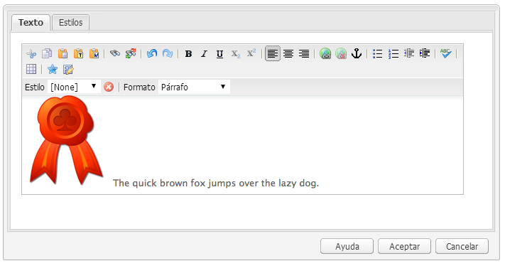

# Editor de texto enriquecido{#rich-text-editor}

>[!CAUTION]
>
>AEM 6.4 ha llegado al final de la compatibilidad ampliada y esta documentación ya no se actualiza. Para obtener más información, consulte nuestra [períodos de asistencia técnica](https://helpx.adobe.com/es/support/programs/eol-matrix.html). Buscar las versiones compatibles [here](https://experienceleague.adobe.com/docs/).

El Editor de texto enriquecido es un bloque de creación básico para la entrada de contenido textual en AEM. Constituye la base de diversos componentes, entre ellos:

* Texto
* Texto  Imagen
* Tabla

## Editor de texto enriquecido {#rich-text-editor-2}

El cuadro de diálogo de edición WYSIWYG ofrece una amplia gama de funciones:

>[!NOTE]
>
>Las funciones disponibles se pueden configurar para proyectos individuales, por lo que pueden variar para la instalación.

## Edición local {#in-place-editing}

Además del modo de edición de texto enriquecido basado en cuadros de diálogo, AEM también proporciona el modo de edición in situ, que permite editar directamente el texto tal y como aparece en el diseño de la página.

Haga clic dos veces en un párrafo (un doble clic lento) para entrar al modo de edición in situ (el borde del componente ahora estará de color naranja).

Podrá editar directamente el texto en la página, en lugar de en una ventana de diálogo. Simplemente realice los cambios y se guardarán automáticamente.

>[!NOTE]
>
>Si tiene abierto el buscador de contenido, se mostrará una barra de herramientas con las opciones de formato RTE en la parte superior de la pestaña (como se muestra arriba).
>
>Si el buscador de contenido no está abierto, no se mostrará la barra de herramientas.

Actualmente, el modo de edición in situ está habilitado para los elementos de página generados por la variable **Texto** y **Título** componentes.

>[!NOTE]
>
>La variable **Título** está diseñado para contener texto corto sin saltos de línea. Al editar un título en el modo de edición in situ, al especificar un salto de línea se abrirá un nuevo **Texto** debajo del título.

## Funciones del Editor de texto enriquecido {#features-of-the-rich-text-editor}

El Editor de texto enriquecido ofrece una amplia gama de funciones, estas [dependen de la configuración](/help/sites-administering/rich-text-editor.md) del componente individual. Las funciones están disponibles tanto para la IU táctil como para la clásica.

### Formatos de caracteres básicos {#basic-character-formats}

Aquí puede aplicar formato a los caracteres seleccionados (resaltados); algunas opciones también tienen teclas de método abreviado:

* Negrita (Ctrl-B)
* Cursiva (Ctrl-I)
* Subrayado (Ctrl-U)
* Subíndice
* Superíndice

Todos funcionan como un botón de alternancia, por lo que la reelección elimina el formato.

### Formatos y estilos predefinidos {#predefined-styles-and-formats}

Su instalación puede incluir estilos y formatos predefinidos. Están disponibles con la variable **Estilo** y **Formato** listas desplegables y se pueden aplicar a texto seleccionado.

Se puede aplicar un estilo a una cadena específica (un estilo se correlaciona con CSS):

Mientras que se aplica un formato a todo el párrafo de texto (un formato se basa en HTML):

Solo se puede cambiar un formato específico (el valor predeterminado es **Párrafo**).

Se puede quitar un estilo; coloque el cursor dentro del texto al que se ha aplicado el estilo y haga clic en el icono quitar :

>[!CAUTION]
>
>No vuelva a seleccionar ningún texto al que se haya aplicado el estilo o el icono se desactivará.

### Cortar, copiar, pegar {#cut-copy-paste}

Las funciones estándar de **Cortar** y **Copiar** están disponibles. Varios sabores de **Pegar** se proporcionan para adaptarse a los diferentes formatos.

* Cortar (**Ctrl-X**)
* Copiar (**Ctrl-C**)
* Pegar

   Este es el mecanismo de pegado predeterminado (**Ctrl-V**) para el componente; cuando se instala de forma predeterminada, está configurado para &quot;Pegar desde Word&quot;.

* Pegar como texto

   Quita todos los estilos y formatos para pegar solo texto sin formato.

* Pegar desde Word

   Esto pega el contenido como HTML (con algunas modificaciones de formato necesarias).

### Deshacer, rehacer {#undo-redo}

AEM mantiene un registro de las últimas 50 acciones en el componente actual, en orden cronológico. Estas acciones se pueden deshacer (y luego rehacer) en orden estricto, si es necesario.

>[!CAUTION]
>
>El historial solo se conserva para la sesión de edición actual. Se reinicia cada vez que se abre el componente para su edición.

>[!NOTE]
>
>Cincuenta es el número predeterminado de tareas. Esto puede ser diferente para su instalación.

### Alineación {#alignment}

El texto puede alinearse a la izquierda, al centro o a la derecha.

### Sangría {#indentation}

La sangría de un párrafo se puede aumentar o reducir. Se aplicará sangría al párrafo seleccionado; cualquier texto nuevo introducido conservará el nivel actual de sangría.

### Listas {#lists}

Las listas numeradas y con viñetas se pueden crear dentro del texto. Seleccione el tipo de lista y empiece a escribir o resalte el texto que desea convertir. En ambos casos, una fuente de línea iniciará un nuevo elemento de lista.

Se pueden anidar listas aplicando sangría a uno o varios elementos de lista.

El estilo de una lista se puede cambiar simplemente colocando el cursor dentro de la lista y seleccionando el otro estilo. Una sublista también puede tener un estilo diferente a la lista contenedora. Esto se puede aplicar una vez creada la sublista (mediante sangría).

### Vínculos {#links}

Se genera un vínculo a una dirección URL (ya sea dentro del sitio web o una ubicación externa) al resaltar el texto requerido y luego hacer clic en el botón **Hipervínculo** icono:

Un cuadro de diálogo le permite especificar la dirección URL de destino; también si debe abrirse en una nueva ventana.

Puede hacer lo siguiente:

* escribir un URI directamente
* use el mapa del sitio para seleccionar una página dentro del sitio web
* introduzca el URI y, a continuación, añada el anclaje de destino; p. ej. `www.TargetUri.org#AnchorName`
* escribir un anclaje solamente (para hacer referencia a &quot;la página actual&quot;); p. ej. `#anchor`
* busque una página en el buscador de contenido y, a continuación, arrastre y suelte el icono de página en el cuadro de diálogo Hipervínculo

>[!NOTE]
>
>El URI se puede anteponer con cualquiera de los protocolos configurados para la instalación. En una instalación estándar, estos son `https://`, `ftp://`y `mailto:`. Los protocolos que no estén configurados para la instalación se rechazarán y se marcarán como no válidos.

Para dividir el vínculo, coloque el cursor en cualquier lugar dentro del texto del vínculo y haga clic en el botón **Desvincular** icono:

### Anclajes {#anchors}

Se puede crear un anclaje en cualquier parte dentro del texto colocando el cursor o seleccionando texto. A continuación, haga clic en el **Anclaje** para abrir el cuadro de diálogo.

Introduzca el nombre del anclaje y haga clic en **OK** para guardar.

El anclaje se muestra cuando se edita el componente y ahora se puede utilizar dentro de un destino para vínculos.

### Buscar y reemplazar {#find-and-replace}

AEM proporciona ambas **Buscar** y **Reemplazar** (buscar y reemplazar).

Ambas tienen un **Buscar siguiente** para buscar el texto especificado en el componente abierto. También puede especificar si necesita que haya coincidencia con mayúsculas y minúsculas.

La búsqueda siempre comenzará desde la posición actual del cursor dentro del texto. Cuando se llegue al final del componente, un mensaje le informará de que la siguiente operación de búsqueda comenzará desde arriba.

La variable **Reemplazar** le permite **Buscar**, luego **Reemplazar** una instancia individual con el texto especificado, o bien **Reemplazar todo** instancias en el componente actual.

### Imágenes {#images}

Las imágenes se pueden arrastrar desde el buscador de contenido para agregarlas al texto.

>[!NOTE]
>
>AEM también ofrece componentes especializados para una configuración de imagen más detallada. Por ejemplo, la variable **Imagen** y **Imagen de texto** están disponibles.

### Corrector ortográfico {#spelling-checker}

El corrector ortográfico revisará todo el texto del componente actual.

Cualquier ortografía incorrecta se resaltará:

>[!NOTE]
>
>El corrector ortográfico funcionará en el idioma del sitio web tomando la propiedad de idioma del subárbol o extrayendo el idioma de la dirección URL. Por ejemplo, la variable `en` la rama se comprobará en inglés y la `de` para alemán.

### Tablas {#tables}

Las tablas están disponibles tanto:

* Como **Tabla** componente

   

* Desde dentro de la variable **Texto** componente

   

   >[!NOTE]
   >
   >Aunque las tablas están disponibles en el RTE, se recomienda usar la variable **Tabla** al crear tablas.

En ambas **Texto** y **Tabla** componentes, la funcionalidad de tabla está disponible a través del menú contextual (generalmente el botón derecho del ratón) en el que se hace clic dentro de la tabla; por ejemplo:

>[!NOTE]
>
>En el **Tabla** , también hay disponible una barra de herramientas especializada, que incluye varias funciones de editor de texto enriquecido estándar, junto con un subconjunto de las funciones específicas de las tablas.

Las funciones específicas de la tabla son:

<table> 
 <tbody> 
  <tr> 
   <td><a href="#table-properties">Propiedades de tabla</a>  </td> 
  </tr> 
  <tr> 
   <td><a href="#cell-properties">Propiedades de celda  </a></td> 
  </tr> 
  <tr> 
   <td><a href="#add-or-delete-rows">Agregar o eliminar filas  </a></td> 
  </tr> 
  <tr> 
   <td><a href="#add-or-delete-columns">Agregar o eliminar columnas  </a></td> 
  </tr> 
  <tr> 
   <td><a href="#selecting-entire-rows-or-columns">Selección de filas o columnas enteras  </a></td> 
  </tr> 
  <tr> 
   <td><a href="#merge-cells">Combinar celdas  </a></td> 
  </tr> 
  <tr> 
   <td><a href="#split-cells">Dividir celdas  </a></td> 
  </tr> 
  <tr> 
   <td><a href="#creating-nested-tables">Tablas anidadas</a></td> 
  </tr> 
  <tr> 
   <td><a href="#remove-table">Quitar tabla</a> </td> 
  </tr> 
 </tbody> 
</table>

#### Propiedades de tabla {#table-properties}

Se pueden configurar las propiedades básicas de la tabla antes de hacer clic en **OK** para guardar:

* **Anchura**

   Ancho total de la tabla.

* **Altura**

   Altura total de la tabla.

* **Borde**

   El tamaño del borde de la tabla.

* **Margen de celdas**

   Define el espacio en blanco entre el contenido de la celda y sus bordes.

* **Espaciado de celdas**

   Define la distancia entre las celdas.

>[!NOTE]
>
>**Anchura**, **Altura** y ciertas propiedades de celda se pueden definir en:
>
>* píxeles
>* porcentajes

>[!CAUTION]
>
>Adobe recomienda encarecidamente que defina una **Anchura** para su tabla.

#### Propiedades de celda {#cell-properties}

Las propiedades de una celda específica, o serie de celdas, se pueden configurar:

* **Anchura**
* **Altura**
* **Alineación horizontal** - Izquierda, Centro o Derecha
* **Alineación vertical** - Superior, Centro, Abajo o Línea de base
* **Tipo de celda** - Datos o Encabezado
* **Aplicar a:**
   * Celda única
   * Toda la fila
   * Toda la columna

#### Agregar o eliminar filas {#add-or-delete-rows}

Las filas se pueden agregar por encima o por debajo de la fila actual.

La fila actual también se puede eliminar.

#### Agregar o eliminar columnas {#add-or-delete-columns}

Las columnas se pueden agregar a la izquierda o a la derecha de la columna actual.

La columna actual también se puede eliminar.

#### Selección de filas o columnas enteras {#selecting-entire-rows-or-columns}

Selecciona toda la fila o columna actual. A continuación, están disponibles acciones específicas (por ejemplo, combinar).

#### Combinar celdas {#merge-cells}

 

* Si ha seleccionado un grupo de celdas, puede combinarlas en una.
* Si solo tiene una celda seleccionada, puede combinarla con la celda a la derecha o debajo.

#### Dividir celdas {#split-cells}

Seleccione una celda única para dividirla:

* Dividir una celda horizontalmente generará una nueva celda a la derecha de la celda actual, dentro de la columna actual.
* Dividir una celda verticalmente generará una nueva celda debajo de la celda actual, pero dentro de la fila actual.

#### Creación de tablas anidadas {#creating-nested-tables}

La creación de una tabla anidada creará una nueva tabla independiente dentro de la celda actual.

>[!NOTE]
>
>Algunos comportamientos adicionales dependen del explorador:
>
>* Windows IE: Utilice Ctrl+clic con el botón principal del ratón (generalmente el izquierdo) para seleccionar varias celdas.
>* Firefox: Arrastre el ratón para seleccionar un rango de celdas.
>

#### Quitar tabla {#remove-table}

Esto eliminará la tabla desde el interior de la variable **Texto** componente.

### Caracteres especiales {#special-characters}

Se pueden poner caracteres especiales a disposición del editor de texto enriquecido; pueden variar según la instalación.

Utilice pasar el ratón para ver una versión ampliada del carácter y haga clic en para que se incluya en la ubicación actual del texto.

### Modo de edición de origen {#source-editing-mode}

El modo de edición de origen permite ver y editar el HTML subyacente del componente.

Así que el texto:

Tendrá el siguiente aspecto en el modo de origen (a menudo, el origen es mucho más largo, por lo que tendrá que desplazarse):

>[!CAUTION]
>
>Al salir del modo de origen, AEM realiza ciertas comprobaciones de validación (por ejemplo, asegurarse de que el texto esté contenido o anidado correctamente en bloques). Esto puede provocar cambios en las ediciones.
