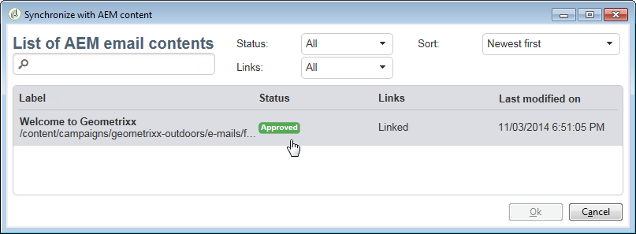

# Uso de Adobe Campaign 6.1 y Adobe Campaign Standard{#working-with-adobe-campaign-and-adobe-campaign-standard}

>[!CAUTION]
>
>AEM 6.4 ha llegado al final de la compatibilidad ampliada y esta documentación ya no se actualiza. Para obtener más información, consulte nuestra [períodos de asistencia técnica](https://helpx.adobe.com/es/support/programs/eol-matrix.html). Buscar las versiones compatibles [here](https://experienceleague.adobe.com/docs/).

Puede crear contenido de correo electrónico en AEM y procesarlo en los correos electrónicos de Adobe Campaign. Para ello, debe:

1. Cree una newsletter nueva en AEM a partir de una plantilla específica de Adobe Campaign.
1. Select [un servicio de Adobe Campaign](#selectingtheadobecampaigncloudservice) antes de editar el contenido para acceder a todas las funciones.
1. Edite el contenido.
1. Valide el contenido.

A continuación, el contenido se puede sincronizar con un envío en Adobe Campaign. Las instrucciones detalladas se describen en este documento.

>[!NOTE]
>
>Antes de poder utilizar esta funcionalidad, debe configurar AEM para que se integre con [Adobe Campaign](/help/sites-administering/campaignonpremise.md) o [Adobe Campaign Standard](/help/sites-administering/campaignstandard.md).

## Envío de contenido de correo electrónico a través de Adobe Campaign {#sending-email-content-via-adobe-campaign}

Después de configurar AEM y Adobe Campaign, puede crear contenido de envío de correo electrónico directamente en AEM y luego procesarlo en Adobe Campaign.

Al crear contenido de Adobe Campaign en AEM, debe vincular a un servicio de Adobe Campaign antes de editar el contenido para acceder a todas las funciones.

Hay dos casos posibles:

* El contenido se puede sincronizar con un envío de Adobe Campaign. Esto le permite utilizar AEM contenido en una entrega.
* (Solo Adobe Campaign in situ) El contenido se puede enviar directamente a Adobe Campaign, que genera automáticamente un nuevo envío de correo electrónico. Este modo tiene limitaciones.

Las instrucciones detalladas se describen en este documento.

### Creación de nuevo contenido de correo electrónico {#creating-new-email-content}

>[!NOTE]
>
>Al añadir plantillas de correo electrónico, asegúrese de agregarlas en **/content/igns** para que estén disponibles.

1. En AEM, seleccione la opción **Sitios web** a continuación, examine el explorador para encontrar dónde se administran las campañas de correo electrónico. En el ejemplo siguiente, el nodo correspondiente es **Sitios web** > **Campañas** > **Geometrixx Outdoors** > **Campañas de correo electrónico**.

   >[!NOTE]
   >
   >[Los ejemplos de correo electrónico solo están disponibles en Geometrixx](/help/sites-developing/we-retail.md#weretail). Descargue el contenido de muestra de Package Share.

   

1. Select **Nuevo** > **Nueva página** para crear contenido de correo electrónico nuevo.
1. Seleccione una de las plantillas disponibles específicas de Adobe Campaign y rellene las propiedades generales de la página. Hay tres plantillas disponibles de forma predeterminada:

   * **Correo electrónico de Adobe Campaign (AC 6.1)**: permite añadir contenido a una plantilla predefinida antes de enviarlo a Adobe Campaign 6.1 para su envío.
   * **Correo electrónico de Adobe Campaign (ACS)**: permite añadir contenido a una plantilla predefinida antes de enviarlo a Adobe Campaign Standard para su envío.

   

1. Haga clic en **Crear** para crear su correo electrónico o newsletter.

### Selección del servicio en la nube y la plantilla de Adobe Campaign {#selecting-the-adobe-campaign-cloud-service-and-template}

Para integrarse con Adobe Campaign, debe añadir un servicio de nube de Adobe Campaign a la página. Al hacerlo, tendrá acceso a la personalización y a otra información de Adobe Campaign.

Además, es posible que también necesite seleccionar la plantilla de Adobe Campaign y cambiar el asunto, así como añadir contenido de texto sin formato para los usuarios que no verán el correo electrónico en el HTML.

1. Seleccione el **Página** en la barra de tareas y, a continuación, seleccione **Propiedades de página.**
1. En el **Servicios de nube** en la ventana emergente, seleccione **Añadir servicio** para añadir el servicio Adobe Campaign y haga clic en **OK**.

   

1. Seleccione la configuración que coincida con su instancia de Adobe Campaign en la lista desplegable y haga clic en **OK**.

   >[!NOTE]
   >
   >Asegúrese de tocar o hacer clic **OK** o **Aplicar** después de agregar el servicio en la nube. Esto habilita la variable **Adobe Campaign** para que funcione correctamente.

1. Si desea aplicar una plantilla de envío de correo electrónico específica (de Adobe Campaign) distinta de la predeterminada **correo** plantilla, seleccione **Propiedades de página** de nuevo. En el **Adobe Campaign** , introduzca el nombre interno de la plantilla de envío de correo electrónico en la instancia de Adobe Campaign relacionada.

   En Adobe Campaign Standard, la plantilla es **Entrega con contenido AEM**. En Adobe Campaign 6.1, la plantilla es **Envío de correo electrónico con contenido AEM**.

   Al seleccionar la plantilla, AEM activa automáticamente la variable **Newsletter de Adobe Campaign** componentes.

### Edición del contenido de correo electrónico {#editing-email-content}

Puede editar el contenido del correo electrónico en la interfaz de usuario clásica o en la táctil.

1. Introduzca el asunto y la versión de texto del correo electrónico seleccionando **Propiedades de página** > **Correo electrónico** del cuadro de herramientas.

   

1. Edite el contenido del correo electrónico agregando los elementos que desee de los que están disponibles en la barra de tareas. Para ello, arrástrelos y suéltelos. A continuación, haga doble clic en el elemento que desee editar.

   Por ejemplo, puede añadir texto que contenga campos de personalización.

   

   Consulte [Componentes de Adobe Campaign](/help/sites-classic-ui-authoring/classic-personalization-ac-components.md) para obtener una descripción de los componentes disponibles para las campañas de correo electrónico o los boletines informativos de Adobe Campaign.

   

### Inserción de personalización {#inserting-personalization}

Al editar el contenido, puede insertar:

* Campos de contexto de Adobe Campaign. Son campos que puede insertar en el texto y que se adaptarán según los datos del destinatario (por ejemplo, nombre, apellido o cualquier dato de la dimensión de destino).
* Bloques personalizados de Adobe Campaign. Son bloques de contenido predefinido que no están relacionados con los datos del destinatario, como un logotipo de marca o un vínculo a una página espejo.

Consulte [Componentes de Adobe Campaign](/help/sites-classic-ui-authoring/classic-personalization-ac-components.md) para obtener una descripción completa de los componentes de Campaign.

>[!NOTE]
>
>* Solo los campos de Adobe Campaign **Perfiles** se tienen en cuenta las dimensiones de segmentación.
>* Al ver las propiedades desde **Sitios**, no tiene acceso a los campos de contexto de Adobe Campaign. Puede acceder a ellas directamente desde el correo electrónico mientras edita.
>

1. Insertar un nuevo **Newsletter** > **Texto y personalización (Campaign)** componente.
1. Abra el componente haciendo doble clic en él. La variable **Editar** tiene una funcionalidad que permite insertar los elementos de personalización.

   >[!NOTE]
   >
   >Los campos de contexto disponibles corresponden a la variable **Perfiles** dimensión de segmentación en Adobe Campaign.
   >
   >Consulte [Vinculación de una página AEM a un correo electrónico de Adobe Campaign](/help/sites-classic-ui-authoring/classic-personalization-ac-campaign.md#linkinganaempagetoanadobecampaignemail).

   

1. Select **ClientContext** en la barra de tareas para probar los campos de personalización utilizando los datos de los perfiles de persona.

   

1. Aparece una ventana que permite seleccionar el perfil que desea. Los campos de personalización se sustituyen automáticamente por datos del perfil seleccionado.

   

### Vista previa de una newsletter {#previewing-a-newsletter}

Puede obtener una vista previa del aspecto que tendrá el boletín y la personalización.

1. Abra la newsletter que desee previsualizar y haga clic en Vista previa (lupa) para reducir la barra de tareas.
1. Haga clic en uno de los iconos del cliente de correo electrónico para ver el aspecto del boletín en cada cliente de correo electrónico.

   

1. Expanda la barra de tareas para volver a empezar la edición.

### Aprobación de contenido en AEM {#approving-content-in-aem}

Una vez finalizado el contenido, puede iniciar el proceso de aprobación. Vaya a la **Flujo de trabajo** del cuadro de herramientas y seleccione la **Aprobar para Adobe Campaign** flujo de trabajo.

Este flujo de trabajo integrado tiene dos pasos: revisión, luego aprobación, o revisión y luego rechazo. Sin embargo, este flujo de trabajo se puede ampliar y adaptar a un proceso más complejo.

Para aprobar contenido para Adobe Campaign, aplique el flujo de trabajo seleccionando **Flujo de trabajo** en la barra de tareas y seleccione **Aprobar para Adobe Campaign** y haga clic en **Iniciar flujo de trabajo**. Siga los pasos y apruebe el contenido. También puede rechazar el contenido seleccionando **Rechazar** en lugar de **Aprobar** en el último paso del flujo de trabajo.

Una vez aprobado el contenido, aparece como aprobado en Adobe Campaign. A continuación, se puede enviar el correo electrónico.

En Adobe Campaign Standard:

En Adobe Campaign 6.1:

>[!NOTE]
>
>El contenido no aprobado se puede sincronizar con un envío en Adobe Campaign, pero el envío no se puede ejecutar. Solo se puede enviar contenido aprobado a través de envíos de Campaign.

## Vinculación de AEM con Adobe Campaign Standard y Adobe Campaign 6.1 {#linking-aem-with-adobe-campaign-standard-and-adobe-campaign}

>[!NOTE]
>
>Consulte [Vinculación de AEM con Adobe Campaign Standard y Adobe Campaign 6.1](/help/sites-authoring/campaign.md#linking-aem-with-adobe-campaign-standard-and-adobe-campaign-classic) under [Uso de Adobe Campaign 6.1 y Adobe Campaign Standard](/help/sites-authoring/campaign.md) en la documentación de creación estándar para obtener más información.
