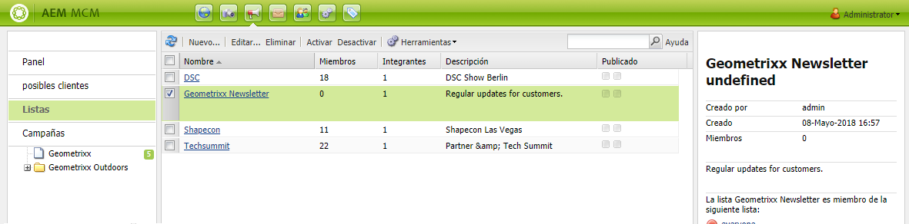
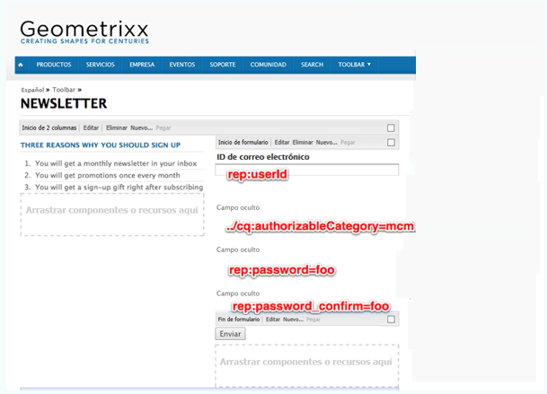
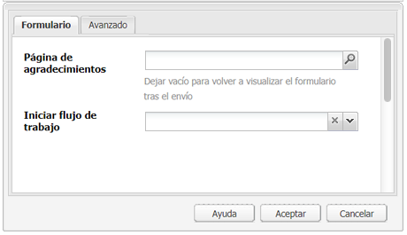
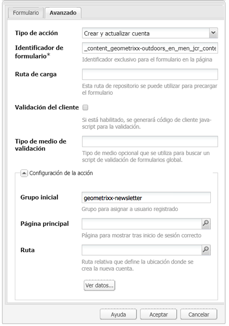
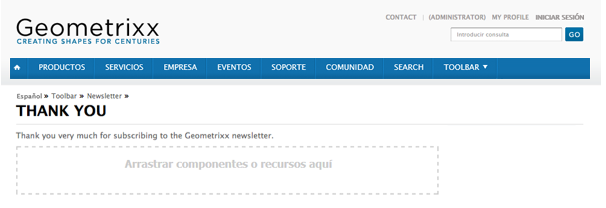
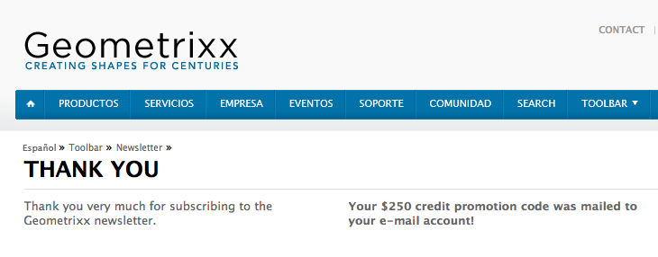

# Crear una página de aterrizaje del boletín eficaz{#creating-an-effective-newsletter-landing-page}

Una página de base de boletín eficaz ayuda a llegar a los máximos visitantes posibles para que éstos se registren en el boletín (u otra campaña de marketing por correo electrónico). La información recopilada de los registros al boletín se puede utilizar para obtener posibles clientes.

Para crear una página de base de boletín eficaz, debe hacer lo siguiente:

1. Cree una lista para el boletín, de modo que los usuarios se puedan suscribir al mismo.
1. Cree el formulario de registro. Cuando realice esto, añada una etapa de flujo de trabajo que añada automáticamente la persona que se registre al boletín de la lista de posibles clientes.
1. Cree una página de confirmación que agradezca a los usuarios el registro y que posiblemente pueda ofrecerles una oferta.
1. Añada teasers.

>[!NOTE]
>
>Adobe no planea seguir mejorando esta capacidad (Administración de posibles clientes y Listas).\
>Se recomienda aprovechar [Adobe Campaign y su integración](/help/sites-administering/campaign.md)AEM.

## Crear una lista para el boletín {#creating-a-list-for-the-newsletter}

Cree una lista como, por ejemplo, **Boletín de Geometrixx**, en MCM a la que los usuarios deben suscribirse. La creación de la listas se describe en [Crear listas](/help/sites-classic-ui-authoring/classic-personalization-campaigns.md#creatingnewlists).

A continuación se incluye un ejemplo de una lista:

## Crear un formulario de registro {#create-a-sign-up-form}

Cree un formulario de registro al boletín que permita a los usuarios suscribirse a etiquetas. El sitio web de ejemplo de Geometrixx proporciona una página del boletín en la barra de herramientas de Geometrixx donde puede crear su formulario.

Para crear su propio formulario del boletín, consulte la información sobre la creación de formularios en la [documentación de los formularios](/help/sites-authoring/default-components.md#form). El boletín utiliza las etiquetas de la biblioteca de etiquetas. Para añadir etiquetas adicionales, consulte [Administración de etiquetas](/help/sites-authoring/tags.md#tagadministration).

Los campos ocultos del siguiente ejemplo proporcionan la cantidad mínima de información básica (correo electrónico); asimismo, puede añadir más campos posteriormente, pero esto influirá en el porcentaje de conversión.

El siguiente ejemplo es un formulario creado en http://localhost:4502/cf#/content/geometrixx/en/toolbar/newsletter.html.

1. Cree el formulario.

   

1. Haga clic en **Editar** en el componente Formulario para configurar el formulario para que se dirija a la página de agradecimiento (consulte [Creación de páginas de agradecimiento](#creating-a-thank-you-page)).

   

1. Establezca la acción del formulario (esto es lo que sucederá cuando envíe el formulario) y configure el grupo para asignar los usuarios registrados a la lista que creó previamente (por ejemplo, newsletter de geometrixx).

   

## Crear una página de agradecimiento {#creating-a-thank-you-page}

Cuando los usuarios hacen clic en **Suscribirse ahora**, desea que se abra una página de agradecimiento automáticamente. Cree la página de agradecimiento en la página del boletín de Geometrixx. Una vez creado el formulario de la Newsletter, edite el componente Formulario y añada la ruta a la página de agradecimiento.

Al enviar la solicitud, el usuario se dirige a la página de **agradecimiento** tras la cual recibirá un correo electrónico. Esta página de agradecimiento se creó en /content/geometrixx/en/toolbar/newsletter/thank_you.

## Añadir teasers {#adding-teasers}

Añada [teasers](/help/sites-classic-ui-authoring/classic-personalization-campaigns.md#teasers) para dirigirse a audiencias específicas. Por ejemplo, puede añadir teasers a la página de agradecimiento y a la página de registro a la newsletter.

Para añadir teasers con el fin de que la página de base de la newsletter sea eficaz:

1. Cree un párrafo de teaser para obtener un regalo de registro. Seleccione **Primero** como estrategia e incluya texto que informe sobre qué regalo podrán recibir los usuarios.

   

1. Cree un párrafo de teaser para la página de agradecimiento. Seleccione **Primero** como estrategia e incluya texto que indique que el regalo ya se ha enviado.

   

1. Cree una campaña con dos teasers -- etiquete uno con la palabra negocio y deje otro sin etiquetar.

## Inserción de contenido en suscriptores {#pushing-content-to-subscribers}

Introduzca los cambios en las páginas mediante la funcionalidad del boletín, en MCM. Envíe el contenido actualizado a los suscriptores.

Consulte [Enviar boletines](/help/sites-classic-ui-authoring/classic-personalization-campaigns.md#newsletters).
