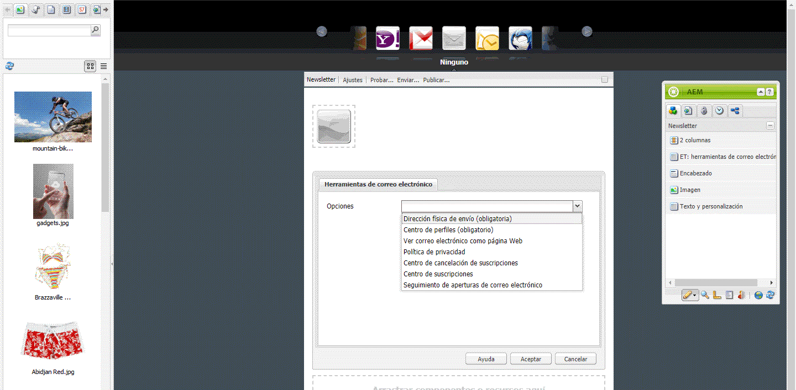
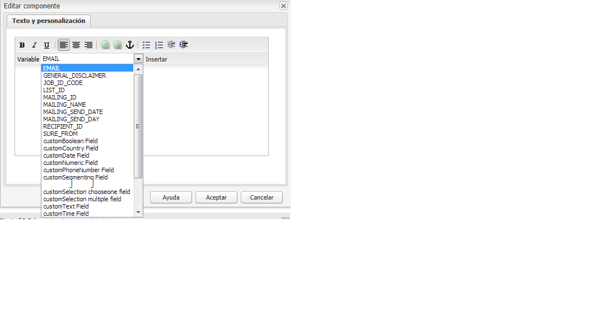
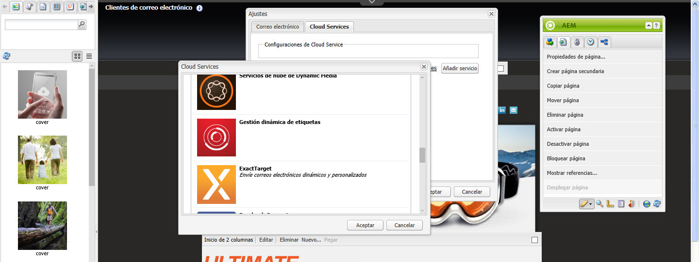
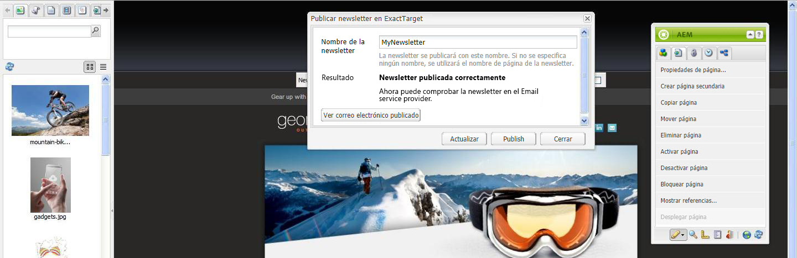

# Publicación de un correo electrónico para los proveedores de servicios de correo electrónico{#publishing-an-email-to-email-service-providers}

>[!CAUTION]
>
>AEM 6.4 ha llegado al final de la compatibilidad ampliada y esta documentación ya no se actualiza. Para obtener más información, consulte nuestra [períodos de asistencia técnica](https://helpx.adobe.com/es/support/programs/eol-matrix.html). Buscar las versiones compatibles [here](https://experienceleague.adobe.com/docs/).

Puede publicar newsletters en servicios de correo electrónico como ExactTarget y Silverpop Engage. En este documento se describe cómo configurar AEM para publicar una newsletter en estos servicios de correo electrónico.

>[!NOTE]
>
>Debe configurar el proveedor de servicios antes de crear y publicar un correo electrónico. Consulte [Configuración de ExactTarget](/help/sites-administering/exacttarget.md) y [Configuración de Silverpop Engage](/help/sites-administering/silverpop.md) para obtener más información.

Para publicar el correo electrónico en el proveedor de servicios de correo electrónico, debe realizar los siguientes pasos:

1. Cree un correo electrónico.
1. Aplique la configuración del servicio de correo electrónico al correo electrónico.
1. Publique el correo electrónico.

>[!NOTE]
>
>Si actualiza los proveedores de correo electrónico, realice una prueba de vuelo o envíe un boletín, estas operaciones fallarán si el boletín no se publica primero en la instancia Publicar o si la instancia Publicar no está disponible. Asegúrese de publicar la newsletter y de que la instancia de publicación esté funcionando.

## Creación de un correo electrónico {#creating-an-email}

Se puede crear en una campaña un boletín o mensaje de correo electrónico que desee publicar en un servicio de correo electrónico mediante la **Newsletter de Geometrixx** plantilla. También puede usar la variable **Correo electrónico de los Geometrixx Outdoors** plantilla. Ejemplo de correo electrónico o newsletter basado en la variable **Correo electrónico de los Geometrixx Outdoors** la plantilla está disponible en `https://<hostname>:<port>/cf#/content/campaigns/geometrixx-outdoors/e-mails.html`.

Para crear un nuevo correo electrónico que se publique en el servicio de correo electrónico configurado:

1. Vaya a **Sitios web** y luego **Campañas**. Seleccione una campaña.
1. Haga clic en **Nuevo** para abrir el **Crear página** ventana.
1. Introduzca el título, el nombre y seleccione el **Newsletter de Geometrixx** de la lista de plantillas disponibles.
1. Haga clic en **Crear**.
1. Abra el correo electrónico creado.
1. Cambie al modo de diseño para seleccionar los componentes que desea mostrar en la barra de tareas.
1. Cambie al modo de edición y empiece a añadir contenido (texto, imágenes, [herramientas de correo electrónico](#adding-exacttarget-email-tools-to-your-email), [variables de personalización](#adding-text-and-personalization-tool-to-your-e-mail), etc.) a su correo electrónico.

### Adición de herramientas de correo electrónico de ExactTarget al correo electrónico {#adding-exacttarget-email-tools-to-your-email}

>[!NOTE]
>
>Esta sección es específica del servicio ExactTarget.

La variable **Herramientas de correo electrónico** para ExactTarget puede añadir más funciones de correo electrónico al correo electrónico o al boletín.

1. Abra un correo electrónico para publicarlo en ExactTarget.
1. Añadir el componente **ET: herramientas de correo electrónico** a su página mediante la barra de tareas. Abra el componente en modo de edición.

   

1. Seleccione una opción de la **Opciones** menú:

<table> 
 <tbody> 
  <tr> 
   <td>Dirección física de envío (obligatoria)</td> 
   <td>Este componente inserta la dirección de correo física de su organización en el correo electrónico.</td> 
  </tr> 
  <tr> 
   <td>Centro de perfiles (obligatorio)</td> 
   <td>El centro de perfiles es una página web en la que los suscriptores pueden introducir y mantener la información personal que tenga sobre ellos.</td> 
  </tr> 
  <tr> 
   <td>Ver correo electrónico como página Web</td> 
   <td>Este componente permite al usuario ver el correo electrónico como una página web.</td> 
  </tr> 
  <tr> 
   <td>Política de privacidad</td> 
   <td>Este componente inserta el vínculo a la política de privacidad en el correo electrónico.  </td> 
  </tr> 
  <tr> 
   <td>Centro de cancelación de suscripciones</td> 
   <td>Ofrece al usuario la opción de cancelar la suscripción a su lista de correo.</td> 
  </tr> 
  <tr> 
   <td>Centro de suscripciones</td> 
   <td>Un centro de suscripciones es una página web en la que un suscriptor puede controlar los mensajes que recibe de su organización.</td> 
  </tr> 
  <tr> 
   <td>Seguimiento de aperturas de correo electrónico</td> 
   <td>Componente oculto que le permite utilizar la función de seguimiento ExactTarget.  </td> 
  </tr> 
 </tbody> 
</table>

>[!NOTE]
>
>La variable **Opciones** el menú desplegable solo se rellena si se aplica la configuración de ExactTarget al correo electrónico. Consulte [Aplicación de la configuración del servicio de correo electrónico a la configuración del correo electrónico](#applying-e-mail-service-configuration-to-e-mail-settings) para obtener más información.

1. Publique el correo electrónico en ExactTarget.

   El correo electrónico con las herramientas de correo electrónico está disponible para su uso en la cuenta configurada de ExactTarget.

>[!NOTE]
>
>* Las direcciones URL dentro de las herramientas de correo electrónico solo se reemplazan (en el correo recibido) por sus valores reales cuando se envía un correo electrónico mediante **Envío simple** o **Envío guiado** pero no **Envío de prueba**.
>
>* Se requieren dos de las herramientas de correo electrónico: **Dirección física de envío (obligatoria)** y **Centro de perfiles (obligatorio)**. Cuando el correo electrónico se publica en ExactTarget, estas dos herramientas de correo electrónico se añaden al final de cada correo de forma predeterminada.
>

### Agregar la herramienta Texto y Personalización al correo electrónico {#adding-text-and-personalization-tool-to-your-e-mail}

Puede añadir campos personalizados en un correo electrónico agregando la variable **Texto y personalización** a la página:

1. Abra el correo electrónico que desee publicar en su servicio de correo electrónico.
1. Para habilitar el campo de personalización desde el servicio de correo electrónico, añada la configuración del marco al configurar el servicio de correo electrónico. Consulte [configuración de Silverpop Engage](/help/sites-administering/silverpop.md) y [configuración de ExactTarget](/help/sites-administering/exacttarget.md) para obtener más información.
1. Añadir el componente **Texto y personalización** de la barra de tareas. Este componente forma parte del grupo de boletines informativos. Abra este componente en el modo de edición.

   

1. Añada el campo personalizado requerido al texto; para ello, seleccione el campo en el menú desplegable y haga clic en **Insertar**.
1. Haga clic en **OK** para terminar.

## Aplicación de la configuración del servicio de correo electrónico a la configuración del correo electrónico {#applying-e-mail-service-configuration-to-e-mail-settings}

Para aplicar la configuración del servicio de correo electrónico a una newsletter:

1. Cree una configuración del servicio de correo electrónico.
1. Abra el correo electrónico o la newsletter.
1. Abra la configuración del correo electrónico o del boletín haciendo clic en **Configuración** o haciendo clic en **Propiedades de página de** la barra de tareas.
1. Haga clic en **Añadir servicio** en **Cloud Services** pestaña . Verá la lista de servicios. Seleccione la configuración requerida: o **ExactTarget** o **Silverpop** - en la lista de la lista desplegable.

   

1. Haga clic en **Aceptar**.

## Publicación de correos electrónicos en el servicio de correo electrónico {#publishing-emails-to-email-service}

Puede publicar correos electrónicos y boletines en su servicio de correo electrónico siguiendo estos pasos:

1. Abra el correo electrónico.
1. Antes de publicar un correo electrónico, asegúrese de haber aplicado la configuración correcta a su correo electrónico.
1. Haga clic en **Publicar**. Esto abre el **Publicar Newsletter en el proveedor de servicios de correo electrónico** ventana.
1. Complete la variable **Nombre del boletín** campo . El correo electrónico o el boletín se publica en el proveedor de servicios de correo electrónico con este nombre. Si no se proporciona un nombre de correo electrónico, el correo electrónico se publica con el nombre de página de la newsletter en AEM.
1. Haga clic en **Publicar**.

   

   Si se realiza correctamente, AEM confirma que puede ver el correo electrónico en ExactTarget o Silverpop Engage.

   En el caso de ExactTarget, el correo electrónico publicado se puede ver haciendo clic en **Ver correo electrónico publicado**. Esto le llevará directamente a la newsletter publicada en ExactTarget ([https://members.exacttarget.com/](https://members.exacttarget.com/).).

>[!NOTE]
>
>Si un correo electrónico o boletín se publica con el mismo nombre que el de un correo electrónico o boletín ya publicado, el correo electrónico o boletín anterior no se reemplaza. En su lugar, se crea un nuevo correo electrónico/boletín con el mismo nombre (los ID de dos boletines son, sin embargo, diferentes).
>
>Al publicar el correo electrónico o el boletín en el proveedor de servicios de correo electrónico también se publica el correo electrónico o el boletín en la instancia de publicación de AEM.

### Actualización de un correo electrónico publicado {#updating-a-published-e-mail}

La variable **Actualizar** en el cuadro de diálogo Publicar permite actualizar una newsletter ya publicada en un proveedor de servicios de correo electrónico. En caso de que el boletín aún no se haya publicado y la variable **Actualizar** se hace clic en el botón, **El boletín no está publicado** se muestra.

Para actualizar un correo electrónico publicado:

1. Abra el correo electrónico o la newsletter que se haya publicado anteriormente en un proveedor de servicios de correo electrónico que desee volver a publicar después de realizar cambios en el correo electrónico o la newsletter.
1. Haga clic en **Publicar**. La variable **Publicar newsletter en el proveedor de servicios de correo electrónico** se muestra. Haga clic en **Actualizar**.

   Para comprobar si el correo electrónico o la newsletter se han actualizado en ExactTarget, haga clic en **Ver correo electrónico publicado**. Esto le lleva al correo electrónico publicado en ExactTarget.

   Para comprobar si el correo electrónico o el boletín se ha actualizado en el servicio de correo electrónico de Silverpop, visite el sitio de Silverpop Engage.
