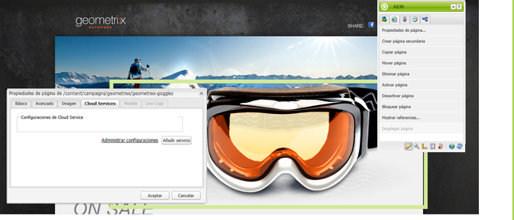
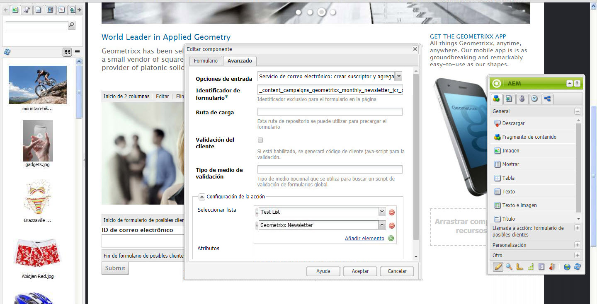
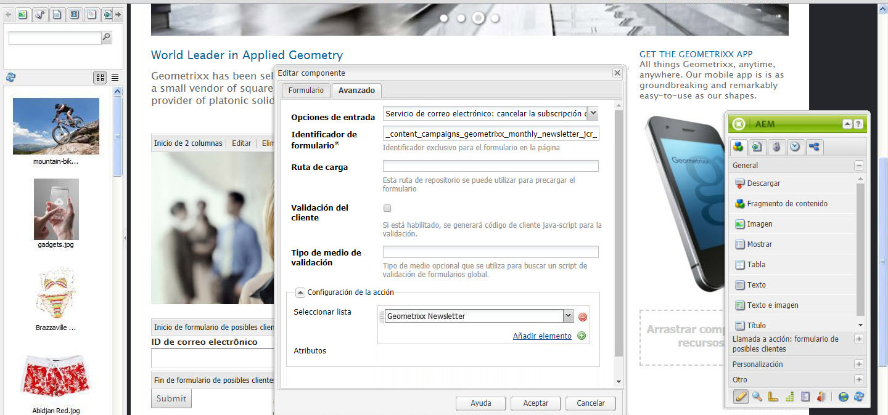
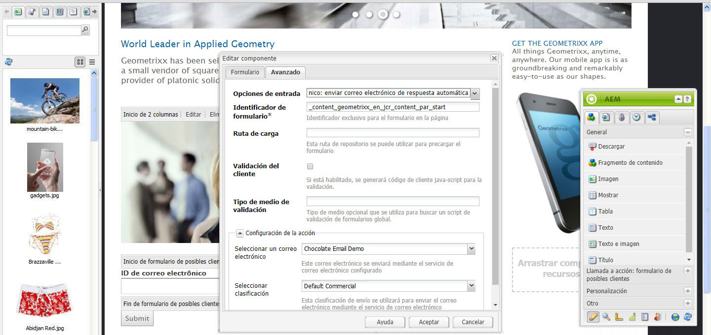

# Administración de suscripciones{#managing-subscriptions}

>[!CAUTION]
>
>AEM 6.4 ha llegado al final de la compatibilidad ampliada y esta documentación ya no se actualiza. Para obtener más información, consulte nuestra [períodos de asistencia técnica](https://helpx.adobe.com/es/support/programs/eol-matrix.html). Buscar las versiones compatibles [here](https://experienceleague.adobe.com/docs/).

>[!NOTE]
>
>Adobe no tiene previsto mejorar aún más esta capacidad (Administración de posibles clientes y listas).\
>La recomendación es aprovechar [Adobe Campaign y su integración AEM](/help/sites-administering/campaign.md).

Se puede solicitar a los usuarios que se suscriban a **del proveedor de servicios de correo electrónico** listas de correo con la ayuda de **Formulario** componente utilizado en una página web AEM. Para preparar una página AEM con un formulario de registro para la suscripción a las listas de correo del servicio de correo electrónico, debe aplicar la configuración de servicio correspondiente a la página AEM que visitará el posible suscriptor.

## Aplicación de la configuración del servicio de correo electrónico a una página {#applying-email-service-configuration-to-a-page}

Para configurar una página AEM:

1. Vaya a la **Sitios web** pestaña .
1. Seleccione la página que debe configurarse para el servicio. Haga clic con el botón derecho en la página y seleccione **Propiedades**.

1. Select **Cloud Services** then **Añadir servicio**. Seleccione una configuración de la lista de configuraciones disponibles.

   

1. Haga clic en **Aceptar**.

## Creación de un formulario de registro en una página AEM para suscribirse o cancelar la suscripción a listas {#creating-a-sign-up-form-on-an-aem-page-for-subscribing-unsubscribing-to-lists}

Para crear un formulario de registro y configurarlo para suscripciones a las listas de correo del proveedor de servicios de correo electrónico:

1. Abra la página AEM que visitará el usuario.
1. Aplique la configuración del proveedor de servicios de correo electrónico a la página.

1. Agregue un **Formulario** para colocarlo en la página arrastrando el componente desde la barra de tareas. Si el componente no está disponible, cambie al modo de diseño y active **Formulario** grupo.
1. Haga clic en **Editar** en el **Inicio de formulario** y vaya a **Avanzadas** pestaña .
1. En el **Formulario** menú desplegable, seleccione **Servicio de correo electrónico: Crear suscriptor** y añadir a la lista.
1. En la parte inferior del cuadro de diálogo, abra la **Configuración de la acción** , que le permite seleccionar una o varias listas de suscripción.
1. En el **Seleccionar lista**, seleccione la lista a la que desea que se suscriban los usuarios. Puede agregar varias listas utilizando el botón más (**Agregar elemento**).

   

   >[!NOTE]
   >
   >El cuadro de diálogo puede variar según el proveedor de servicios de correo electrónico.

1. En el **Formulario** , seleccione la página de agradecimiento a la que desea que se dirijan los usuarios después de enviar el formulario (si se deja en blanco, el formulario se vuelve a mostrar tras el envío). Haga clic en **Aceptar**. Un **ID de correo electrónico** aparece en el formulario, que le permite crear un formulario en el que los usuarios pueden enviar sus direcciones de correo electrónico para suscribirse o cancelar la suscripción a una lista de correo.
1. Agregue la variable **Submit** del componente **Formulario** en la barra de tareas.

   El formulario está listo. Publique la página configurada en los pasos anteriores junto con la variable **gracias** a la instancia de publicación. Los suscriptores potenciales que visiten la página pueden rellenar el formulario y suscribirse a la lista proporcionada en la configuración.

   >[!NOTE]
   >
   >Para que la suscripción del formulario funcione correctamente, [las claves de cifrado del autor deben exportarse e importarse en la instancia de publicación](#exporting-keys-from-author-and-importing-on-publish).

## Exportación de claves de creación e importación en publicación {#exporting-keys-from-author-and-importing-on-publish}

Para que la suscripción y la cancelación de suscripciones al servicio de correo electrónico funcionen mediante el formulario de registro en la instancia de publicación, debe seguir estos pasos:

1. En la instancia de autor, vaya al Administrador de paquetes.
1. Cree un nuevo paquete. Establezca el filtro como `/etc/key`.
1. Cree y descargue el paquete.
1. Vaya al Administrador de paquetes en la instancia de publicación y cargue este paquete.
1. Vaya a la consola OSGi de publicación y reinicie el paquete denominado **Compatibilidad con Adobe Granite Crypto**.

## Cancelación de la suscripción de usuarios de listas {#unsubscribing-users-from-lists}

Para cancelar la suscripción de los usuarios a las listas:

1. Abra las propiedades de página de la página AEM que contenga el formulario de registro para cancelar la suscripción de un posible cliente.
1. Aplique la configuración de servicio a la página.
1. Cree un formulario de registro en la página.
1. Al configurar el componente, seleccione la acción **Servicio de correo electrónico**: **Cancele la suscripción del usuario a la lista.**
1. En el menú desplegable, seleccione la lista adecuada de la que se eliminará el usuario al cancelar la suscripción.

   

1. Exporte las claves del autor a la publicación.

## Configuración de correos electrónicos de respuesta automática para el servicio de correo electrónico {#configuring-auto-responder-emails-for-email-service}

Para configurar un correo electrónico de respuesta automática para un suscriptor:

1. Abra las propiedades de página de la página AEM que contenga el formulario de registro para configurar el respondedor automático de un posible cliente.
1. Aplique la configuración de ExactTarget a la página.

1. Agregue un **Formulario** para colocarlo en la página arrastrando el componente desde la barra de tareas. Si el componente no está disponible, cambie al modo de diseño y habilite el **Formulario** grupo.
1. Haga clic en **Editar** en el **Inicio de formulario** y vaya a **Avanzadas** pestaña .
1. En el **Formulario** menú desplegable, seleccione **Servicio de correo electrónico: Enviar correo electrónico de respuesta automática.**
1. **Seleccionar un correo electrónico** (es el correo que se envía como correo electrónico de respuesta automática).

1. **Seleccionar clasificación** (esta clasificación se utiliza para enviar el correo electrónico).
1. Seleccione el **Gracias** (la página a la que se dirige a los usuarios una vez que envían el formulario).

   En el **Formulario** , seleccione la página de agradecimiento a la que desea que se dirijan los usuarios después de enviar el formulario. (Si se deja en blanco, el formulario se vuelve a mostrar tras el envío). Haga clic en **Aceptar**.

1. Exporte las claves del autor a la publicación.
1. Agregue la variable **Submit** del componente **Formulario** en la barra de tareas.

   El formulario de registro está listo. Publique la página configurada en los pasos anteriores junto con la variable **gracias** a la instancia de publicación. Los suscriptores potenciales que visiten la página pueden rellenar el formulario y, al enviar el formulario, el visitante recibirá un correo electrónico de respuesta automática en el ID de correo electrónico que se rellene en el formulario.

   >[!NOTE]
   >
   >Para que la suscripción del formulario de registro funcione correctamente, [las claves de cifrado del autor deben exportarse e importarse en la instancia de publicación](#exporting-keys-from-author-and-importing-on-publish).

   
