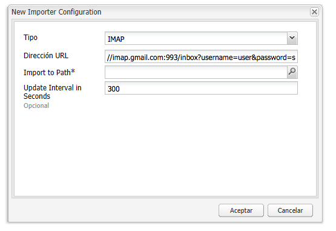

# Seguimiento de correos electrónicos devueltos{#tracking-bounced-emails}

>[!CAUTION]
>
>AEM 6.4 ha llegado al final de la compatibilidad ampliada y esta documentación ya no se actualiza. Para obtener más información, consulte nuestra [períodos de asistencia técnica](https://helpx.adobe.com/es/support/programs/eol-matrix.html). Buscar las versiones compatibles [here](https://experienceleague.adobe.com/docs/).

>[!NOTE]
>
>Adobe no tiene previsto mejorar aún más el seguimiento de los correos electrónicos abiertos o devueltos enviados por AEM servicio SMTP.
>
>La recomendación es [aprovechar Adobe Campaign y su integración AEM](/help/sites-administering/campaign.md).

Cuando envía una newsletter a muchos usuarios, normalmente hay algunas direcciones de correo electrónico no válidas en la lista. Si se envían newsletters a esas direcciones, se devuelven. AEM es capaz de administrar esas devoluciones y puede dejar de enviar newsletters a esas direcciones una vez se haya superado el contador de devoluciones configurado. De forma predeterminada, la tasa de salida hacia otro sitio está definida en 3 pero es configurable.

Para configurar AEM para realizar un seguimiento de los correos electrónicos devueltos, debe configurar AEM para sondear un buzón de correo existente en el que se reciben los correos devueltos (normalmente es la dirección de correo electrónico &quot;de&quot; que especifique al enviar la newsletter). AEM sondea esta bandeja de entrada e importa todos los correos electrónicos por debajo de la ruta especificada en la configuración de sondeo. A continuación, se activa un flujo de trabajo para buscar las direcciones de correo electrónico devueltas dentro de los usuarios y actualiza el valor de la propiedad bounceCounter del usuario en consecuencia. Una vez superados los rechazos máximos configurados, el usuario se elimina de la lista del boletín informativo.

## Configuración del importador de fuentes {#configuring-the-feed-importer}

El importador de fuentes le permite importar repetidamente contenido de fuentes externas en su repositorio. Con esta configuración del importador de fuentes, AEM comprueba si hay correos electrónicos devueltos en el buzón del remitente.

Para configurar Feed Importer para que realice el seguimiento de los correos electrónicos devueltos:

1. En **Herramientas**, seleccione Feed Importer.

1. Haga clic en **Agregar** para crear una configuración nueva.

   

1. Añada una nueva configuración seleccionando el tipo y añadiendo información a la URL de sondeo para configurar el host y el puerto. Además, debe añadir a la consulta de URL algunos parámetros específicos de protocolo y correo. Establezca la configuración para sondear al menos una vez al día.

   Todas las configuraciones necesitan información sobre lo siguiente en la URL de sondeo:

   `username`: El nombre de usuario que se utilizará para la conexión

   `password`: La contraseña que se utilizará para la conexión

   Además, según el protocolo, puede configurar ciertos ajustes.

   **Propiedades de configuración POP3:**

   `pop3.leave.on.server`: Define si los mensajes se dejarán en el servidor o no. Configúrelo en true para dejar mensajes en el servidor; en caso contrario, en false . El valor predeterminado es true.

   **Ejemplos de POP3:**

   | pop3s://pop.gmail.com:995/INBOX?username=user&amp;password=secret | Usar pop3 sobre SSL para conectarse a GMail en el puerto 995 con user/secret, dejando mensajes en el servidor de forma predeterminada |
   |---|---|
   | pop3s://pop.gmail.com:995/INBOX?username=user&amp;password=secret&amp;pop3.leave.on.server=false | pop3s://pop.gmail.com:995/INBOX?username=user&amp;password=secret&amp;pop3.leave.on.server=false |

   **Propiedades de configuración de IMAP:**

   Permite establecer indicadores para buscar.

   `imap.flag.SEEN`: establezca false para los mensajes nuevos o no vistos, true para los mensajes ya leídos

   Consulte [https://java.sun.com/products/javamail/javadocs/javax/mail/Flags.Flag.html](https://java.sun.com/products/javamail/javadocs/javax/mail/Flags.Flag.html) para la lista completa de indicadores.

   **Ejemplos de IMAP:**

   | imaps://imap.gmail.com:993/inbox?username=user&amp;password=secret | Usar IMAP sobre SSL para conectarse a GMail en el puerto 993 con user/secret. Solo se obtienen nuevos mensajes de forma predeterminada. |
   |---|---|
   | imaps://imap.gmail.com:993/inbox?username=user&amp;password=secret&amp;imap.flag.SEEN=true | Usar IMAP sobre SSL para conectarse a GMail 993 con usuario/secreto, solo obteniendo un mensaje ya visto. |
   | imaps://imap.gmail.com:993/inbox?username=user&amp;password=secret&amp;imap.flag.SEEN=true&amp;imap.flag.SEEN=false | Usar IMAP sobre SSL para conectarse a GMail 993 con usuario/secreto, obteniendo mensajes nuevos o ya leídos. |

1. Guarde la configuración.

## Configuración del componente de servicio de boletín informativo {#configuring-the-newsletter-service-component}

Después de configurar Feed Importer, debe configurar la dirección De y el contador de devoluciones.

Para configurar el servicio de boletín informativo:

1. En la consola OSGi en `<host>:<port>/system/console/configMgr` y vaya a **Newsletter de MCM**.

1. Configure el servicio y guarde los cambios cuando termine.

   

   Se pueden configurar las siguientes configuraciones para ajustar el comportamiento:

   | Contador de devoluciones máximo (max.bounce.count) | Define el número de devoluciones hasta que se omita a un usuario al enviar una newsletter. Si este valor se establece en 0, se desactiva completamente la comprobación de devoluciones. |
   |---|---|
   | Actividad sin caché (sent.activity.nocache) | Define la configuración de caché que se utilizará para la actividad de newsletter enviada |

   Una vez guardado, el servicio MCM newsletter hace lo siguiente:

   * Escribe una actividad en el flujo oculto de los usuarios tras enviar correctamente una newsletter.
   * Escribe una actividad si se detecta una devolución y cambia el contador de devoluciones de los usuarios.
