# Marketing por correo electrónico{#e-mail-marketing}

>[!CAUTION]
>
>AEM 6.4 ha llegado al final de la compatibilidad ampliada y esta documentación ya no se actualiza. Para obtener más información, consulte nuestra [períodos de asistencia técnica](https://helpx.adobe.com/es/support/programs/eol-matrix.html). Buscar las versiones compatibles [here](https://experienceleague.adobe.com/docs/).

>[!NOTE]
>
>Adobe no tiene previsto mejorar aún más los correos electrónicos abiertos o devueltos enviados por el servicio SMTP AEM.\
>La recomendación es [aprovechar Adobe Campaign y su integración AEM](/help/sites-administering/campaign.md).

El marketing por correo electrónico (por ejemplo, boletines informativos) es una parte importante de cualquier campaña de marketing, ya que se usa para impulsar el contenido a los posibles clientes. En AEM, puede crear boletines a partir de contenido AEM existente, así como añadir contenido nuevo, específico para los boletines.

Una vez creados, los boletines se pueden enviar al grupo de usuarios específico inmediatamente o en otro momento programado (mediante el uso de un flujo de trabajo). Además, los usuarios pueden suscribirse a los boletines en el formato que elijan.

Además, AEM permite administrar la funcionalidad del boletín, incluido el mantenimiento de temas, el archivado de boletines y la visualización de estadísticas del boletín.

>[!NOTE]
>
>En Geometrixx, la plantilla del boletín abre automáticamente el editor de correo electrónico. Puede utilizar el editor de correo electrónico en otras plantillas en las que desee enviar correos electrónicos, por ejemplo, invitaciones. El editor de correo electrónico se muestra cada vez que se hereda una página de **mcm/components/newsletter/página**.

En este documento se describen los aspectos básicos de la creación de boletines en AEM. Para obtener información más detallada sobre cómo trabajar con el marketing por correo electrónico, consulte los siguientes documentos:

* [Creación de una página de aterrizaje del boletín eficaz](/help/sites-classic-ui-authoring/classic-personalization-campaigns-email-landingpage.md)
* [Administración de suscripciones](/help/sites-classic-ui-authoring/classic-personalization-campaigns-email-subscriptions.md)
* [Publicación de un correo electrónico para los proveedores de servicios de correo electrónico](/help/sites-classic-ui-authoring/classic-personalization-campaigns-email-newsletters.md)
* [Seguimiento de correos electrónicos devueltos](/help/sites-classic-ui-authoring/classic-personalization-campaigns-email-tracking-bounces.md)

>[!NOTE]
>
>Si actualiza los proveedores de correo electrónico, realice una prueba de vuelo o envíe un boletín, estas operaciones fallarán si el boletín no se publica primero en la instancia Publicar o si la instancia Publicar no está disponible. Asegúrese de publicar la newsletter y de que la instancia de publicación esté funcionando.

## Creación de una experiencia de newsletter {#creating-a-newsletter-experience}

>[!NOTE]
>
>Las notificaciones por correo electrónico deben configurarse mediante la configuración osgi. Consulte [Configuración de notificaciones por correo electrónico.](/help/sites-administering/notification.md)

1. Seleccione la nueva campaña en el panel izquierdo o haga doble clic en ella en el panel derecho.

1. Seleccione la vista de lista mediante el icono :

   

1. Haga clic en **Nuevo...**

   Puede especificar la variable **Título**, **Nombre** y el tipo de experiencia que se creará; en este caso, Newsletter.

   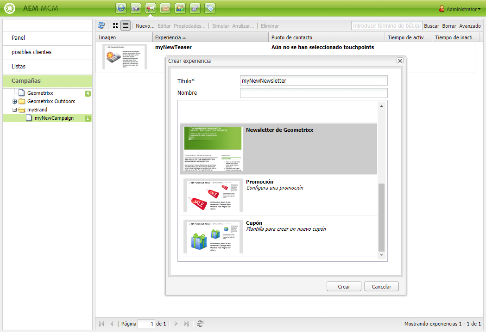

1. Haga clic en **Crear**.

1. Se abrirá un nuevo cuadro de diálogo inmediatamente. Aquí puede especificar las propiedades de la newsletter.

   La variable **Lista de destinatarios predeterminada** es un campo obligatorio, ya que constituye el punto de contacto de la newsletter (consulte [Uso de listas](/help/sites-classic-ui-authoring/classic-personalization-campaigns.md#workingwithlists) para obtener más información sobre listas).

   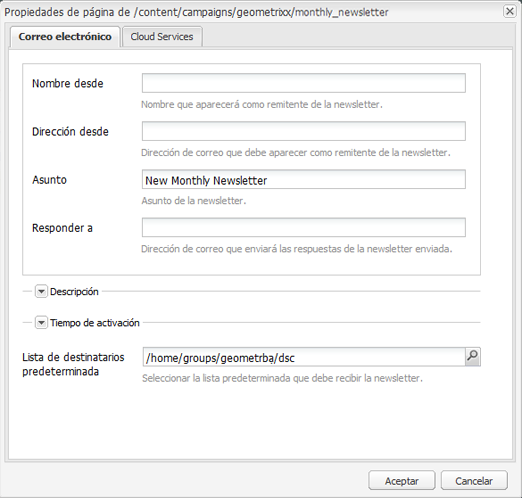

   * **Nombre desde**

      Nombre que aparecerá como remitente de la newsletter.

   * **Dirección desde**

      Dirección de correo que debe aparecer como remitente de la newsletter.

   * **Asunto**

      Asunto de la newsletter.

   * **Responder a**

      Dirección de correo que enviará las respuestas de la newsletter enviada.

   * **Descripción**

      Descripción de la newsletter.

   * **Tiempo de activación**

      Tiempo de activación para enviar la newsletter.

   * **Lista de destinatarios predeterminada**

      Lista predeterminada que debe recibir la newsletter.
   Se pueden actualizar en una fase posterior desde el **Propiedades...** diálogo.

1. Haga clic en **OK** para guardar.

## Adición de contenido a boletines {#adding-content-to-newsletters}

Puede añadir contenido, incluido contenido dinámico, a la newsletter como lo haría en cualquier componente AEM. En Geometrixx, la plantilla Newsletter tiene ciertos componentes disponibles para añadir y modificar contenido en los boletines.

1. En MCM, haga clic en la **Campañas** y haga doble clic en la newsletter que desee editar o a la que quiera añadir contenido. Se abre el boletín.

1. Si los componentes no están visibles, vaya a la vista Diseño y habilite los componentes necesarios (por ejemplo, los componentes del boletín) antes de comenzar la edición.
1. Introduzca cualquier nuevo texto, imágenes u otros componentes según corresponda. En el ejemplo de Geometrixx, hay 4 componentes disponibles: Texto, Imagen, Encabezado y 2 columnas. El boletín puede tener más o menos componentes en función de su configuración.

   >[!NOTE]
   >
   >Los boletines se personalizan mediante variables. En la newsletter de Geometrixx, las variables están disponibles en el componente Texto . Los valores de las variables se heredan de la información del perfil de usuario.

   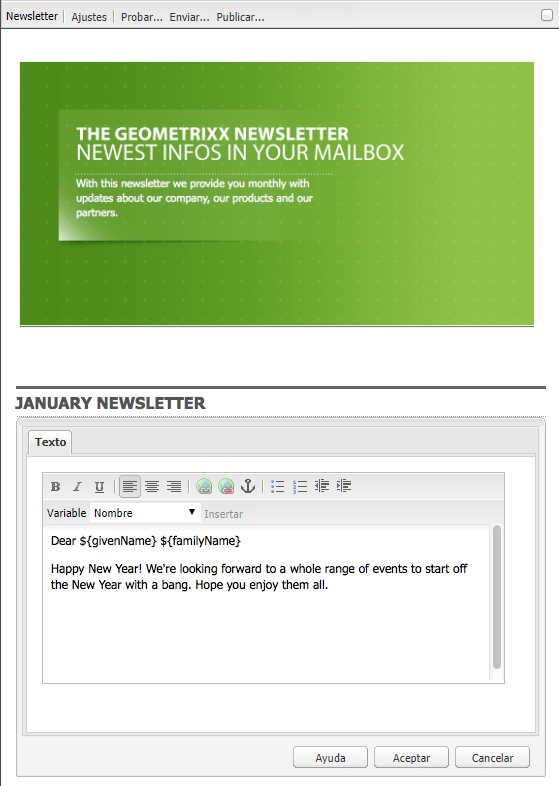

1. Para insertar variables, seleccione la variable en la lista y haga clic en **Insertar**. Las variables se rellenan desde el perfil.

## Personalización de boletines {#personalizing-newsletters}

Los boletines se personalizan insertando variables predefinidas en el componente Texto de los boletines en Geometrixx. Los valores de las variables se heredan de la información del perfil de usuario.

También puede simular el modo en que se personaliza una newsletter, utilizando ClientContext y cargando un perfil.

Para personalizar un boletín y simular su aspecto:

1. En MCM, abra la newsletter para la que desee personalizar la configuración.

1. Abra el componente Texto que desee personalizar.

1. Sitúe el cursor donde desee que aparezca la variable , seleccione una variable en la lista desplegable y haga clic en **Insertar**. Haga esto para tantas variables como sea necesario y haga clic en **OK**.

   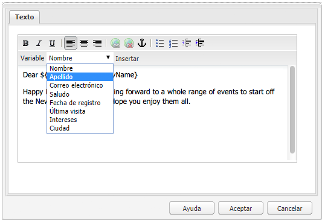

1. Para simular el aspecto que tendrá la variable cuando se envíe, presione CTRL+ALT+c para abrir ClientContext y seleccione **Cargar**. Seleccione el usuario de la lista cuyo perfil desee cargar y haga clic en **OK**.

   La información del perfil cargado ha rellenado las variables.

   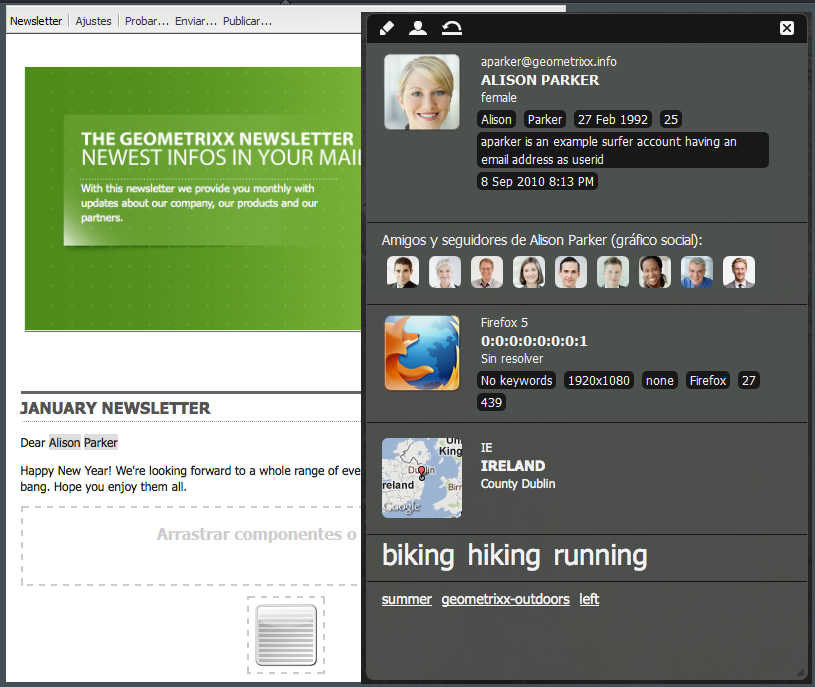

## Prueba de newsletters en diferentes clientes de correo electrónico {#testing-newsletters-in-different-e-mail-clients}

>[!NOTE]
>
>Antes de enviar newsletters, compruebe la configuración OSGi para Day CQ Link Externalizer en `http://localhost:4502/system/console/configMgr`.
>
>De forma predeterminada, el valor del parámetro es `localhost:4502` La operación y no se puede completar si se cambia el puerto para ejecutar la instancia.

Cambiar entre clientes de correo electrónico comunes para ver el aspecto que tendrá la newsletter para los posibles clientes. De forma predeterminada, la newsletter se abre sin seleccionar ninguno de los clientes de correo electrónico.

Actualmente, puede ver los boletines en los siguientes clientes de correo electrónico:

* Correo de Yahoo
* Gmail
* Hotmail
* Thunderbird
* Microsoft Outlook 2007
* Correo Apple

Para cambiar entre clientes, haga clic en el icono correspondiente para ver la newsletter en ese cliente de correo electrónico:

1. En MCM, abra la newsletter para la que desee personalizar la configuración.

1. Haga clic en un cliente de correo electrónico en la barra superior para ver el aspecto que tendrá el boletín en ese cliente.

   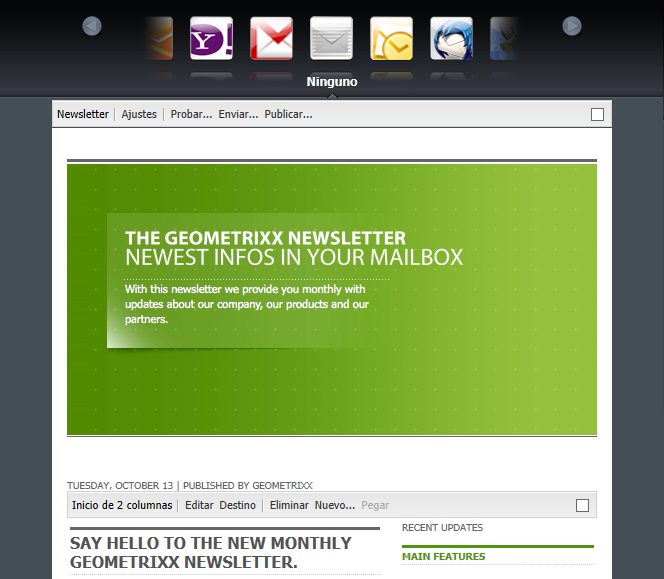

1. Repita este paso para cualquier cliente de correo electrónico adicional que desee ver.

   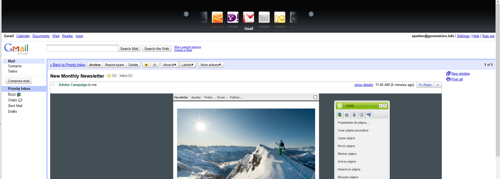

## Personalización de la configuración del boletín {#customizing-newsletter-settings}

Aunque solo los usuarios autorizados pueden enviar un boletín, debe personalizar lo siguiente:

* La línea de asunto, de modo que los usuarios deseen abrir el correo electrónico y también asegurarse de que la newsletter no termine marcada como correo no deseado.
* La dirección De, por ejemplo noreply@geometrixx.com, para que los usuarios reciban el correo electrónico de una dirección especificada.

Para personalizar la configuración de la newsletter:

1. En MCM, abra la newsletter para la que desee personalizar la configuración.

   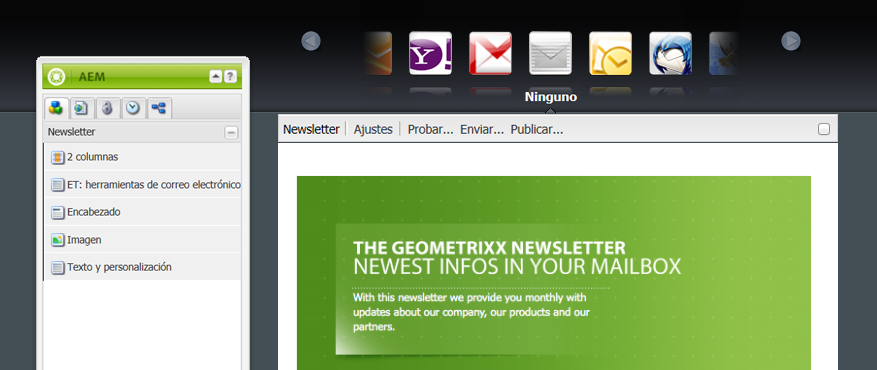

1. En la parte superior de la newsletter, haga clic en **Configuración**.

   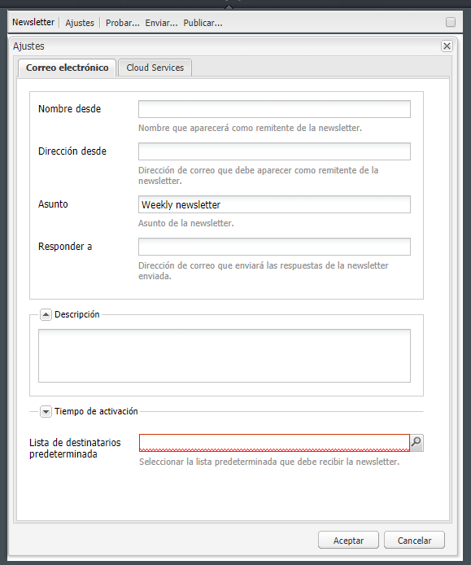

   1. Introduzca la variable **De** dirección de correo electrónico
   1. Modifique el **Asunto** del correo electrónico, si es necesario.
   1. Seleccione un **Lista de destinatarios predeterminada** en la lista desplegable.
   1. Haga clic en **Aceptar**.

   Al probar o enviar la newsletter, los destinatarios recibirán correos electrónicos con la dirección de correo electrónico y el asunto especificados.

## Comprobación de envío de boletines {#flight-testing-newsletters}

Aunque las pruebas de vuelo no son obligatorias, antes de enviar un boletín, es posible que desee probarlo para asegurarse de que aparece como desea.

Las pruebas de vuelo le permiten hacer lo siguiente:

* Consulte la newsletter en [todos los clientes a los que va destinado](#testing-newsletters-in-different-e-mail-clients).
* Valide que el servidor de correo esté correctamente configurado.
* Determine si el correo electrónico está siendo marcado como correo no deseado. (Asegúrese de incluirse a sí mismo en la lista de destinatarios).

>[!NOTE]
>
>Si actualiza los proveedores de correo electrónico, realice una prueba de vuelo o envíe un boletín, estas operaciones fallarán si el boletín no se publica primero en la instancia Publicar o si la instancia Publicar no está disponible. Asegúrese de publicar la newsletter y de que la instancia de publicación esté funcionando.

Para probar los boletines:

1. En MCM, abra la newsletter que desee probar y enviar.

1. En la parte superior de la newsletter, haga clic en **Prueba** para probarlo antes de enviarlo.

   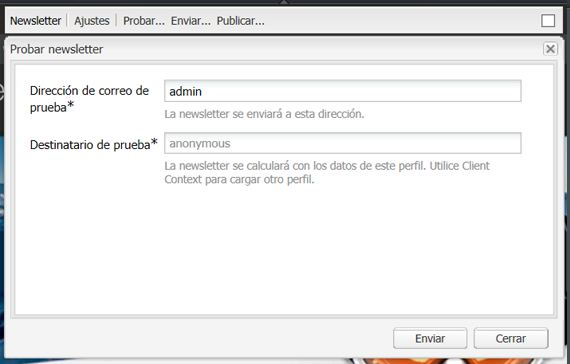

1. Introduzca la dirección de correo de prueba a la que desea enviar la newsletter y haga clic en **Enviar**. Si desea cambiar el perfil, cargue otro en ClientContext. Para ello, presione CTRL+ALT+c y seleccione Cargar y cargar un perfil.

## Envío de boletines {#sending-newsletters}

Puede enviar una newsletter desde la newsletter o desde la lista. Se describen ambos procedimientos.

>[!NOTE]
>
>Antes de enviar newsletters, compruebe la configuración OSGi para Day CQ Link Externalizer en `http://localhost:4502/system/console/configMgr`.
>
>De forma predeterminada, el valor del parámetro es `localhost:4502` La operación y no se puede completar si se cambia el puerto para ejecutar la instancia.

>[!NOTE]
>
>Si actualiza los proveedores de correo electrónico, realice una prueba de vuelo o envíe un boletín, estas operaciones fallarán si el boletín no se publica primero en la instancia Publicar o si la instancia Publicar no está disponible. Asegúrese de publicar la newsletter y de que la instancia de publicación esté funcionando.

### Envío de newsletters desde una campaña {#sending-newsletters-from-a-campaign}

Para enviar una newsletter desde la campaña:

1. En MCM, abra la newsletter que desee enviar.

   >[!NOTE]
   >
   >Antes de realizar el envío, asegúrese de haber personalizado el asunto del boletín y de haber originado una dirección de correo electrónico mediante [personalización de su configuración](#customizing-newsletter-settings).
   >
   >[Pruebas de vuelo](#flight-testing-newsletters) se recomienda utilizar la newsletter antes de enviarla.

1. En la parte superior de la newsletter, haga clic en **Enviar**. Se abre el asistente de Newsletter.

1. En la lista de destinatarios, seleccione la lista que desee que reciba la newsletter y haga clic en **Siguiente**.

   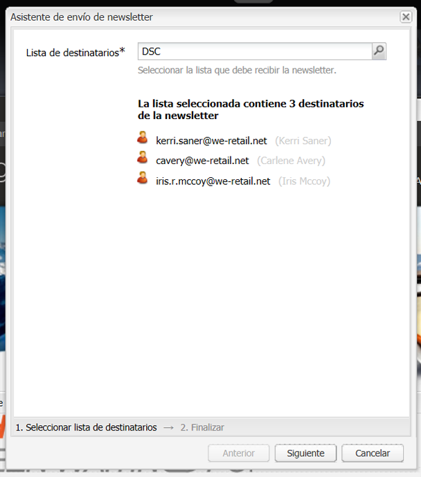

1. Se ha confirmado la finalización de la configuración. Haga clic en **Enviar** para enviar la newsletter.

   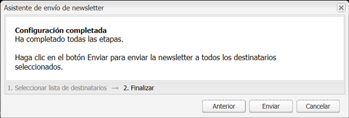

   >[!NOTE]
   >
   >Asegúrese de ser uno de los destinatarios para que pueda asegurarse de que se recibió la newsletter.

### Envío de newsletters desde una lista {#sending-newsletters-from-a-list}

Para enviar una newsletter desde una lista:

1. En MCM, haga clic en **Listas** en el panel izquierdo.

   >[!NOTE]
   >
   >Antes de realizar el envío, asegúrese de haber personalizado el asunto del boletín y de haber originado una dirección de correo electrónico mediante [personalización de su configuración](#customizing-newsletter-settings). No puede probar un boletín si lo envía desde la lista; puede [prueba de vuelo](#flight-testing-newsletters) si lo envía desde la newsletter.

1. Active la casilla situada junto a la lista de posibles clientes a los que desee enviar la newsletter.

1. En el **Herramientas** seleccione **Enviar boletín**. La variable **Enviar boletín** se abre.

   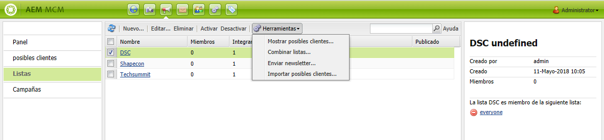

1. En el **Newsletter** , seleccione la newsletter que desee enviar y haga clic en **Siguiente**.

   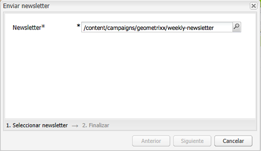

1. Se ha confirmado la finalización de la configuración. Haga clic en **Enviar** para enviar la newsletter seleccionada a la lista especificada de posibles clientes.

   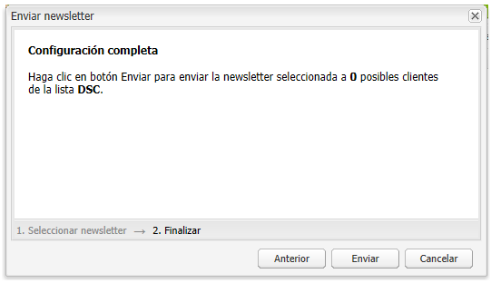

   El boletín se envía a los destinatarios seleccionados.

## Suscripción a un boletín {#subscribing-to-a-newsletter}

En esta sección se describe cómo suscribirse a un boletín informativo.

### Suscripción a una newsletter {#subscribing-to-a-newsletter-1}

Para suscribirse a un boletín (utilizando el sitio web de Geometrixx como ejemplo):

1. Haga clic en **Sitios web** y vaya a la Geometrixx **Barra de herramientas** y ábrala.

   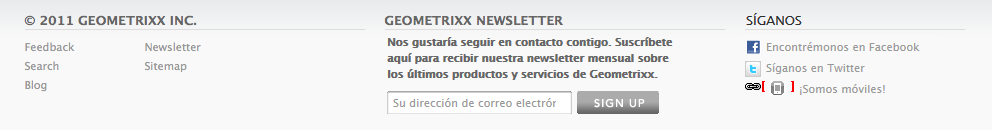

1. En el boletín de Geometrixx **Registrarse** , introduzca su dirección de correo electrónico y haga clic en **Registrarse**. Ahora está suscrito al boletín informativo.
