# Páginas de destino{#landing-pages}

>[!CAUTION]
>
>AEM 6.4 ha llegado al final de la compatibilidad ampliada y esta documentación ya no se actualiza. Para obtener más información, consulte nuestra [períodos de asistencia técnica](https://helpx.adobe.com/es/support/programs/eol-matrix.html). Buscar las versiones compatibles [here](https://experienceleague.adobe.com/docs/).

La función de páginas de aterrizaje permite importar rápida y fácilmente un diseño y contenido en una página AEM. Un desarrollador de Web puede preparar el HTML y los recursos adicionales que se pueden importar como página completa o solo parte de una página. La funcionalidad es útil para crear páginas de aterrizaje de marketing que solo están activas durante un tiempo limitado y que deben crearse rápidamente.

Esta página describe lo siguiente:

* el aspecto de las páginas de aterrizaje en AEM que incluyen componentes disponibles
* cómo crear una página de aterrizaje y cómo importar un paquete de diseño
* cómo trabajar con páginas de aterrizaje en AEM
* configuración de páginas de aterrizaje móviles

La preparación del paquete de diseño para su importación se explica en [Ampliación y configuración del importador de diseños](/help/sites-administering/extending-the-design-importer-for-landingpages.md). La integración con Adobe Analytics se explica en [Integración de páginas de aterrizaje con Adobe Analytics.](/help/sites-administering/integrating-landing-pages-with-adobe-analytics.md)

## ¿Qué son las páginas de aterrizaje? {#what-are-landing-pages}

Las páginas de aterrizaje son sitios de una o varias páginas que son el &quot;punto final&quot; de un contacto de marketing, por ejemplo, con correo electrónico, adwords/titulares, medios sociales. Una página de aterrizaje puede tener varios propósitos, pero todos tienen una cosa en común: el visitante debe realizar una tarea y eso define el éxito de una página de aterrizaje.

La función Páginas de aterrizaje de AEM permite a los especialistas en marketing trabajar con diseñadores web en agencias o equipos creativos internos para crear diseños de página que se puedan importar fácilmente a AEM y que los especialistas en marketing puedan editar y publicar con la misma administración que el resto de sitios AEM.

En AEM, cree páginas de aterrizaje siguiendo estos pasos:

1. Cree una página en AEM que contenga el lienzo de páginas de aterrizaje. AEM se envía con una muestra denominada **Página Importador**.

1. [Prepare el HTML y los recursos.](/help/sites-administering/extending-the-design-importer-for-landingpages.md)
1. Empaquete los recursos en un archivo ZIP denominado Paquete de diseño .
1. Importe el paquete de diseño en la página del importador.
1. Modifique y publique la página.

### Páginas de aterrizaje de escritorio {#desktop-landing-pages}

Una página de aterrizaje de ejemplo en AEM tiene el siguiente aspecto:

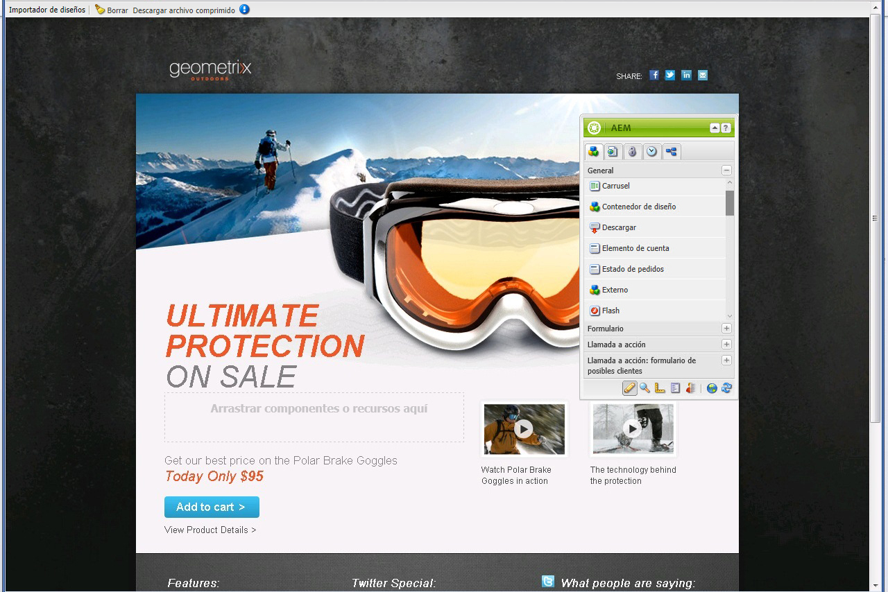

### Páginas de aterrizaje móviles {#mobile-landing-pages}

Una página de aterrizaje también puede tener una versión móvil de la página. Para tener una versión móvil independiente de la página de aterrizaje, el diseño de importación debe tener dos archivos html: *index.htm(l)* y *mobile.index.htm(l)*.

El procedimiento de importación de la página de aterrizaje es el mismo que el de una página de aterrizaje normal, el diseño de la página de aterrizaje tiene un archivo html adicional que corresponde a la página de aterrizaje móvil. Este archivo html también debe tener un lienzo `div` con `id=cqcanvas` al igual que el HTML de la página de aterrizaje de escritorio y admite todos los componentes editables descritos para la página de aterrizaje de escritorio.

La página de aterrizaje móvil se crea como una página secundaria de la página de aterrizaje de escritorio. Para abrirla, vaya a la página de aterrizaje en Sitios web y abra la página secundaria.

>[!NOTE]
>
>La página de aterrizaje móvil se elimina o desactiva junto con la página de aterrizaje de escritorio si esta se elimina o desactiva.

## Componentes de la página de aterrizaje {#landing-page-components}

Para hacer que partes del HTML que se importa sean editables dentro de AEM, puede asignar contenido dentro del HTML Páginas de aterrizaje a AEM componentes directamente. El importador de diseños comprende los siguientes componentes de forma predeterminada:

* Texto, para cualquier texto
* Título, para contenido en etiquetas H1-6
* Imagen, para imágenes que deberían ser intercambiables
* Llamada a acciones:

   * Vínculo de pulsaciones
   * Vínculo gráfico

* Llamada a acción: formulario de posibles clientes para capturar información del usuario
* Sistema de párrafos (Parsys), para permitir que se añada cualquier componente o que se convierta el componente anterior

Además, es posible ampliarlo y admitir componentes personalizados. En esta sección se describen los componentes en detalle.

### Texto {#text}

El componente Texto permite introducir un bloque de texto utilizando un editor WYSIWYG. Consulte [Componente de texto](/help/sites-authoring/default-components.md#text) para obtener más información.

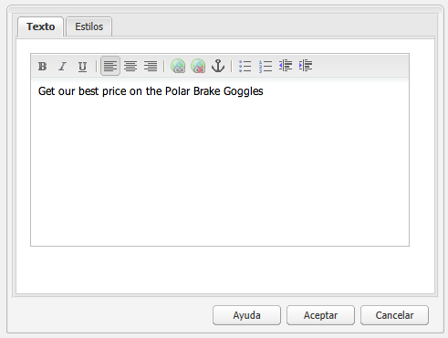

A continuación se muestra un ejemplo de un componente de texto en una página de aterrizaje:

### Título {#title}

El componente Título permite mostrar un título y configurar su tamaño (h1-6). Consulte [Componente de título](/help/sites-authoring/default-components.md#title) para obtener más información.

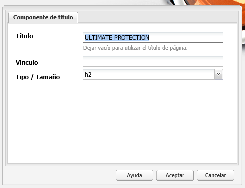

A continuación se muestra un ejemplo de un componente de título en una página de aterrizaje:

### Imagen {#image}

El componente de imagen muestra una imagen que puede arrastrar y soltar desde el Buscador de contenido o hacer clic para cargar. Consulte [componente de imagen](/help/sites-authoring/default-components.md) para obtener más información.

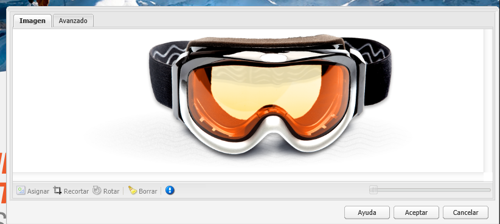

A continuación se muestra un ejemplo de un componente de imagen en una página de aterrizaje:

### Llamada a acción (CTA) {#call-to-action-cta}

Un diseño de página de aterrizaje puede tener varios vínculos; algunos de estos vínculos pueden considerarse &quot;Llamadas a acción&quot;.

La llamada a la acción se utiliza para que el visitante realice una acción inmediata en la página de aterrizaje, como &quot;Suscribirse ahora&quot;, &quot;Ver este vídeo&quot;, &quot;Solo tiempo limitado&quot;, etc.

* Vínculo de pulsaciones : le permite agregar un vínculo de texto que, cuando se hace clic, lleva al visitante a una dirección URL de destino.
* Vínculo gráfico: permite agregar una imagen que, al hacer clic, lleve al visitante a una dirección URL de destino.

Ambos componentes de llamada a acción tienen opciones similares. El vínculo de pulsaciones tiene opciones de texto enriquecido adicionales. Los componentes se describen en detalle en los párrafos siguientes.

### Vínculo de pulsaciones {#click-through-link}

Este componente de llamada a acción se puede utilizar para añadir un vínculo de texto en la página de aterrizaje. Se puede hacer clic en ese vínculo para llevar al usuario a la dirección URL de destino especificada en las propiedades del componente. Forma parte del grupo &quot;Llamada a acción&quot;.

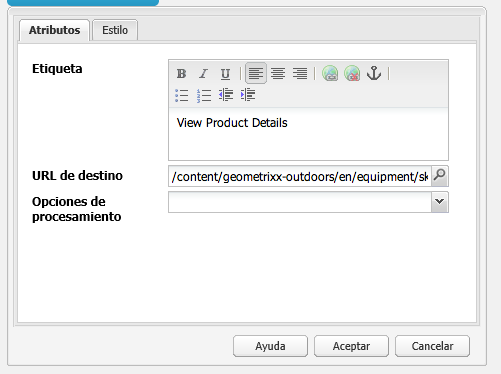

**Etiqueta** Texto que ven los usuarios. Puede modificar el formato con el editor de texto enriquecido.

**Dirección URL de destino** Introduzca el URI que desea que visiten los usuarios si hacen clic en el texto.

**Opciones de renderización** Describe las opciones de renderización. Puede seleccionar una de las siguientes opciones:

* Cargar página en una nueva ventana del navegador
* Cargar página en la ventana actual
* Cargar página en el marco principal
* Cancelar todos los marcos y cargar la página en la ventana completa del explorador

**CSS** En la ficha Estilo , introduzca una ruta a la hoja de estilos CSS.

**ID** En la pestaña Estilo , introduzca un ID para el componente para identificarlo de forma única.

El siguiente es un ejemplo de vínculo de pulsación:

### Vínculo gráfico {#graphical-link}

Este componente de llamada a acción se puede utilizar para añadir cualquier imagen gráfica con vínculo en la página de aterrizaje. La imagen puede ser un botón simple o cualquier imagen gráfica como fondo. Cuando se hace clic en la imagen, se lleva al usuario a la dirección URL de destino especificada en las propiedades del componente. Forma parte del **Llamada a acción** grupo.

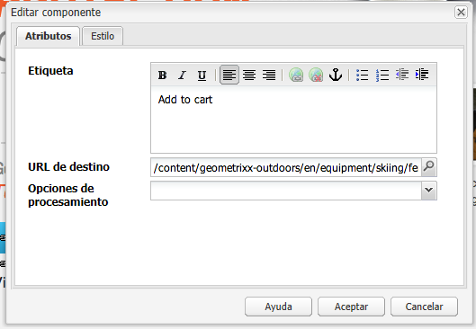

**Etiqueta** Texto que los usuarios ven en el gráfico. Puede modificar el formato con el editor de texto enriquecido.

**Dirección URL de destino** Introduzca el URI que desea que visiten los usuarios si hacen clic en la imagen.

**Opciones de renderización** Describe las opciones de renderización. Puede seleccionar una de las siguientes opciones:

* Cargar página en una nueva ventana del navegador
* Cargar página en la ventana actual
* Cargar página en el marco principal
* Cancelar todos los marcos y cargar la página en la ventana completa del explorador

**CSS** En la ficha Estilo , introduzca una ruta a la hoja de estilos CSS.

**ID** En la pestaña Estilo , introduzca un ID para el componente para identificarlo de forma única.

El siguiente es un ejemplo de vínculo gráfico:

## Llamada a acción: formulario de posibles clientes {#call-to-action-cta-lead-form}

Un formulario de posibles clientes es un formulario que se utiliza para recopilar información de perfil de un visitante o posible cliente. Esta información se puede almacenar y utilizar más adelante para realizar un marketing eficaz basado en la información. Esta información generalmente incluye título, nombre, correo electrónico, fecha de nacimiento, dirección, interés, etc. Forma parte del **Llamada a acción: formulario de posibles clientes** grupo.

Un ejemplo de formulario de posibles clientes de llamada a acción tiene este aspecto:

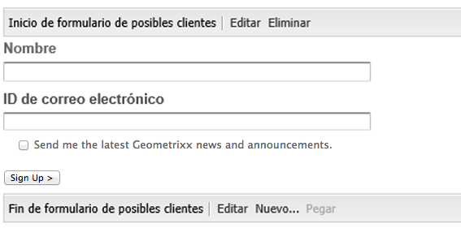

Los formularios de posibles clientes de llamada a acción se crean a partir de varios componentes diferentes:

* **Formulario de posibles clientes**
El componente Formulario de posibles clientes define el principio y el final de un nuevo formulario de posibles clientes en una página. A continuación, se pueden colocar otros componentes entre estos elementos, como ID de correo electrónico, Nombre, etc.

* **Campos y elementos de formulario**
Los campos y elementos de formulario pueden incluir cuadros de texto, botones de opción, imágenes, etc. El usuario suele completar una acción en un campo de formulario, como escribir texto. Consulte los elementos de formulario individuales para obtener más información.

* **Componentes de perfil**
Los componentes Perfil están relacionados con perfiles utilizados para colaboración social y otras áreas en las que es necesaria la personalización de visitantes.

El ejemplo anterior es un formulario; se compone de la variable **Formulario de posibles clientes** componente (inicio y fin), con **Nombre** y **ID de correo electrónico** campos utilizados para la entrada y un **Submit** field

Desde la barra de tareas, están disponibles los siguientes componentes para Llamada a acción: Formulario de posibles clientes:

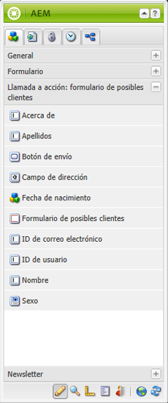

### Configuración común a muchos componentes del formulario de posibles clientes {#settings-common-to-many-lead-form-components}

Aunque cada uno de los componentes del formulario de posibles clientes tiene un propósito diferente, muchos están compuestos por opciones y parámetros similares.

Al configurar cualquiera de los componentes de formulario, las fichas siguientes están disponibles en el cuadro de diálogo:

* **Título y texto**
Aquí debe especificar la información básica, como el título del componente y el texto que lo acompañe, si lo hay. Si corresponde, también le permite definir otra información clave, como si el campo es multiseleccionable y si los elementos se pueden seleccionar.

* **Valores iniciales**
Permite especificar un valor predeterminado.

* **Restricciones**
Aquí puede especificar si un campo es obligatorio y definir qué restricciones existen en dicho campo (por ejemplo, debe ser numérico, etc.).

* **Estilo**
Indica el tamaño y el estilo de los campos.

>[!NOTE]
>
>Los campos que se ven dependen del componente individual.
>
>No todas las opciones están disponibles para todos los componentes del formulario de posibles clientes. Consulte Forms para obtener más información sobre estas [configuración común](/help/sites-authoring/default-components.md#formsgroup).

#### Componentes del formulario de posibles clientes {#lead-form-components}

En la siguiente sección se describen los componentes disponibles para los formularios de posibles clientes de Call-to-Action.

**Acerca de** Permite a los usuarios agregar información Acerca de .

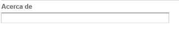

**Campo de dirección** Permite a los usuarios introducir la información de dirección. Al configurar este componente, debe introducir el Nombre del elemento en el cuadro de diálogo. El Nombre del elemento es el nombre del elemento de formulario. Esto indica en qué parte del repositorio se almacenan los datos.

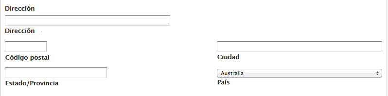

**Fecha de nacimiento** Los usuarios pueden introducir la información de fecha de nacimiento.

**ID de correo electrónico** Permite a los usuarios introducir una dirección de correo electrónico (identificación).

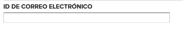

**Nombre** Proporciona un campo para que los usuarios introduzcan su nombre.

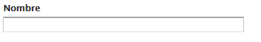

**Sexo** Los usuarios pueden seleccionar su sexo en una lista desplegable.

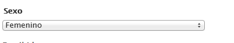

**Apellidos** Los usuarios pueden introducir la información de Apellidos.

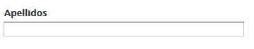

**Formulario de posibles clientes** Añada este componente para añadir un formulario de posibles clientes a la página de aterrizaje. Un formulario de posibles clientes contiene automáticamente los campos Inicio del formulario de posibles clientes y Fin del formulario de posibles clientes . En el medio, agregue los componentes Formulario de posibles clientes que se describen en esta sección.

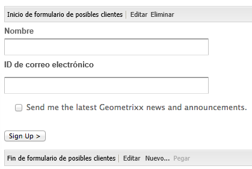

El componente Formulario de posibles clientes define el inicio y el final de un formulario mediante la variable **Inicio del formulario** y **Final del formulario** elementos. Estos siempre están emparejados para garantizar que el formulario esté definido correctamente.

Después de agregar el formulario de posibles clientes, puede configurar el inicio o el final del formulario haciendo clic en **Editar** en la barra correspondiente.

**Inicio de formulario de posibles clientes**

Hay dos pestañas disponibles para la configuración **Formulario** y **Avanzadas**:

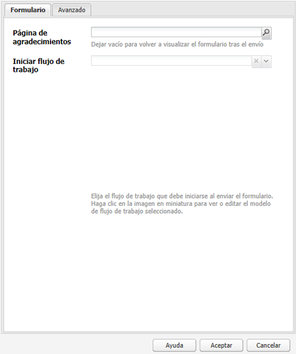

**Página de agradecimiento** Página a la que se hace referencia para agradecer a los visitantes que hayan proporcionado información. Si se deja en blanco, el formulario se vuelve a mostrar tras el envío.

**Iniciar flujo de trabajo** Determina qué flujo de trabajo se activa una vez que se envía un formulario de posibles clientes.

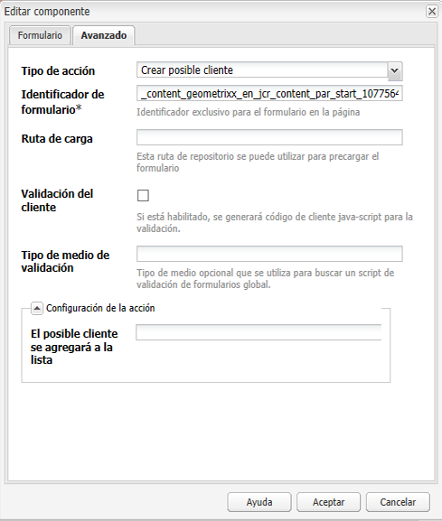

**Opciones de publicación** Las siguientes opciones de publicación están disponibles:

* Crear posible cliente
* Servicio de correo electrónico: Crear suscriptor y añadirlo a la lista : se utiliza con un proveedor de servicios de correo electrónico como ExactTarget.
* Servicio de correo electrónico: Enviar correo electrónico de respuesta automática : se utiliza con un proveedor de servicios de correo electrónico como ExactTarget.
* Servicio de correo electrónico: Dar de baja a un usuario de la lista : se utiliza con un proveedor de servicios de correo electrónico como ExactTarget.
* Cancelar la suscripción del usuario

**Identificador de formulario** El identificador del formulario identifica de forma exclusiva el formulario de posibles clientes. Utilice el identificador del formulario si tiene varios formularios en una sola página; asegúrese de que tienen identificadores diferentes.

**Ruta de carga** Es la ruta a las propiedades de nodo que se utiliza para cargar valores predefinidos en los campos del formulario de posibles clientes.

Se trata de un campo opcional que especifica la ruta a un nodo en el repositorio. Cuando este nodo tiene propiedades que coinciden con los nombres de campo, los campos correspondientes del formulario se cargan previamente con el valor de esas propiedades. Si no existe coincidencia, el campo contiene el valor predeterminado.

**Validación del cliente** Indica si el formulario requiere validación de cliente (siempre se produce la validación de servidor). Esto se puede lograr junto con el componente Captcha de Forms.

**Tipo de recurso de validación** Define el tipo de recurso de validación del formulario si desea validar todo el formulario de posibles clientes (en lugar de campos individuales).

Si va a validar el formulario completo, incluya también una de las siguientes opciones:

* Una secuencia de comandos para la validación del cliente:

   ` /apps/<myApp>/form/<myValidation>/formclientvalidation.jsp`

* Secuencia de comandos para validación en el servidor:

   ` /apps/<myApp>/form/<myValidation>/formservervalidation.jsp`

**Configuración de la acción** Según la selección de Opciones de publicación, cambia la Configuración de acción. Por ejemplo, cuando selecciona Crear posible cliente, puede configurar a qué lista se agrega el posible cliente.

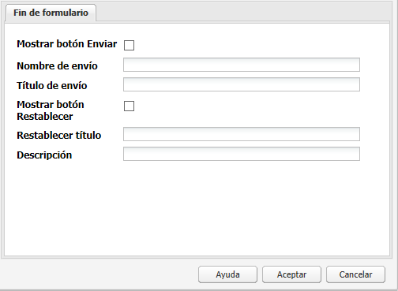

* **Mostrar botón Enviar**
Indica si se debe mostrar o no un botón Enviar.

* **Nombre de envío**
Un identificador si utiliza varios botones de envío en un formulario.

* **Enviar título**
El nombre que aparece en el botón, como Enviar o Enviar.

* **Mostrar botón Restablecer**
Active la casilla de verificación para que el botón Restablecer esté visible.

* **Restablecer título**
Nombre que aparece en el botón Restablecer.

* **Descripción**
Información que aparece debajo del botón.

## Creación de una página de aterrizaje {#creating-a-landing-page}

Al crear una página de aterrizaje, debe realizar tres pasos:

1. Cree una página de importador.
1. [Prepare el HTML para la importación.](/help/sites-administering/extending-the-design-importer-for-landingpages.md)
1. Importe el paquete de diseño.

### Creación de una página de importador {#creating-an-importer-page}

Para poder importar el diseño de la página de aterrizaje, debe crear una página de importador, por ejemplo, en una campaña. La plantilla Página importadora permite importar la página de aterrizaje completa del HTML. La página contiene un cuadro desplegable en el que el paquete de diseño de la página de aterrizaje se puede importar arrastrando y soltando.

>[!NOTE]
>
>De forma predeterminada, una página del importador solo se puede crear en campañas, pero también puede superponer esta plantilla para crear una página de aterrizaje en `/content/mysite.`

Para crear una nueva página de aterrizaje:

1. Vaya a la **Sitios web** consola.
1. Seleccione la campaña en el panel izquierdo.
1. Haga clic en **Nuevo** para abrir la ventana** Crear página **.
1. Seleccione el **Página Importador** plantilla y añada un título y, opcionalmente, un nombre, y haga clic en **Crear**.

   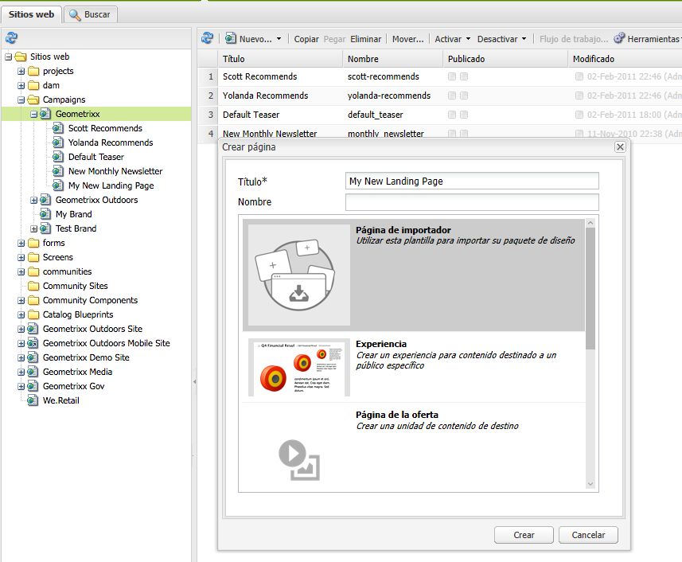

   Se muestra la nueva página del importador.

### Preparación del HTML para la importación {#preparing-the-html-for-import}

Antes de importar el paquete de diseño, es necesario preparar el HTML. Consulte [Ampliación y configuración de la importación de diseños](/help/sites-administering/extending-the-design-importer-for-landingpages.md) para obtener más información.

### Importación del paquete de diseño {#importing-the-design-package}

Una vez creada la página del importador, puede importar un paquete de diseño en ella. Los detalles sobre la creación del paquete de diseño y su estructura recomendada se explican en [Ampliación y configuración de la importación de diseños](/help/sites-administering/extending-the-design-importer-for-landingpages.md).

Si el paquete de diseño está listo, en los siguientes pasos se describe cómo importar el paquete de diseño en una página del importador.

1. Abra la página del importador que desee [creado anteriormente](#creatingablankcanvaspage). Verá un cuadro desplegable con el texto que dice **Zip**.

   

1. Arrastre y suelte el paquete de diseño en el cuadro desplegable. Observe que la flecha cambia de dirección cuando se arrastra un paquete sobre ella.
1. Como resultado de la función de arrastrar y soltar, verá la página de aterrizaje en lugar de la página del importador. La página de aterrizaje del HTML se ha importado correctamente.

   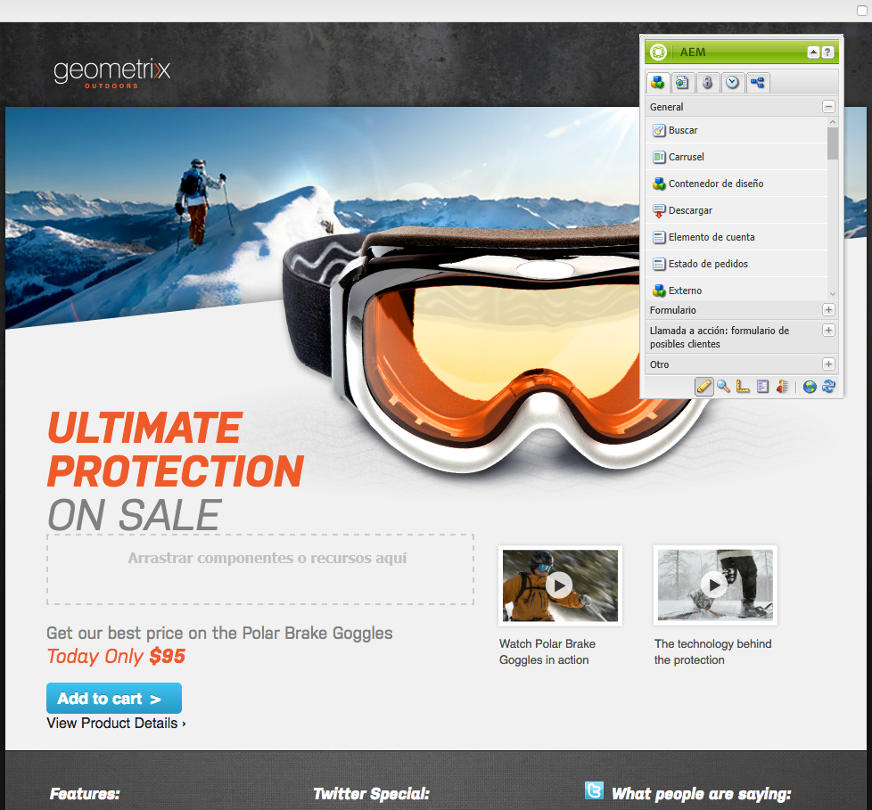

>[!NOTE]
>
>Si tiene problemas para importar el paquete de diseño, consulte [Resolución de problemas](/help/sites-administering/extending-the-design-importer-for-landingpages.md#troubleshooting).

## Uso de páginas de aterrizaje {#working-with-landing-pages}

Normalmente, un diseñador crea el diseño y los recursos de una página de aterrizaje posiblemente en una agencia con herramientas como Adobe Photoshop o Adobe Dreamweaver. Cuando se completa el diseño, el diseñador envía un archivo zip con todos los recursos al marketing. A continuación, el contacto de marketing es responsable de colocar el archivo zip en AEM y publicar el contenido.

Además, es posible que el diseñador tenga que realizar modificaciones en la página de aterrizaje después de importarla editando o eliminando contenido y configurando los componentes de llamada a acción. Por último, el comerciante querrá obtener una vista previa de la página de aterrizaje y, a continuación, activar la campaña para garantizar que se publique la página de aterrizaje.

En esta sección se describe cómo hacer lo siguiente:

* Eliminar una página de aterrizaje
* Descargar el paquete de diseño
* Ver información de importación
* Restablecer una página de aterrizaje
* [Configurar los componentes de llamada a acción y añadir contenido a la página](#call-to-action-cta)
* Vista previa de la página de aterrizaje
* Activar/publicar una página de aterrizaje

Al importar el paquete de diseño, la siguiente barra de herramientas está disponible en la parte superior de la página de aterrizaje:

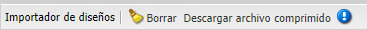

### Descarga del paquete de diseño importado {#downloading-the-imported-design-package}

La descarga del archivo zip le permite registrar qué archivo comprimido se importó con una página de aterrizaje concreta. Tenga en cuenta que los cambios realizados en una página no se agregan al zip.

Para descargar el paquete de diseño importado, haga clic en **Descargar archivo comprimido** en la barra de herramientas de la página de aterrizaje.

### Visualización de la información de importación {#viewing-import-information}

En cualquier momento, puede ver información sobre la última importación haciendo clic en el signo de exclamación azul en la parte superior de la página de aterrizaje en la interfaz de usuario clásica.

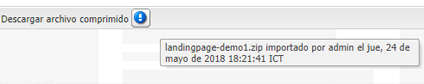

Si el paquete de diseño importado tiene algunos problemas, por ejemplo, si hace referencia a imágenes/scripts que no existen en el paquete, etc., el importador de diseños muestra estos problemas en forma de lista. Para ver la lista de problemas, en la interfaz de usuario clásica, haga clic en el vínculo de problemas de la barra de herramientas de la página de aterrizaje. En la siguiente imagen, haga clic en **Problemas** abre la ventana Problemas de importación.

### Restablecimiento de una página de aterrizaje {#resetting-a-landing-page}

Si desea volver a importar el paquete de diseño de la página de aterrizaje después de realizar algunos cambios, puede &quot;borrar&quot; la página de aterrizaje haciendo clic en **Borrar** en la parte superior de la página de aterrizaje en la interfaz de usuario clásica o haga clic en Borrar en el menú de configuración de la interfaz de usuario táctil. Al hacerlo, se elimina la página de aterrizaje importada y se crea una página de importador en blanco.

Al borrar la página de aterrizaje, puede eliminar los cambios de contenido. Si hace clic en **No**, los cambios de contenido se conservan, es decir, la estructura de `jcr:content/importer`se conserva y solo el componente de página del importador y los recursos de `etc/design` se eliminan. Mientras que, si hace clic en **Sí**, el `jcr:content/importer` también se elimina.

>[!NOTE]
>
>Si decide eliminar los cambios de contenido, al hacer clic en , se perderán todos los cambios realizados en la página de aterrizaje importada, así como todas las propiedades de página **Borrar**.

### Modificación y adición de componentes en una página de aterrizaje {#modifying-and-adding-components-on-a-landing-page}

Para modificar componentes en la página de aterrizaje, haga doble clic en ellos para abrirlos y editarlos como lo haría con cualquier otro componente.

Para añadir componentes en la página de aterrizaje, arrastre y suelte componentes en la página de aterrizaje, ya sea desde la barra de tareas de la interfaz de usuario clásica o desde el panel Componentes de la interfaz de usuario táctil, y edítelos según corresponda.

>[!NOTE]
>
>Si un componente de la página de aterrizaje no se puede editar, debe volver a importar el archivo zip después de [modificar el archivo HTML.](/help/sites-administering/extending-the-design-importer-for-landingpages.md) Significa que durante la importación, las partes no editables no se convirtieron en componentes AEM.

### Eliminación de una página de aterrizaje {#deleting-a-landing-page}

Eliminar una página de aterrizaje es como eliminar una página de AEM normal.

La única excepción es que, al eliminar una página de aterrizaje de escritorio, también elimina la página de aterrizaje móvil correspondiente (si está presente), pero no al revés.

### Publicación de una página de aterrizaje {#publishing-a-landing-page}

Puede publicar la página de aterrizaje y todas sus dependencias como si se tratara de una página normal.

>[!NOTE]
>
>Al publicar la página de aterrizaje de escritorio, también se publica su versión móvil correspondiente (si existe). Sin embargo, la publicación de una página de aterrizaje móvil no publica la versión de escritorio.
