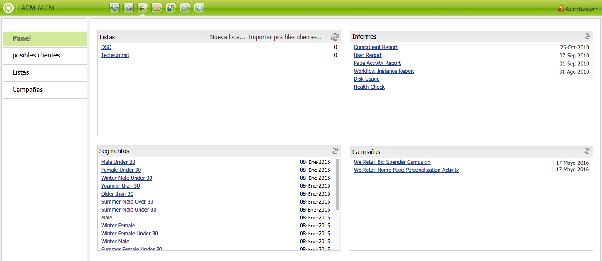
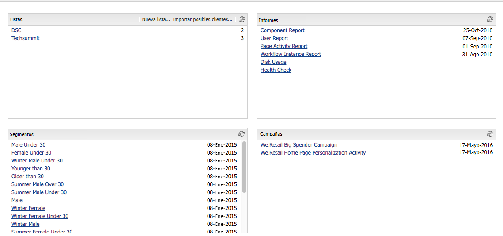
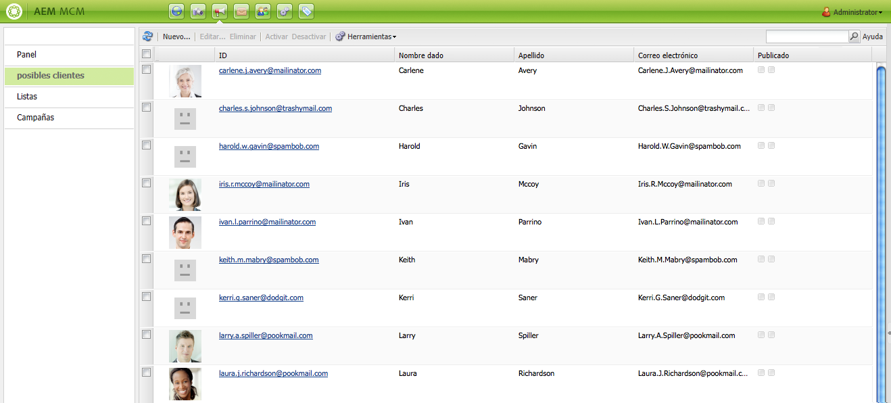
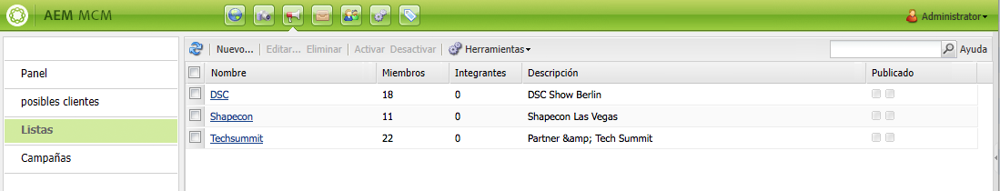
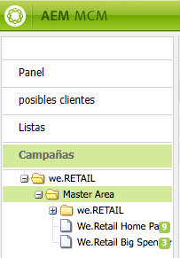
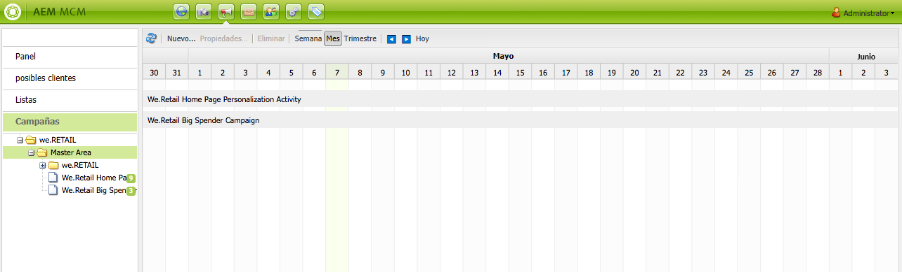
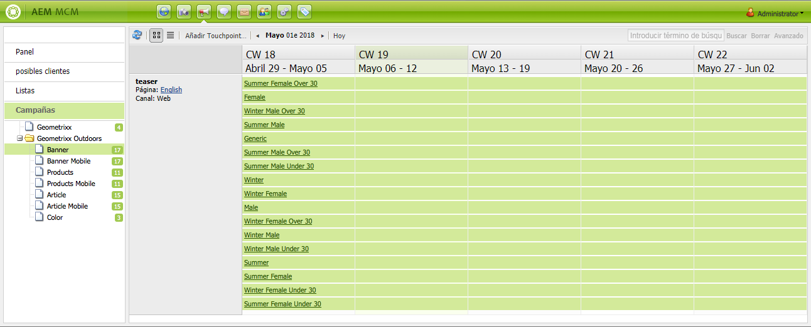
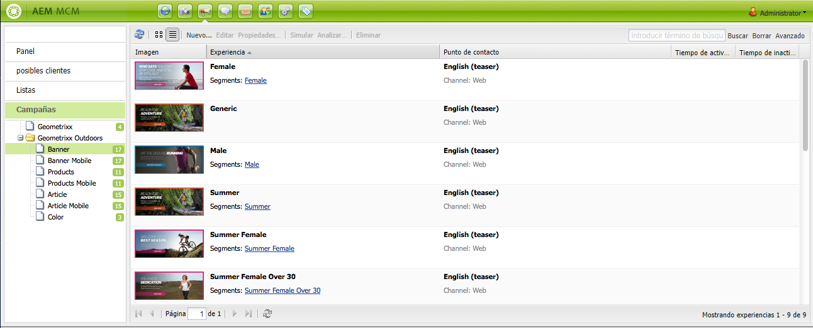
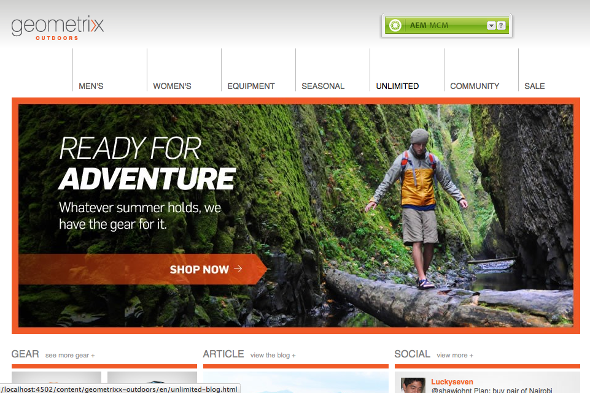
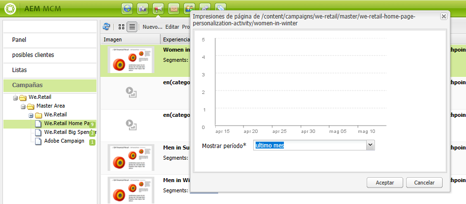

# Uso del administrador de campañas de marketing{#working-with-the-marketing-campaign-manager}

>[!CAUTION]
>
>AEM 6.4 ha llegado al final de la compatibilidad ampliada y esta documentación ya no se actualiza. Para obtener más información, consulte nuestra [períodos de asistencia técnica](https://helpx.adobe.com/es/support/programs/eol-matrix.html). Buscar las versiones compatibles [here](https://experienceleague.adobe.com/docs/).

En AEM, Marketing Campaign Manager (MCM) es una consola que le ayuda a administrar campañas multicanal. Con este software de automatización de marketing puede administrar todas sus marcas, campañas y experiencias, así como los segmentos, listas, posibles clientes e informes relacionados.

Se puede acceder a MCM desde varias ubicaciones de AEM; por ejemplo, la pantalla de bienvenida, el icono Campañas o la dirección URL:

`https://<hostname>:<port>/libs/mcm/content/admin.html`

Por ejemplo:

`http://localhost:4502/libs/mcm/content/admin.html`

Desde MCM puede acceder a:

* **[Panel](#dashboard)**
Se divide en cuatro paneles:

   * [Listas](#lists)

      Este panel muestra las listas que ya ha creado, junto con el número de posibles clientes de esa lista. Desde este panel puede crear una nueva lista directamente o importar posibles clientes para crear una nueva lista.

      Si selecciona una lista específica, pasará al [Listas](#lists) que muestra los detalles de la lista.

   * [Segmentos](/help/sites-classic-ui-authoring/classic-personalization-campaigns.md#anoverviewofsegmentation)

      Este panel muestra los segmentos que ha definido. Los segmentos le permiten caracterizar una colección de visitantes que comparten ciertas características.

      Si se selecciona un segmento específico, se abrirá la página de definición del segmento.

   * [Informes](/help/sites-administering/reporting.md)\
      AEM proporciona diferentes informes para ayudarle a analizar y supervisar el estado de su instancia. Este panel de MCM enumera los informes.

      Si se selecciona un informe, se abrirá la página del informe.

   * [Campañas](#campaigns)

      Este panel enumera experiencias de campaña como [newsletters](/help/sites-classic-ui-authoring/classic-personalization-campaigns.md#newsletters) y [teasers](/help/sites-classic-ui-authoring/classic-personalization-campaigns.md#teasers).

* **[posibles clientes](#leads)**

   Aquí puede administrar sus posibles clientes. Puede crear o importar posibles clientes, editar detalles específicos de posibles clientes o eliminarlos cuando ya no los necesite. También puede colocar posibles clientes en diferentes grupos, llamados Listas. **Nota:** El Adobe no tiene previsto seguir mejorando esta capacidad.

   La recomendación es [aproveche Adobe Campaign y la integración para AEM](/help/sites-administering/campaign.md).

* **[Listas](#lists)**

   Aquí puede administrar sus listas (de posibles clientes).**Nota:** El Adobe no tiene previsto seguir mejorando esta capacidad.

   La recomendación es [aproveche Adobe Campaign y la integración para AEM](/help/sites-administering/campaign.md).

* **[Campañas](#campaigns)**
Aquí puede administrar sus marcas, campañas y experiencias.

## Tablero {#dashboard}

El tablero muestra cuatro paneles en los que se proporciona información general sobre las listas (de posibles clientes), los segmentos, los informes y las campañas. El acceso a las funciones básicas de estas también está disponible aquí.

## posibles clientes {#leads}

>[!NOTE]
>
>Adobe no tiene previsto mejorar aún más esta capacidad (Administración de posibles clientes).\
>La recomendación es aprovechar [Adobe Campaign y la integración a AEM](/help/sites-administering/campaign.md).

En AEM MCM, puede organizar y añadir posibles clientes introduciéndolos manualmente o importando una lista separada por comas; por ejemplo, una lista de correo. Las formas adicionales de generar posibles clientes consisten en los registros a boletines informativos o comunidades (si se configuran, pueden generar un déclencheur de un flujo de trabajo que rellene los posibles clientes). Los posibles clientes se suelen categorizar y situar en una lista para que más adelante pueda realizar acciones en toda la lista; por ejemplo, enviar un correo electrónico personalizado a una lista determinada.

En **Posibles clientes** en el panel izquierdo puede crear, importar, editar y eliminar posibles clientes y activarlos o desactivarlos según sea necesario. Puede agregar un posible cliente a una lista o ver a qué listas pertenece.

>[!NOTE]
>
>Consulte [Uso de posibles clientes](/help/sites-classic-ui-authoring/classic-personalization-campaigns.md#workingwithleads) para obtener información detallada sobre tareas específicas.

## Listas {#lists}

>[!NOTE]
>
>Adobe no tiene previsto mejorar aún más esta capacidad (Gestión de listas).\
>La recomendación es aprovechar [Adobe Campaign y la integración a AEM](/help/sites-administering/campaign.md).

Las listas permiten organizar los posibles clientes en grupos. Con las listas, puede dirigir sus campañas de marketing a un grupo determinado de personas; por ejemplo, puede enviar una newsletter de destino a una lista.

En **Listas**, puede administrar las listas mediante la creación, importación, edición, combinación y eliminación de listas que puede activar o desactivar según sea necesario. También puede ver los posibles clientes de esa lista, ver si la lista es miembro de otra lista o ver la descripción.

>[!NOTE]
>
>Consulte [Uso de listas](/help/sites-classic-ui-authoring/classic-personalization-campaigns.md#workingwithlists) para obtener información detallada sobre tareas específicas.

### Campañas {#campaigns}

>[!NOTE]
>
>Consulte [Teasers y estrategias](/help/sites-classic-ui-authoring/classic-personalization-campaigns.md#workingwithlists), [Configuración de la campaña](/help/sites-classic-ui-authoring/classic-personalization-campaigns.md#settingupyourcampaign) y [Newsletters](/help/sites-classic-ui-authoring/classic-personalization-campaigns.md#newsletters) para obtener información detallada sobre tareas específicas.

Para acceder a las campañas existentes, en MCM, haga clic en **Campañas**.

* **En el panel izquierdo**:

   Hay una lista de todas las marcas y campañas.

   Un solo clic en una marca:

   * amplíe la lista para mostrar todas las campañas relacionadas en el panel izquierdo; esta lista también muestra el número de experiencias que existen para cada campaña.
   * abra la información general de marca en el panel derecho.

* **En el panel derecho**:

   Se muestran iconos para cada marca (no se mostrarán las campañas históricas).

   Puede hacer doble clic en estos iconos para abrir la descripción general de la marca.

#### Información general de marca {#brand-overview}

Desde aquí puede:

* Ver el número de campañas y experiencias (el número se muestra en el panel izquierdo) que existen para esta marca.
* Cree un **Nuevo...** campaña para esta marca.

* Cambiar el periodo de tiempo visualizado; select **Semana**, **Mes** o **Trimestre**, utilice las flechas para seleccionar períodos específicos o volver a **Hoy**.

* Seleccione una campaña (en el panel derecho) para:

   * Edite el **Propiedades...**
   * **Eliminar** la campaña.

* Abra la información general de la campaña (haga doble clic en una campaña en el panel derecho o haga clic en el panel izquierdo).

#### Información general de campaña {#campaign-overview}

Hay dos vistas disponibles para cada campaña:

1. **Vista de calendario**

   Utilice el icono :

   

   Se presenta una lista de todos los touchpoints (grises) con un intervalo de tiempo horizontal de las experiencias (verdes) conectadas con ese touchpoint:

   

   Desde aquí puede:

   * Cambiar el periodo de tiempo visualizado mediante las flechas o volver a **Hoy**.
   * Uso **Agregar Touchpoint...** para agregar un touchpoint nuevo a una experiencia existente.
   * Haga clic en un teaser (en el panel derecho) para establecer la variable **Tiempo de activación** y **Tiempo de inactividad**.

1. **Vista de lista**

   Utilice el icono :

   

   Se mostrarán todas las experiencias (p. ej. teasers y newsletters) para la campaña seleccionada:

   

   Desde aquí puede:

   * Cree un **Nuevo...** experiencia; por ejemplo, ofertas, teasers y newsletters de Adobe Target.
   * **Editar** los detalles de una página de teaser o newsletter específica (también se puede hacer doble clic).
   * Defina el **Propiedades...** para una página de teaser o newsletter específica.
   * **Simular** aspecto de una experiencia (página de teaser o newsletter).

      Cuando la página simulada está abierta, puede abrir la barra de tareas para cambiar al modo de edición para esa página.

   * **Analizar...** las impresiones generadas para una página.
   * **Eliminar** elementos que ya no se necesitan.
   * **Buscar** para el texto (se buscará en el campo Título de la experiencia).
   * Uso **Avanzadas** buscar para aplicar filtros a la búsqueda.

### Simulación de las experiencias de campaña {#simulating-your-campaign-experiences}

En MCM, haga clic en **Campañas**. Asegúrese de que la vista de lista esté activa, seleccione la experiencia de campaña necesaria y haga clic en **Simular**. Se abrirá el touchpoint (página de teaser o newsletter) para mostrar la experiencia seleccionada, tal como la verá el visitante.

Desde aquí también puede abrir la barra de tareas (haga clic en la pequeña flecha hacia abajo) para cambiar al modo de edición y actualizar la página.

### Análisis de las experiencias de su campaña {#analyzing-your-campaign-experiences}

En MCM, haga clic en **Campañas**. Asegúrese de que la vista de lista esté activa, seleccione la experiencia de campaña necesaria y seleccione **Analizar...**. Se mostrará un gráfico de las impresiones de la página a lo largo del tiempo.

