# Configuración de la campaña{#setting-up-your-campaign}

>[!CAUTION]
>
>AEM 6.4 ha llegado al final de la compatibilidad ampliada y esta documentación ya no se actualiza. Para obtener más información, consulte nuestra [períodos de asistencia técnica](https://helpx.adobe.com/es/support/programs/eol-matrix.html). Buscar las versiones compatibles [here](https://experienceleague.adobe.com/docs/).

La configuración de una nueva campaña incluye los siguientes pasos (genéricos):

1. [Crear una marca](#creating-a-new-brand) para incluir sus campañas.
1. Si es necesario, puede [definir las propiedades de la nueva marca](#defining-the-properties-for-your-new-brand).
1. [Creación de una campaña](#creating-a-new-campaign) para albergar experiencias; por ejemplo, páginas de teaser o una newsletter.
1. Si es necesario, puede [definir las propiedades de la nueva campaña](#defining-the-properties-for-your-new-campaign).

A continuación, según el tipo de experiencias que esté creando, deberá [crear una experiencia](#creating-a-new-experience). Los detalles de la experiencia y las acciones que siguen a su creación dependen del tipo de experiencia que desee crear:

* Si se crea un teaser:

   1. [Crear una experiencia de teaser](/help/sites-classic-ui-authoring/classic-personalization-campaigns.md#creatingateaserexperience).
   1. [Añadir contenido al teaser](/help/sites-classic-ui-authoring/classic-personalization-campaigns.md#addingcontenttoyourteaser).
   1. [Creación de un touchpoint para el teaser](/help/sites-classic-ui-authoring/classic-personalization-campaigns.md#creatingatouchpointforyourteaser) (añada el teaser a una página de contenido).

* Si crea un boletín:

   1. [Crear una experiencia de newsletter](/help/sites-classic-ui-authoring/classic-personalization-campaigns.md#creatinganewsletterexperience).
   1. [Añada contenido a la newsletter.](/help/sites-classic-ui-authoring/classic-personalization-campaigns.md#addingcontenttonewsletters)
   1. [Personalice la newsletter.](/help/sites-classic-ui-authoring/classic-personalization-campaigns.md#personalizingnewsletters)
   1. [Crear una atractiva página de aterrizaje de la newsletter](/help/sites-classic-ui-authoring/classic-personalization-campaigns.md#settingupanewsletterlandingpage).
   1. [Enviar el boletín](/help/sites-classic-ui-authoring/classic-personalization-campaigns.md#sendingnewsletters) a suscriptores o posibles clientes.

* Si se crea una oferta de Adobe Target (antes Test&amp;Target):

   1. [Crear una experiencia de oferta de Adobe Target](/help/sites-classic-ui-authoring/classic-personalization-campaigns.md#creatingatesttargetofferexperience).
   1. [Integración con Adobe Target](/help/sites-classic-ui-authoring/classic-personalization-campaigns.md#integratewithadobetesttarget)

>[!NOTE]
>
>Consulte [Segmentación](/help/sites-administering/campaign-segmentation.md) para obtener instrucciones detalladas sobre la definición de segmentos.

## Creación de una nueva marca {#creating-a-new-brand}

Para crear una nueva marca:

1. Abra el **MCM** y seleccione **Campañas** en el panel izquierdo.

1. Select **Nuevo...** para introducir el **Título** y **Nombre** y la plantilla que se utilizará para la nueva marca:

   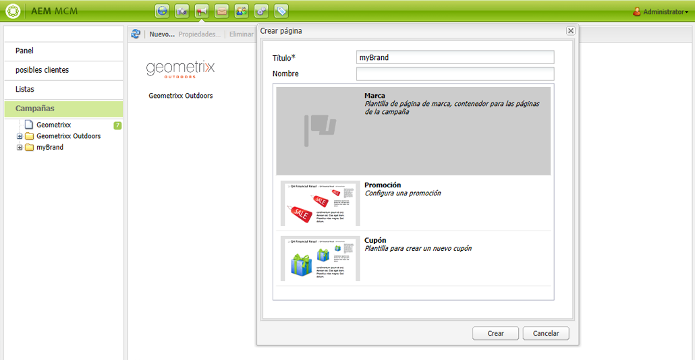

1. Haga clic en **Crear**. La nueva marca se mostrará en MCM (con un icono predeterminado).

### Definición de las propiedades de la nueva marca {#defining-the-properties-for-your-new-brand}

1. De **Campañas** en el panel izquierdo, seleccione el icono de la nueva marca en el panel derecho y haga clic en **Propiedades...**

   Puede especificar un **Título**, **Descripción** y una imagen que se utilizará como icono.

   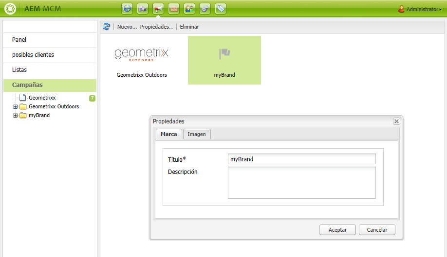

1. Haga clic en **OK** para guardar.

## Creación de una nueva campaña {#creating-a-new-campaign}

Para crear una nueva campaña:

1. De **Campañas**, seleccione la nueva marca en el panel izquierdo o haga doble clic en el icono del panel derecho.

   Se mostrará la información general (estará vacía si la marca es nueva).

1. Haga clic en **Nuevo...** y especifique el **Título**, **Nombre** y la plantilla que se utilizará para la nueva campaña.

   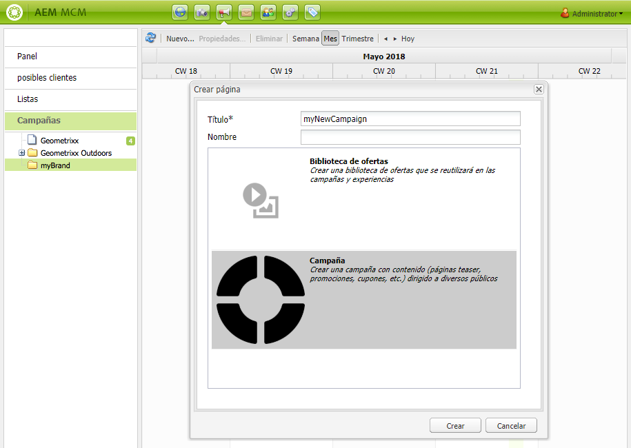

1. Haga clic en **Crear**. La nueva campaña se mostrará en MCM.

### Definición de las propiedades de la nueva campaña {#defining-the-properties-for-your-new-campaign}

Configure las propiedades de campaña que controlan el comportamiento:

* **Prioridad:** Prioridad de esta campaña en relación a otras campañas. Cuando varias campañas están activadas simultáneamente, la campaña que tenga la prioridad más alta controla la experiencia del visitante.
* **Tiempo de activación y desactivación:** Estas propiedades controlan el período de tiempo en el que la campaña controla la experiencia del visitante. La propiedad Tiempo activo controla el momento en que la campaña comienza a controlar la experiencia. La propiedad Tiempo inactivo controla cuándo las campañas dejan de controlar la experiencia.
* **Imagen:** Imagen que representa la campaña en AEM.
* **Cloud Services:** Configuraciones de Cloud Service con las que se integra la campaña. (Consulte [Integración con Adobe Marketing Cloud](/help/sites-administering/marketing-cloud.md).)

* **Adobe Target:** Propiedades que configuran campañas integradas con Adobe Target. (Consulte [Integración con Adobe Target](/help/sites-administering/target.md).)

1. De **Campañas**, seleccione su marca. En el panel derecho, seleccione la campaña y haga clic en **Propiedades**.

   Puede especificar varias propiedades, incluido un **Título**, **Descripción** y **Cloud Services** quieres.

   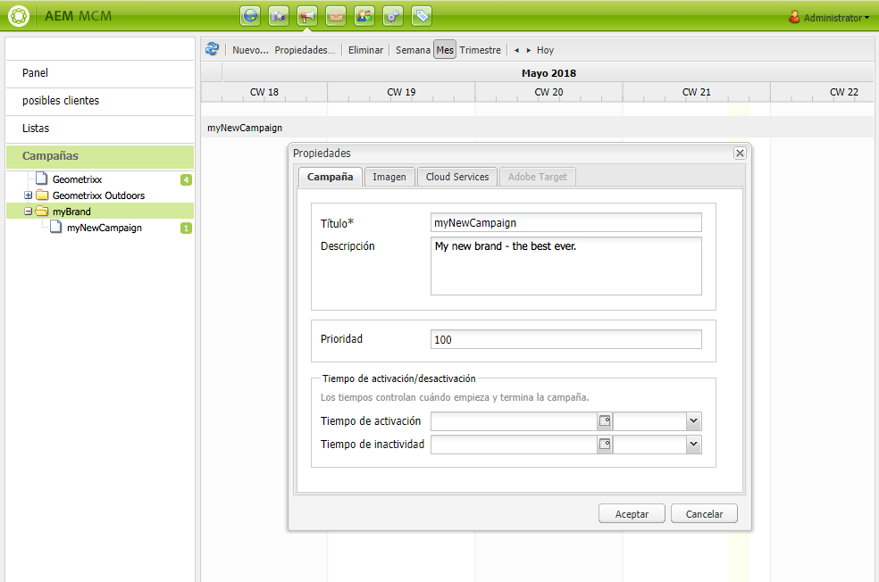

1. Haga clic en **OK** para guardar.

## Creación de una nueva experiencia {#creating-a-new-experience}

El procedimiento para crear una nueva experiencia depende del tipo de experiencia:

* [Creación de un teaser](/help/sites-classic-ui-authoring/classic-personalization-campaigns.md#creatingateaser)
* [Creación de una newsletter](/help/sites-classic-ui-authoring/classic-personalization-campaigns.md#creatinganewsletter)
* [Creación de una oferta de Adobe Target](/help/sites-classic-ui-authoring/classic-personalization-campaigns.md#creatingatesttargetoffer)

>[!NOTE]
>
>Al igual que en versiones anteriores, sigue siendo posible crear la experiencia como una página en la **Sitios web** (y todas las páginas de este tipo creadas en versiones anteriores siguen siendo totalmente compatibles).
>
>La práctica recomendada ahora es utilizar MCM para crear experiencias.

## Configuración de la nueva experiencia {#configuring-your-new-experience}

Ahora que ha creado el esqueleto básico para su experiencia, debe continuar con las siguientes acciones, según el tipo de experiencia:

* [Teaser](/help/sites-classic-ui-authoring/classic-personalization-campaigns.md#teasers):

   * [Conecte la página teaser a los segmentos del visitante.](/help/sites-classic-ui-authoring/classic-personalization-campaigns.md#applyingasegmenttoyourteaser)
   * [Creación de un touchpoint para el teaser](/help/sites-classic-ui-authoring/classic-personalization-campaigns.md#creatingatouchpointforyourteaser) (añada el teaser a una página de contenido).

* [Newsletter](/help/sites-classic-ui-authoring/classic-personalization-campaigns.md#newsletters):

   * [Añada contenido a la newsletter.](/help/sites-classic-ui-authoring/classic-personalization-campaigns.md#addingcontenttonewsletters)
   * [Personalice la newsletter.](/help/sites-classic-ui-authoring/classic-personalization-campaigns.md#personalizingnewsletters)
   * [Enviar el boletín](/help/sites-classic-ui-authoring/classic-personalization-campaigns.md#sendingnewsletters) a suscriptores o posibles clientes.
   * [Crear una atractiva página de aterrizaje de la newsletter](/help/sites-classic-ui-authoring/classic-personalization-campaigns.md#settingupanewsletterlandingpage).

* [Oferta de Adobe Target](/help/sites-classic-ui-authoring/classic-personalization-campaigns.md#testtargetoffers):

   * [Integración con Adobe Target](/help/sites-administering/target.md)

### Adición de un nuevo touchpoint {#adding-a-new-touchpoint}

Si tiene experiencias existentes, puede añadir un touchpoint directamente desde la vista de calendario de MCM:

1. Seleccione la vista de calendario de la campaña.

1. Haga clic en **Agregar Touchpoint...** para abrir el cuadro de diálogo. Especifique la experiencia que desee añadir:

   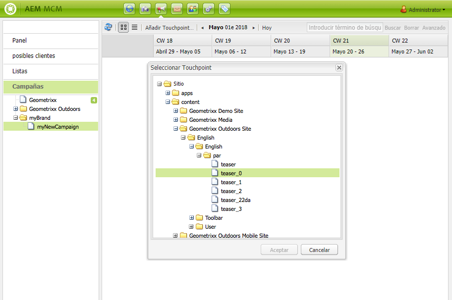

1. Haga clic en **OK** para guardar.

## Uso de posibles clientes {#working-with-leads}

>[!NOTE]
>
>Adobe no tiene previsto mejorar aún más esta capacidad (Administración de posibles clientes).\
>La recomendación es [aproveche Adobe Campaign y la integración para AEM](/help/sites-administering/campaign.md).

En AEM MCM, puede organizar y añadir posibles clientes introduciéndolos manualmente o importando una lista separada por comas, por ejemplo, una lista de correo. Las formas adicionales de generar posibles clientes consisten en los registros a boletines informativos o comunidades (si se configuran, pueden generar el déclencheur de un flujo de trabajo que rellene los posibles clientes).

Los posibles clientes se suelen categorizar y situar en una lista para que más adelante se puedan realizar acciones en toda la lista como, por ejemplo, enviar un correo electrónico personalizado a una lista concreta.

En el panel, puede acceder a todos los posibles clientes haciendo clic en **Posibles clientes** del panel izquierdo. También puede acceder a los posibles clientes desde el **Listas** panel.

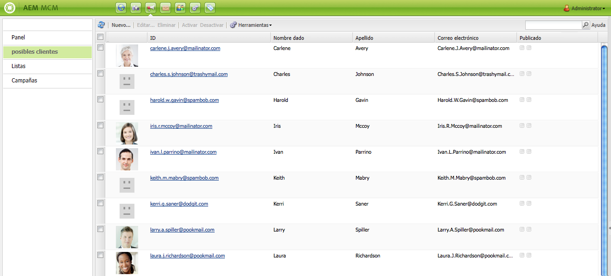

>[!NOTE]
>
>Para agregar o modificar avatares de usuarios, abra la nube de secuencias de clic (Ctrl+Alt+c), cargue el perfil y haga clic en **Editar**.

### Creación de nuevos posibles clientes {#creating-new-leads}

Después de crear nuevos posibles clientes, asegúrese de [actívelos](#activating-or-deactivating-leads) para poder rastrear su actividad en la instancia de publicación y personalizar su experiencia.

Para crear un nuevo posible cliente manualmente:

1. En AEM, vaya a MCM. En el panel, haga clic en **Posibles clientes**.
1. Haga clic en **Nuevo**. La variable **Crear nuevo** se abre.

   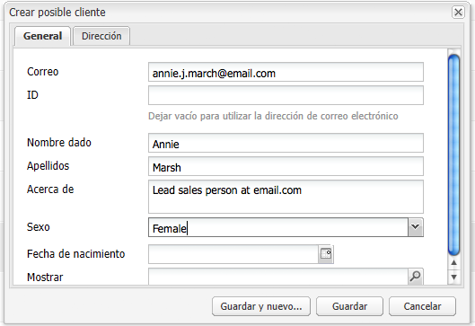

1. Introduzca la información en los campos, según corresponda. Haga clic en el **Dirección** pestaña .

   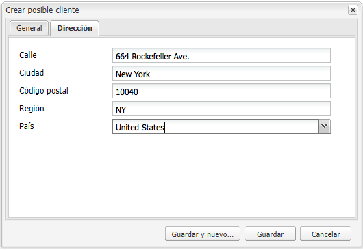

1. Introduzca la información de dirección, según corresponda. Haga clic en **Guardar** para guardar el posible cliente. Si necesita agregar posibles clientes adicionales, haga clic en** Guardar y nuevo**.

   El nuevo posible cliente aparece en el panel Posibles clientes . Al hacer clic en la entrada, toda la información introducida aparece en el panel derecho. Después de crear un posible cliente, puede agregarlo a una lista.

   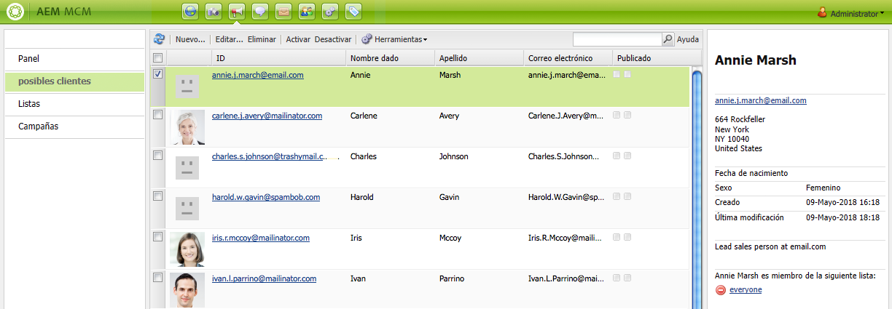

### Activación o desactivación de posibles clientes {#activating-or-deactivating-leads}

La activación de posibles clientes ayuda a realizar un seguimiento de su actividad en la instancia de publicación y permite personalizar su experiencia. Cuando ya no desee rastrear su actividad, puede desactivarla.

Para activar o desactivar posibles clientes:

1. En AEM, vaya a MCM y haga clic en **Posibles clientes**.

1. Seleccione los posibles clientes que desee activar o desactivar y haga clic en **Activar** o **Desactivar**.

   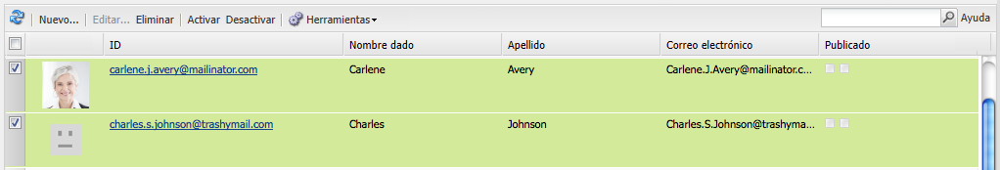

   Al igual que con AEM páginas, el estado de publicación se indica en la variable **Publicado** para abrir el Navegador.

   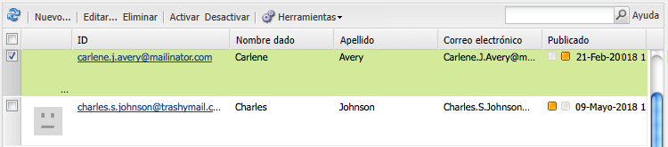

### Importación de nuevos posibles clientes {#importing-new-leads}

Al importar nuevos posibles clientes, puede agregarlos automáticamente a una lista existente o crear una nueva lista para incluirlos.

Para importar posibles clientes de una lista separada por comas:

1. En AEM, vaya a MCM y haga clic en **Posibles clientes**.

   >[!NOTE]
   >
   >También puede importar posibles clientes realizando una de las siguientes acciones:
   >
   >* En el panel, haga clic en **Importar posibles clientes** en el **Listas** panel
   >* Haga clic en **Listas** y en el **Herramientas** seleccione **Importar posibles clientes**.

1. En el **Herramientas** seleccione **Importar posibles clientes**.
1. Introduzca la información tal como se describe en Datos de ejemplo. Se pueden importar los siguientes campos: email,familyName,givenName,gender,aboutMe,city,country,phoneNumber,postalCode,region,streetAddress

   >[!NOTE]
   >
   >La primera fila de la lista CSV son etiquetas predefinidas que deben escribirse exactamente como en el ejemplo:
   >
   >`email,givenName,familyName` - si se escribe como `givenname`, por ejemplo, el sistema no lo reconocerá.

   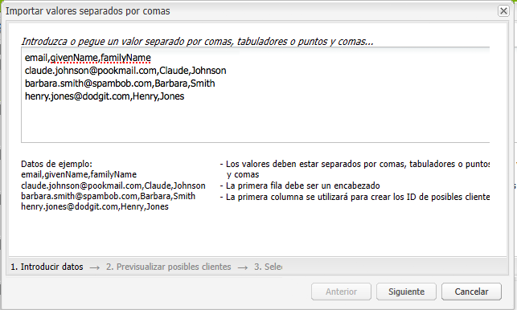

1. Haga clic en **Siguiente**. Aquí puede obtener una vista previa de los posibles clientes para asegurarse de que son precisos.

   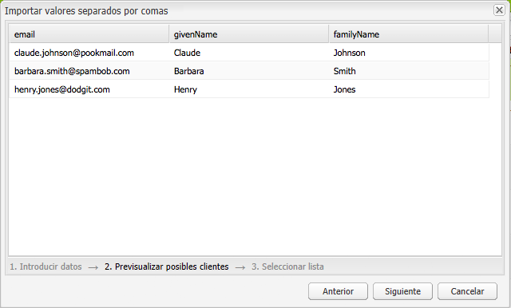

1. Haga clic en **Siguiente**. Seleccione la lista a la que desea que pertenezcan los posibles clientes. Si no desea que pertenezcan a una lista, elimine la información en el campo . De forma predeterminada, AEM crea un nombre de lista que incluye la fecha y la hora. Haga clic en **Importar**.

   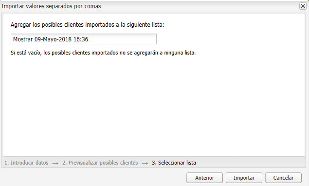

   El nuevo posible cliente aparece en el panel Posibles clientes . Si hace clic en la entrada, toda la información introducida aparecerá en el panel derecho. Después de crear un posible cliente, puede agregarlo a una lista.

### Adición de posibles clientes a listas {#adding-leads-to-lists}

Para agregar posibles clientes a listas preexistentes:

1. En MCM, haga clic en **Posibles clientes** para ver todos los posibles clientes disponibles.

1. Seleccione los posibles clientes que desee añadir a una lista seleccionando la casilla de verificación situada junto al posible cliente. Puede agregar tantos posibles clientes como desee.

   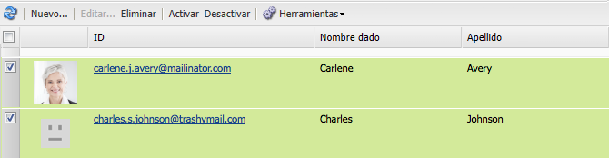

1. En el **Herramientas** seleccione **Agregar a lista....** Se abre la ventana **Agregar a lista **.

   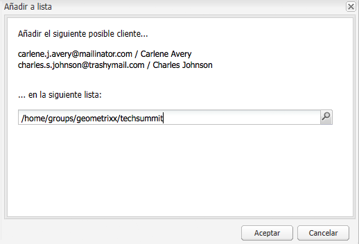

1. Seleccione a qué lista desea añadir los posibles clientes y haga clic en **OK**. Los posibles clientes se añaden a las listas adecuadas.

### Visualización de la información del posible cliente {#viewing-lead-information}

Para ver la información del posible cliente, en MCM, haga clic en la casilla de verificación situada junto al posible cliente y se abrirá un panel derecho con toda la información del posible cliente, incluida la afiliación a la lista.

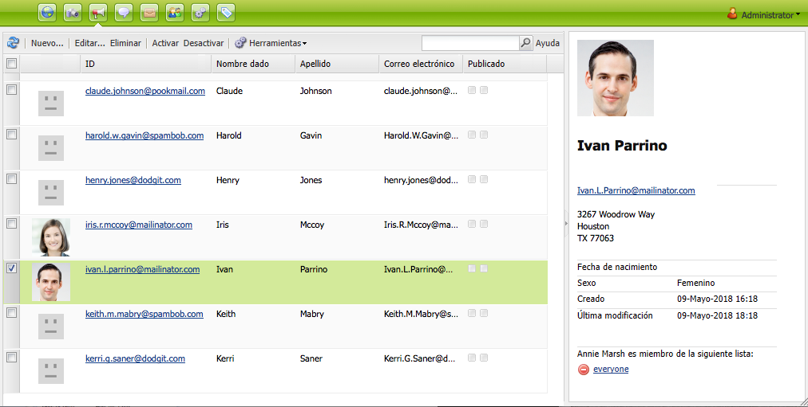

### Modificación de posibles clientes existentes {#modifying-existing-leads}

Para modificar la información del posible cliente existente:

1. En MCM, haga clic en **Posibles clientes**. En la lista de posibles clientes, seleccione la casilla de verificación situada junto al posible cliente que desee editar. Toda la información del posible cliente aparece en el panel derecho.

   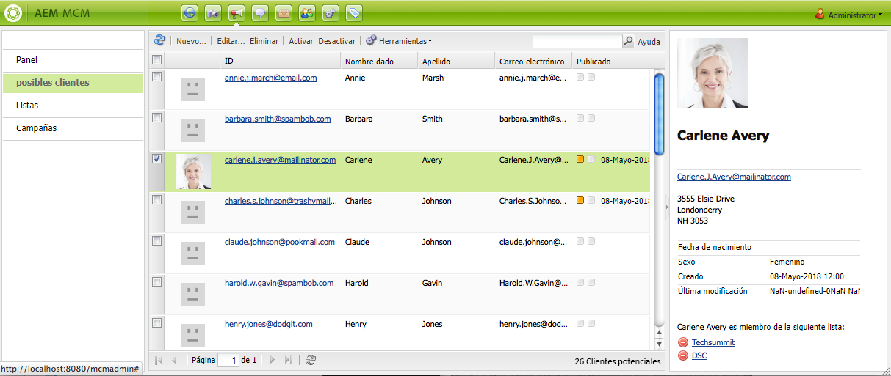

   >[!NOTE]
   >
   >Solo puede editar un posible cliente a la vez. Si necesita modificar posibles clientes que formen parte de la misma lista, puede modificar la lista en su lugar.

1. Haga clic en **Editar**. La variable **Editar posible cliente** se abre.

   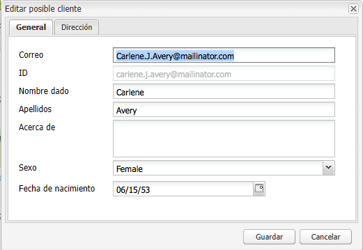

1. Realice las ediciones necesarias y haga clic en **Guardar** para guardar los cambios.

   >[!NOTE]
   >
   >Para cambiar el avatar del posible cliente, vaya al perfil del usuario. Puede cargar el perfil en la nube de secuencias de clic presionando CTRL+ALT+c, haciendo clic en **Cargar** y, a continuación, seleccione el perfil.

### Eliminación de posibles clientes existentes {#deleting-existing-leads}

Para eliminar posibles clientes existentes en MCM, active la casilla de verificación situada junto al posible cliente y haga clic en **Eliminar**. El posible cliente se elimina de la lista de posibles clientes y de todas las listas asociadas.

>[!NOTE]
>
>Antes de proceder a la eliminación, AEM confirma que desea eliminar el posible cliente existente. Una vez eliminado, no se puede recuperar.

## Uso de listas {#working-with-lists}

>[!NOTE]
>
>El Adobe no tiene previsto mejorar aún más esta capacidad (gestión de listas).\
>La recomendación es [aproveche Adobe Campaign y la integración para AEM](/help/sites-administering/campaign.md).

Las listas permiten organizar los posibles clientes en grupos. Con las listas, puede dirigir las campañas de marketing a un grupo determinado de personas; por ejemplo, puede enviar una newsletter dirigida a una lista. Las listas están visibles en MCM, ya sea en el panel de control o haciendo clic en **Listas**. Ambos proporcionan el nombre de la lista y el número de miembros.

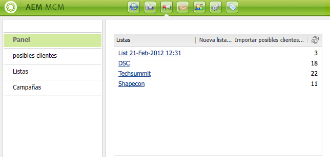

Si hace clic en **Listas**, también puede ver si la lista es miembro de otra lista y ver una descripción.

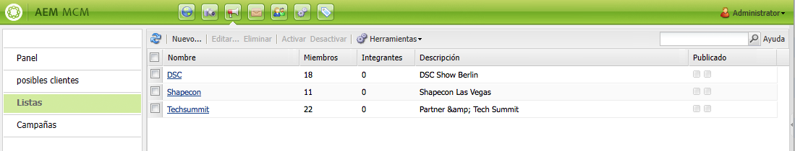

### Creación de nuevas listas {#creating-new-lists}

Para crear una nueva lista (grupo):

1. En el panel de MCM, haga clic en **Nueva lista ...** o **Listas**, haga clic en **Nuevo** ... Se abre la ventana Crear lista .

   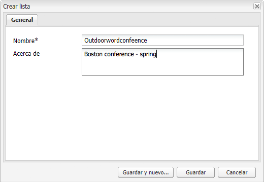

1. Introduzca un nombre (obligatorio) y, si lo desea, una descripción y haga clic en **Guardar**. La lista aparece en el **Listas** panel.

   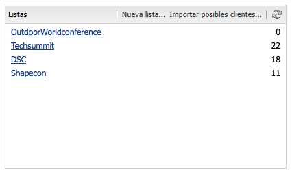

### Modificación de listas existentes {#modifying-existing-lists}

Para modificar una lista existente:

1. En MCM, haga clic en **Listas**.

1. En la lista, active la casilla situada junto a la lista que desee editar y haga clic en **Editar**. La variable **Editar lista** se abre.

   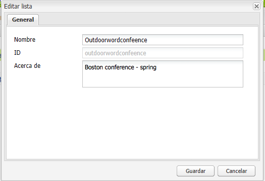

   >[!NOTE]
   >
   >Solo puede editar una lista a la vez.

1. Realice ediciones, según sea necesario, y haga clic en **Guardar** para guardar los cambios.

### Eliminación de listas existentes {#deleting-existing-lists}

Para eliminar listas existentes, en MCM, active la casilla situada junto a la lista y haga clic en **Eliminar**. Se elimina la lista. Los posibles clientes afiliados a la lista no se eliminan, solo se elimina la afiliación a la lista.

>[!NOTE]
>
>Antes de proceder a la eliminación, AEM confirma que desea eliminar las listas existentes. Una vez eliminado, no se puede recuperar.

### Combinación de listas {#merging-lists}

Puede combinar una lista existente con otra lista. Al hacerlo, la lista que está combinando se convierte en miembro de la otra lista. Sigue existiendo como entidad independiente y no debe eliminarse.

Puede combinar listas si tiene la misma conferencia en dos ubicaciones diferentes y desea combinarlas en una lista de asistentes de todas las conferencias.

Para combinar listas existentes:

1. En MCM, haga clic en **Listas**.

1. Seleccione la lista con la que desea combinar otra lista seleccionando la casilla situada junto a ella.

1. En el **Herramientas** seleccione **Combinar lista**.

   >[!NOTE]
   >
   >Solo se puede combinar una lista a la vez.

1. En el **Combinar lista** , seleccione la lista con la que desea combinar y haga clic en **OK**.

   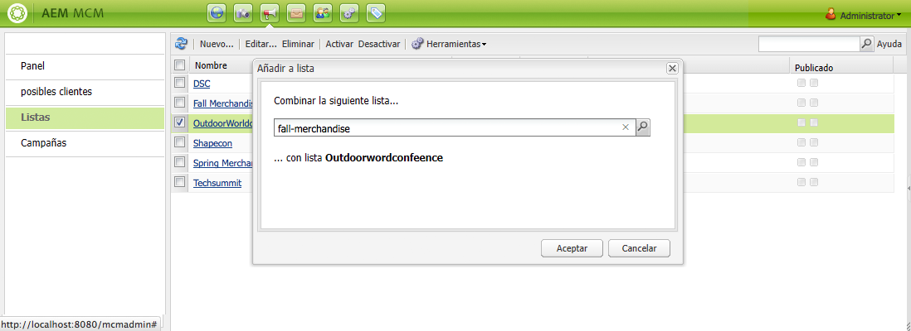

   La lista combinada debe aumentar en un miembro. Para ver que la lista se ha combinado, seleccione la lista combinada y en la **Herramientas** seleccione **Mostrar posibles clientes**.

1. Repita el paso hasta que haya combinado todas las listas que desee.

   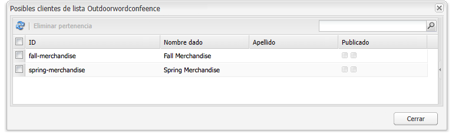

>[!NOTE]
>
>Eliminar una lista combinada de su pertenencia es idéntico a eliminar un posible cliente de una lista. Abra el **Listas** , seleccione la lista que incluye la lista combinada y elimine la pertenencia haciendo clic en el círculo rojo situado junto a la lista.

### Visualización de posibles clientes en listas {#viewing-leads-in-lists}

En cualquier momento, puede ver qué posibles clientes pertenecen a una lista específica navegando o buscando miembros.

Para ver los posibles clientes que pertenecen a una lista:

1. En MCM, haga clic en **Listas**.

1. Seleccione la casilla situada junto a la lista para la que desea ver los miembros.

1. En el **Herramientas** seleccione **Mostrar posibles clientes**. AEM muestra los posibles clientes que son miembros de esa lista. Puede navegar por la lista o buscar miembros.

   >[!NOTE]
   >
   >Además, puede eliminar posibles clientes de una lista seleccionándolos y luego haciendo clic en **Eliminar pertenencia**.

   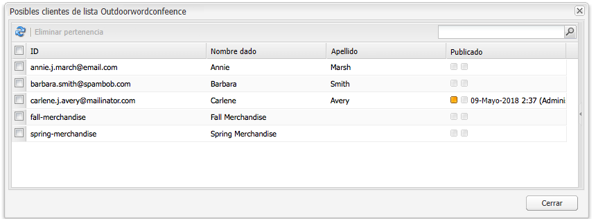

1. Haga clic en **Cerrar** para volver al MCM.
