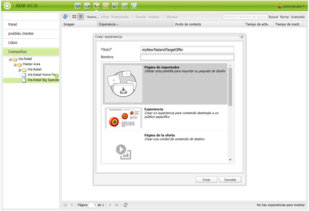

# Ofertas de Target{#target-offers}

>[!CAUTION]
>
>AEM 6.4 ha llegado al final de la compatibilidad ampliada y esta documentación ya no se actualiza. Para obtener más información, consulte nuestra [períodos de asistencia técnica](https://helpx.adobe.com/es/support/programs/eol-matrix.html). Buscar las versiones compatibles [here](https://experienceleague.adobe.com/docs/).

## Creación de una experiencia de oferta de Test&amp;Target {#creating-a-test-target-offer-experience}

1. Seleccione la nueva campaña en el panel izquierdo o haga doble clic en ella en el panel derecho.
1. Seleccione la vista de lista mediante el icono :

   

1. Haga clic en **Nuevo...**
1. Puede especificar la variable **Título**, **Nombre** y el tipo de experiencia que se creará; en este caso, oferta de Test&amp;Target.

   

1. Haga clic en **Crear**.

   >[!NOTE]
   >
   >Actualmente, las experiencias de Test&amp;Target no aparecen en la lista de MCM. Se puede acceder a ellas desde la **Sitios web** en Campañas.

## Integración con Adobe Target {#integrating-with-adobe-target}

Consulte [Integrar con Adobe](/help/sites-administering/target.md) [Target](/help/sites-administering/target.md) para obtener más información.
