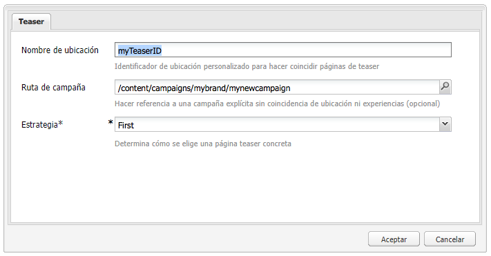
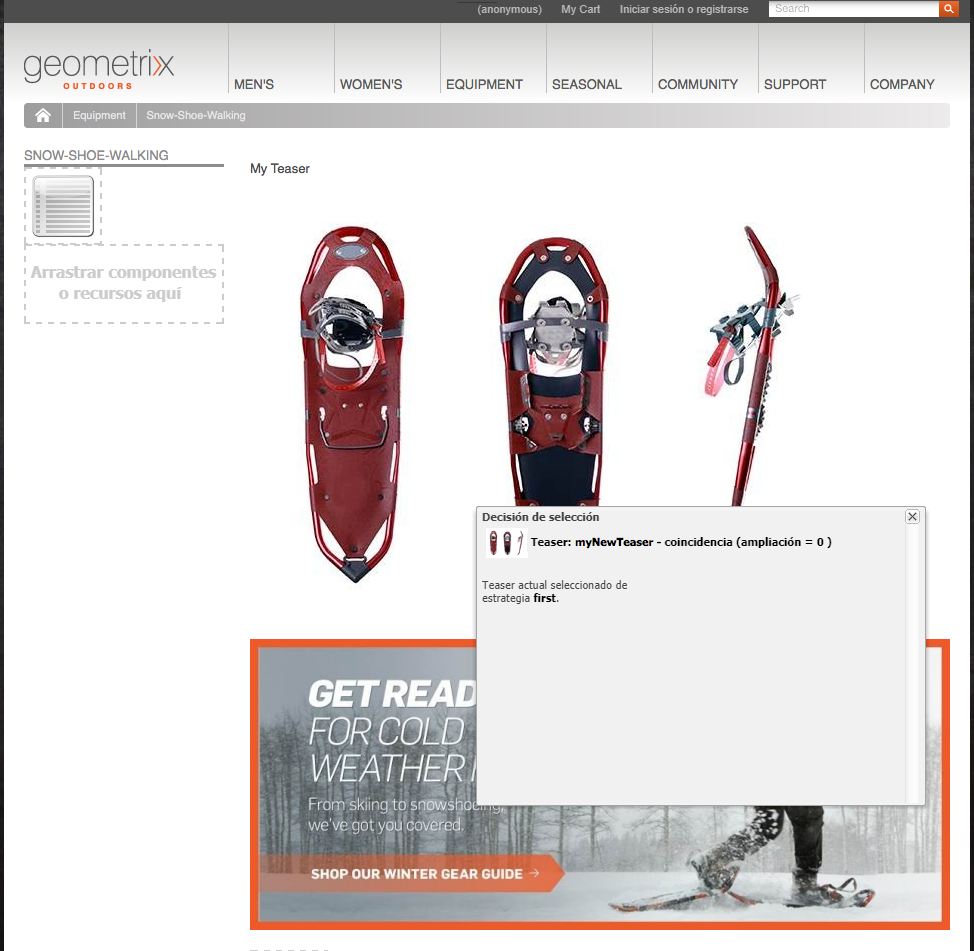
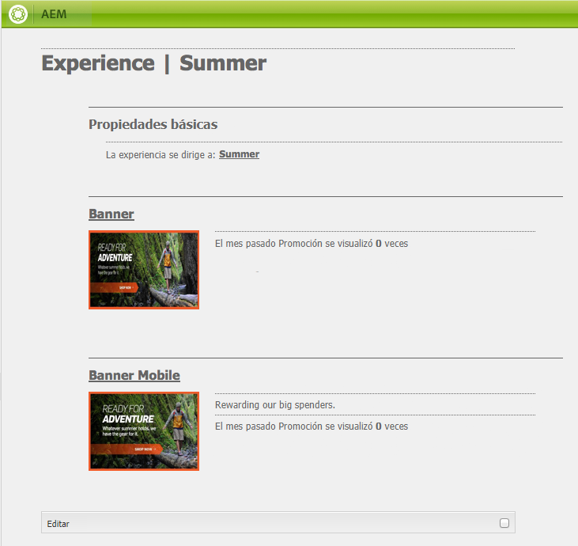

# Teasers y estrategias{#teasers-and-strategies}

>[!CAUTION]
>
>AEM 6.4 ha llegado al final de la compatibilidad ampliada y esta documentación ya no se actualiza. Para obtener más información, consulte nuestra [períodos de asistencia técnica](https://helpx.adobe.com/es/support/programs/eol-matrix.html). Buscar las versiones compatibles [here](https://experienceleague.adobe.com/docs/).

Las campañas suelen utilizar teasers como mecanismo para atraer un segmento específico de la población visitante hacia contenido centrado en sus intereses. Se definen uno o más teasers para una campaña específica.

>[!NOTE]
>
>El componente Teaser se ha desaprobado en AEM 6.2.

* **Páginas de marca** se almacenan en la sección Campañas del sitio web. Una marca contiene campañas individuales.

* **Páginas de campaña** se almacenan en la sección Campañas del sitio web. Cada campaña tiene una página individual en la que se incluyen las definiciones del teaser. La página contenedora, o de descripción general, también contiene cierta información y estadísticas relacionadas con las páginas de teaser individuales.

Los teasers de AEM constan de varias partes:

* **Páginas de teaser** se almacenan en la página de campaña correspondiente y contienen las definiciones de los párrafos de teaser disponibles para cada campaña específica. Estas definiciones se utilizan al mostrar los párrafos de teaser. incluyendo las variaciones de contenido, el segmento que se utilizará para seleccionar una variación y el factor de ampliación.
* La variable **Componente teaser** está disponible de forma predeterminada y le permite crear una instancia de un párrafo de teaser específico en una página de contenido. Puede arrastrar el componente teaser desde la barra de tareas y, a continuación, especificar la definición del teaser para crear su propio párrafo de teaser. **Nota:** El componente Teaser se ha desaprobado en AEM 6.2.

* **Párrafos del teaser** son instancias reales del teaser en una página de contenido. Esto atrae a un segmento de visitantes a contenido centrado en sus intereses.
* Las páginas que contienen contenido de campaña se centran en un segmento específico de visitantes. Normalmente, los párrafos de teaser llevan al visitante a esas páginas.

## Estrategias {#strategies}

Al añadir un párrafo de teaser a una página, debe definir la variable **Estrategia**.

Esto sucede en el caso de que varios teasers estén disponibles para su selección a medida que sus segmentos asignados se resuelvan correctamente. La variable **Estrategia** especifica los criterios adicionales utilizados para seleccionar el teaser mostrado:

* **Puntuación del flujo de navegación**, se basa en las etiquetas y en las visitas de etiquetas relacionadas que se incluyen en el contexto de cliente del visitante (muestran con qué frecuencia ha hecho clic un visitante en las páginas que contienen la etiqueta correspondiente). Se comparan las tasas de visitas de las etiquetas definidas en la página de teaser.
* **Aleatorio**, para la selección &quot;aleatoria&quot;; utiliza el factor aleatorio generado para una página; esto se puede ver con la variable [contexto de cliente](/help/sites-administering/client-context.md).

* **First** en la lista de segmentos resueltos. El orden es el de los teasers dentro de la página contenedora de la campaña.

La variable [Factor de ampliación](/help/sites-administering/campaign-segmentation.md#boost-factor) del segmento también tiene un impacto en la selección. Se trata de un factor de ponderación añadido a una definición de segmento para aumentar/disminuir la probabilidad relativa de que se seleccione.

El proceso y las interrelaciones de los distintos criterios de selección se ilustran mejor con un ejemplo (método que también se puede utilizar para garantizar que los teasers lleguen a la audiencia requerida).

Si los siguientes segmentos ya se han creado y asignado a su factor de ampliación respectivo:

| Segmento | Factor de ampliación |
|---|---|
| S1 | 0 |
| S2 | 0 |
| S3 | 10 |
| S4 | 30 |
| S5 | 0 |
| S6 | 100 |

Y utilizamos las siguientes definiciones de teaser:

<table> 
 <tbody> 
  <tr> 
   <td>Campaign</td> 
   <td>Teaser</td> 
   <td>Segmentos asignados</td> 
   <td>Etiquetas asignadas </td> 
  </tr> 
  <tr> 
   <td>C1</td> 
   <td>T1</td> 
   <td>S1, S2</td> 
   <td>Negocios, marketing</td> 
  </tr> 
  <tr> 
   <td>C1</td> 
   <td>T2 </td> 
   <td>S1</td> 
   <td>  </td> 
  </tr> 
  <tr> 
   <td>C1 </td> 
   <td>T3</td> 
   <td>S3, S4</td> 
   <td>  </td> 
  </tr> 
  <tr> 
   <td>C1 </td> 
   <td>T4</td> 
   <td>S2, S5</td> 
   <td>  </td> 
  </tr> 
  <tr> 
   <td>C1 </td> 
   <td>T5</td> 
   <td>S1, S2, S6</td> 
   <td>Marketing</td> 
  </tr> 
  <tr> 
   <td>C1 </td> 
   <td>T6</td> 
   <td>S6</td> 
   <td>Negocios  </td> 
  </tr> 
 </tbody> 
</table>

Si aplicamos esto a un visitante donde:

* **S1**, **S2** y **S6** resolver correctamente

* la etiqueta **marketing** tiene 3 visitas
* la etiqueta **negocio** tiene 6 visitas

Se puede ver el resultado:

* éxito de coincidencia: ¿alguno de los segmentos asignados al teaser se resuelve correctamente para el visitante actual?
* factor de ampliación: el factor de ampliación más alto de todos los segmentos aplicables
* puntuación del flujo de navegación: el total acumulado de todas las visitas de etiqueta aplicables

que se calculan antes de aplicar la estrategia adecuada:

<table> 
 <tbody> 
  <tr> 
   <td>Campaign</td> 
   <td>Teaser</td> 
   <td>Segmentos asignados</td> 
   <td>Etiquetas </td> 
   <td>¿Coincidencia correcta?</td> 
   <td>Factor de ampliación resultante</td> 
   <td>Puntuación de secuencias de clic resultante </td> 
  </tr> 
  <tr> 
   <td>C1</td> 
   <td>T1</td> 
   <td>S1, S2</td> 
   <td>Negocios, marketing</td> 
   <td>Sí</td> 
   <td>0</td> 
   <td>9</td> 
  </tr> 
  <tr> 
   <td>C1</td> 
   <td>T2 </td> 
   <td>S1</td> 
   <td>  </td> 
   <td>Sí</td> 
   <td>0</td> 
   <td>  </td> 
  </tr> 
  <tr> 
   <td>C1 </td> 
   <td>T3</td> 
   <td>S3, S4</td> 
   <td>  </td> 
   <td>No</td> 
   <td>  </td> 
   <td>  </td> 
  </tr> 
  <tr> 
   <td>C1 </td> 
   <td>T4</td> 
   <td>S2, S5</td> 
   <td>  </td> 
   <td>Sí  </td> 
   <td>0  </td> 
   <td>  </td> 
  </tr> 
  <tr> 
   <td>C1 </td> 
   <td>T5</td> 
   <td>S1, S2, S6</td> 
   <td>Marketing</td> 
   <td>Sí</td> 
   <td>100</td> 
   <td>3</td> 
  </tr> 
  <tr> 
   <td>C1 </td> 
   <td>T6</td> 
   <td>S6</td> 
   <td>Negocios</td> 
   <td>Sí</td> 
   <td>100</td> 
   <td>6 </td> 
  </tr> 
 </tbody> 
</table>

Estos valores se utilizan para determinar los teaser que verá el visitante, en función de la variable **Estrategia** aplicado al párrafo de teaser:

<table> 
 <tbody> 
  <tr> 
   <td>Estrategia</td> 
   <td>Teaser resultante</td> 
   <td>Comentarios</td> 
  </tr> 
  <tr> 
   <td>Primero</td> 
   <td>T5</td> 
   <td>Solo T5 y T6 se consideran como sus segmentos resueltos <i>y</i> tienen el factor de ampliación más alto. La lista devuelta sigue el orden T5, T6; así, T5 está seleccionado y se muestra.</td> 
  </tr> 
  <tr> 
   <td>Aleatorio</td> 
   <td>T5 o T6</td> 
   <td>Ambos teasers tienen segmentos que se resuelven todos y el mismo factor de ampliación. Por lo tanto, los dos teasers se muestran en la misma proporción.</td> 
  </tr> 
  <tr> 
   <td>Puntuación del flujo de navegación</td> 
   <td>T6</td> 
   <td>
Los segmentos para T1, T4, T5 y T6 se resuelven para el visitante. A continuación, los factores de ampliación más elevados de T5 y T6 excluyen T1 y T4. Finalmente, la puntuación de secuencias de clic más alta de T6 hace que se seleccione esta opción.
 </td> 
  </tr> 
 </tbody> 
</table>

>[!NOTE]
>
>Si, después de las técnicas de resolución anteriores, hay varios teasers disponibles para la selección, una selección interna (aleatoria) seleccionará un solo teaser para la visualización.
>
>Por ejemplo, si la estrategia era Puntuación de secuencias de clic y T5 tenía la misma Puntuación de secuencias de clic que T6 (es decir, 6 en lugar de 3), la selección interna (aleatoria) se utilizaría para seleccionar una de estas dos.

Las páginas o párrafos de teaser se utilizan para dirigir a segmentos concretos de visitantes a contenido centrado en sus intereses. Pueden presentar una serie de opciones que el visitante puede elegir o mostrar solo un párrafo de teaser basado en el segmento específico del visitante; por ejemplo, el párrafo de teaser mostrado puede depender de la edad del visitante.

Normalmente, una página de teaser es una acción temporal que dura un período de tiempo específico, hasta que se reemplaza por la siguiente página de teaser.

Después de crear la marca y la campaña, puede crear y configurar la experiencia de teaser.

## Creación de un touchpoint para el teaser {#creating-a-touchpoint-for-your-teaser}

>[!NOTE]
>
>El componente Teaser se ha desaprobado en AEM 6.2.

1. Desplácese a la página de contenido donde desee colocar el párrafo de teaser que dirigirá a la página de campaña.
1. Agregue un **Teaser** (disponible en la **Personalización** de la barra de tareas) en la posición requerida. Cuando se cree por primera vez, mostrará que la ruta de campaña aún no está configurada:

   

1. Edite el componente teaser para añadir lo siguiente:

   * **Ruta de campaña**
Ruta a la página de campaña que contiene la página de teaser individual; los segmentos determinan exactamente qué teaser se muestra.
   * **[Estrategia](/help/sites-classic-ui-authoring/classic-personalization-campaigns.md#strategies)**
Método utilizado para la selección cuando varios segmentos se resuelven correctamente.
   

1. Haga clic en **OK** para guardar. Según los segmentos que haya establecido en el teaser y el perfil del usuario con el que haya iniciado sesión, se mostrará el contenido adecuado:

   

1. Pase el ratón sobre el párrafo del teaser para mostrar el icono del signo de interrogación (esquina inferior derecha del componente). Haga clic en esto para ver los segmentos aplicados y si se resuelven actualmente.

   

## Información general del teaser {#teaser-overview}

Además de la vista de campaña en MCM, la página de campaña también proporciona información sobre los teasers conectados a ella:

1. En el **Sitios web** consola, abra la página de campaña; por ejemplo:

   `http://localhost:4502/content/campaigns/geometrixx-outdoors/storefront/summer.html`

   Se mostrará información general sobre las estadísticas de visualización y las definiciones del teaser:

   
