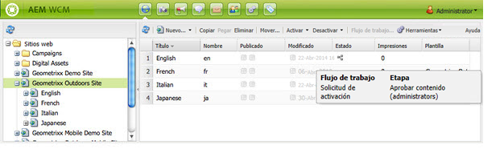

# Aplicación de flujos de trabajo a páginas{#applying-workflows-to-pages}

>[!CAUTION]
>
>AEM 6.4 ha llegado al final de la compatibilidad ampliada y esta documentación ya no se actualiza. Para obtener más información, consulte nuestra [períodos de asistencia técnica](https://helpx.adobe.com/es/support/programs/eol-matrix.html). Buscar las versiones compatibles [here](https://experienceleague.adobe.com/docs/).

Al aplicar el flujo de trabajo, debe especificar la siguiente información:

* Flujo de trabajo que se va a aplicar.

   Puede aplicar cualquier flujo de trabajo (al que tenga acceso, según lo haya asignado el administrador de AEM).
* Opcionalmente:

   * Un comentario que proporciona información sobre por qué inició el flujo de trabajo.
   * Un título que ayuda a identificar la instancia de flujo de trabajo en la bandeja de entrada de un usuario.

>[!NOTE]
>
>Los administradores de AEM pueden iniciar flujos de trabajo mediante [varios otros métodos](/help/sites-administering/workflows-starting.md).

## Aplicación de flujos de trabajo {#applying-workflows}

Los flujos de trabajo se pueden iniciar desde la consola Sitios web o, al editar una página, desde la barra de tareas.

La variable **Estado** en la columna **Sitios web** console indica si se ha aplicado un flujo de trabajo a una página:

### Inicio de un flujo de trabajo desde la consola Sitios web {#starting-a-workflow-from-the-websites-console}

1. Abra la consola Sitios web . ([http://localhost:4502/siteadmin](http://localhost:4502/siteadmin))
1. En el árbol Sitios web , seleccione el elemento principal de la página a la que desea aplicar el flujo de trabajo.
1. En la lista de páginas, seleccione la página y haga clic en Flujo de trabajo.
1. En el cuadro de diálogo Iniciar flujo de trabajo, seleccione el flujo de trabajo que desee aplicar. De forma opcional, introduzca un comentario y un título. A continuación, haga clic en Inicio.

### Inicio de un flujo de trabajo mediante la barra de tareas {#starting-a-workflow-using-sidekick}

1. Abra la consola Sitios web .
1. Abra la página requerida.
1. Seleccione la ficha Flujo de trabajo en la barra de tareas.
1. Expanda el **Flujo de trabajo** , lo que le permite seleccionar la **Flujo de trabajo** y, opcionalmente, introduzca **Título del flujo de trabajo** y **Comentario**.

   

1. Haga clic en **Iniciar flujo de trabajo** para iniciar una nueva instancia de flujo de trabajo con las propiedades que ha configurado y la página actual como carga útil. Ahora el flujo de trabajo se está ejecutando.
