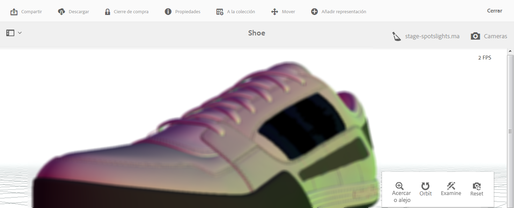

# Visualización de recursos 3D{#viewing-d-assets}

El visor interactivo 3D está disponible en la página de información de recursos de AEM. El visor incluye, entre otras cosas, una colección de controles de cámara interactivos que le permiten girar, ampliar o reducir y panoramizar el recurso 3D.

Además de utilizar los escenarios predeterminados en AEM 3D, también puede utilizar los escenarios que haya creado en una aplicación de terceros y cargado en AEM.

Consulte [Acerca del uso de escenarios en AEM 3D](/help/sites-classic-ui-authoring/classicui-stages-aem3d.md).

>[!NOTE]
>
>Para ver un recurso 3D, el navegador de su dispositivo o de escritorio debe tener WebGL activado. Asimismo, el hardware de gráficos subyacente debe tener suficientes capacidades y memoria para representar modelos del tamaño deseado.

## Consideraciones de rendimiento al ver recursos 3D {#performance-considerations-when-you-view-d-assets}

El tiempo que se tarda en abrir un recurso 3D en la vista de la página de información del recurso depende de varios factores. Estos factores incluyen elementos como los siguientes:

* Ancho de banda y latencias al servidor.
* Tamaño del modelo (número de caras).
* Número y tamaño de los mapas.
* Complejidad del escenario. Por ejemplo, el tamaño de la imagen de IBL.

Además, las capacidades del ordenador cliente, como una estación de trabajo, un ordenador portátil o un dispositivo móvil táctil, también son importantes para tener en cuenta al manipular la cámara de forma interactiva. Un sistema razonablemente potente con buenas capacidades gráficas puede hacer que la experiencia de visualización interactiva en 3D sea más cómoda y agradable.

**Para ver los recursos 3D**:

1. Asegúrese de que ha cargado los recursos 3D en AEM.

   Consulte [Acerca de la carga y el procesamiento de los recursos 3D en AEM](/help/sites-classic-ui-authoring/classicui-upload-proc-3d.md).
1. En **[!UICONTROL Adobe Experience Manager]**, en la página **[!UICONTROL Navegación]**, toque **[!UICONTROL Recursos]**.
1. Cerca de la esquina superior derecha de la página, en la lista desplegable **[!UICONTROL Vista]**, toque **[!UICONTROL Vista de tarjeta]**.

1. Vaya a un recurso 3D que desee ver.
1. Toque la tarjeta del recurso 3D para abrirlo en la página de información del recurso.

1. Realice una de las acciones siguientes:

   * En la esquina inferior derecha de la página de información del recurso, utilice la paleta de control de cámara para cambiar las distintas vistas del recurso.

      Si utiliza un dispositivo de entrada que no sea táctil ni tenga una rueda de desplazamiento, por ejemplo, un ratón Apple clásico de un solo botón, sigue siendo posible cambiar el zoom o la perspectiva de un recurso 3D, mientras esté en cada modo respectivo. Para realizar la acción, presione y mantenga presionada la tecla `SHIFT`mientras deprime el botón del ratón y arrastra hacia arriba o hacia abajo.

      Al utilizar un panel táctil en un equipo portátil típico, a menudo resulta difícil controlar los comportamientos del zoom o de la perspectiva con el gesto de pellizcar con dos dedos. En estos casos, puede presionar y mantener presionada `SHIFT`durante la acción. Este tipo de esfuerzo reduce la velocidad del gesto de pellizcar y hace que sea más fácil conseguir el nivel de zoom exacto o la perspectiva que desea. También puede utilizar un dedo para arrastrar hacia arriba o hacia abajo mientras se pulsa la tecla `SHIFT`para afectar a los comportamientos de zoom o perspectiva.
   <table> 
    <tbody> 
      <tr> 
      <td><strong>Nombre del control de cámara</strong>  </td> 
      <td><strong>Descripción</strong></td> 
      </tr> 
      <tr> 
      <td>
Zoom
 
o
 
Persp
 </td> 
      <td>
Toque o haga clic para alternar entre los modos Zoom y Perspectiva.
 
O bien, mantenga pulsada la tecla <code>ALT/OPTION</code> durante la acción para cambiar temporalmente al modo Perspectiva . Suelte la tecla para volver al modo de Zoom.
 
        <ul> 
        <li><strong>Zoom</strong>-Acercar y alejar la cámara, lo que la aleja del   recurso que está viendo. El zoom es el comportamiento predeterminado de la rueda de desplazamiento de un ratón (si está disponible), de los gestos de pellizcar con dos dedos en los dispositivos móviles, o cuando mantiene pulsada la tecla Mayús mientras arrastra hacia arriba o abajo con el botón izquierdo del ratón.</li> 
        <li><strong>Perspectiva</strong>: cambia la distancia focal (también conocida como campo de vista) de la cámara mientras se mantiene el tamaño relativo del recurso en la vista. La perspectiva es el comportamiento alternativo de la rueda de desplazamiento de un ratón (si está disponible), de los gestos de pellizcar con dos dedos en los dispositivos móviles, o cuando mantiene pulsada la tecla Mayús mientras arrastra hacia arriba o abajo con el botón izquierdo del ratón.</li> 
        </ul> </td> 
      </tr> 
      <tr> 
      <td>
Orbit
 
o
 
Panorámica
 </td> 
      <td>
Toque o haga clic para alternar entre los modos Orbit y Pan.
 
O bien, mantenga presionada la tecla <code>ALT/OPTION</code> durante la acción para cambiar temporalmente al modo de desplazamiento. Suelte la tecla para volver al modo de Giro.
 
        <ul> 
        <li><strong>Orbit</strong>: Mueve la cámara de visualización en una esfera centrada en un punto de destinatario que se encuentra cerca del centro del recurso 3D por defecto. El giro es el comportamiento predeterminado al arrastrar con el botón izquierdo o al arrastrar con un solo toque en dispositivos móviles.</li> 
        <li><strong>Recorrido</strong>: mueve la cámara en el plano de visualización. El punto de destino se mueve en consecuencia, de manera que las acciones de giro posteriores moverán la cámara alrededor de un nuevo punto de destino. La panorámica es el comportamiento alternativo al arrastrar con el botón izquierdo y al arrastrar con un solo toque.</li> 
        </ul> </td> 
      </tr> 
      <tr> 
      <td>
Examinar
 
o
 
Destino
 </td> 
      <td>
Toque o haga clic para alternar entre los modos Examinar y Destinatario.
 
        <ul> 
        <li><strong>Examine</strong>-Toque o haga clic para entrar en el modo Destinatario.</li> 
        <li><strong>Destinatario</strong>: toque o haga clic en un punto del recurso 3D para centrar la vista en esa parte del recurso.  Las acciones de giro utilizan el nuevo punto de destino.</li> 
        </ul> </td> 
      </tr> 
      <tr> 
      <td>Restablecer</td> 
      <td>Toque o haga clic para restaurar el punto de destinatario de la vista al centro del modelo. El reinicio también hace que la cámara  se acerque o se aleje más para mostrar el recurso en su totalidad y con un tamaño de visualización razonable.</td> 
      </tr> 
    </tbody> 
    </table>

1. Cerca de la esquina superior derecha de la página de detalles del recurso, toque el icono **[!UICONTROL Selector de escenario]**. Seleccione un nombre de escenario con el fondo y la iluminación que desee aplicar al recurso 3D.

   

   Las etapas proporcionan el fondo del entorno, el plano de tierra y la iluminación en la que se ve el modelo 3D.

   Consulte [Información acerca del uso de escenarios en AEM 3D](/help/sites-classic-ui-authoring/classicui-stages-aem3d.md).

1. Cerca de la esquina superior derecha de la página de detalles del recurso, toque el icono **[!UICONTROL Selector de cámara]** y seleccione una vista de cámara que desee aplicar al recurso 3D.

   

   A menudo, los escenarios proporcionan cámaras predefinidas. Puede volver a seleccionar la cámara actual para restaurarla a su configuración predefinida.

   Consulte [Información acerca del uso de escenarios en AEM 3D](/help/sites-classic-ui-authoring/classicui-stages-aem3d.md).

1. En la esquina superior derecha de la página, toque **[!UICONTROL Guardar]**.
1. Realice una de las acciones siguientes:

   * Procesar el recurso 3D.

      Consulte [Procesamiento de recursos 3D](/help/sites-classic-ui-authoring/classicui-rendering-3d.md).

   * En la esquina superior derecha de la página, toque **[!UICONTROL Cerrar]** para volver a la página Recursos.

