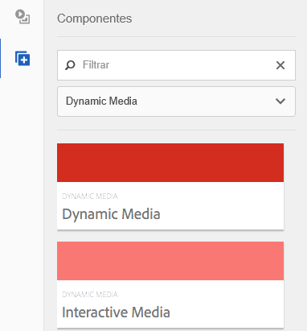
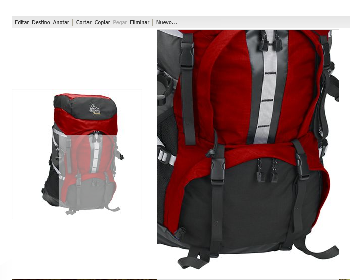
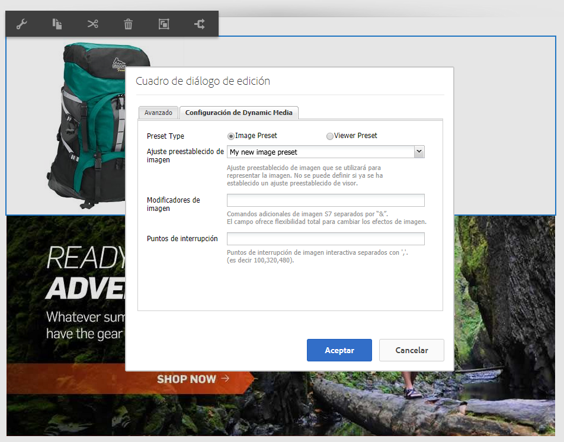
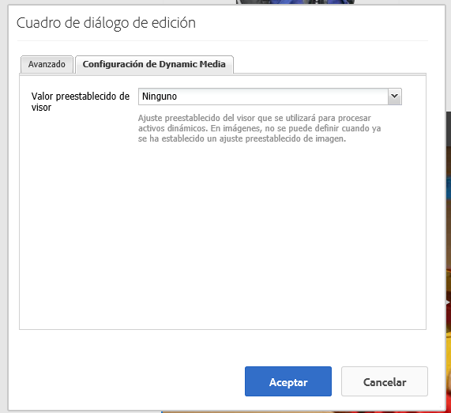

# Agregar recursos de Dynamic Media a las páginas{#adding-dynamic-media-assets-to-pages}

>[!CAUTION]
>
>AEM 6.4 ha llegado al final de la compatibilidad ampliada y esta documentación ya no se actualiza. Para obtener más información, consulte nuestra [períodos de asistencia técnica](https://helpx.adobe.com/es/support/programs/eol-matrix.html). Buscar las versiones compatibles [here](https://experienceleague.adobe.com/docs/).

Para añadir la funcionalidad de Dynamic Media a los recursos que utilice en sus sitios web, puede agregar la variable **[!UICONTROL Dynamic Media]** o **[!UICONTROL Medios interactivos]** directamente en la página. Para ello, introduzca [!UICONTROL Diseño] y activar los componentes de Dynamic Media. A continuación, puede añadir estos componentes a la página y añadir recursos al componente. Los componentes de Dynamic Media y Medios interactivos son inteligentes: saben si va a añadir una imagen o un vídeo y las opciones disponibles cambian en consecuencia.

Los recursos de Dynamic Media se agregan directamente a la página si utiliza AEM como WCM.

>[!NOTE]
>
>Los mapas de imágenes están disponibles para banners de carrusel.

## Adición de un componente de Dynamic Media a una página {#adding-a-dynamic-media-component-to-a-page}

Adición de la variable [!UICONTROL Dynamic Media] o [!UICONTROL Medios interactivos] a una página es lo mismo que añadir un componente a cualquier página. La variable [!UICONTROL Dynamic Media] y [!UICONTROL Medios interactivos] los componentes se describen en detalle en las secciones siguientes.

Para añadir un componente/visor de Dynamic Media a una página:

1. En AEM, abra la página a la que desee añadir el componente Dynamic Media.
1. Si no hay ningún componente de Dynamic Media disponible, haga clic en la regla de la [!UICONTROL Barra de tareas] para especificar **[!UICONTROL Diseño]** modo, haga clic en **[!UICONTROL Editar]** parsys y seleccione **[!UICONTROL Dynamic Media]** para que los componentes de Dynamic Media estén disponibles.

   >[!NOTE]
   >
   >Consulte [Configuración de componentes en el modo Diseño](/help/sites-authoring/default-components-designmode.md) para obtener más información.

1. Volver a **[!UICONTROL Editar]** haciendo clic en el icono de lápiz de la sección [!UICONTROL Barra de tareas].
1. Arrastre el **[!UICONTROL Dynamic Media]** o **[!UICONTROL Medios interactivos]** del **[!UICONTROL Otro]** en la barra de tareas hasta la página en la ubicación deseada.
1. Haga clic en **[!UICONTROL Editar]** para abrir el componente.
1. [Editar el componente](#dynamic-media-component) según sea necesario, haga clic en **[!UICONTROL OK]** para guardar los cambios.

## Componentes de Dynamic Media {#dynamic-media-components}

[!UICONTROL Dynamic Media] y [!UICONTROL Medios interactivos] están disponibles en la [!UICONTROL Barra de tareas] under **[!UICONTROL Dynamic Media]**. Utilice la variable **[!UICONTROL Medios interactivos]** para cualquier recurso interactivo, como vídeo interactivo, imágenes interactivas o conjuntos de carrusel. Para todos los demás componentes de Dynamic Media, utilice la variable **[!UICONTROL Dynamic Media]** componente.

>[!NOTE]
>
>Estos componentes no están disponibles de forma predeterminada y deben seleccionarse en el modo Diseño antes de utilizarlos. [Después de que estén disponibles en el modo Diseño](/help/sites-authoring/default-components-designmode.md), puede añadir los componentes a la página como lo haría con cualquier otro componente AEM.

### Componente de Dynamic Media {#dynamic-media-component}

El componente Dynamic Media es inteligente: en función de si se añade una imagen o un vídeo, hay varias opciones. El componente admite ajustes preestablecidos de imagen, visores basados en imágenes, como conjuntos de imágenes, conjuntos de giros, conjuntos de medios mixtos y vídeo. Además, el visor es interactivo. Es decir, el tamaño de la pantalla cambia automáticamente en función del tamaño de la pantalla. Todos los visores son visores basados en HTML5.

>[!NOTE]
>
>Al agregar la variable [!UICONTROL Dynamic Media] y **[!UICONTROL Configuración de Dynamic Media]** está en blanco o no puede agregar un recurso correctamente, compruebe lo siguiente:
>
>* Tiene [habilitado para Dynamic Media](/help/assets/config-dynamic.md). Dynamic Media está desactivado de forma predeterminada.
>* La imagen tiene un archivo tiff piramidal. Las imágenes importadas antes de que los medios dinámicos estén activados no tienen un archivo tiff piramidal.
>

#### Uso de imágenes {#when-working-with-images}

La variable [!UICONTROL Dynamic Media] permite añadir imágenes dinámicas, incluidos conjuntos de imágenes, conjuntos de giros y conjuntos de medios mixtos. Puede acercar, alejar y, si corresponde, girar una imagen dentro de un conjunto de giros o seleccionar una imagen de otro tipo de conjunto.

También puede configurar el ajuste preestablecido de visualizador, el ajuste preestablecido de imagen o el formato de imagen directamente en el componente. Para que una imagen sea interactiva, puede establecer puntos de interrupción o aplicar un ajuste preestablecido de imagen interactivo.

Puede editar las siguientes opciones de configuración de Dynamic Media haciendo clic en **[!UICONTROL Editar]** en el componente y, a continuación, haga clic en el botón **[!UICONTROL Configuración de Dynamic Media]** pestaña .

>[!NOTE]
>
>De forma predeterminada, el componente de imagen Dynamic Media es adaptable. Si desea que tenga un tamaño fijo, configúrelo en el componente de la variable **[!UICONTROL Avanzadas]** con el **[!UICONTROL Anchura]** y **[!UICONTROL Altura]** propiedades.

**[!UICONTROL Ajuste preestablecido del visor]** - Seleccione un ajuste preestablecido de visualizador existente en el menú desplegable. Si el ajuste preestablecido de visualizador que está buscando no está visible, es posible que tenga que hacerlo visible. Consulte [Administración de ajustes preestablecidos de visor](/help/assets/managing-viewer-presets.md). No puede seleccionar un ajuste preestablecido de visualizador si utiliza un ajuste preestablecido de imagen y viceversa.

Esta es la única opción disponible si visualiza conjuntos de imágenes, conjuntos de giros o conjuntos de medios mixtos. Los ajustes preestablecidos de visor que se muestran también son inteligentes: solo aparecen los ajustes preestablecidos de visor relevantes.

**[!UICONTROL Ajuste preestablecido de imagen]** - Seleccione un ajuste preestablecido de imagen existente en el menú desplegable. Si el ajuste preestablecido de imagen que está buscando no está visible, es posible que tenga que hacerlo visible. Consulte [Administración de ajustes preestablecidos de imagen](/help/assets/managing-image-presets.md). No puede seleccionar un ajuste preestablecido de visualizador si utiliza un ajuste preestablecido de imagen y viceversa.

Esta opción no está disponible si visualiza conjuntos de imágenes, conjuntos de giros o conjuntos de medios mixtos.

**[!UICONTROL Modificadores de imagen]** - Puede cambiar los efectos de imagen suministrando comandos de imagen adicionales. Estos se describen en [Administración de ajustes preestablecidos de imagen](/help/assets/managing-viewer-presets.md) y [Referencia de comandos](https://experienceleague.adobe.com/docs/dynamic-media-developer-resources/image-serving-api/image-serving-api/http-protocol-reference/command-reference/c-command-reference.html).

Esta opción no está disponible si visualiza conjuntos de imágenes, conjuntos de giros o conjuntos de medios mixtos.

**[!UICONTROL Puntos de interrupción]** : Si utiliza este recurso en un sitio interactivo, debe agregar los puntos de interrupción de la página. Los puntos de interrupción de la imagen deben separarse con comas (,). Esta opción funciona cuando no hay ninguna altura o anchura definidas en un ajuste preestablecido de imagen.

Esta opción no está disponible si visualiza conjuntos de imágenes, conjuntos de giros o conjuntos de medios mixtos.

Puede editar lo siguiente [!UICONTROL Configuración avanzada] haciendo clic en **[!UICONTROL Editar]** en el componente.

**[!UICONTROL Título]** - Cambiar el título de la imagen.

**[!UICONTROL Texto alternativo]** - Añada un título a la imagen para los usuarios que tengan los gráficos desactivados.

Esta opción no está disponible si visualiza conjuntos de imágenes, conjuntos de giros o conjuntos de medios mixtos.

**[!UICONTROL URL, Abrir en]** - Puede configurar un recurso de para abrir un vínculo. Configure las variables **[!UICONTROL URL]** y **[!UICONTROL Abrir en]** para indicar si desea que se abra en la misma ventana o en una ventana nueva.

Esta opción no está disponible si visualiza conjuntos de imágenes, conjuntos de giros o conjuntos de medios mixtos.

**[!UICONTROL Anchura y altura]** - Introduzca el valor en píxeles si desea que la imagen tenga un tamaño fijo. Si deja estos valores en blanco, el recurso se adapta.

#### Al trabajar con vídeo {#when-working-with-video}

Utilice la variable [!UICONTROL Dynamic Media] para añadir vídeo dinámico a las páginas web. Al editar el componente, puede elegir utilizar un ajuste preestablecido de visualizador de vídeo predefinido para reproducir el vídeo en la página.

Puede editar lo siguiente [!UICONTROL Configuración de Dynamic Media] haciendo clic en **[!UICONTROL Editar]** en el componente.

>[!NOTE]
>
>De forma predeterminada, el componente de vídeo de Dynamic Media es adaptable. Si desea que tenga un tamaño fijo, configúrelo en el componente con la variable **[!UICONTROL Anchura]** y **[!UICONTROL Altura]** en el **[!UICONTROL Avanzadas]** pestaña .

**[!UICONTROL Ajuste preestablecido del visor]** : seleccione un ajuste preestablecido de visualizador de vídeo existente en el menú desplegable. Si el ajuste preestablecido de visualizador que está buscando no está visible, es posible que tenga que hacerlo visible. Consulte [Administración de ajustes preestablecidos de visor](/help/assets/managing-viewer-presets.md).

Puede editar lo siguiente [!UICONTROL Avanzadas] configuración haciendo clic en **[!UICONTROL Editar]** en el componente.

**[!UICONTROL Título]** - Cambie el título del vídeo.

**[!UICONTROL Anchura y altura]** - Introduzca el valor en píxeles si desea que el vídeo sea de un tamaño fijo. Dejar estos valores en blanco lo hace adaptable.

#### Entrega de vídeo seguro {#how-to-delivery-secure-video}

En AEM 6.2, al instalar [FP-13480](https://experience.adobe.com/#/downloads/content/software-distribution/en/aem.html?package=/content/software-distribution/en/details.html/content/dam/aem/public/adobe/packages/cq620/featurepack/cq-6.2.0-featurepack-13480), puede controlar si un vídeo se entrega a través de una conexión SSL segura (HTTPS) o una conexión no segura (HTTP). De forma predeterminada, el protocolo de entrega de vídeo se hereda automáticamente del protocolo de la página web de incrustación. Si la página web se carga a través de HTTPS, el vídeo también se envía a través de HTTPS. Y viceversa, si la página web está en HTTP, el vídeo se envía a través de HTTP. En la mayoría de los casos, este comportamiento predeterminado es correcto y no es necesario realizar ningún cambio en la configuración. Sin embargo, puede anular este comportamiento predeterminado añadiendo `VideoPlayer.ssl=on` al final de una ruta de URL o a la lista de otros parámetros de configuración del visor en un fragmento de código incrustado, para forzar el envío seguro de vídeo.

Para obtener más información sobre la entrega de vídeo seguro y el uso de la variable `VideoPlayer.ssl` atributo de configuración en la ruta URL, consulte [Entrega segura de vídeo](https://experienceleague.adobe.com/docs/dynamic-media-developer-resources/library/viewers-aem-assets-dmc/video/c-html5-video-viewer-20-securevideodelivery.html) en la Guía de referencia de visores. Además del visor de vídeo, el envío de vídeo seguro está disponible para el visor de medios mixtos y el visor de vídeo interactivo.

### Componente de Medios interactivos {#interactive-media-component}

El componente de Medios interactivos es para los recursos que tienen interactividad en ellos, como puntos interactivos o mapas de imágenes. Si tiene una imagen interactiva, un vídeo interactivo o un titular de carrusel, utilice la variable **[!UICONTROL Medios interactivos]** componente.

La variable [!UICONTROL Medios interactivos] es inteligente : según si agrega una imagen o un vídeo, tiene varias opciones. Además, el visor es interactivo. Es decir, el tamaño de la pantalla cambia automáticamente en función del tamaño de la pantalla. Todos los visores son visores basados en HTML5.

Puede editar lo siguiente **[!UICONTROL General]** configuración haciendo clic en **[!UICONTROL Editar]** en el componente.

**[!UICONTROL Ajuste preestablecido del visor]** - Seleccione un ajuste preestablecido de visualizador existente en el menú desplegable. Si el ajuste preestablecido de visualizador que está buscando no está visible, es posible que tenga que hacerlo visible. Los ajustes preestablecidos de visor deben publicarse antes de poder utilizarse. Consulte Administración de ajustes preestablecidos de visualizador.

**[!UICONTROL Título]** - Cambie el título del vídeo.

**[!UICONTROL Anchura y altura]** - Introduzca el valor en píxeles si desea que el vídeo sea de un tamaño fijo. Dejar estos valores en blanco lo hace adaptable.

Puede editar lo siguiente **[!UICONTROL Agregar al carro]** configuración haciendo clic en **[!UICONTROL Editar]** en el componente.

**[!UICONTROL Mostrar recurso del producto]** - De forma predeterminada, este valor está seleccionado. El recurso de producto muestra una imagen del producto según se define en el módulo Comercio . Desactive la marca de verificación para no mostrar el recurso del producto.

**[!UICONTROL Mostrar precio del producto]** - De forma predeterminada, este valor está seleccionado. El precio del producto muestra el precio del artículo tal como se define en el módulo Comercio. Desactive la marca de verificación para no mostrar el precio del producto.

**[!UICONTROL Mostrar formulario de producto]** - De forma predeterminada, este valor no está seleccionado. El formulario de producto incluye variantes de producto como tamaño y color. Desactive la marca de verificación para no mostrar las variantes del producto.
