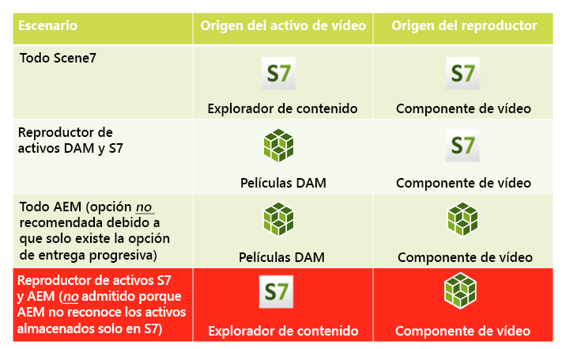
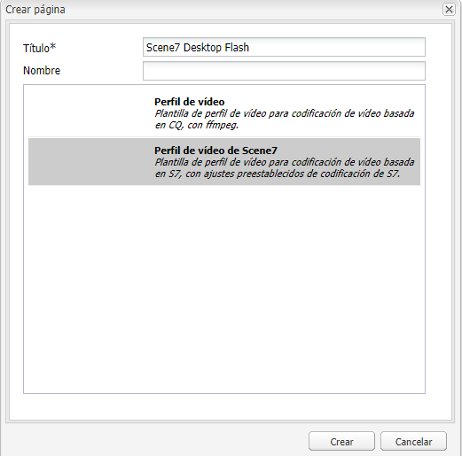
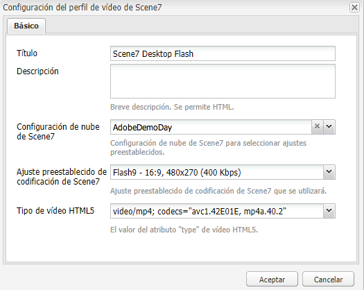

# Vídeo{#video}

>[!CAUTION]
>
>AEM 6.4 ha llegado al final de la compatibilidad ampliada y esta documentación ya no se actualiza. Para obtener más información, consulte nuestra [períodos de asistencia técnica](https://helpx.adobe.com/es/support/programs/eol-matrix.html). Buscar las versiones compatibles [here](https://experienceleague.adobe.com/docs/).

Assets proporciona compatibilidad con la administración centralizada de recursos de vídeo, donde puede cargar vídeos directamente en Assets para la codificación automática en Dynamic Media Classic y acceder a los vídeos de Dynamic Media Classic directamente desde Assets para la creación de páginas.

La integración de vídeo de Dynamic Media Classic amplía el alcance del vídeo optimizado a todas las pantallas (detección automática de dispositivos y ancho de banda).

* El componente de vídeo Dynamic Media Classic (Scene7) realiza automáticamente la detección de dispositivos y ancho de banda para reproducir el formato y la calidad de vídeo correctos en equipos de escritorio, tabletas y dispositivos móviles.
* Recursos: puede incluir conjuntos de vídeos adaptables en lugar de solo recursos de vídeo únicos. Un conjunto de vídeos adaptables es un contenedor para todas las representaciones de vídeo necesarias para reproducir vídeo sin problemas en varias pantallas. Un conjunto de vídeos adaptables agrupa versiones del mismo vídeo codificadas a diferentes velocidades de bits y formatos, como 400 kbps, 800 kbps y 1000 kbps. Utiliza un conjunto de vídeos adaptables, junto con el componente de vídeo S7, para el flujo de vídeo adaptable en varias pantallas, incluidos los dispositivos móviles de escritorio, iOS, Android, Blackberry y Windows. Consulte [Documentación de Scene7 sobre conjuntos de vídeos adaptables para obtener más información](https://experienceleague.adobe.com/docs/dynamic-media-classic/using/setup/application-setup.html#video-presets-for-encoding-video-files).

## Acerca de FFMPEG y Dynamic Media Classic {#about-ffmpeg-and-scene}

El proceso de codificación de vídeo predeterminado se basa en el uso de la integración basada en FFMPEG con perfiles de vídeo. Por lo tanto, el flujo de trabajo de recursos de actualización de DAM integrado contiene los dos pasos de flujo de trabajo basados en FFMP siguientes:

* Miniaturas de FFMPEG
* Codificación FFMPEG

Tenga en cuenta que al habilitar y configurar la integración de Dynamic Media Classic, no se eliminan ni se desactivan automáticamente estos dos pasos de flujo de trabajo del flujo de trabajo de ingesta de recursos de actualización de DAM integrado. Si ya utiliza la codificación de vídeo basada en FFMPEG en AEM, es probable que tenga FFMPEG instalado en sus entornos de creación. En este caso, un nuevo vídeo ingestado con Assets se codificaría dos veces: una desde el codificador FFMPEG y otra desde la integración con Dynamic Media Classic.

Si tiene la codificación de vídeo basada en FFMPEG configurada en AEM y FFMPEG instalado, Adobe recomienda eliminar los dos flujos de trabajo FFMPEG de los flujos de trabajo de recursos de actualización de DAM.

### Formatos admitidos {#supported-formats}

El componente Vídeo de Dynamic Media Classic admite los siguientes formatos:

* F4V H.264
* MP4 H.264

### Decidir dónde cargar el vídeo {#deciding-where-to-upload-your-video}

Decidir dónde cargar los recursos de vídeo depende de lo siguiente:

* ¿Necesita un flujo de trabajo para el recurso de vídeo?
* ¿Necesita control de versiones para el recurso de vídeo?

Si la respuesta es &quot;sí&quot; a una o ambas preguntas, cargue el vídeo directamente en DAM de Adobe. Si la respuesta a ambas preguntas es &quot;no&quot;, cargue el vídeo directamente en Dynamic Media Classic. El flujo de trabajo de cada escenario se describe en la siguiente sección.

#### Si está cargando el vídeo directamente en Recursos de Adobe {#if-you-are-uploading-your-video-directly-to-adobe-assets}

Si necesita un flujo de trabajo o crear versiones de los recursos, primero debe cargarlos en Recursos de Adobe. El siguiente es el flujo de trabajo recomendado:

1. Cargue el recurso de vídeo en Recursos de Adobe y codifique y publique automáticamente en Dynamic Media Classic.
1. En AEM, acceda a los recursos de vídeo de WCM en la **[!UICONTROL Películas]** del Buscador de contenido.
1. Autor con vídeo de Dynamic Media Classic o componente de vídeo base.

#### Si está cargando el vídeo en Dynamic Media Classic {#if-you-are-uploading-your-video-to-scene}

Si no necesita un flujo de trabajo o crear versiones de los recursos, debe cargarlos en Dynamic Media Classic. El siguiente es el flujo de trabajo recomendado:

1. En Dynamic Media Classic, [configurar una carga y codificación de FTP programadas en Dynamic Media Classic (sistema automatizado)](https://experienceleague.adobe.com/docs/dynamic-media-classic/using/upload-publish/uploading-files.html#uploading-your-files).
1. En AEM, acceda a los recursos de vídeo de WCM en la **[!UICONTROL Dynamic Media Classic]** del Buscador de contenido.
1. Autor con el componente de vídeo de Dynamic Media Classic.

### Configuración de la integración con Dynamic Media Classic Video {#configuring-integration-with-scene-video}

**Para configurar ajustes preestablecidos universales**:

1. En **[!UICONTROL Cloud Services]**, vaya a su **[!UICONTROL Dynamic Media Classic]** configuración y haga clic en **[!UICONTROL Editar]**.
1. Seleccione el **[!UICONTROL Vídeo]** pestaña .

   >[!NOTE]
   >
   >La variable **[!UICONTROL Vídeo]** no aparece si la página no tiene una configuración de nube. Consulte [Activación de Dynamic Media Classic para WCM](#enablingscene7forwcm).

1. Seleccione el perfil de codificación de vídeo adaptable, un perfil de codificación de vídeo único incorporado o un perfil de codificación de vídeo personalizado.

   >[!NOTE]
   >
   >Para obtener más información sobre el significado de los ajustes preestablecidos de vídeo, consulte la [Documentación de Dynamic Media Classic](https://experienceleague.adobe.com/docs/dynamic-media-classic/using/setup/application-setup.html#video-presets-for-encoding-video-files).
   >
   >Adobe recomienda seleccionar ambos conjuntos de vídeos adaptables al configurar los ajustes preestablecidos universales o seleccionar la opción **[!UICONTROL Codificación de vídeo adaptable]** .

1. Los perfiles de codificación seleccionados se aplican automáticamente a todos los vídeos cargados en la carpeta de destino de CQ DAM configurada para esta configuración de nube de Dynamic Media Classic. Puede configurar varias configuraciones de nube de Dynamic Media Classic con diferentes carpetas de destino para aplicar distintos perfiles de codificación según sea necesario.

### Actualización de ajustes preestablecidos de visor y codificación {#updating-viewer-and-encoding-presets}

Si necesita actualizar los ajustes preestablecidos de visor y codificación para vídeo en AEM porque los ajustes preestablecidos se han actualizado en Dynamic Media Classic, vaya a la configuración de Dynamic Media Classic en la configuración de nube y haga clic en **Actualizar los ajustes preestablecidos de visor y codificación**.

### Carga del vídeo maestro {#uploading-your-master-video}

Para cargar el vídeo maestro en Dynamic Media Classic desde el DAM de Adobe:

1. Vaya a la carpeta de destino de CQ DAM donde ha configurado la configuración de nube con perfiles de codificación de Dynamic Media Classic.
1. Haga clic en **[!UICONTROL Cargar]** para cargar el vídeo maestro. La carga y codificación de vídeo se completan después de la [!UICONTROL Recurso de actualización DAM] el flujo de trabajo ha finalizado y **[!UICONTROL Publicar en Dynamic Media Classic]** tiene una marca de verificación.

   >[!NOTE]
   >
   >Es posible que las miniaturas de vídeo tarden algún tiempo en generarse.

   Arrastrar el vídeo maestro de DAM a los accesos al componente de vídeo *all* de las representaciones proxy codificadas de Dynamic Media Classic para su entrega.

### Componente de vídeo base frente a componente de vídeo de Dynamic Media Classic {#foundation-video-component-versus-scene-video-component}

Al utilizar AEM, tiene acceso al componente Vídeo disponible en Sitios y al componente de vídeo de Dynamic Media Classic (Scene7). Estos componentes no son intercambiables.

El componente de vídeo de Dynamic Media Classic solo funciona para vídeos de Dynamic Media Classic. El componente base funciona con vídeos almacenados desde AEM (con ffmpeg) y vídeos de Dynamic Media Classic.

La siguiente matriz explica cuándo debe utilizar cada componente:

>[!NOTE]
>
>De serie, el componente de vídeo de Dynamic Media Classic utiliza el perfil de vídeo universal. Sin embargo, puede obtener el reproductor de vídeo basado en HTML5 para AEM. En Dynamic Media Classic, copie el código incrustado del reproductor de vídeo HTML5 listo para usar y colóquelo en su página AEM.

## Componente de vídeo AEM {#aem-video-component}

Aunque se recomiende utilizar el componente de vídeo de Dynamic Media Classic para ver vídeos de Dynamic Media Classic, en esta sección se describe el uso de vídeos de Dynamic Media Classic con la variable [!UICONTROL Componente de vídeo base] en AEM, en aras de la integridad.

### Comparación de vídeo de AEM y Dynamic Media Classic {#aem-video-and-scene-video-comparison}

La siguiente tabla proporciona una comparación de alto nivel de las capacidades admitidas entre el componente de vídeo base de AEM y el componente de vídeo de Scene7:

|  | Vídeo de base de AEM | Vídeo de Dynamic Media Classic |
|---|---|---|
| Enfoque | primer enfoque de HTML5. El Flash solo se utiliza para la reserva que no es de HTML5. | Flash en la mayoría de los escritorios. HTML5 se utiliza para móviles y tabletas. |
| Entrega | Progresivo | Transmisión adaptable |
| Seguimiento | Sí | Sí |
| Extensibilidad | Sí | Sí (con el SDK del visor de Dynamic Media Classic) |
| Vídeo móvil | Sí | Sí |

### Configuración {#setting-up}

#### Creación de perfiles de vídeo {#creating-video-profiles}

Las distintas codificaciones de vídeo se crean según los ajustes preestablecidos de codificación de Dynamic Media Classic seleccionados en la configuración de nube de Dynamic Media Classic. Para que el componente de vídeo base pueda utilizarlos, se debe crear un perfil de vídeo para cada ajuste preestablecido de codificación de Dynamic Media Classic seleccionado. Esto permite que el componente de vídeo seleccione las representaciones de DAM según corresponda.

>[!NOTE]
>
>Los nuevos perfiles de vídeo y los cambios que se realicen en ellos deben activarse para poder publicarse.

1. En AEM, vaya a **[!UICONTROL Herramientas]** y, a continuación, seleccione **[!UICONTROL Consola de configuración]**. En la Consola de configuración, vaya a **[!UICONTROL Herramientas]** > **[!UICONTROL Recursos]** > **[!UICONTROL Perfiles de vídeo]** en el árbol de navegación.
1. Cree un nuevo perfil de vídeo de Dynamic Media Classic. En el **[!UICONTROL Nuevo...]** seleccione **[!UICONTROL Crear página]** y, a continuación, seleccione la plantilla Perfil de vídeo de Dynamic Media Classic . Asigne un nombre a la nueva página de perfil de vídeo y haga clic en **[!UICONTROL Crear]**.

   

1. Edite el nuevo perfil de vídeo. Seleccione primero la configuración de nube. A continuación, seleccione el mismo ajuste preestablecido de codificación que el seleccionado en la configuración de nube.

   

   | Propiedad | Descripción |
   |---|---|
   | Configuración de nube de Dynamic Media Classic (Scene7) | La configuración de nube que se utilizará para los ajustes preestablecidos de codificación. |
   | Ajuste preestablecido de codificación de Dynamic Media Classic (Scene7) | El ajuste preestablecido de codificación con el que asignar este perfil de vídeo. |
   | Tipo de vídeo HTML5 | Esta propiedad permite establecer el valor de la propiedad type del elemento de origen de vídeo HTML5. Esta información no la proporcionan los ajustes preestablecidos de codificación de Dynamic Media Classic, sino que es necesaria para procesar correctamente los vídeos mediante el elemento de vídeo HTML5. Se proporciona una lista para formatos comunes, pero se puede sobrescribir para otros formatos. |

   Repita este paso para todos los ajustes preestablecidos de codificación seleccionados en la configuración de nube que desee utilizar en el componente de vídeo.

#### Configuración del diseño {#configuring-design}

El componente de vídeo base debe saber qué perfiles de vídeo utilizar para crear la lista de fuentes de vídeo. Debe abrir el cuadro de diálogo de diseño de componentes de vídeo y configurar el diseño de componentes para utilizar los nuevos perfiles de vídeo.

>[!NOTE]
>
>Si utiliza el componente de vídeo base en una página móvil, es posible que tenga que repetir estos pasos en el diseño de la página móvil.

>[!NOTE]
>
>Los cambios realizados en el diseño requieren la activación del diseño para que surtan efecto en la publicación.

1. Abra el cuadro de diálogo de diseño del componente de vídeo base y cambie a **[!UICONTROL Perfiles]** pestaña . A continuación, elimine los perfiles predeterminados y añada los nuevos perfiles de vídeo de Dynamic Media Classic. El orden de la lista de perfiles en el cuadro de diálogo de diseño también define el orden del elemento de orígenes de vídeo al realizar la representación.
1. En los navegadores que no admiten HTML5, el componente de vídeo permite configurar una alternativa flash. Abra el cuadro de diálogo de diseño de componentes de vídeo y cambie a la **[!UICONTROL Flash]** pestaña . Configure los ajustes del reproductor Flash y asigne un perfil de reserva para el reproductor Flash.

#### Lista de comprobación {#checklist}

1. Cree una configuración de nube de Dynamic Media Classic (Scene7). Asegúrese de que los ajustes preestablecidos de codificación de vídeo estén configurados y de que el importador se esté ejecutando.
1. Cree un perfil de vídeo de Dynamic Media Classic para cada ajuste preestablecido de codificación de vídeo seleccionado en la configuración de nube.
1. Los perfiles de vídeo deben activarse.
1. Configure el diseño del componente de vídeo base en la página.
1. Active el diseño una vez que haya terminado con los cambios de diseño.
