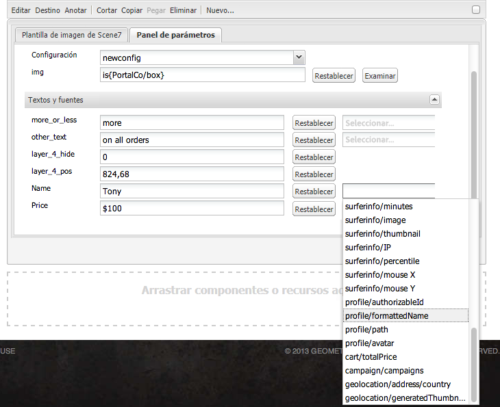

# Añadir funciones de Dynamic Media Classic a su página{#adding-scene-features-to-your-page}

[Adobe Dynamic Media ](https://help.adobe.com/en_US/scene7/using/WS26AB0D9A-F51C-464e-88C8-580A5A82F810.html) Classicis es una solución alojada para administrar, mejorar, publicar y distribuir recursos de medios enriquecidos en pantallas e impresiones web, móviles, de correo electrónico y conectadas a Internet.

Puede realizar la vista de AEM recursos publicados en Dynamic Media Classic en varios visores:

* Zoom
* Flotante
* Vídeo
* Plantilla de imagen
* Imagen

Puede publicar recursos digitales directamente de AEM a Dynamic Media Classic y puede publicarlos de Dynamic Media Classic a AEM.

En esta sección se describe cómo publicar recursos digitales de AEM a Dynamic Media Classic y viceversa. Los visores también se describen en detalle. Para obtener información sobre la configuración de AEM para Dynamic Media Classic, consulte [Integración de Dynamic Media Classic con AEM](/help/sites-administering/scene7.md).

Consulte también [Adición de mapas de imagen](/help/assets/image-maps.md).

Para obtener más información sobre el uso de componentes de vídeo con AEM, consulte lo siguiente:

* [Vídeo](/help/sites-classic-ui-authoring/manage-assets-classic-s7-video.md)

>[!NOTE]
>
>Si los recursos de Dynamic Media Classic no se muestran correctamente, asegúrese de que Dynamic Media esté [deshabilitado](/help/assets/config-dynamic.md#disabling-dynamic-media) y, a continuación, actualice la página.

## Publicación manual en Dynamic Media Classic desde Assets {#manually-publishing-to-scene-from-assets}

Puede publicar recursos digitales en Dynamic Media Classic desde la consola Recursos en la IU clásica o directamente desde el recurso.

>[!NOTE]
>
>AEM publica en Dynamic Media Classic de forma asíncrona. Después de hacer clic en **[!UICONTROL Publicar]**, el recurso puede tardar varios segundos en publicarse en Dynamic Media Classic.

### Publicación desde la consola Recursos {#publishing-from-the-assets-console}

Para publicar en Dynamic Media Classic desde la consola Recursos si los recursos están en una carpeta de destinatario de Dynamic Media Classic:

1. En la IU clásica AEM, haga clic en **[!UICONTROL Recursos digitales]** para acceder al administrador de recursos digitales.

1. Seleccione el recurso (o los recursos) o la carpeta dentro de la carpeta de destinatario que desea publicar en Dynamic Media Classic y haga clic con el botón derecho y seleccione **[!UICONTROL Publicar en Dynamic Media Classic]**. También puede seleccionar **[!UICONTROL Publicar en Dynamic Media Classic]** en el menú **[!UICONTROL Herramientas]**.

   

1. Vaya a Dynamic Media Classic y confirme que los recursos están disponibles.

   >[!NOTE]
   >
   >Si los recursos no están en una carpeta sincronizada de Dynamic Media Classic, **[!UICONTROL Publicar en Dynamic Media Classic]** en ambos menús estará visible pero deshabilitada.

### Publicación desde un recurso {#publishing-from-an-asset}

Puede publicar manualmente un recurso siempre que se encuentre dentro de la carpeta sincronizada de Dynamic Media Classic.

>[!NOTE]
>
>Si el recurso no está ubicado en la carpeta sincronizada de Dynamic Media Classic, el vínculo a **[!UICONTROL Publicar en Dynamic Media Classic]** no está disponible.

**Para publicar en Dynamic Media Classic directamente desde un recurso** digital:

1. En AEM, haga clic en **[!UICONTROL Recursos digitales]** para acceder al administrador de recursos digitales.

1. Haga doble clic en dicha opción para abrir un recurso.

1. En el panel de detalles del recurso, seleccione **[!UICONTROL Publicar en Dynamic Media Classic]**.

   

1. El vínculo cambia a **[!UICONTROL Publicando...]** y, a continuación, a **[!UICONTROL Publicado]**. Vaya a Dynamic Media Classic y confirme que el recurso está disponible.

   >[!NOTE]
   >
   >Si el recurso no se publica correctamente en Dynamic Media Classic, el vínculo cambia a **[!UICONTROL Error al publicar]**. Si el recurso ya se ha publicado en Dynamic Media Classic, el vínculo lee **[!UICONTROL Volver a publicar en Dynamic Media Classic]**. La republicación le permite realizar cambios en un recurso en AEM y volver a publicarlo.

### Publicación de recursos desde fuera de la carpeta de destinatario de CQ {#publishing-assets-from-outside-the-cq-target-folder}

Adobe recomienda publicar recursos en Dynamic Media Classic solo desde los recursos de la carpeta de destinatario de Dynamic Media Classic. Sin embargo, si necesita cargar recursos desde una carpeta fuera de la carpeta destinatario, puede hacerlo cargándolos en una carpeta *ad-hoc* de Dynamic Media Classic.

Para ello, configure la configuración de la nube para la página en la que aparecerá el recurso. A continuación, agregue un componente de Dynamic Media Classic a la página y arrastre y suelte un recurso en el componente. Una vez definidas las propiedades de página para esa página, aparece un vínculo **[!UICONTROL Publicar en Dynamic Media Classic]** que cuando se seleccionan los activadores que se cargan en Dynamic Media Classic.

>[!NOTE]
>
>Los recursos que se encuentran en la carpeta ad-hoc no aparecen en el navegador de contenido de Dynamic Media Classic.

**Para publicar los recursos que residen fuera de la carpeta de destino de CQ**:

1. En AEM en la IU clásica, haga clic en **[!UICONTROL Sitios web]** y navegue a la página web en la que desee agregar un recurso digital que aún no se haya publicado en Dynamic Media Classic. (Se aplican las reglas de herencia de página habituales).

1. En la barra de tareas, haga clic en el icono **[!UICONTROL Página]** y, a continuación, haga clic en **[!UICONTROL Propiedades de la página]**.

1. Haga clic en **[!UICONTROL Cloud Services] > [!UICONTROL Añadir servicios] > [!UICONTROL Dynamic Media Classic (Scene7)]**.
1. En la lista desplegable Adobe Dynamic Media Classic, seleccione la configuración que desee y haga clic en **[!UICONTROL Aceptar]**.

   

1. En la página web, agregue un componente de Dynamic Media Classic (Scene7) a la ubicación deseada en la página.
1. En el buscador de contenido, arrastre un recurso digital hasta el componente. Puede ver un vínculo a **[!UICONTROL Comprobar el estado de publicación de Dynamic Media Classic]**.

   >[!NOTE]
   >
   >Si el recurso digital está en la carpeta de destinatario de CQ, no aparece ningún vínculo a **[!UICONTROL Comprobar estado de publicación de Dynamic Media Classic]**. Los recursos simplemente se colocan en el componente.

   

1. Haga clic en **[!UICONTROL Comprobar el estado de publicación de Dynamic Media Classic]**. Si el recurso no está publicado, AEM publica el recurso en Dynamic Media Classic. Una vez cargado, el recurso se encuentra en la carpeta ad hoc. De forma predeterminada, la carpeta ad-hoc se encuentra en `name_of_the_company/CQ5_adhoc`. Puede [configurarla, si es necesario](#configuringtheadhocfolder).

   >[!NOTE]
   >
   >Si el recurso no está en una carpeta sincronizada de Dynamic Media Classic y no hay ninguna configuración de nube de Dynamic Media Classic asociada a la página actual, la carga fallará.

## Componentes de Dynamic Media Classic (Scene7) {#scene-components}

Los siguientes componentes de Dynamic Media Classic están disponibles en AEM:

* Zoom
* Flotante (zoom)
* Plantilla de imagen
* Imagen
* Vídeo

>[!NOTE]
>
>Estos componentes no están disponibles de forma predeterminada y deben seleccionarse en el modo **[!UICONTROL Diseño]** antes de usarlos.

Una vez que estén disponibles en el modo **[!UICONTROL Diseño]**, puede agregar los componentes a la página como cualquier otro componente de AEM. Los recursos que aún no se han publicado en Dynamic Media Classic se publican en Dynamic Media Classic si se encuentran en una carpeta sincronizada o en una página o con una configuración de nube de Dynamic Media Classic.

### Aviso de fin de vida útil de los visores de Flash {#flash-viewers-end-of-life-notice}

A partir del 31 de enero de 2017, Adobe Dynamic Media Classic dejó de ofrecer asistencia técnica para la plataforma de visor de Flash.

Para obtener más información sobre este cambio importante, consulte [Preguntas más frecuentes sobre el final de la vida útil del visor de Flash](https://docs.adobe.com/content/docs/en/aem/6-1/administer/integration/marketing-cloud/scene7/flash-eol.html).

### Añadir un componente de Dynamic Media Classic en una página {#adding-a-scene-component-to-a-page}

Añadir un componente de Dynamic Media Classic en una página es lo mismo que agregar un componente a cualquier página. Los componentes de Dynamic Media Classic se describen en detalle en las siguientes secciones.

**Para agregar un componente o visor de Dynamic Media Classic a una página de la IU** clásica:

1. En AEM, abra la página donde desee agregar el componente Dynamic Media Classic.

1. Si no hay componentes de Dynamic Media Classic disponibles, haga clic en la regla de la barra de tareas para entrar en el modo **[!UICONTROL Diseño]**, haga clic en **[!UICONTROL Editar]** parsys y seleccione todos los componentes **[!UICONTROL Dynamic Media Classic]** para que estén disponibles.

1. Vuelva al modo **[!UICONTROL Editar]** haciendo clic en el lápiz de la barra de tareas.

1. Arrastre un componente del grupo **[!UICONTROL Dynamic Media Classic]** de la barra de tareas a la página en la ubicación deseada.

1. Haga clic en **[!UICONTROL Editar]** para abrir el componente.

1. Edite el componente según sea necesario y haga clic en **[!UICONTROL Aceptar]** para guardar los cambios.

### Adición de experiencias de visualización interactiva a un sitio web con capacidad de respuesta {#adding-interactive-viewing-experiences-to-a-responsive-website}

El diseño interactivo para sus recursos implica que estos se ajustan según el lugar en que se muestren. Con el diseño interactivo, los mismos recursos se muestran de forma eficaz en varios dispositivos.

**Para añadir una experiencia de visualización interactiva a un sitio interactivo en la interfaz de usuario clásica**:

1. Inicie sesión en AEM y asegúrese de que tiene [Cloud Services Dynamic Media Classic de Adobe](/help/sites-administering/scene7.md#configuring-scene-integration) configurados y de que los componentes de Dynamic Media Classic están disponibles.

   >[!NOTE]
   >
   >Si los componentes de Dynamic Media Classic WCM no están disponibles, asegúrese de habilitarlos mediante el modo **[!UICONTROL Diseño].

1. En un sitio web con los componentes de Dynamic Media Classic activados, arrastre un visor de **[!UICONTROL imagen]** a la página.
1. Edite el componente y ajuste los puntos de interrupción en la ficha **[!UICONTROL Configuración de Dynamic Media Classic]**.

   

1. Confirme que los visores cambian de tamaño de manera interactiva y que las interacciones están optimizadas para dispositivos de escritorio, tabletas y móviles.

### Configuración común a todos los componentes de Dynamic Media Classic {#settings-common-to-all-scene-components}

Aunque las opciones de configuración varían, las siguientes son comunes a todos los componentes de Dynamic Media Classic:

* **[!UICONTROL Referencia del archivo]**: navegue a un archivo al que quiera hacer referencia. La referencia de archivo muestra la URL del recurso y no necesariamente la URL completa de Dynamic Media Classic, incluidos los comandos y parámetros de URL. En este campo no se pueden agregar comandos ni parámetros de URL de Dynamic Media Classic. Deben añadirse mediante la funcionalidad correspondiente del componente.
* **[!UICONTROL Anchura]**: le permite definir la anchura.
* **[!UICONTROL Altura]**: le permite definir la altura.

Estas opciones de configuración se configuran haciendo clic con el doble en un componente de Dynamic Media Classic, por ejemplo, al abrir un componente **[!UICONTROL Zoom]**:

### Zoom {#zoom}

El componente Zoom HTML5 muestra una imagen más grande al pulsar el botón +.

El recurso dispone de herramientas de zoom en la parte inferior. Haga clic en **[!UICONTROL +]** para ampliar. Haga clic en **[!UICONTROL -]** para reducir. Al hacer clic en **[!UICONTROL x]** o en la flecha de zoom de restablecimiento, la imagen vuelve al tamaño original que se importó. Haga clic en las flechas diagonales para pasar a pantalla completa. Haga clic en **[!UICONTROL Editar]** para configurar el componente. Con este componente, puede configurar [opciones comunes a todos los componentes de Dynamic Media Classic](#settings-common-to-all-scene-components).

### Flotante {#flyout}

En el componente Flotante HTML5, el recurso se muestra como una pantalla dividida: a la izquierda aparece con el tamaño especificado y a la derecha aparece la porción modificada con el zoom. Haga clic en **[!UICONTROL Editar]** para configurar el componente. Con este componente, puede configurar [opciones comunes a todos los componentes de Dynamic Media Classic](/help/sites-administering/scene7.md#settingscommontoalldynamicmediaclassiccomponents).

>[!NOTE]
>
>Si el componente Flotante utiliza un tamaño personalizado, se utiliza dicho tamaño y se desactiva la configuración interactiva del componente.
>
>Si el componente Flotante utiliza el tamaño predeterminado, tal como se define en la vista [!UICONTROL Diseño], se utiliza el tamaño predeterminado y el componente se expande para adaptarse al tamaño de presentación de página con la configuración interactiva del componente activada. Sin embargo, tenga en cuenta que existe una limitación en la configuración interactiva del componente. Al utilizar el componente Flotante con la configuración interactiva, no debe usarlo con la ampliación de página completa. De lo contrario, el menú flotante puede extenderse más allá del borde derecho de la página.

### Imagen {#image}

El componente Imagen clásica de Dynamic Media le permite añadir la funcionalidad de Dynamic Media Classic a sus imágenes, como modificadores de Dynamic Media Classic, ajustes preestablecidos de imagen o visor y enfoque. El componente de imagen Dynamic Media Classic es similar a otros componentes de imagen en AEM con una funcionalidad Dynamic Media Classic especial. En este ejemplo, la imagen tiene el modificador URL de Dynamic Media Classic, `&op_invert=1` aplicado.

**[!UICONTROL Título, Texto]**  alternativo: en la ficha   Avanzado, añada un título a la imagen y texto alternativo para los usuarios que tienen gráficos desactivados.

**[!UICONTROL URL, Abrir en]** : puede definir un recurso desde para abrir un vínculo. Configure las **[!UICONTROL URL]** y **[!UICONTROL Abrir en]** para indicar si desea que se abra en la misma ventana o en una nueva.

**[!UICONTROL Ajuste preestablecido]**  de visor: seleccione un ajuste preestablecido de visor existente en el menú desplegable. Si el ajuste preestablecido de visor que busca no está visible, es posible que tenga que hacerlo visible. Consulte [Administración de ajustes preestablecidos de visor](/help/assets/managing-viewer-presets.md). No es posible seleccionar un ajuste preestablecido de visor si utiliza un ajuste preestablecido de imagen, y viceversa.

**[!UICONTROL Configuración]**  de Dynamic Media Classic: seleccione la configuración de Dynamic Media Classic que desee utilizar para recuperar los ajustes preestablecidos de imagen activos de Scene7 Publishing System.

**[!UICONTROL Ajuste preestablecido]**  de imagen: seleccione un ajuste preestablecido de imagen existente en el menú desplegable. Si el ajuste preestablecido de imagen que busca no está visible, es posible que tenga que hacerlo visible. Consulte [Administración de ajustes preestablecidos de imagen](/help/assets/managing-image-presets.md). No es posible seleccionar un ajuste preestablecido de visor si utiliza un ajuste preestablecido de imagen, y viceversa.

**[!UICONTROL Formato]**  de salida: seleccione el formato de salida de la imagen, por ejemplo jpeg. En función del formato de salida que seleccione, puede tener opciones de configuración adicionales. Consulte [Administración de ajustes preestablecidos de imagen](/help/assets/managing-image-presets.md).

**[!UICONTROL Enfoque]** : seleccione cómo desea enfocar la imagen. El enfoque se explica en detalle en [*Calidad de imagen clásica de Dynamic Media Adobe y Optimizaciones para enfoque*](/help/assets/assets/s7_sharpening_images.pdf).

**[!UICONTROL Modificadores]**  de URL: puede cambiar los efectos de imagen proporcionando comandos de imagen adicionales de Dynamic Media Classic. Se describen en [Administración de ajustes preestablecidos de imagen](/help/assets/managing-image-presets.md) y en la [referencia de comando](https://docs.adobe.com/content/help/en/dynamic-media-developer-resources/image-serving-api/image-serving-api/http-protocol-reference/command-reference/c-command-reference.html).

**[!UICONTROL Puntos de interrupción]** : si el sitio web responde, desea ajustar los puntos de interrupción. Los puntos de interrupción deben separarse con comas `,`.

### Plantilla de imagen {#image-template}

[Las plantillas de imagen ](https://help.adobe.com/en_US/scene7/using/WS60B68844-9054-4099-BF69-3DC998A04D3C.html) de Dynamic Media Classic son contenido de Photoshop en capas que se importó a Dynamic Media Classic, donde el contenido y las propiedades se parametrizaron para la variabilidad. El componente **[!UICONTROL Plantilla de imagen]** le permite importar imágenes y cambiar el texto de forma dinámica en AEM. Además, puede configurar el componente **[!UICONTROL Plantilla de imágenes]** para utilizar valores de ClientContext, de modo que cada usuario experimenta la imagen de una forma personalizada.

Haga clic en **[!UICONTROL Editar]** para configurar el componente. Puede configurar [opciones comunes a todos los componentes de Dynamic Media Classic](/help/sites-administering/scene7.md#settingscommontoalldynamicmediaclassicscomponents), así como otras opciones que se describen en esta sección.

**[!UICONTROL Referencia de archivo, Anchura, Altura]** : consulte los ajustes comunes a todos los componentes de Dynamic Media Classic.

>[!NOTE]
>
>Los comandos y parámetros de URL de Dynamic Media Classic no se pueden agregar directamente a la URL de referencia de archivo. Solo se pueden definir en la interfaz de usuario del componente en el panel **[!UICONTROL Parámetro]**.

**[!UICONTROL Título,]** Texto alternativoEn la  [!UICONTROL ficha Plantilla de imagen clásica de ] Dynamic Media, agregue un título a la imagen y texto alternativo para los usuarios que tengan los gráficos desactivados.

**[!UICONTROL URL, Abrir]** enPuede definir un recurso desde para abrir un vínculo. Defina la **[!UICONTROL dirección URL]** y, en **[!UICONTROL Abrir en]**, indique si quiere que se abra en la misma ventana o en una nueva.

**[!UICONTROL Panel]** ParámetrosAl importar una imagen, los parámetros se rellenan previamente con información de la imagen. Si no existe contenido que se pueda cambiar de forma dinámica, esta ventana está vacía.

#### Cambio del texto de forma dinámica {#changing-text-dynamically}

Para cambiar el texto de forma dinámica, escriba el nuevo texto en los campos y haga clic en **[!UICONTROL Aceptar]**. En este ejemplo, el **[!UICONTROL Precio]** es ahora $50 y el envío cuesta 99 centavos.

El texto de la imagen cambia. Para restablecer el texto al valor original, haga clic en **[!UICONTROL Restablecer]** junto al campo.

#### Cambio del texto para reflejar un valor de ClientContext {#changing-text-to-reflect-the-value-of-a-client-context-value}

Para vincular un campo a un valor de contexto de cliente, haga clic en **[!UICONTROL Seleccionar]** para abrir el menú cliente-contexto, seleccione el contexto de cliente y haga clic en **[!UICONTROL Aceptar]**. En este ejemplo, el nombre cambia en función de la vinculación de valor de Nombre con el nombre con formato que consta en el perfil.

El texto refleja el nombre del usuario de la sesión actual. Para restablecer el texto al valor original, haga clic en **[!UICONTROL Restablecer]** junto al campo.

#### Convertir la plantilla de imagen de Dynamic Media Classic en un vínculo {#making-the-scene-image-template-a-link}

**Para convertir la plantilla de imagen de Dynamic Media Classic en un vínculo**:

1. En la página con el componente de plantilla de imagen de Dynamic Media Classic, haga clic en **[!UICONTROL Editar]**.
1. En el campo **[!UICONTROL URL]**, introduzca la dirección URL a la que los usuarios se dirigen al hacer clic en la imagen. En el campo **[!UICONTROL Abrir en]**, seleccione si desea que se abra el destinatario (una ventana nueva o la misma ventana).

   

1. Haga clic en **[!UICONTROL OK]**.

### Componente de vídeo  {#video-component}

El componente **[!UICONTROL Video]** de Dynamic Media Classic (disponible en la sección Dynamic Media Classic de la barra de tareas) utiliza la detección de ancho de banda y dispositivos para proporcionar el vídeo adecuado a cada pantalla. Este componente es un reproductor de vídeo HTML5; se trata de un visor único que se puede utilizar en múltiples canales.

Se puede usar para conjuntos de vídeos adaptables, un solo vídeo MP4 o un solo vídeo F4V.

Consulte [Video](/help/sites-classic-ui-authoring/manage-assets-classic-s7-video.md) para obtener más información sobre cómo funcionan los vídeos con la integración de Dynamic Media Classic. Además, consulte cómo [el componente **Dynamic Media Classic video** se compara con el componente básico **video**](/help/sites-classic-ui-authoring/manage-assets-classic-s7-video.md).

### Limitaciones conocidas del componente de vídeo {#known-limitations-for-the-video-component}

Adobe DAM y WCM muestran si se ha cargado un vídeo maestro. No muestran estos recursos de proxy:

* Representaciones codificadas de Dynamic Media Classic
* Conjuntos de vídeos adaptables de Dynamic Media Classic

Al utilizar un conjunto de vídeos adaptables con el componente de vídeo Dynamic Media Classic, debe cambiar el tamaño del componente para adaptarlo a las dimensiones del vídeo.

## Navegador de contenido de Dynamic Media Classic {#scene-content-browser}

El navegador de contenido de Dynamic Media Classic le permite realizar vistas de contenido desde Dynamic Media Classic directamente en AEM. Para acceder al navegador de contenido, en el Buscador de contenido, seleccione **[!UICONTROL Dynamic Media Classic]** en la interfaz de usuario táctil o el icono **[!UICONTROL S7]** en la interfaz de usuario clásica. La funcionalidad es idéntica en ambas interfaces de usuario.

Si tiene varias configuraciones, AEM muestra de forma predeterminada la [configuración predeterminada](/help/sites-administering/scene7.md#configuring-a-default-configuration). Puede seleccionar diferentes configuraciones directamente en el navegador de contenido de Dynamic Media Classic en el menú desplegable.

>[!NOTE]
>
>* Los recursos ubicados en la carpeta ad-hoc no aparecen en el navegador de contenido de Dynamic Media Classic.
>* Cuando [Previsualización segura está habilitada](/help/sites-administering/scene7.md#configuring-the-state-published-unpublished-of-assets-pushed-to-scene), los recursos publicados y no publicados en Dynamic Media Classic sí aparecen en el explorador de contenido de Dynamic Media Classic.
>* Si no ve **[!UICONTROL Dynamic Media Classic]** o el icono **[!UICONTROL S7]** como una opción en el explorador de contenido, debe [configurar Dynamic Media Classic para que funcione con AEM](/help/sites-administering/scene7.md).

   >
   >
* Para vídeo, el navegador de contenido de Dynamic Media Classic admite:
   >
   >
* Conjuntos de vídeos adaptables: contenedor de todas las representaciones de vídeo necesarias para la reproducción sin errores en varias pantallas.
>* Vídeo MP4 sencillo
>* Vídeo F4V sencillo

### Exploración del contenido en la interfaz de usuario clásica {#browsing-content-in-the-classic-ui}

Para examinar el contenido en Dynamic Media Classic, haga clic en la ficha **[!UICONTROL S7]**.

Puede cambiar la configuración a la que accede seleccionando la configuración. Las carpetas cambian según la configuración seleccionada.

Al igual que ocurre con el buscador de contenido para los recursos, puede buscar recursos y filtrar los resultados. Sin embargo, a diferencia del buscador de recursos, al introducir una palabra clave en la pestaña **[!UICONTROL S7]**, el nombre del archivo *comienza por* la cadena introducida, en lugar de *contener* la palabra clave en el nombre de archivo.

De forma predeterminada, los recursos se muestran por el nombre de archivo. También puede filtrar los resultados por el tipo de recurso.

>[!NOTE]
>
>Para vídeo, el navegador de contenido Dynamic Media Classic de WCM admite:
>
>* Conjuntos de vídeos adaptables: contenedor de todas las representaciones de vídeo necesarias para la reproducción sin errores en varias pantallas.
>* Vídeo MP4 sencillo
>* Vídeo F4V sencillo

>

### Búsqueda de recursos de Dynamic Media Classic con el navegador de contenido {#searching-for-scene-assets-with-the-content-browser}

La búsqueda de recursos de Dynamic Media Classic es similar a la búsqueda de recursos de AEM, excepto que cuando realiza una búsqueda, verá una vista remota de los recursos en el sistema Dynamic Media Classic, en lugar de importarlos directamente a AEM.

Puede utilizar la interfaz de usuario clásica o la optimizada para el uso táctil para ver y buscar recursos. Según la interfaz, la búsqueda es ligeramente diferente.

Al buscar en cualquier interfaz de usuario, puede filtrar según los criterios siguientes (aquí se muestra la IU optimizada para el uso táctil):

**[!UICONTROL Escriba palabras clave]** : puede buscar recursos por nombre. Al buscar, las palabras clave que introduce es por lo que comienza el nombre de archivo. Por ejemplo, al escribir la palabra “natación”, el sistema buscaría cualquier nombre de archivo de recurso que comience por esas letras en ese orden. Asegúrese de hacer clic en Entrar después de escribir el término para buscar el recurso.

**[!UICONTROL Carpeta/ruta]** : el nombre de la carpeta que aparece se basa en la configuración seleccionada. Para ver los niveles inferiores, haga clic en el icono de carpeta, seleccione una subcarpeta y, a continuación, haga clic en la marca de verificación para seleccionarla.

Si introduce una palabra clave y selecciona una carpeta, AEM realiza la búsqueda en esa carpeta y todas las subcarpetas. Sin embargo, si no introduce ninguna palabra clave cuando realice la búsqueda, al seleccionar la carpeta solo se mostrarán los recursos de esa carpeta y no se incluirá ninguna de las subcarpetas.

De forma predeterminada, AEM realiza la búsqueda en la carpeta seleccionada y todas las subcarpetas.

**[!UICONTROL Tipo de]** recursoSeleccione Dynamic Media Classic para examinar el contenido de Dynamic Media Classic. Esta opción solo está disponible si ya ha configurado Dynamic Media Classic.

**** ConfiguraciónSi tiene más de una configuración de Dynamic Media Classic definida en  [!UICONTROL Cloud Services], puede seleccionarla aquí. Como resultado, la carpeta cambiará según la configuración que haya elegido.

**[!UICONTROL Tipo de]** recursoEn el navegador de Dynamic Media Classic, puede filtrar los resultados para incluir cualquiera de los siguientes elementos: imágenes, plantillas, vídeos y conjuntos de vídeos adaptables. Si no selecciona ningún tipo de recurso, AEM busca de manera predeterminada todos los tipos de recursos.

>[!NOTE]
>
>* Al buscar vídeos, se busca una sola representación. Los resultados devuelven la representación original (solo &amp;ast;.mp4) y la representación codificada.
>* Al buscar un conjunto de vídeos adaptables, busca en la carpeta y en todas las subcarpetas, pero solo si ha agregado una palabra clave a la búsqueda. Si no ha añadido ninguna palabra clave, AEM no busca en las subcarpetas.

>

**[!UICONTROL Estado]** de publicaciónPuede filtrar recursos en función del estado de publicación:   Publicado o  [!UICONTROL No publicado]. Si no selecciona ningún [!UICONTROL estado de publicación], AEM de forma predeterminada busca todos los estados de publicación.

