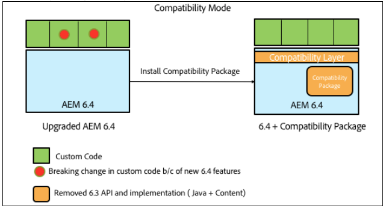

# Compatibilidad con versiones anteriores en AEM 6.4{#backward-compatibility-in-aem}

## Información general {#overview}

>[!NOTE]
>
>Para obtener una lista de los cambios de contenido y configuración que no están incluidos en el ámbito del paquete de compatibilidad, consulte Reestructuración [del repositorio en AEM 6.4](/help/sites-deploying/repository-restructuring.md).

En AEM 6.4, todas las características se han desarrollado teniendo en cuenta la compatibilidad con versiones anteriores.

En la mayoría de los casos, los clientes que ejecutan AEM 6.3 no deben tener que cambiar el código o las personalizaciones al realizar la actualización. Para los clientes de AEM 6.1 y 6.2 no hay cambios de ruptura adicionales que los que se producirían durante una actualización a 6.3.

Para las excepciones en las que las funciones no se podían mantener compatibles con versiones anteriores, se puede lograr la compatibilidad con versiones anteriores para paquetes y contenido mediante la instalación de un paquete de compatibilidad para 6.3 (consulte cómo configurar a continuación para obtener más información sobre dónde descargar). Este paquete compat restaurará la compatibilidad para aplicaciones compatibles con AEM 6.3.

El paquete de compatibilidad le permite ejecutar AEM en modo de compatibilidad y diferir el desarrollo personalizado con nuevas funciones de AEM:

>[!NOTE]
>
>Tenga en cuenta que el paquete de compatibilidad es sólo una solución temporal para aplazar el desarrollo necesario para ser compatible con AEM 6.4, su recomendación solo es una última opción si no puede abordar los problemas de compatibilidad a través del desarrollo inmediatamente después de la actualización. Se recomienda encarecidamente cambiar al modo nativo y desinstalar el paquete de compatibilidad una vez que decida continuar con el desarrollo personalizado basado en 6.4 y utilizar la funcionalidad completa de 6.4.

El paquete de compatibilidad tiene dos modos: **Enrutamiento habilitado** y **Enrutamiento deshabilitado**.

Esto permite que AEM 6.4 se ejecute en tres modos:

**Modo nativo:**

El modo nativo es para clientes que desean utilizar todas las nuevas funciones de AEM 6.4 y están listos para realizar algunas tareas de desarrollo para que sus personalizaciones funcionen con todas las nuevas funciones.

Esto significa que es posible que deba realizar ajustes en la aplicación inmediatamente después de la actualización.

**Modo de compatibilidad: Paquete de compatibilidad instalado con Enrutamiento habilitado**

El modo de compatibilidad es para clientes que tienen personalizaciones de interfaces que no son compatibles con versiones anteriores. Esto permite que AEM se ejecute en modo de compatibilidad y postergue el desarrollo personalizado necesario para las nuevas funciones de AEM que no sean compatibles con algunos de sus códigos personalizados.

**Modo heredado: Paquete de compatibilidad instalado con Enrutamiento deshabilitado**

El modo heredado es para clientes que tienen interfaces personalizadas basadas en código heredado o obsoleto de AEM que se ha movido fuera del paquete de compatibilidad.

## Configuración {#how-to-set-up}

El paquete de compatibilidad de AEM 6.3 se podrá instalar como paquete mediante el Administrador de paquetes en este [vínculo](https://www.adobeaemcloud.com/content/marketplace/marketplaceProxy.html?packagePath=/content/companies/public/adobe/packages/cq640/compatpack/aem-compat-cq64-to-cq63).

Una vez instalado el Paquete de compatibilidad, el enrutamiento se puede habilitar o deshabilitar mediante un conmutador en la configuración OSGI, como se muestra a continuación:

Una vez que se haya instalado y configurado el paquete de compatibilidad, las funciones se utilizarán según el modo de compatibilidad elegido.
