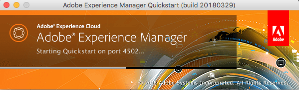
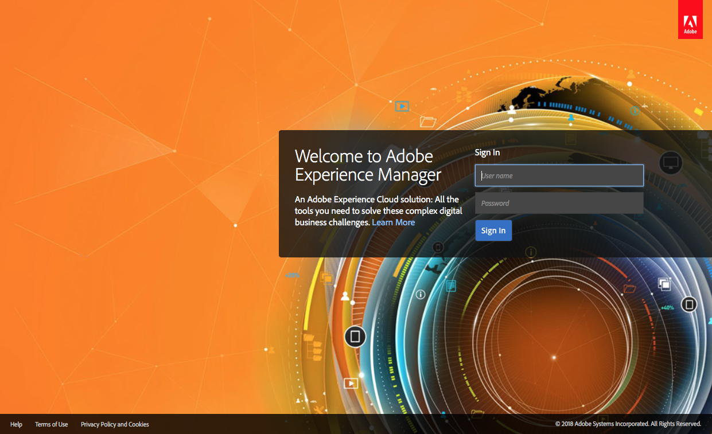

# Implementación y mantenimiento{#deploying-and-maintaining}

En esta página encontrará:

* [Conceptos básicos](#basic-concepts)

   * [¿Qué es AEM?](#what-is-aem)
   * [Implementaciones habituales](#typical-deployment-scenarios) 

      * [In situ](#on-premise)
      * [Servicios administrados mediante Cloud Manager](#managed-services-using-cloud-manager)

* [Introducción](#getting-started)

   * [Requisitos previos](#prerequisites)
   * [Obtención del software](#getting-the-software)
   * [Instalación local predeterminada](#default-local-install)
   * [Creación y publicación de instalaciones](#author-and-publish-installs)
   * [Directorio de instalación sin empaquetar](#unpacked-install-directory)
   * [Inicio y parada](#starting-and-stopping)

Una vez familiarizado con estos conceptos básicos, encontrará información más avanzada y detallada en las siguientes subpáginas:

* [Requisitos técnicos](/help/sites-deploying/technical-requirements.md)
* [Implementaciones recomendadas](/help/sites-deploying/recommended-deploys.md)
* [Instalación independiente personalizada](/help/sites-deploying/custom-standalone-install.md)
* [Instalación del servidor de aplicaciones](/help/sites-deploying/application-server-install.md)
* [Solución de problemas](/help/sites-deploying/troubleshooting.md)
* [Línea de comandos: start y stop](/help/sites-deploying/command-line-start-and-stop.md)
* [Configuración](/help/sites-deploying/configuring.md)
* [Actualización a AEM 6.4](/help/sites-deploying/upgrade.md)
* [eCommerce](/help/sites-deploying/ecommerce.md)
* [Artículos de procedimientos de configuración](/help/sites-deploying/ht-deploy.md)
* [Consola web](/help/sites-deploying/web-console.md)
* [Resolución de problemas de replicación](/help/sites-deploying/troubleshoot-rep.md)
* [Prácticas recomendadas  ](/help/sites-deploying/best-practices.md)
* [Implementación de comunidades](/help/communities/deploy-communities.md)
* [Introducción a la plataforma AEM](/help/sites-deploying/platform.md)
* [Directrices de rendimiento](/help/sites-deploying/performance-guidelines.md)
* [Introducción a AEM Mobile](/help/mobile/getting-started-aem-mobile.md)
* [Actualizar definiciones del vehículo de lanzamiento](/help/sites-deploying/update-release-vehicle-definitions.md)
* [¿Qué es AEM Screens?](/help/screens/aem-screens-introduction.md)

## Conceptos básicos {#basic-concepts}

### What is AEM? {#what-is-aem}

Adobe Experience Manager es un sistema de cliente-servidor basado en web para crear, administrar e implementar sitios web comerciales y servicios relacionados. Combina varias funciones a nivel de infraestructura y aplicación en un único paquete integrado.

A nivel de infraestructura, AEM proporciona lo siguiente:

* **Servidor** de Aplicación web: AEM se puede implementar en modo independiente (incluye un servidor web integrado de Jetty) o como una aplicación web en un servidor de aplicaciones de terceros (WebLogic, WebSphere, etc.).
* **Marco** de Aplicación web: AEM incorpora el módulo de Aplicación web Sling que simplifica la escritura de aplicaciones web con orientación a contenido RESTful.
* **Repositorio** de contenido: AEM incluye un repositorio de contenido Java (JCR), un tipo de base de datos jerárquica diseñada específicamente para datos no estructurados y semiestructurados. El repositorio almacena no sólo el contenido orientado al usuario, sino también todo el código, las plantillas y los datos internos utilizados por la aplicación.

Basándose en esto, AEM también oferta una serie de funciones de nivel de aplicación para la administración de:

* **Sitios web**
* **Aplicaciones móviles**
* **Publicaciones digitales**
* **Formularios**
* **Recursos digitales**
* **Comunidades**
* **Comercio en línea**

Por último, los clientes pueden utilizar estos componentes de infraestructura y de nivel de aplicación para crear soluciones personalizadas mediante la creación de aplicaciones propias.

El servidor AEM está basado en **Java** y se ejecuta en la mayoría de los sistemas operativos que admiten esa plataforma. Toda la interacción del cliente con AEM se realiza a través de un navegador **web**.

### Escenarios de implementación típicos {#typical-deployment-scenarios}

En la terminología de AEM, una &quot;instancia&quot; es una copia de AEM que se ejecuta en un servidor. Las instalaciones de AEM suelen incluir al menos dos instancias, normalmente en equipos independientes:

* **Autor**: Instancia de AEM que se utiliza para crear, cargar y editar contenido y administrar el sitio web. Una vez que el contenido está listo para activarse, se replica en la instancia de publicación.
* **Publicar**: Instancia de AEM que proporciona el contenido publicado al público.

Estas instancias son idénticas en términos de software instalado. Solo se diferencian por configuración. Además, la mayoría de las instalaciones utilizan un distribuidor:

* **Dispatcher**: Un servidor web estático (Apache httpd, Microsoft IIS, etc.) se ha ampliado con el módulo de despachante de AEM. Almacena en caché las páginas web producidas por la instancia de publicación para mejorar el rendimiento.

Hay muchas opciones avanzadas y elaboraciones de esta configuración, pero el patrón básico de creación, publicación y despachante está en el centro de la mayoría de las implementaciones. Empezaremos por centrarnos en una configuración relativamente simple. A continuación se analizarán las opciones de implementación avanzada.

Las siguientes secciones describen ambos escenarios:

* **In situ**: AEM implementado y gestionado en su entorno corporativo.

* **Servicios gestionados - Administrador de nube para Adobe Experience Manager**: AEM implementado y administrado por Adobe Managed Services.

### On-premise {#on-premise}

Puede instalar AEM en servidores de su entorno corporativo. Las instancias de instalación habituales incluyen: entornos de desarrollo, prueba y publicación. Consulte la sección [Introducción](/help/sites-deploying/deploy.md#getting-started) para obtener detalles básicos sobre cómo obtener el software AEM para instalarlo localmente.

Para obtener más información sobre las implementaciones locales típicas, consulte Implementación [recomendada](/help/sites-deploying/recommended-deploys.md).

### Servicios administrados mediante Cloud Manager {#managed-services-using-cloud-manager}

Los servicios gestionados de AEM son una solución completa para la administración de experiencias digitales. Ofrece beneficios de la solución de envío de experiencias en la nube, al tiempo que conserva todos los beneficios de control, seguridad y personalización de una implementación local. Los servicios gestionados de AEM permiten a los clientes iniciarse más rápidamente mediante la implementación en la nube y también gracias a las prácticas recomendadas y la asistencia técnica de Adobe. Las organizaciones y los usuarios empresariales pueden atraer a los clientes en un tiempo mínimo, impulsar la participación en el mercado y centrarse en crear campañas de mercadotecnia innovadoras, al tiempo que reducen la carga que supone para la TI.

Con los servicios gestionados de AEM, los clientes pueden disfrutar de las siguientes ventajas:

**Tiempo de salida al mercado más rápido:** Con una infraestructura flexible de nube de los servicios gestionados de Adobe, las organizaciones pueden planificar, lanzar y optimizar rápidamente experiencias digitales exitosas. Adobe gestiona la arquitectura en la nube sin necesidad de capital, hardware ni software adicionales, y los ingenieros de éxito de los clientes de Adobe le ayudarán con la arquitectura, el aprovisionamiento y la personalización de AEM para conectarse a aplicaciones de back-end y las prácticas recomendadas para la puesta en marcha.

**Mayor rendimiento:** Proporciona experiencias digitales fiables para su empresa con cuatro opciones de disponibilidad de servicios: 99,5%, 99,9%, 99,95% y 99,99%. Además, permite el backup automático y los modelos multimodo de recuperación ante desastres para garantizar la confiabilidad y la administración de contingencias.

**Costos de TI optimizados:** La orientación y la experiencia proactivas ayudan a las organizaciones a mantenerse al día en la última versión de AEM. El mantenimiento y la asistencia de Adobe Platinum se incluyen automáticamente en las nuevas implementaciones de AMS Enterprise/Basic, que ofrecen experiencia técnica y operativa para ayudar a las organizaciones a mantener sus aplicaciones de misión crítica. Las funciones básicas gratuitas de Analytics o Destinatario oferta un valor adicional, especialmente para organizaciones de mercado medio con necesidades limitadas de análisis y personalización.

**Seguridad máxima:** Garantiza la seguridad física, de red y de datos de nivel empresarial alojando aplicaciones de cliente en una instalación de acceso restringido, detrás de sistemas de firewall o dentro de una nube privada virtual. Incluye máquinas virtuales de un solo inquilino con cifrado sólido de almacenamiento de datos, antivirales y aislamiento de datos.

**Administrador** de nube: Cloud Manager, parte de la oferta de servicios gestionados de Adobe Experience Manager, es un portal de autoservicio que permite a las organizaciones administrar Adobe Experience Manager de forma automática en la nube. Incluye una integración continua de última generación y una canalización de envío continuo (CI/CD) que permite a los equipos de TI y a los socios de implementación acelerar el envío de personalizaciones o actualizaciones sin comprometer el rendimiento ni la seguridad. Cloud Manager solo está disponible para los clientes de los servicios gestionados de Adobe.

Para obtener más información sobre Cloud Manager y sus recursos, consulte la Guía [**del usuario de **](https://helpx.adobe.com/experience-manager/cloud-manager/user-guide.html)Cloud Manager.

## Introducción {#getting-started}

### Requisitos previos {#prerequisites}

Aunque las instancias de producción suelen ejecutarse en equipos dedicados que ejecutan un sistema operativo oficialmente admitido (consulte Requisitos [](/help/sites-deploying/technical-requirements.md)técnicos), el servidor de Experience Manager se ejecutará en cualquier sistema que admita [**Java Standard Edition 8 **](https://www.oracle.com/technetwork/java/javase/downloads/jdk8-downloads-2133151.html).

Para familiarizarse y desarrollar en AEM, es bastante común utilizar una instancia instalada en el equipo local que ejecuta Apple OS X o versiones de escritorio de Microsoft Windows o Linux.

En el lado del cliente, AEM funciona con todos los navegadores modernos (**Microsoft Edge**, **Internet Explorer** 11, **Chrome** 51+, **Firefox** 47+, **Safari** 8+) en los sistemas operativos de escritorio y tablet. Consulte Plataformas de cliente [admitidas](/help/sites-deploying/technical-requirements.md#supported-client-platforms) para obtener más información.

### Obtención del software {#getting-the-software}

Customers with a valid maintenance and support contract should have received a mail notification with a code and be able to download AEM from the [**Adobe Licensing Website **](https://licensing.adobe.com/). Business partners can request download access from[**spphelp@adobe.com **](mailto:spphelp@adobe.com).

El paquete de software de AEM está disponible en dos formatos:

* **cq-quickstart-6.4.0.jar:** Archivo *jar* ejecutable independiente que incluye todo lo necesario para ponerse en marcha.

* **cq-quickstart-6.4.0.war:** Un archivo de *guerra* para la implementación en un servidor de aplicaciones de terceros.

En la siguiente sección describimos la instalación **independiente**. Para obtener más información sobre la instalación de AEM en un servidor de aplicaciones, consulte Instalación [de Application Server](/help/sites-deploying/application-server-install.md).

### Instalación local predeterminada {#default-local-install}

1. Cree un directorio de instalación en el equipo local. Por ejemplo:

   Ubicación de instalación de UNIX: **/opt/aem**

   Ubicación de instalación de Windows: **`C:\Program Files\aem`**

   Del mismo modo, es común instalar instancias de ejemplo en una carpeta del escritorio. En cualquier caso, nos referiremos a esta ubicación de forma genérica como:

   `<aem-install>`

   *Tenga en cuenta que la ruta del directorio de archivos debe constar únicamente de caracteres ASCII de EE.UU.*

1. Coloque los archivos **jar** y **licencia** en este directorio:

   ```shell
   <aem-install>/
       cq-quickstart-6.4.0.jar
       license.properties
   ```

   Si no proporciona un `license.properties` archivo, AEM redirigirá el navegador a una pantalla de **bienvenida** al iniciar, donde puede introducir una clave de licencia. Deberá solicitar una clave de licencia válida a Adobe si todavía no la tiene.

1. Para inicio de la instancia en un entorno GUI, haga clic con el botón doble en el **`cq-quickstart-6.4.0.jar`** archivo.

   Como alternativa, puede iniciar AEM desde la línea de comandos. Para una VM Java de 32 bits, introduzca lo siguiente:

   ```shell
       java -Xmx1024M -jar cq-quickstart-6.4.0.jar
   ```

   Para una VM de 64 bits, introduzca:

   ```shell
       java -XX:MaxPermSize=256m -Xmx1024M -jar cq-quickstart-6.4.0.jar
   ```

AEM tardará unos minutos en desempaquetar el archivo jar, instalarse y inicio. El procedimiento anterior da lugar a:

* una instancia de autor **de** AEM
* ejecución en **localhost**
* sobre el puerto **4502**

Para acceder a la instancia, dirija el explorador a:

**`http://localhost:4502`**

El resultado en la instancia de autor se configurará automáticamente para conectarse a una instancia **de** publicación en **`localhost:4503`**.

### Creación y publicación de instalaciones {#author-and-publish-installs}

La instalación predeterminada (una instancia de **autor** activada **`localhost:4502`**) se puede cambiar simplemente cambiando el nombre del `jar` archivo antes de iniciarlo por primera vez. El patrón de nomenclatura es:

**`cq-<instance-type>-p<port-number>.jar`**

Por ejemplo, cambiar el nombre del archivo a

**`cq-author-p4502.jar`**

y al iniciarla, se ejecutará una instancia de autor en **`localhost:4502`**.

Del mismo modo, al cambiar el nombre del archivo y al iniciarlo

**`cq-publish-p4503.jar`**

resultará en una instancia de publicación en ejecución **`localhost:4503`**.

instalaría estas dos instancias en, por ejemplo

`<aem-install>/author`y

**`<aem-install>/publish`**

Para obtener más información sobre la personalización de la instalación, consulte:

* [Instalación independiente personalizada](/help/sites-deploying/custom-standalone-install.md)
* [Ejecutar modos](/help/sites-deploying/configure-runmodes.md)

### Directorio de instalación sin empaquetar {#unpacked-install-directory}

Cuando el tarro de arranque rápido se inicia por primera vez se descomprime en el mismo directorio bajo un nuevo subdirectorio llamado `crx-quickstart`. Debería terminar con lo siguiente:

```xml
<aem-install>/
    license.properties
    cq-quickstart-6.4.0.jar
    crx-quickstart/
        app/
        bin/
        conf/
        launchpad/
        logs/
        metrics/        
        monitoring/
        opt/
        repository/
        threaddumps/
        eula-de_DE.html
        eula-en_US.html
        eula-fr_FR.html
        eula-ja_JP.html
        readme.txt
```

Si la instancia se instaló desde la interfaz gráfica de usuario, se abrirá automáticamente una ventana del explorador y también se abrirá una ventana de la aplicación de escritorio con el host y el puerto de la instancia y un conmutador de activación y desactivación:



>[!NOTE]
>
>Si está utilizando enlaces simbólicos, consulte [los problemas con el enlace simbólico](https://helpx.adobe.com/experience-manager/kb/changing-symlink.html).

### Inicio y parada {#starting-and-stopping}

Una vez que AEM se ha desempaquetado y se ha iniciado por primera vez, el doble de hacer clic en el archivo jar del directorio de instalación simplemente inicio la instancia, no la vuelve a instalar.

Para detener la instancia desde la interfaz gráfica de usuario (GUI), simplemente haga clic en el conmutador **encendido/apagado** en la ventana de la aplicación de escritorio.

También puede detener y inicio de AEM desde la línea de comandos. Suponiendo que ya ha instalado la instancia por primera vez, los scripts **de la línea de** comandos se encuentran aquí:

**`<aem-install>/crx-quickstart/bin/`**

Esta carpeta contiene los siguientes scripts de shell de bash de Unix:

* **`start`**:: Inicio la instancia
* `stop`:: Detiene la instancia
* **`status`**:: Informa del estado de la instancia
* **`quickstart`**:: Se utiliza para configurar la información de inicio, si es necesario.

También hay **`bat`** archivos equivalentes para Windows. Para obtener información más detallada, consulte:

* [Línea de comandos: start y stop](/help/sites-deploying/command-line-start-and-stop.md)

AEM inicio y redirige automáticamente el navegador web a la página adecuada, generalmente la página de inicio de sesión; por ejemplo:

`http://localhost:4502/`



Una vez que haya iniciado sesión, podrá acceder a AEM. Para obtener más información, en función de su función, consulte:

* [Creación  ](/help/sites-authoring/home.md)
* [Administración](/help/sites-administering/home.md)
* [Desarrollo de](/help/sites-developing/home.md)
* [Administración](/help/managing/best-practices.md)

## Implementación avanzada {#advanced-deployment}

La sección anterior debería ofrecerle una buena comprensión de los conceptos básicos de la instalación de AEM. Sin embargo, la instalación de un sistema de producción completo de AEM puede implicar una complejidad considerablemente mayor. Para obtener una cobertura completa de la instalación avanzada, consulte las siguientes subpáginas:

* [Requisitos técnicos](/help/sites-deploying/technical-requirements.md)
* [Implementaciones recomendadas](/help/sites-deploying/recommended-deploys.md)
* [Instalación independiente personalizada](/help/sites-deploying/custom-standalone-install.md)
* [Instalación del servidor de aplicaciones](/help/sites-deploying/application-server-install.md)
* [Solución de problemas](/help/sites-deploying/troubleshooting.md)
* [Línea de comandos: start y stop](/help/sites-deploying/command-line-start-and-stop.md)
* [Configuración](/help/sites-deploying/configuring.md)
* [Actualización a AEM 6.4](/help/sites-deploying/upgrade.md)
* [eCommerce](/help/sites-deploying/ecommerce.md)
* [Artículos de procedimientos de configuración](/help/sites-deploying/ht-deploy.md)
* [Consola web](/help/sites-deploying/web-console.md)
* [Resolución de problemas de replicación](/help/sites-deploying/troubleshoot-rep.md)
* [Prácticas recomendadas  ](/help/sites-deploying/best-practices.md)
* [Implementación de comunidades](/help/communities/deploy-communities.md)
* [Introducción a la plataforma AEM](/help/sites-deploying/platform.md)
* [Directrices de rendimiento](/help/sites-deploying/performance-guidelines.md)
* [Introducción a AEM Mobile](/help/mobile/getting-started-aem-mobile.md)
* [Actualizar definiciones del vehículo de lanzamiento](/help/sites-deploying/update-release-vehicle-definitions.md)
* [¿Qué es AEM Screens?](/help/screens/aem-screens-introduction.md)

