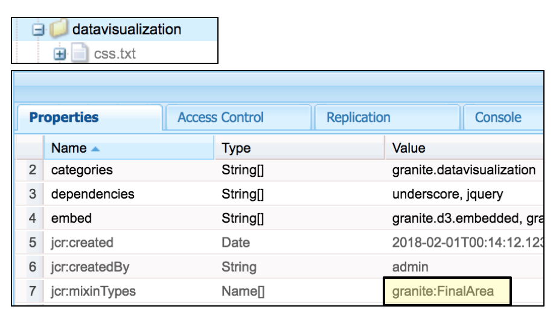

# Actualizaciones sostenibles{#sustainable-upgrades}

>[!CAUTION]
>
>AEM 6.4 ha llegado al final de la compatibilidad ampliada y esta documentación ya no se actualiza. Para obtener más información, consulte nuestra [períodos de asistencia técnica](https://helpx.adobe.com/es/support/programs/eol-matrix.html). Buscar las versiones compatibles [here](https://experienceleague.adobe.com/docs/).

## Marco de personalización {#customization-framework}

### Arquitectura (Funcional / Infraestructura / Contenido / Aplicación)  {#architecture-functional-infrastructure-content-application}

La función del marco de personalización está diseñada para ayudar a reducir las infracciones en áreas no extensibles del código (como APIS) o contenido (como superposiciones) que no sean fáciles de actualizar.

Existen dos componentes del marco de personalización: el **Superficie de API** y **Clasificación de contenido**.

#### Superficie de API {#api-surface}

En versiones anteriores de AEM muchas API se han expuesto a través de Uber Jar. Algunas de estas API no estaban pensadas para ser utilizadas por los clientes, pero estaban expuestas a admitir AEM funcionalidad en varios paquetes. En adelante, las API de Java se marcarán como públicas o privadas para indicar a los clientes qué API pueden utilizar con seguridad en el contexto de las actualizaciones. Otros detalles son:

* API de Java marcadas como `Public` se puede usar y usar como referencia en los paquetes de implementación personalizados.

* Las API públicas serán compatibles con la instalación de un paquete de compatibilidad.
* El paquete de compatibilidad contendrá una compatibilidad con Uber JAR para garantizar la compatibilidad con versiones anteriores
* API de Java marcadas como `Private` están pensados para ser utilizados únicamente por AEM paquetes internos y no deben ser utilizados por paquetes personalizados.

>[!NOTE]
>
>El concepto de `Private` y `Public` en este contexto no debe confundirse con las nociones de Java de las clases públicas y privadas.

#### Clasificaciones de contenido {#content-classifications}

AEM ha utilizado durante mucho tiempo la principal función de superposiciones y fusión de recursos de Sling para permitir a los clientes ampliar y personalizar AEM funcionalidad. La funcionalidad predefinida que alimenta las consolas de AEM y la IU se almacena en **/libs**. Los clientes nunca deben modificar nada debajo **/libs** pero podría añadir contenido adicional debajo de **/apps** para superponer y ampliar la funcionalidad definida en **/libs** (Consulte Desarrollo con superposiciones para obtener más información). Esto causaba numerosos problemas al actualizar AEM como contenido en **/libs** puede cambiar, lo que provoca que la funcionalidad de superposición se rompa de formas inesperadas. Los clientes también pueden ampliar los componentes de AEM mediante la herencia `sling:resourceSuperType`, o simplemente haga referencia a un componente en **/libs** directamente a través de sling:resourceType. Pueden producirse problemas de actualización similares con casos de uso de referencia y de anulación.

Para que sea más seguro y fácil para los clientes comprender qué áreas de **/libs** son seguros para usar y superponer el contenido en **/libs** se ha clasificado con las siguientes mezclas:

* **Público (granito:área pública)** - Define un nodo como público para que se pueda superponer, heredar ( `sling:resourceSuperType`) o se usa directamente ( `sling:resourceType`). Los nodos situados debajo de /libs marcados como públicos serán seguros de actualizar con la adición de un paquete de compatibilidad. En general, los clientes solo deben aprovechar los nodos marcados como públicos.

* **Abstracto (granito:AbstractArea)** - Define un nodo como abstracto. Los nodos se pueden superponer o heredar ( `sling:resourceSupertype`) pero no debe usarse directamente ( `sling:resourceType`).

* **Final (granite:FinalArea)** - Define un nodo como final. Los nodos clasificados como finales no se pueden superponer ni heredar. Los nodos finales se pueden utilizar directamente mediante `sling:resourceType`. Los subnodos bajo el nodo final se consideran internos de forma predeterminada

* **Interno (granite:InternalArea)** - Define un nodo como interno. Los nodos clasificados como internos no se pueden superponer, heredar ni utilizar directamente. Estos nodos solo están pensados para la funcionalidad interna de AEM

* **Sin anotación** - Los nodos heredan la clasificación en función de la jerarquía de árbol. La raíz / es pública de forma predeterminada. **Los nodos con una matriz clasificada como interna o final también deben tratarse como internos.**

>[!NOTE]
>
>Estas políticas solo se aplican contra los mecanismos basados en rutas de búsqueda de Sling. Otras áreas de **/libs** como una biblioteca del lado del cliente se puede marcar como `Internal`, pero podría seguir utilizándose con la inclusión clientlib estándar. Es importante que un cliente siga respetando la clasificación interna en estos casos.

#### Indicadores de tipo de contenido del CRXDE Lite {#crxde-lite-content-type-indicators}

Las mezclas aplicadas en el CRXDE Lite mostrarán los nodos de contenido y los árboles marcados como `INTERNAL` como atenuado. Para `FINAL` solo el icono aparece atenuado. Los elementos secundarios de estos nodos también aparecerán en gris. La funcionalidad Nodo de superposición está deshabilitada en ambos casos.

**Público**

**Final**

**Internas**

**Comprobación del estado del contenido**

AEM 6.4 se enviará con una comprobación de estado para avisar a los clientes si el contenido superpuesto o referenciado se utiliza de forma incompatible con la clasificación de contenido.

La variable **Comprobación de acceso al contenido de Sling/Granite** es una nueva comprobación de estado que supervisa el repositorio para ver si el código de cliente accede incorrectamente a los nodos protegidos en AEM.

Esto analizará **/apps** y normalmente tardan varios segundos en completarse.

Para acceder a esta nueva comprobación de estado, debe hacer lo siguiente:

1. En la pantalla principal de AEM, vaya a **Herramientas > Operaciones > Informes de estado**
1. Haga clic en el **Comprobación de acceso al contenido de Sling/Granite** como se muestra a continuación:

   

Una vez completado el análisis, aparecerá una lista de advertencias notificando al usuario final del nodo protegido al que se hace referencia incorrectamente:

Después de corregir las violaciones, volverá al estado verde:

La comprobación de estado muestra la información recopilada por un servicio en segundo plano que comprueba de forma asíncrona siempre que se utiliza una superposición o un tipo de recurso en todas las rutas de búsqueda de Sling. Si las mezclas de contenido se utilizan incorrectamente, se informa de una infracción.
