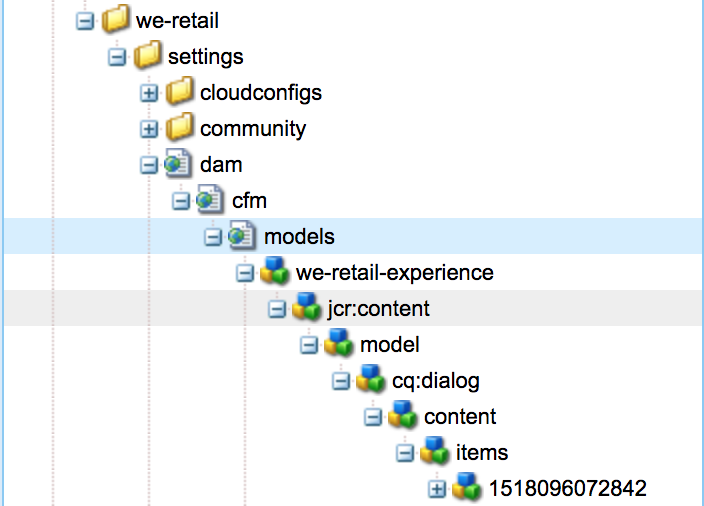

# NO PUBLICAR, PERO NO DELETE Personalizar modelos de fragmentos de contenido{#do-not-publish-but-do-not-delete-customizing-content-fragment-models}

>[!CAUTION]
>
>AEM 6.4 ha llegado al final de la compatibilidad ampliada y esta documentación ya no se actualiza. Para obtener más información, consulte nuestra [períodos de asistencia técnica](https://helpx.adobe.com/es/support/programs/eol-matrix.html). Buscar las versiones compatibles [here](https://experienceleague.adobe.com/docs/).

El editor del modelo de fragmento de contenido es un asistente basado en `Formbuilder`, heredado de:

`granite/ui/components/foundation/form/formbuilder`

Este componente tiene las herramientas necesarias para procesar la interfaz de arrastrar y soltar del editor de modelos, con tipos de datos y propiedades para cada uno.

## Ubicaciones {#locations}

Los modelos se guardan y se crean en `/conf`, en una carpeta que tenga la variable [Propiedad de los modelos de fragmento de contenido](/help/assets/content-fragments-models.md#enable-content-fragment-models) activada. Esta configuración también se puede ver en la **Propiedades de configuración**, accesible desde el **[Explorador de configuración](/help/sites-administering/configurations.md)**.

1. Vaya al explorador a través de **Herramientas**, **General**, **Explorador de configuración**
Por ejemplo, 
`http://localhost:4502/libs/granite/configurations/content/view.html/conf`

1. En el explorador, seleccione la configuración adecuada y luego **Propiedades** en la barra de herramientas.

   Por ejemplo, las propiedades de `global`: `http://localhost:4502/libs/granite/configurations/content/edit.html/conf/global`

En la consola de modelos, todas las carpetas con la variable **Modelos de fragmento de contenido** aparecerá. Navegar por **Herramientas**, **Recursos**, **Modelos de fragmento de contenido**; por ejemplo, `http://localhost:4502/libs/dam/cfm/models/console/content/models.html/conf`.

Un usuario puede [crear un modelo de fragmento de contenido](/help/assets/content-fragments-models.md#creating-a-content-fragment-model) usando la variable **Crear modelo** asistente (mediante **Crear** desde la consola).

>[!CAUTION]
>
>You ***must*** no cambie nada en la variable `/libs` ruta.
>
>Esto se debe a que el contenido de `/libs` se sobrescribe la próxima vez que actualice la instancia (y se puede sobrescribir al aplicar una corrección o un paquete de funciones).

## Estructura de un modelo {#structure-of-a-model}

El asistente creará una entrada con esta estructura:

* `../settings/dam/cfm/models`

   Todos los modelos se guardan en subcarpetas de esta carpeta.

* `jcr:content`

   Cada modelo contiene un `jcr:content` nodo que:

   * contiene propiedades de información sobre el modelo como `jcr:title`, `lastModified`, `lastModifiedBy`
   * normalmente tiene la variable `sling:ResourceType` de `dam/cfm/models/console/components/data/entity/default`,

      con la variable `sling:ResourceSuperType` de `dam/cfm/models/console/components/data/entity`

* `model`

   La variable `model` node contiene una propiedad `dataTypesConfig`, se utiliza para determinar los tipos de datos utilizados en el editor de modelos.

* `items`

   En el `items` , se guardan todos los tipos de datos agregados al modelo (como arrastrados y soltados en el editor de modelos). A cada elemento se le asigna un nombre de nodo aleatorio, pero para que el editor de fragmentos de contenido funcione con este modelo, cada elemento debe tener un `name` propiedad. Además, en este nodo se guardan todas las propiedades de configuración de un tipo de datos concreto, incluidas las propiedades predeterminadas necesarias para procesar los componentes.

>[!CAUTION]
>
>Todos los tipos de datos se arrastran y se sueltan en un editor de modelos y, como tales, se crean instancias de ellos. **must** tienen la variable `name` propiedad introducida por el usuario.
>
>Esto se ve como **Nombre de propiedad &amp;ast;** en el **Propiedades** pestaña del editor de modelos.

## Estructura del Editor de modelos {#structure-of-the-model-editor}

La variable **Editor del modelo de fragmento de contenido** tiene dos partes:

* El panel de vista previa, o vista, del lado izquierdo, donde puede soltar elementos. Así pues:

   * Muestra una vista previa del **Tipo de datos** se crea una instancia de .
   * Permite ordenar dentro del Editor de modelos.

* La variable **Tipos de datos**/**Propiedades** en el panel de la derecha. Así pues:

   * Muestra una lista de tipos de datos que se pueden arrastrar y crear instancias.
   * Para el editor de modelos listo para usar, la lista está presente en:

      `/libs/settings/dam/cfm/models/formbuilderconfig/datatypes`

      <!-- Please uncomment when file is used
      This node contains all the data types currently supported in the model editor. For more information on how to configure the data types, see [Customizing Data Types for Content Fragment Models](/help/sites-developing/customizing-content-fragment-model-data-types.md).
      -->

   * Todos los tipos de datos procesados tienen dos etiquetas de script que, al crearse una instancia, formarán la vista (el componente representado en el lado izquierdo) y la **Propiedades** , que define las propiedades que un usuario puede definir para un componente determinado.

>[!CAUTION]
>
>You ***must*** no cambie nada en la variable `/libs` ruta.
>
>Esto se debe a que el contenido de `/libs` se sobrescribe la próxima vez que actualice la instancia (y se puede sobrescribir al aplicar una corrección o un paquete de funciones).

<!-- Please uncomment when files are used
The properties on the right side define a form that is submitted directly into JCR under `/conf`; see the path in the example [Structure of a Model](/help/sites-developing/customizing-content-fragment-models.md#structure-of-a-model).
-->

Cuando se crea una instancia de un tipo de datos, se crean entradas de HTML para cada propiedad que necesite representar el componente en un fragmento de contenido. Por ejemplo, estos incluyen:

* **Nombre de propiedad &amp;ast;** ( `name`): actúa como identificador para los componentes

* **Representar como** ( `metaType`): escriba el componente que se va a procesar como

* **Descripción** ( `fieldDescription`): descripción del componente en el fragmento de contenido

* y otros.

