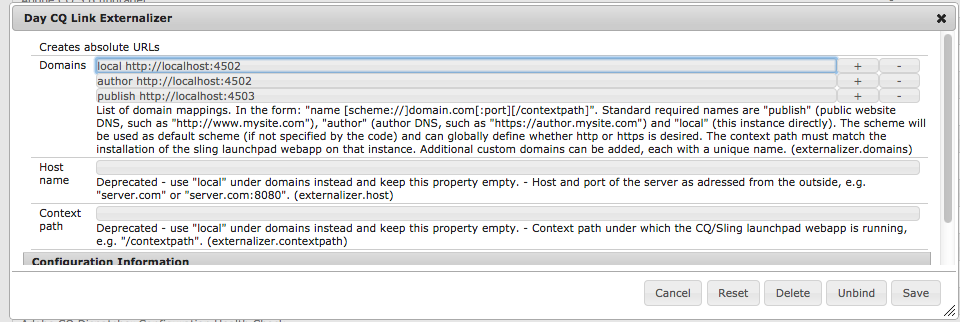

# Externalización de direcciones URL{#externalizing-urls}

En AEM, el **Externalizador** es un servicio OSGI que le permite transformar mediante programación una ruta de recursos (p. ej. `/path/to/my/page`) en una dirección URL externa y absoluta (por ejemplo, `https://www.mycompany.com/path/to/my/page`) mediante el prefijo de la ruta con un DNS preconfigurado.

Debido a que una instancia no puede conocer su URL visible externamente si se está ejecutando detrás de una capa web y, a veces, es necesario crear un vínculo fuera del ámbito de la solicitud, este servicio proporciona un lugar central para configurar dichas URL externas y generarlas.

En esta página se explica cómo configurar el servicio **Externalizer** y cómo utilizarlo. Para más detalles, por favor diríjase al [Javadocs](https://helpx.adobe.com/experience-manager/6-4/sites/developing/using/reference-materials/javadoc/com/day/cq/commons/Externalizer.html).

## Configuración del servicio Externalizer {#configuring-the-externalizer-service}

El servicio **Externalizer** permite definir centralmente varios dominios que se pueden utilizar para anteponer programáticamente las rutas de recursos. Cada dominio se identifica con un nombre único que se utiliza para hacer referencia al dominio mediante programación.

Para definir una asignación de dominio para el servicio **Externalizer** :

1. Vaya al administrador de configuración a través de **Herramientas** y, a continuación, **Consola** web, o introduzca `https://<host>:<port>/system/console/configMgr.`
1. Haga clic en **Day CQ Link Externalizer** para abrir el cuadro de diálogo de configuración.

   >[!NOTE]
   >
   >El vínculo directo a la configuración es `https://<host>:<port>/system/console/configMgr/com.day.cq.commons.impl.ExternalizerImpl`

   

1. Definir una asignación de dominio: una asignación consiste en un nombre único que puede utilizarse en el código para hacer referencia al dominio, un espacio y el dominio:

   `<unique-name> [scheme://]server[:port][/contextpath]`, donde:

   * **el esquema** suele ser http o https, pero también puede ser ftp, etc.; utilice https para aplicar los vínculos https si lo desea; se utilizará si el código de cliente no anula el esquema al solicitar la externalización de una dirección URL.
   * **server** es el nombre de host (puede ser un nombre de dominio o una dirección IP).
   * **puerto** (opcional) es el número de puerto.
   * **contextpath** (opcional) solo se establece si AEM está instalado como una aplicación web en una ruta de contexto diferente.

   Por ejemplo: `production https://my.production.instance`

   Los siguientes nombres de asignación están predefinidos y siempre deben configurarse como AEM dependen de ellos:

   * **local** : la instancia local
   * **autor** : DNS del sistema de creación
   * **publicar** : DNS del sitio web de cara pública

   >[!NOTE]
   >
   >Una configuración personalizada permite agregar una nueva categoría, como &quot;producción&quot;, &quot;ensayo&quot; o incluso sistemas externos no AEM como &quot;my-internal-webservice&quot;, y resulta útil para evitar codificar dichas direcciones URL en diferentes lugares del código de un proyecto.

1. Click **Save** to save your changes.

>[!NOTE]
>
>Adobe recomienda que [agregue la configuración al repositorio](/help/sites-deploying/configuring-osgi.md#adding-a-new-configuration-to-the-repository).

## Uso del servicio Externalizer {#using-the-externalizer-service}

Esta sección muestra algunos ejemplos de cómo se puede utilizar el servicio **Externalizador** .

**Para obtener el servicio Externalizador en un JSP:**

`Externalizer externalizer = resourceResolver.adaptTo(Externalizer.class);`

**Para externalizar una ruta con el dominio de &quot;publicación&quot;:**

`String myExternalizedUrl = externalizer.publishLink(resolver, "/my/page") + ".html";`

Suponiendo que la asignación de dominio &quot; `publish https://www.website.com`&quot;, myExternalizedUrl termina con el valor &quot; `https://www.website.com/contextpath/my/page.html`&quot;.

**Para externalizar una ruta con el dominio de &quot;autor&quot;:**

`String myExternalizedUrl = externalizer.authorLink(resolver, "/my/page") + ".html";`

Suponiendo que la asignación de dominio &quot; `author https://author.website.com`&quot;, myExternalizedUrl termina con el valor &quot; `https://author.website.com/contextpath/my/page.html`&quot;.

**Para externalizar una ruta con el dominio &#39;local&#39;:**

`String myExternalizedUrl = externalizer.externalLink(resolver, Externalizer.LOCAL, "/my/page") + ".html";`

Suponiendo que la asignación de dominio &quot; `local https://publish-3.internal`&quot;, myExternalizedUrl termina con el valor &quot; `https://publish-3.internal/contextpath/my/page.html`&quot;.

Puede encontrar más ejemplos en el [Javadocs](https://helpx.adobe.com/experience-manager/6-4/sites/developing/using/reference-materials/javadoc/com/day/cq/commons/Externalizer.html).
