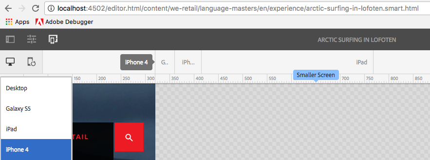

# Representación de plantilla adaptable{#adaptive-template-rendering}

El procesamiento de plantillas adaptables proporciona una forma de administrar una página con variaciones. Esta función, que en un principio resultaba útil para ofrecer varios resultados HTML para dispositivos móviles (por ejemplo, un teléfono con funciones o un smartphone), resulta útil cuando las experiencias deben entregarse a varios dispositivos que necesitan un marcado o una salida HTML diferentes.

## Información general {#overview}

Las plantillas generalmente se crean en torno a una cuadrícula adaptable y las páginas creadas en función de estas plantillas responden plenamente, ajustándose automáticamente a la ventanilla del dispositivo cliente. Mediante la barra de herramientas del emulador del editor de páginas, los autores pueden destinatario de diseños a dispositivos específicos.

También es posible configurar plantillas para admitir el procesamiento adaptable. Cuando los grupos de dispositivos están configurados correctamente, la página se procesará con un selector diferente en la URL al seleccionar un dispositivo en el modo de emulador. Mediante un selector, se puede llamar directamente a una representación de página específica mediante la dirección URL.

Recuerde al configurar los grupos de dispositivos:

* Cada dispositivo debe estar en al menos un grupo de dispositivos.
* Un dispositivo puede estar en varios grupos de dispositivos.
* Debido a que los dispositivos pueden estar en varios grupos de dispositivos, se pueden combinar selectores.
* La combinación de selectores se evalúa de arriba a abajo, ya que persisten en el repositorio.

>[!NOTE]
>
>El grupo de dispositivos **Dispositivos interactivos** nunca tendrá un selector porque se supone que los dispositivos reconocidos como compatibles con el diseño interactivo no necesitan un diseño adaptable

## Configuración {#configuration}

Los selectores de procesamiento adaptables pueden configurarse para grupos de dispositivos existentes o para [grupos que usted mismo haya creado.](/help/sites-developing/mobile.md#device-groups)

Para este ejemplo, vamos a configurar el grupo de dispositivos existente **Teléfonos inteligentes** para que tenga un selector de procesamiento adaptable como parte de la plantilla **Página de experiencia** dentro de We.Retail.

1. Editar el grupo de dispositivos que requiere un selector adaptable en `http://localhost:4502/miscadmin#/etc/mobile/groups`

   Configure la opción **Deshabilitar emulador** y guarde.

   

1. El selector estará disponible para **Blackberry** y **iPhone 4** siempre que el grupo de dispositivos **Smartphone** se agregue a la plantilla y a las estructuras de página en los pasos siguientes.

   

1. Con CRX DE Lite, permita que el grupo de dispositivos se utilice en la plantilla agregándola a la propiedad de cadena de varios valores `cq:deviceGroups` en la estructura de la plantilla.

   `/conf/<your-site>/settings/wcm/templates/<your-template>/structure/jcr:content`

   Por ejemplo, si desea agregar el grupo de dispositivos Smart Phone:

   `/conf/we-retail/settings/wcm/templates/experience-page/structure/jcr:content`

   

1. Con CRX DE Lite, permita que el grupo de dispositivos se utilice en el sitio agregándolo a la propiedad de cadena de varios valores `cq:deviceGroups` en la estructura del sitio.

   `/content/<your-site>/jcr:content`

   Por ejemplo, si desea permitir el grupo de dispositivos **Smart Phone**:

   `/content/we-retail/jcr:content`

   

Ahora, al utilizar el [emulador](/help/sites-authoring/responsive-layout.md#layout-definitions-device-emulation-and-breakpoints) en el editor de páginas (por ejemplo, cuando [modifica el diseño](/help/sites-authoring/responsive-layout.md)) y elige un dispositivo del grupo de dispositivos configurado, la página se procesará con un selector como parte de la dirección URL.

En nuestro ejemplo, al editar una página basada en la plantilla **Página de experiencia** y elegir iPhone 4 en el emulador, la página se procesa incluyendo el selector como `arctic-surfing-in-lofoten.smart.html` en lugar de `arctic-surfing-in-lofoten.html`

También se puede llamar a la página directamente con este selector.

